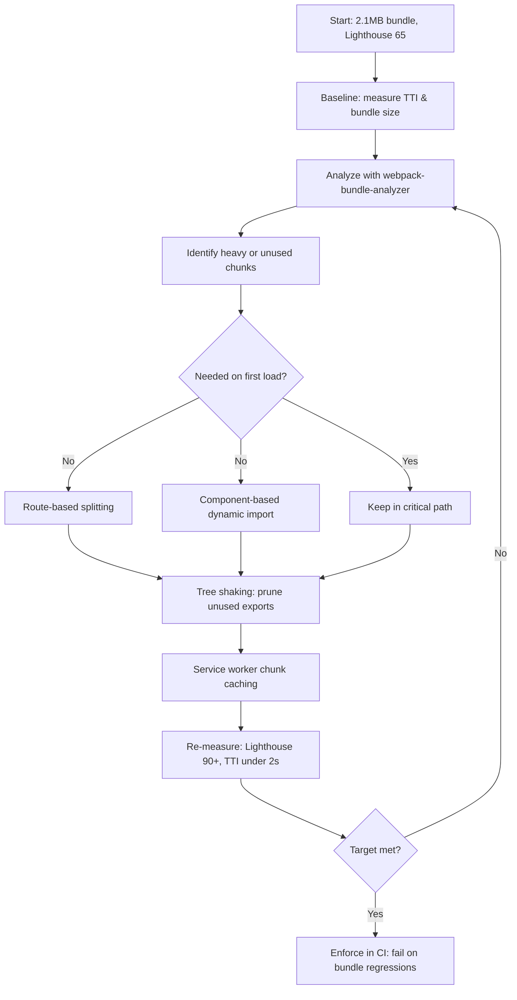

| Difficulty | Channel | Tags |
|---|---|---|
| intermediate | frontend | lighthouse, bundle, lazy-loading |

The deploy looked clean. No errors, no red pipelines, just a routine onboarding feature shipping to production. Then the analytics team flagged it: page load time had regressed, and digging through Chrome DevTools revealed why — the JavaScript bundle had ballooned to 190KB, with webpack-bundle-analyzer showing that roughly 94KB of it was a lottie-web animation library plus its JSON file, loaded eagerly for a 'happy moment' that often never played for the user [1]. Wix engineers cut that bundle by 80% using a disciplined combination of bundle analysis, React.lazy, and Suspense. The same playbook is exactly what takes a React app from a Lighthouse score of 65 to 90+.

---

> ### Real-World Case — Wix
>
> A Wix engineer shipped a new onboarding feature and the analytics team flagged that page load time had regressed. Digging into Chrome DevTools revealed the page's JS bundle had grown to 190KB — and webpack-bundle-analyzer showed that lottie-web (61KB) plus its JSON animation file (26KB), roughly 94KB total, were eagerly bundled just for a 'happy moment' animation that often never played for the user.
>
> | | |
> |---|---|
> | **Challenge** | A React bundle bloated by a heavy, rarely-triggered third-party animation library was slowing down initial page load, and manually reasoning about the dependency graph was impossible at that size. |
> | **Solution** | Ran webpack-bundle-analyzer to visualize the dependency tree and identify lottie-web as the culprit, then used React.lazy() and Suspense (React 16.6+) plus webpack's native dynamic import() code splitting to fetch the animation chunk only after the user completed the setup steps. They further split code based on what must be visible/interactive on first render, dropping the progress bar from the critical path. They also hit a subtle plot twist: React.lazy requires default exports and their tooltip positioned itself before the lazy chunk arrived — fixed by awaiting the dynamic import and only then triggering the UI state. |
> | **Outcome** | Bundle size cut from 190KB to 96KB (~50%) with the first split, then to 38KB total — an 80% reduction — resolving the load-time regression reported by analytics. |
> | **Lesson** | Analyze bundle composition before optimizing — webpack-bundle-analyzer surfaces the real culprits (often a single heavy dependency) — and lazily load anything not needed for first render; but beware React.lazy's caveats around default exports and timing UI side effects until the lazy chunk actually resolves. |

---

## Hook — One animation silently doubled a bundle

A single animation can double your JavaScript payload — that is the plot twist in Wix's story. Wix shipped what looked like a routine feature, yet analytics caught a regression that sent engineers spelunking through Chrome DevTools [1]. There they found the usual suspects: a 190KB bundle and a webpack-bundle-analyzer heatmap showing lottie-web (61KB) plus its 26KB JSON animation file sitting squarely in the eager bundle. Roughly 94KB — nearly half the payload — existed purely for a celebratory flourish that most users never even saw [1]. Sound familiar? Every React app has a few of these: the chart that renders off-screen, the editor on a page nobody opens first, the animation that plays exactly once. Now scale that problem up: a 2.1MB bundle, a 4.2 second Time to Interactive, and a Lighthouse score stuck at 65. This article walks through the exact steps to push that score past 90 — starting with the story of how one animation nearly doubled a bundle, and ending with a workflow you can run on Monday morning.

## Problem — The invisible weight of unused JavaScript

Performance regressions are insidious because they don't crash anything. The app still works; it just feels heavier. And users leave when it feels heavier — load time and interactivity directly shape conversion and retention, which is precisely why metrics like Time to Interactive and Core Web Vitals carry so much weight in modern engineering organizations [9]. A 2.1MB bundle is not just a number; it's the parse time, the main-thread blocking, and the blank white screen on a mid-range phone over a slow connection. The 65 Lighthouse score is the visible symptom. The real disease is that the browser is downloading and executing code the user may never use. Many developers respond by sprinkling `React.lazy` around the codebase and calling it done. That is a start, but it is the equivalent of throwing paint at a wall — it looks active without addressing the structure. The craft is in knowing what to split, when to split, and how to verify the split actually moved the metric. This is the point where teams stall, and where Wix's story becomes your roadmap.

## Real-World Case — Wix

The numbers tell the whole story. Wix's first split took the bundle from 190KB to 96KB — a ~50% reduction in a single pass — and follow-up work landed the total at 38KB, an 80% reduction, which fully resolved the load-time regression the analytics team had flagged [1]. Notice what made this possible: the team didn't guess. They let webpack-bundle-analyzer show them exactly which modules dominated the bundle, then asked the question every team should ask of each one — does the user actually need this on first load? For lottie-web, the answer was a confident no. The animation was a flourish on a secondary path, not a core journey. By converting it to a dynamic import triggered only when the 'happy moment' actually happened, the animation's cost moved entirely out of the critical rendering path [1]. The deeper insight: the highest-leverage optimization is almost never micro-tuning; it is removing dead weight from the critical path. Wix's win was not clever webpack configuration — it was ruthless prioritization backed by data.

## Deep Dive — Splitting strategies, tree shaking, and the trade-offs that matter

Building on the Wix story, the technical toolkit breaks down into a few core moves, and each carries a real trade-off. Code splitting — dividing one bundle into many — is the foundation. React.lazy() and Suspense give you declarative dynamic imports: React suspends rendering, fetches the chunk, and swaps in a fallback while the network does its work [2]. There are two splitting philosophies, and the choice between them shapes your architecture:

| Strategy | Best for | Cost / Risk |
|---|---|---|
| Route-based splitting | App shells where each page is self-contained | Simple and predictable; one chunk per route, minimal refactoring [5] |
| Component-based splitting | Heavy islands like charts, editors, maps | Fine-grained and powerful, but more `lazy()` calls and fallback flicker to manage [2] |

Most production apps end up with both — route-based splitting for the skeleton, component-based splitting for the heavy third-party libraries that appear across many screens. That leads to the second move: tree shaking. ES modules are statically analyzable, which lets bundlers drop unused exports — but only if you ship ES module builds to consumers and avoid side-effectful imports that defeat the analysis [6]. Here is the plot twist: tree shaking does nothing for libraries that are imported eagerly. The bundler will happily shake unused exports out of a module you still download. The real savings come when you also convert eager imports into dynamic ones so the entire chunk disappears from the first load [4]. Finally, round out the strategy with complementary tactics: lazy-loading images and below-the-fold media [7], and a service worker that caches split chunks so repeat visits skip the network entirely [8]. Combined, these techniques attack the problem from four directions at once.

## Workflow — A step-by-step bundle optimization loop

This leads to the workflow Wix's engineers effectively followed — a loop you can execute in an afternoon. Figure 3 below maps the full cycle; here is the step-by-step breakdown:

1. **Baseline first.** Record Lighthouse, TTI, and bundle size before changing anything. Without a baseline, you cannot prove your fix worked [9].
2. **Analyze.** Run webpack-bundle-analyzer and sort by raw size. The largest chunks are almost never where you expect them — in Wix's case it was an animation, not the data layer [3].
3. **Prioritize.** For each oversized module, ask: is this needed for first paint? If not, it is a split candidate.
4. **Split routes.** Wrap each route in `React.lazy()` so every page becomes its own chunk [5].
5. **Split components.** For heavy libraries used mid-page, convert eager imports to dynamic ones [4].
6. **Prune.** Remove unused dependencies and fix imports to maximize tree shaking [6].
7. **Cache.** Add a service worker to cache chunks and assets for repeat visits [8].
8. **Re-measure.** Re-run Lighthouse. Did TTI drop? Is the score above 90? If not, go back to step 2 — this is a loop, not a one-shot.

One pro tip from running this loop many times: enforce the final metric in CI. A bundle-size budget that fails the pipeline when a dependency sneaks past the limit is what keeps a 38KB bundle from creeping back to 190KB six months later.

## Code Example — Implementing lazy loading with error boundaries and on-demand dependencies

Now for the part that turns the workflow into code. This example mirrors the exact pattern Wix used: route-level splitting, component-level splitting for heavy islands, an error boundary so a failed chunk load doesn't white-screen the app, and a dynamic import for the animation library that only fires when it is actually needed. Each piece is production-shaped — the fallback, the boundary, and the on-demand fetch are not nice-to-haves; they are what makes lazy loading safe rather than fragile.

## Lessons Learned — What Wix's 80% teaches every React team

After walking this journey, the takeaways are concrete enough to act on tomorrow. First, measurement beats intuition — every time, Wix's win started with webpack-bundle-analyzer, not a hunch [1][3]. Second, optimize the critical path, not the median module; moving 94KB of animation out of first load did more than any micro-optimization could. Third, treat tree shaking as a prerequisite, not a solution — it only shrinks what you still download, so pair it with dynamic imports for the real win [4][6]. Fourth, protect the gains: ship a bundle-size budget in CI so regressions fail loudly [9]. Finally, remember the human stakes behind every number — every kilobyte you cut from the critical path is a fraction of a second someone gets back on a slow connection, and that translates directly into users who stay instead of bouncing [7][10]. The one insight to share with your team: your bundle is not a storage unit — it's a delivery route, and every item you move off the critical path shortens the trip for every user.

If this feels like a lot, you're not alone. Start small: pick the single largest chunk on your busiest page, lazy-load it, and measure. One afternoon, one chunk, one documented win — that is how every 80% reduction begins.

---

## Bundle Optimization Workflow

<strong>Original Interview Question</strong>

**Q:** You're tasked with improving a React app's Lighthouse performance score from 65 to 90+. The bundle size is 2.1MB and Time to Interactive is 4.2s. What specific steps would you take to optimize the bundle and implement lazy loading?

**A:** Implement code splitting with React.lazy() and Suspense, analyze bundle composition with webpack-bundle-analyzer to identify largest chunks, remove unused dependencies and optimize imports, add dynamic imports for heavy components and third-party libraries, implement route-based splitting for better initial load times, and utilize tree shaking with proper ES module configuration.

## Conclusion

The moral of Wix's story is deceptively simple: your bundle is not a storage unit — it's a delivery route, and every kilobyte you move off the critical path shortens the trip for every user. Start tomorrow by running webpack-bundle-analyzer on your largest page, pick the single heaviest chunk that isn't needed for first paint, wrap it in React.lazy with a proper fallback and error boundary, and re-run Lighthouse. One chunk, one afternoon, one documented win — that is exactly how an 80% reduction begins, and it is the same disciplined loop that takes a score from 65 to 90+ and keeps it there.

---

## References

1. [Wix incident report](https://www.wix.engineering/post/trim-the-fat-from-your-bundles-using-webpack-analyzer-react-lazy-suspense) — blog
2. [React.lazy documentation](https://react.dev/reference/react/lazy) — documentation
3. [webpack-bundle-analyzer](https://github.com/webpack-contrib/webpack-bundle-analyzer) — documentation
4. [MDN: dynamic import](https://developer.mozilla.org/en-US/docs/Web/JavaScript/Reference/Operators/import) — documentation
5. [MDN: code splitting glossary](https://developer.mozilla.org/en-US/docs/Glossary/Code_splitting) — documentation
6. [MDN: tree shaking glossary](https://developer.mozilla.org/en-US/docs/Glossary/Tree_shaking) — documentation
7. [MDN: lazy loading](https://developer.mozilla.org/en-US/docs/Web/Performance/Lazy_loading) — documentation
8. [MDN: Service Worker API](https://developer.mozilla.org/en-US/docs/Web/API/Service_Worker_API) — documentation
9. [web.dev: Web Vitals](https://web.dev/vitals) — documentation
10. [MDN: web performance](https://developer.mozilla.org/en-US/docs/Web/Performance) — documentation

---

**Author:** Satishkumar Dhule — [GitHub](https://github.com/satishkumar-dhule) · [LinkedIn](https://linkedin.com/in/satishkumar-dhule) · [Website](https://satishkumar-dhule.github.io)
