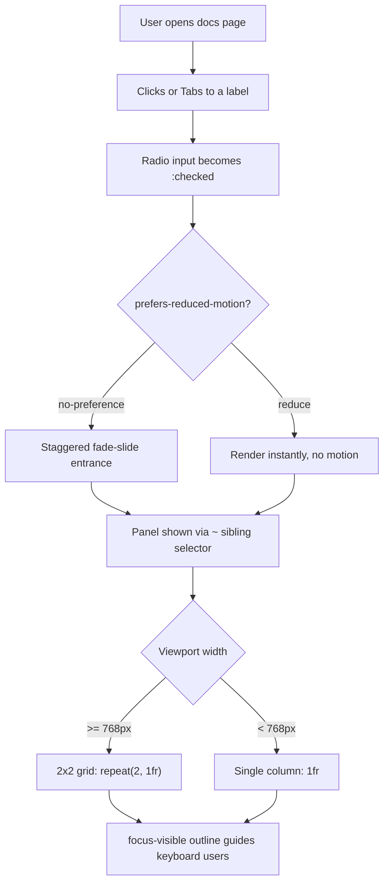

| Difficulty | Channel | Tags |
|---|---|---|
| beginner | frontend | css, flexbox, grid, animations |

In September 2013, Apple shipped iOS 7 with a heavily motion-focused redesign — parallax home-screen wallpapers, zooming app-open transitions, and full-screen slides. Within a week of release, a thread on Apple's own support forums filled with users reporting nausea, vertigo, and headaches; several said they had to leave work [1]. That incident didn't just embarrass a company — it permanently reshaped the web platform. Out of that pain came `prefers-reduced-motion`, a media query now used on millions of sites, and it is the perfect lens for a deceptively simple frontend challenge: building a tab panel with pure CSS.

---

> ### Real-World Case — Apple
>
> In September 2013, Apple shipped iOS 7 with a heavily motion-focused redesign: parallax home-screen wallpapers, zooming app-open/close transitions, and full-screen slides. Within a week of release, a thread on Apple's own support forums filled with users reporting nausea, headaches, and vertigo — several said they had to leave work or were told by Apple support there was no way to fully disable the effects.
>
> | | |
> |---|---|
> | **Challenge** | Decorative UI animation (parallax, 3D zoom transitions, sliding panels) was physically triggering vestibular disorders and motion sickness in a significant minority of users. The zoom effect made the brain perceive self-motion while the body stayed still, causing dizziness that lasted hours — yet the 'eye candy' was shipped with no user control over it. |
> | **Solution** | Apple introduced the 'Reduce Motion' accessibility setting in Settings > General > Accessibility, first turning off the parallax home-screen effect and later being expanded to cover zoom/transition animations. That OS-level preference became the foundation of the CSS `prefers-reduced-motion` media query shipped in Safari 10.1 (2017), letting every website detect the user's motion preference and disable decorative animations — exactly the `@media (prefers-reduced-motion: no-preference)` gate used for entrance stagger animations. |
> | **Outcome** | The incident produced a permanent industry standard: 'Reduce Motion' became the system-wide preference that powers `prefers-reduced-motion` across Safari, Chrome, Firefox, and Edge. Users were measurably harmed before the fix — reports of severe vertigo, users leaving work, and a 100+ post support thread within days — and Apple's eventual response turned a niche accessibility afterthought into a first-class CSS media query used on millions of sites. |
> | **Lesson** | The most delightful-seeming animation is a barrier for someone. A 'plot twist' UX principle: motion that feels smooth to most people can be physically disabling to others, so decorative animation must be gated behind a user preference (prefers-reduced-motion) and focus-visible states kept intact — accessibility isn't just about structure, it's about not making users physically ill. |

---

## Hook — It Only Takes One Animation to Make a User Sick

It was September 2013, and Apple had just shipped iOS 7 — a redesign built entirely on motion. Parallax wallpapers drifted as you tilted your phone. App icons zoomed across the screen. Panels slid full-screen with cinematic flair. Developers applauded the boldness. Then, within a week, Apple's own support forums lit up: users reporting nausea, headaches, and vertigo — people who said they had to leave work, and who were told by Apple support that there was no way to fully disable the effects [1]. Sound familiar? You probably didn't write iOS 7, but every time you add an animation today, you are making the same bet. The question was never whether the motion was pretty. It was whether it hurt someone. That tension sits at the heart of a challenge many developers meet in interviews: build a CSS-only tab panel that switches with radio inputs and no JavaScript. It sounds simple. The history behind it is anything but.

## Problem — The Tab Panel That Refuses JavaScript

Every day, teams reach for JavaScript to build tab panels. React, Vue, jQuery — pick your stack, and the pattern is muscle memory. But this challenge strips that away: CSS-only, radio inputs, zero JavaScript. On the surface it looks like a trivia question. Dig deeper, and it is testing three things at once: whether you can model state in pure CSS, whether you understand accessible focus behavior, and whether you can build responsive layouts without a framework. The stakes are higher than an interview pass. Tabs are everywhere — documentation pages, pricing grids, product galleries. If they break, users cannot navigate. If they ignore reduced-motion, some users get physically ill, and the iOS 7 story is the proof [1]. Here is the thing though: the solution is older and cleverer than most developers expect. It starts with a radio button. Strange? Stick with this. Many developers also fumble the follow-up questions: what happens to keyboard focus when you switch tabs? How do you keep a 16:9 image area stable when card titles vary in length? And what do you do when the entrance animation you added becomes the very thing that makes someone reach for the accessibility settings?

## Real-World Case — Apple, iOS 7, and the Support Thread That Changed the Web

Building on that problem, consider the story that launched this entire journey. In September 2013, Apple shipped iOS 7 with a heavily motion-focused redesign: parallax home-screen wallpapers, zooming app-open and app-close transitions, and full-screen slides [1]. Within a week of release, a thread on Apple's own support forums filled with users reporting nausea, headaches, and vertigo. Several said they had to leave work; others were told by Apple support that there was no way to fully disable the effects [1]. The impact was measurable and immediate — a 100-plus-post support thread within days and real users physically harmed. Consequently, Apple was forced into a permanent response: a system-wide "Reduce Motion" setting. That preference later became the foundation of `prefers-reduced-motion`, now supported across Safari, Chrome, Firefox, and Edge [2]. The plot twist? What looked like a niche accessibility afterthought turned into a first-class CSS media query used on millions of sites. The moment you write `animation` or `transition` in a stylesheet, you inherit that history — and your users inherit your choices.

## Deep Dive — The Hidden Power of the Radio Input

Now the technical heart of the pattern. Radio inputs have a superpower most developers forget: they are natively exclusive. Give several radios the same `name` attribute, and the browser enforces "exactly one checked" for you — no JavaScript required. That state is directly styleable via the `:checked` pseudo-class [7]. Combine it with the general sibling combinator `~`, and any element that follows the checked radio can be shown or hidden [6]. This is the engine of the whole trick, and it is a direct descendant of the "checkbox hack" that CSS-Tricks popularized years ago [8]. You might think you need a pile of selectors, but the elegance is in one rule: `.tabs input:not(:checked) ~ .panel { display: none; }`. One selector, zero JS. Then comes the layout half. Desktop demands a 2x2 grid — `repeat(2, 1fr)` gives two equal columns [5]. Mobile needs a single column, so a `max-width: 768px` media query collapses it to `1fr`. Here is the tradeoff that trips people up:

## Workflow — From Blank File to Polished Tabs

With the mechanics clear, the workflow matters more than any single selector — because debugging order determines whether the pattern works at all. The diagram below maps the user's journey through the finished component, and every step corresponds to a concrete CSS decision.

## Code Example — The Tabs That Respect Your Users

Time to wire it together. The example below is the complete, self-contained pattern — each piece solves a specific part of the problem described earlier: pure-CSS state switching, the responsive 2x2 grid, fixed 16:9 image areas, staggered motion, and accessibility. 🎯 Key Point: read the comments in order — they mirror the workflow steps, from radio structure to the reduced-motion guard.

## Lessons Learned — What iOS 7 Taught Us About Motion

This leads to the takeaways that outlast any interview question. First: state belongs in the platform. Radio inputs give you exclusive, accessible, JavaScript-free state — leverage it instead of rebuilding it. Second: motion is a privilege, not a default. The iOS 7 story is the cautionary tale [1], and `prefers-reduced-motion` is the permanent fix [2] — one that WCAG's design guidance explicitly codifies [9]. Many developers discover, to their surprise, that they have shipped dozens of animations that ignore it — and those are exactly the animations that make some users reach for the "disable motion" switch. Third: accessibility is not a feature layer. Focus outlines and semantic labels are not add-ons; they are the difference between "works" and "works for everyone" [3]. Battle scar: the most common failure mode is order — radios that are not siblings of their panels, or panels accidentally hidden on the checked state. When selectors mysteriously fail, debug the DOM structure before the CSS. The "so what" for tomorrow: rebuild your next component with this mindset — native state, responsive grids, and motion that opts in. The one insight to share with your team: the cheapest accessibility fix you will ever ship is wrapping your animations in a media query.

---

## Tab Panel User Interaction Flow

<strong>Original Interview Question</strong>

**Q:** Build a CSS-only tab panel for a design-system docs page. Use radio inputs to switch tabs (no JavaScript). Desktop: a 2x2 grid of cards under each tab; mobile: single column. Each card has a fixed 16:9 image area, a title, and a short meta line. Add a subtle entrance animation with a stagger and keep focus-visible outlines; ensure prefers-reduced-motion is respected?

**A:** Use a set of radio inputs with a shared `name` attribute and corresponding `` elements for each tab section. The `:checked` state of each radio controls visibility of its associated panel via adjacent sibling selectors. Each panel renders a 2×2 card grid on desktop and collapses to a single column on mobile. Cards use `aspect-ratio: 16/9` for fixed image containers, with a title and meta line below.

## Conclusion

That September in 2013, a phone company's ambitious animation made people physically ill [1]. You now have the tools — native radio state, sibling selectors, `aspect-ratio`, and `prefers-reduced-motion` — to ship motion that delights without ever costing anyone their lunch. When you write your next tab panel, or any component with animation, ask the question iOS 7 forced on the industry: is this motion worth more than a user's comfort? Build like every user matters — because every user does.

---

## References

1. [Apple incident report](https://www.theverge.com/2013/9/25/4770818/ios-7-zooming-animations-causing-reports-of-severe-motion-sickness) — article
2. [prefers-reduced-motion - MDN Web Docs](https://developer.mozilla.org/en-US/docs/Web/CSS/@media/prefers-reduced-motion) — documentation
3. [:focus-visible - MDN Web Docs](https://developer.mozilla.org/en-US/docs/Web/CSS/:focus-visible) — documentation
4. [aspect-ratio - MDN Web Docs](https://developer.mozilla.org/en-US/docs/Web/CSS/aspect-ratio) — documentation
5. [CSS Grid Layout - MDN Web Docs](https://developer.mozilla.org/en-US/docs/Web/CSS/CSS_grid_layout) — documentation
6. [General sibling combinator - MDN Web Docs](https://developer.mozilla.org/en-US/docs/Web/CSS/General_sibling_combinator) — documentation
7. [:checked - MDN Web Docs](https://developer.mozilla.org/en-US/docs/Web/CSS/:checked) — documentation
8. [The Checkbox Hack - CSS-Tricks](https://css-tricks.com/the-checkbox-hack/) — blog
9. [Web Content Accessibility Guidelines (WCAG) 2.1](https://www.w3.org/TR/WCAG21/) — documentation
10. [CSS animations - MDN Web Docs](https://developer.mozilla.org/en-US/docs/Web/CSS/CSS_animations) — documentation

---

**Author:** Satishkumar Dhule — [GitHub](https://github.com/satishkumar-dhule) · [LinkedIn](https://linkedin.com/in/satishkumar-dhule) · [Website](https://satishkumar-dhule.github.io)
