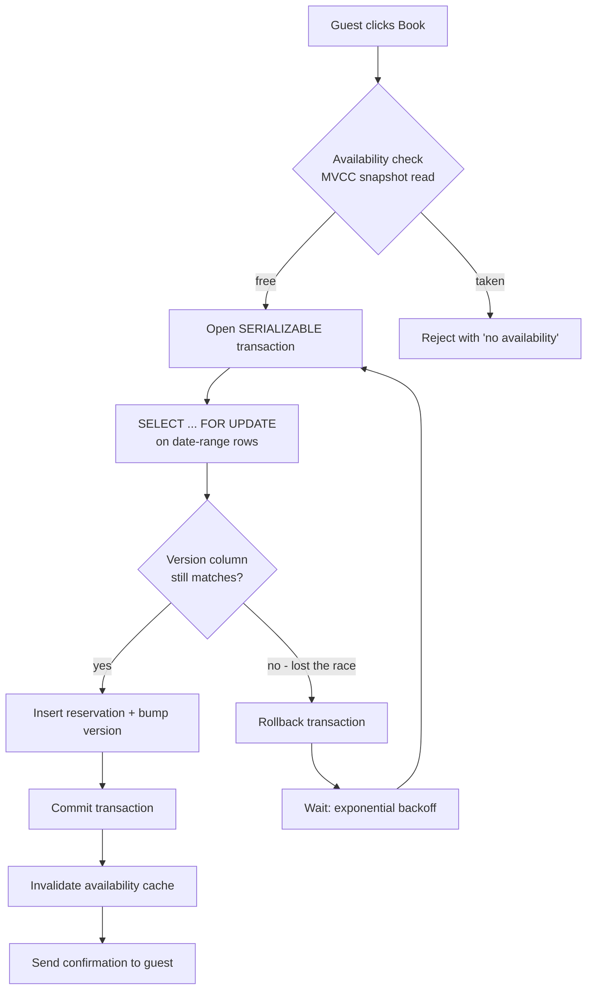

| Difficulty | Channel | Tags |
|---|---|---|
| intermediate | database | acid, isolation-levels, mvcc |

Imagine this: a guest clicks "Book" twice because the page felt slow, and two identical payment requests fire into your system. Both race each other, both get processed, and the guest is charged twice for a single reservation — the exact scenario that haunted Airbnb's distributed payments platform [1]. Now picture that same race happening to your availability calendar, where two guests are fighting for the same night at the same property. This is the story of how to design transaction handling so that only one guest ever wins.

---

> ### Real-World Case — Airbnb
>
> Airbnb's distributed payments microservices were double-charging guests for the same reservation. A guest clicking "Book" twice, a client retry after a lost response, or a timeout could fire two identical payment requests — and because the requests raced each other, both were processed and the guest was charged twice for one booking.
>
> | | |
> |---|---|
> | **Challenge** | Guarantee exactly-once (at most once) processing across a set of payments microservices: make every charge/refund idempotent, classify retryable vs non-retryable errors, keep latency low at payment scale, and avoid duplicates even when responses are lost, servers time out, or users double-click. |
> | **Solution** | Airbnb built a generic idempotency framework ("Orpheus") keyed on idempotency keys. Every API request acquires a database row-level lock on its idempotency key — a lease with an expiration so a timed-out request can only be retried after the lease lapses — then runs the payment atomically. The key insight: idempotency reads and writes go ONLY to the primary MySQL database, never to read replicas, because replica lag was re-creating the very double payments they were trying to prevent. The idempotency store is sharded by key (high-cardinality, evenly distributed) to scale. |
> | **Outcome** | Since the Orpheus framework launched, Airbnb Payments has maintained five-nines (99.999%) consistency, and their annual payment volume has doubled while holding that consistency bar. |
> | **Lesson** | Concurrency bugs aren't only about isolation levels and locks — retries and stale snapshot reads quietly duplicate work. For the critical check-and-act step you must read from the authoritative store (the primary, not replicas) and serialize on an idempotency key with a row-level lock, or the "safe" retry path becomes the source of the double booking. |

---

## Hook — The double-charge that changed how one team thinks about concurrency

You book flights, hotels, and cars through screens that feel instant. But under the hood, every confirmation is a battle between concurrent requests fighting over the same row of data. The losing side doesn't get a consolation prize — the losing side gets an overbooked property, a furious guest, and a support ticket that escalates straight to your team. Sound familiar?

Here is the thing most developers don't realize until it happens to them: double bookings aren't caused by bad code. They're caused by timing. Two transactions each read 'available', then each write 'booked', and both commit. That is the race. And when that race plays out across a calendar spanning hundreds of nights and thousands of properties, the damage compounds fast. The stakes are simple — you either design for concurrency from day one, or you discover it at 2am when the booking counts don't add up. So what does the fix actually look like? The most surprising part is where the answer comes from: a payments system.

## Problem — The read-then-write race nobody sees coming

Zoom in on the actual villain: the read-then-write race. Two guests, both eyeing the same beach house for the same weekend. Guest A's request reads the calendar and sees the nights are free. Guest B's request does the same, microseconds later. Both believe they've won. Both insert reservations. The property is now double-booked, and the database doesn't complain — because nothing in the default isolation level told it to.

Many developers think a unique constraint or a foreign key is enough. But even a perfect schema doesn't solve the deeper problem: the 'check availability' and 'create reservation' steps must behave as one atomic unit. This is where ACID guarantees come in — specifically the I, for isolation [5]. If your transaction isn't properly isolated, concurrent bookings slip through the cracks. If it's over-isolated, everything slows to a crawl. That tension — safety versus availability — is the core challenge every booking system has to resolve, and it is fundamentally a CAP theorem trade-off playing out in microcosm [6]. The question isn't whether you'll face it. The question is whether you'll face it before or after a customer does.

## Real-World Case — Airbnb

Airbnb knows this failure mode personally. Their distributed payments microservices were double-charging guests for the same reservation. A guest clicking "Book" twice, a client retry after a lost response, or a timeout could fire two identical payment requests — and because the requests raced each other, both were processed, and the guest was charged twice for one booking [1].

The root cause wasn't fraud or a billing bug. It was idempotency — nothing told the system 'this exact request has already been seen.' Notice how that maps directly onto your booking problem: it is the same read-then-write race, just wearing a payments system's clothes.

Airbnb's fix was the Orpheus framework, which wraps every payment workflow with idempotency guarantees at the request boundary. The results are the kind of numbers that make any engineering team jealous: since Orpheus launched, Airbnb Payments has maintained five-nines (99.999%) consistency — and their annual payment volume has doubled while holding that bar [1]. That's the destination. The rest of this article is the road map.

## Deep Dive — Isolation levels, MVCC, and the lock that actually matters

Building on that story, the transaction toolbox starts with isolation levels. SQL defines four of them, and most developers only ever hear about READ COMMITTED — PostgreSQL's default — before moving on [2]. The two that matter for a booking system are REPEATABLE READ and SERIALIZABLE. Isolation choices also differ subtly between engines; MySQL's InnoDB, for instance, has its own quirks around gap locks and phantom reads [7].

Here's a plot twist: SERIALIZABLE sounds terrifyingly slow, and in older databases it was. But modern engines like PostgreSQL implement it with serializable snapshot isolation (SSI) — a form of optimistic concurrency control — rather than brute-force locking [2]. The database detects conflicts after the fact and aborts the losing transaction, instead of blocking everyone upfront. You get the strongest guarantees without paying the full serialization tax.

That brings you to MVCC, the mechanism underneath it all. Instead of locking reads, PostgreSQL keeps multiple versions of each row so readers never block writers and writers never block readers [4]. Availability checks run as snapshot reads — cheap, non-blocking, and consistent. The write path then uses a different weapon: row-level locks via SELECT ... FOR UPDATE, which locks exactly the date-range rows a booking touches [3][9]. Specific rows, not whole tables — that's how a hot property stops being a global bottleneck.

Now for the headline trade-off. Pessimistic locking is safe and simple: whoever grabs the lock first wins, everyone else waits. Optimistic locking lets everyone read freely and only fails at write time, forcing retries [4]. For a booking system, you want a blend: snapshot reads for the availability check, FOR UPDATE for the critical reservation step, and a version column as a backstop. The rule of thumb many teams learn the hard way: high conflict rate, go pessimistic; low conflict rate, optimistic wins on throughput. Hot dates on popular properties are almost always high-conflict.

## Workflow — The booking pipeline that serializes exactly where it must

This leads to a concrete workflow you can steal for your own booking endpoint. The diagram below is the whole journey — from the guest's click to the confirmation — including the moment a losing transaction has to pick itself up and try again.

The flow follows this arc:

- Step 1: Check the calendar with an MVCC snapshot read — no locks, no blocking, instant answer.
- Step 2: If the dates look free, open a SERIALIZABLE transaction.
- Step 3: Lock the exact date-range rows with SELECT ... FOR UPDATE [3]. This is where the race is actually decided.
- Step 4: Compare the version column against your snapshot. If it changed, you lost — roll back.
- Step 5: Insert the reservation, bump the version, commit.
- Step 6: Invalidate the availability cache so the next snapshot read sees the new reality.
- Step 7: On a serialization failure, retry with exponential backoff — the loser gets another shot, but only after backing off.

The key detail: every step between 'lock' and 'commit' happens inside one transaction. There is no window where a competing request can observe a half-booked state. And the cache invalidation matters more than people expect — a stale cache that still says 'available' is a time bomb that quietly undoes all your careful transaction work.

## Code Example — An atomic booking with PostgreSQL row locks and idempotent retries

Now let's turn the workflow into something you can run. This Python snippet uses psycopg3 against PostgreSQL and packages the whole arc — idempotency guard, row locks, version check, and retry — into a single function. Notice how step 0 mirrors Airbnb's fix: the request itself carries an idempotency key, so a retried click is recognized instead of becoming a second booking [1]. The connection should be opened with autocommit=True so the idempotency check runs outside the booking transaction.

## Lessons Learned — What Airbnb's war story teaches you about tomorrow's bookings

By now you've seen the whole arc: the race, the incident, the isolation levels, the locks, the retry dance. Compress it into what you can use tomorrow.

First: idempotency is not optional. Airbnb's entire payment fix revolved around making repeated requests recognizable [1]. For bookings, that means a client-generated request ID plus a unique constraint that rejects duplicates — before any transaction logic runs.

Second: locks belong on rows, not tables. SELECT ... FOR UPDATE on a date range costs pennies; locking a whole calendar table costs your p99 [3]. The difference shows up the moment a listing goes viral.

Third: your cache is part of the concurrency story. Every successful booking must invalidate availability, or your snapshot reads will happily tell guests about rooms that are gone.

Here are the battle scars to avoid:
- Using the default isolation level and calling it done — READ COMMITTED does not stop the race [2].
- Retrying with zero backoff — you just turn a conflict storm into a thundering herd.
- Shipping without lock-contention monitoring. PostgreSQL exposes pg_locks, and managed platforms like Amazon RDS give you the dashboards out of the box — use them [8].
- No circuit breaker for hot properties — one viral listing can starve every other write in the database.

The insight to take back to your team: correctness under concurrency is not a database setting you flip once. It's a layered system — idempotency at the edge, isolation in the engine, locks on the hot path, and retries as the safety net. Design all four, and you get what Airbnb got: five-nines consistency while your volume doubles [1].

---

## Booking Transaction Flow

<strong>Original Interview Question</strong>

**Q:** You're building a booking system for Airbnb where multiple users can reserve the same property simultaneously. How would you design the transaction handling to prevent double bookings while maintaining high availability?

**A:** Use SERIALIZABLE isolation with optimistic concurrency control. Implement row-level locks on property availability tables, use MVCC snapshot reads for checking availability, and apply application-level validation to ensure atomic booking operations.

## Conclusion

So the next time someone on your team says "just add a unique constraint and we're done," you'll know better. The real defense is layered: idempotent requests, SERIALIZABLE isolation where it counts, row-level locks on the hot path, and retry logic that knows how to back off. Start by instrumenting your booking endpoint — map out exactly where a second concurrent request can observe a half-written state, and close those windows one by one. The property everyone wants teaches you the hard way; the one that should never be lost is the room you protected with a transaction that could only let one guest win.

---

## References

1. [Airbnb incident report](https://medium.com/airbnb-engineering/avoiding-double-payments-in-a-distributed-payments-system-2981f6b070bb) — blog
2. [PostgreSQL Documentation: Transaction Isolation](https://www.postgresql.org/docs/current/transaction-iso.html) — documentation
3. [PostgreSQL Documentation: Explicit Locking](https://www.postgresql.org/docs/current/explicit-locking.html) — documentation
4. [Wikipedia: Multiversion Concurrency Control](https://en.wikipedia.org/wiki/Multiversion_concurrency_control) — documentation
5. [Wikipedia: ACID](https://en.wikipedia.org/wiki/ACID) — documentation
6. [Wikipedia: CAP Theorem](https://en.wikipedia.org/wiki/CAP_theorem) — documentation
7. [DigitalOcean: Understanding Isolation Levels in MySQL](https://www.digitalocean.com/community/tutorials/understanding-isolation-levels-in-mysql) — blog
8. [AWS Documentation: Amazon RDS for PostgreSQL](https://docs.aws.amazon.com/AmazonRDS/latest/UserGuide/CHAP_PostgreSQL.html) — documentation
9. [PostgreSQL Documentation: SELECT Command (FOR UPDATE clause)](https://www.postgresql.org/docs/current/sql-select.html) — documentation

---

**Author:** Satishkumar Dhule — [GitHub](https://github.com/satishkumar-dhule) · [LinkedIn](https://linkedin.com/in/satishkumar-dhule) · [Website](https://satishkumar-dhule.github.io)
