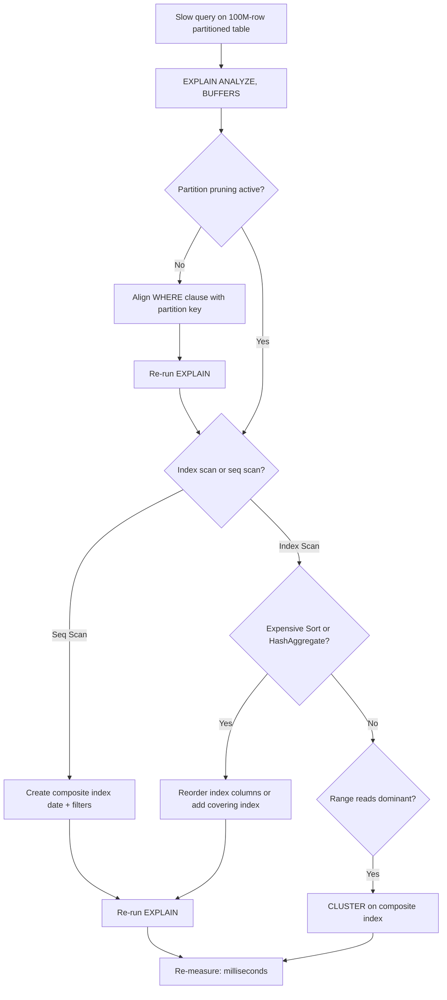

| Difficulty | Channel | Tags |
|---|---|---|
| intermediate | database | explain, query-plan, partitioning |

Imagine managing a table with 100 million rows where every customer expects their recent activity to load in the time it takes to blink. That is the reality Capital One's Consumer Identity platform lives with, and the reason their team turned PostgreSQL partitioning into a craft [1]. For them, a slow date-range query is not an annoyance; it is a customer experience failing in real time. The good news is that the same diagnostic skills keeping their platform running can turn your sluggish partitioned table into a millisecond response machine.

---

> ### Real-World Case — Capital One
>
> Capital One's Consumer Identity platform ingests massive volumes of customer data into PostgreSQL and must serve each customer's recent activity in milliseconds. Their large temporal tables made full-table lookups slow, and their daily data-retention job needed to archive several terabytes of old data every day.
>
> | | |
> |---|---|
> | **Challenge** | Large date-partitioned tables were expensive to query, and archiving old data via bulk DELETE or VACUUM placed locks that blocked reads and writes on the live table, risking downtime for millions of customers. Query performance also skewed badly on peak days (e.g., holidays) when activity spiked. |
> | **Solution** | They used temporal partitioning on timestamptz columns with a hash applied to timestamps so partition volumes stay nearly equal even on peak days. They indexed by customers' unique identifiers so the query planner scans only the partitions where a customer was active and prunes the rest. For retention, they DETACH partitions for archival instead of running costly deletes, and they deliberately skip vacuuming the hot partitions. |
> | **Outcome** | 99.9% of queries for recent customer data respond within milliseconds, several terabytes of data are archived per day without locking the live table or causing downtime, and query execution times no longer vary significantly across the year. |
> | **Lesson** | Partitioning only pays off when the partition key and indexes match the actual access pattern - 'make the common case fast.' Equally important, retention strategy (detach instead of delete, and even skipping VACUUM) can matter as much as query speed for keeping a large partitioned table fast and lock-free. |

---

## Hook — The 100-million-row table that shouldn't feel fast

Think about the last time you waited for a dashboard to load. Now multiply the stakes by 100 million. Capital One's Consumer Identity platform ingests massive volumes of customer data into PostgreSQL and must serve each customer's recent activity in milliseconds [1]. Their temporal tables grew so large that full-table lookups became a performance emergency, and their daily data-retention job had to archive several terabytes every day without locking the live table [1].

Here is the plot twist: adding partitions did not automatically fix anything. A partitioned table can still be slow. Many developers discover this the hard way, they partition, celebrate, and then watch their date-range query crawl anyway. Why? Because partitioning is the start of the story, not the end. The real question is whether your query plan honors the partition structure you built.

This article walks the exact diagnostic path: reading an EXPLAIN plan like a detective, spotting when pruning silently fails, and knowing which index or clustering trick actually moves the needle. By the end, you will understand how Capital One-style performance, 99.9% of queries in milliseconds [1], is engineered rather than hoped for.

## Problem — When partitioning gives you a false sense of speed

Picture this: you follow the docs, declare a monthly partition, backfill 100 million rows, and ship it. A week later, the incident channel lights up. A customer-facing query filtering on event_date between two specific days is still slow, sometimes slower than before.

What went wrong? The honest answer is that partitioning changes your table's shape, not its behavior. The planner still decides how to execute every query, and if your WHERE clause, index design, or data ordering work against the structure, you get the worst of both worlds, the complexity of partitions with none of the speed [2][6].

Here is what is actually at stake. Query times that were merely poor get worse as data accumulates: each new partition adds weight, statistics drift, and what used to be a fine-for-now execution path becomes a production incident. Sound familiar? If you have ever run EXPLAIN and felt like you were reading a foreign language, you are not alone.

The three usual suspects, in order of how often they betray you:
- Partition pruning silently disabled or mismatched with your WHERE clause
- Indexes that exist but never get used (or are the wrong shape)
- Expensive sorts and hash aggregates that eat the milliseconds you just saved

You might think, 'I will just add an index and call it a day.' But many developers discover that an index on the wrong column order, or a planner that overestimates row counts, turns the fix into false confidence. That is precisely why Capital One's team treats the query plan, not the schema, as the source of truth [1].

## Real-World Case — Capital One

Capital One's Consumer Identity platform is the poster child for getting this right. Their system ingests massive volumes of customer data into PostgreSQL, and each customer's recent activity has to load in milliseconds, not usually fast, milliseconds [1].

Here is the scale of the problem: their temporal tables are enormous, and their daily data-retention job archives several terabytes of old data every single day. Before the redesign, large temporal tables made full-table lookups slow, and the archive job risked locking the live table, which in a consumer banking context means customers noticing [1].

The fix was not magic. It was a disciplined combination of declarative partitioning, partition-key alignment, and archive strategies designed around the query patterns that actually matter. The results speak for themselves:
- 99.9% of queries for recent customer data respond within milliseconds
- Several terabytes archived per day without locking the live table or causing downtime
- Query execution times stopped varying wildly across the year

The lesson from Capital One's experience is subtle and powerful: performance in partitioned systems is a property of the query plan, not the schema alone [1]. When pruning works, the planner should touch only the partitions you care about [2]. When it does not, all the partitioning in the world will not save you.

## Deep Dive — Reading the query plan like a detective

Building on Capital One's approach, the first discipline to master is reading EXPLAIN output. This is the raw footage of the planner's thinking: every node, every cost estimate, every filter [3]. The goal is not to memorize syntax; it is to answer three questions in order.

First, did partition pruning actually happen? When pruning works, the plan shows a single partition being scanned instead of an Append node spanning every child [2]. If you see hundreds of child tables in the plan, pruning failed, usually because the WHERE clause does not match the partition key's type or expression, think date_trunc('month', ...) instead of a bare column comparison. Fix that first; nothing else matters until the planner stops visiting partitions it does not need.

Second, are the indexes you built actually being used? A sequential scan on a ten-million-row partition is a signal that either the index does not match the filter columns or the planner's row estimates are off. This is where multicolumn index order becomes decisive: for a query filtering on event_date AND status, an index on (event_date, status) lets the planner narrow both dimensions at once, whereas (status, event_date) rarely helps [9].

Third, what is the most expensive node? Look for Sort or HashAggregate operations that reconstruct work the index could have avoided. A Sort on hundreds of thousands of rows is often the silent killer, and it is exactly the kind of node that clustering eliminates by keeping data physically ordered on disk [5].

Here is the counterintuitive insight: research on query optimizers suggests they are nowhere near perfect, even the best can choose plans orders of magnitude slower than the optimal one, especially on skewed data [8]. So a slow query is rarely the planner being dumb; it is usually the schema, statistics, or data layout giving the planner no good options. And while learned index structures sound futuristic, classical composite indexes remain the workhorse, a reminder that sometimes the boring solution is the right one [7].

⚠️ Watch Out: an index that works in a 100-row test can be completely ignored at production scale because the planner's cost model changes with row counts. Always re-run EXPLAIN ANALYZE with real data volumes [3].

## Workflow — A five-step diagnostic path for slow date-range queries

Now that you understand what the planner is telling you, here is the workflow to follow every single time. The beauty of this process is that each step is cheap, reversible, and moves you closer to the root cause.

Step 1 — Run EXPLAIN with buffers. EXPLAIN (ANALYZE, BUFFERS) shows actual execution time, row counts, and cache behavior, not just estimates [3]. Start here. Do not guess.

Step 2 — Verify partition pruning. Check whether the plan touches one partition or all of them. No pruning means the whole point of partitioning is lost [2].

Step 3 — Inspect the scan type. A Seq Scan on a large partition means your indexes are missing or ignored. An Index Scan or Index Only Scan means the planner found a usable path [4].

Step 4 — Hunt the hot nodes. Look for Sort, HashAggregate, or Nested Loop nodes with scary actual row counts. Each is a different optimization target [3].

Step 5 — Apply and re-measure. Create a composite index, or cluster the table, then re-run Step 1 and compare. The plan is the ground truth [9].

The diagram below captures the full decision flow, the cheat sheet every team should pin to the wall. Figure: {diagramLabel}.

A final pro tip from hard-won experience: when you add a composite index, use CREATE INDEX CONCURRENTLY so the build does not block writes [4], and re-analyze the table afterwards so the planner's statistics reflect the new index [10].

## Code Example — Diagnosing and fixing a slow partitioned query

Let's put the workflow into action with the exact scenario from the interview question: a partitioned events table, a date-range query, and a filter on status. The shell script below walks the full diagnosis, from raw plan to composite index to clustering, using real psql commands.

{codeExample}

Here is what each step accomplishes, line by line. The first EXPLAIN is your baseline: ANALYZE forces execution and reports actual timings, BUFFERS reveals cache misses that pure costs hide, and TIMING OFF keeps output readable [3]. Step two isolates partition pruning: if you see a single leaf instead of an Append over every child, pruning is healthy [2]. Step four is the heavy lift, a composite index on (event_date, status) serves the WHERE clause directly, letting the planner scan far more selectively [9]. Finally, CLUSTER physically rewrites the table in index order, which makes sequential reads of a date range dramatically faster when the data's physical order matches the query pattern [5].

🔥 Hot Take: clustering is underrated. Because it physically reorders rows on disk, it can turn a ten-second range scan into milliseconds, at the cost of a table rewrite. Use it when range scans dominate and writes are predictable [5].

## Lessons Learned — What the query plan teaches you

If there is one takeaway from Capital One's story and every slow-partition diagnosis you will ever run, it is this: the EXPLAIN plan is the only opinion that matters [3]. The schema is a hypothesis; the plan is the verdict.

Here is what to do differently tomorrow:
- Always verify pruning before touching indexes, a plan that visits every partition negates all your other work [2]
- Shape composite indexes around the WHERE clause, ordering columns from equality filters to range filters [9]
- Watch for sorts and hash aggregates, they are where range scans secretly lose milliseconds [3]
- Use CONCURRENTLY for index builds and CLUSTER only when range reads dominate [4][5]
- Tune planner configuration only after you have evidence, never on vibes [10]

And remember the bigger arc of the story. Partitioning was never about the table, it was about the query, the archive job, and the human waiting for a response. Capital One's 99.9% millisecond bar was not achieved by any single index; it was the accumulated result of a team that treated query plans as evidence and iterated relentlessly [1].

So the next time a date-range query crawls, do not re-index blind. Run EXPLAIN, follow the workflow, and let the planner show you the way. Your future self, and your customers, will feel the difference in milliseconds.

---

## Partitioned Query Diagnosis Flow

<strong>Original Interview Question</strong>

**Q:** You have a PostgreSQL table with 100M rows partitioned by date. A query filtering on a specific date range is still slow. What would you check in the EXPLAIN plan and how would you optimize it?

**A:** Check partition pruning effectiveness, index utilization patterns, and expensive sort operations. Create composite indexes on (date, filtered_columns) and evaluate clustering strategies for optimal data access.

## Conclusion

The moral of the story: partitioned tables do not make queries fast on their own, well-designed query paths do. Start your next slow-query investigation with EXPLAIN (ANALYZE, BUFFERS), verify that pruning is doing its job, and let the plan decide whether the fix is a composite index, a CLUSTER, or something subtler [3]. Capital One proved the ceiling: 99.9% of customer queries in milliseconds, terabytes archived daily with zero downtime [1]. That is not luck. It is diagnosis, iteration, and respect for the query plan. So go read your next plan, then go make it faster.

---

## References

1. [Capital One incident report](https://www.capitalone.com/tech/software-engineering/postgresql-partitioning-tips) — article
2. [PostgreSQL Documentation: Table Partitioning](https://www.postgresql.org/docs/current/ddl-partitioning.html) — documentation
3. [PostgreSQL Documentation: EXPLAIN](https://www.postgresql.org/docs/current/sql-explain.html) — documentation
4. [PostgreSQL Documentation: CREATE INDEX](https://www.postgresql.org/docs/current/sql-createindex.html) — documentation
5. [PostgreSQL Documentation: CLUSTER](https://www.postgresql.org/docs/current/sql-cluster.html) — documentation
6. [Wikipedia: Partition (database)](https://en.wikipedia.org/wiki/Partition_(database)) — article
7. [The Case for Learned Index Structures](https://arxiv.org/abs/1712.01208) — paper
8. [How Good Are Query Optimizers, Really?](https://arxiv.org/abs/1805.11755) — paper
9. [PostgreSQL Documentation: Multicolumn Indexes](https://www.postgresql.org/docs/current/indexes-multicolumn.html) — documentation
10. [PostgreSQL Documentation: Query Planning Configuration](https://www.postgresql.org/docs/current/runtime-config-query.html) — documentation

---

**Author:** Satishkumar Dhule — [GitHub](https://github.com/satishkumar-dhule) · [LinkedIn](https://linkedin.com/in/satishkumar-dhule) · [Website](https://satishkumar-dhule.github.io)
