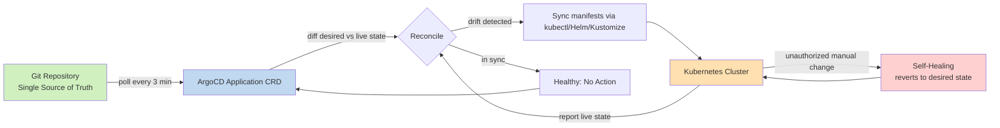

| Difficulty | Channel | Tags |
|---|---|---|
| beginner | devops | argocd, flux, declarative |

When Intuit decided to hand GitOps to 5,000+ engineers across 350+ Kubernetes clusters, the platform team had a deceptively simple dream: one ArgoCD to rule them all [1]. Then the numbers hit — 40,000+ applications, 3,000+ repositories, 1,000 deployments a day — and that dream shattered into 140+ sharded instances. This is the story of why a single control plane dies at scale, and what every developer setting up their first ArgoCD pipeline can learn from a fintech giant's scars.

---

> ### Real-World Case — Intuit
>
> Intuit, the fintech company behind TurboTax and QuickBooks, needed to deliver GitOps to 5,000+ engineers across 350+ Kubernetes clusters and 15,000 nodes. Their platform team wanted a single 'one Argo CD to rule them all' control plane so developers could deploy without touching clusters directly.
>
> | | |
> |---|---|
> | **Challenge** | Intuit didn't just adopt ArgoCD — they invented it, open-sourcing it to manage production deployments at massive scale. The central challenge was scaling GitOps reconciliation itself: 12,000+ ArgoCD Applications spanning 370 clusters and 3,000+ Git repositories, with 1,000+ deployments every single day, while keeping reconciliation fast enough for developers. A naive single-instance ArgoCD broke under this load. |
> | **Solution** | They designed a declarative, GitOps-everything architecture: every ArgoCD instance is itself managed by ArgoCD via Git (GitOps of GitOps), with all config stored as YAML in Git. Instead of one giant control plane, they sharded ArgoCD into 140+ instances per business segment, scaled the application controller by sharding per cluster, bumped controller worker processors from 20 to 100+, and used multiple repo-server replicas plus parallelism limits to keep manifest generation stable — all with auto-sync and self-healing so any manual cluster change or config drift gets reverted to the Git-defined desired state. |
> | **Outcome** | Intuit's ArgoCD manages 40,000+ applications across 3,000+ repositories, powering 1,000 deployments daily for 5,000 engineers with sub-second reconciliation times. The centralized single-instance approach was abandoned in favor of 140+ sharded instances, proving that even a GitOps controller must be designed for horizontal scale. |
> | **Lesson** | Declarative GitOps scales, but the GitOps controller itself needs an architecture. The 'one Argo CD to rule them all' dream fails at enterprise scale — you must shard by business segment or cluster, tune controller workers and repo-server parallelism, and dogfood your own tool by managing ArgoCD instances through Git and ArgoCD itself. |

---

## Hook — The deploy looked fine. Then the cluster drifted.

It's 3am and your pager goes off. A pod in production is running a container image that no longer exists in your Git repository. Nobody in the on-call channel touched anything. Sound familiar? That silent, creeping force is called configuration drift — and it's the reason your Kubernetes cluster stops matching the world you actually committed to. Many developers discover that `kubectl apply` was the enemy all along: every manual command is a fork in reality. By the time you notice, your infrastructure has quietly become a snowflake that nobody else can reproduce. The stakes aren't just a weird Tuesday night — they're your audit trail, your rollback capability, and your team's sanity. The fix isn't another monitoring dashboard. It's a fundamental change in who (or what) is allowed to touch the cluster.

## Problem — The cluster as a black box nobody trusts

The core challenge is simple to state and brutal to solve: Kubernetes is a constantly-mutating system, and every human with cluster access is a liability. With the imperative approach, you run `kubectl scale deploy payments --replicas=12` and move on — but nobody on your team knows why the replicas changed, who did it, or whether it was supposed to happen [2]. Configuration drift between environments becomes the norm: staging looks nothing like production, and every rollback is a desperate archaeology dig through shell history. The result is what GitOps practitioners call the 'hand-built infrastructure' problem — fragile, undocumented, and impossible to collaborate on. Moreover, the moment you scale past a single cluster, the situation compounds: 5 teams, 10 clusters, 30 microservices, and zero shared understanding of what the desired state even is. You might think more access controls solve this. They don't. The only durable fix is to make the cluster read-only to humans and write-only to Git.

## Real-World Case — Intuit

Intuit — the fintech company behind TurboTax and QuickBooks — is the cautionary tale and the success story wrapped in one. Their platform team wanted to deliver GitOps to 5,000+ engineers across 350+ Kubernetes clusters and 15,000 nodes, all through a single 'one ArgoCD to rule them all' control plane [1]. The ambition was to let developers deploy without ever touching a cluster directly. But here is the plot twist: the centralized single-instance approach failed at scale. Today, Intuit's ArgoCD manages 40,000+ applications across 3,000+ repositories, powering 1,000 deployments daily for 5,000 engineers with sub-second reconciliation times — and it achieves this through 140+ sharded instances, not one monolith [1]. The lesson is uncomfortable: even your GitOps controller is an application that needs to be designed for horizontal scale. Intuit's journey proves that the declarative model doesn't absolve you from thinking about capacity planning — it just moves the bottleneck from your cluster to your control plane.

## Deep Dive — Declarative vs Imperative: why Git becomes the single source of truth

At the heart of GitOps sits a philosophical fork. The imperative approach treats the cluster as mutable state you poke with commands: `kubectl create`, `kubectl scale`, `kubectl edit` — each one a direct mutation that bypasses version control entirely [2]. It's fast, it's familiar, and it's a breeding ground for drift. The declarative approach inverts the model: you describe the complete desired state in Git using YAML manifests, Helm charts, or Kustomize overlays, and a controller like ArgoCD continuously reconciles the live cluster toward that description [3]. Kubernetes itself is declarative at its core — the API server stores the desired state in etcd and controllers work to converge reality toward it [4]. ArgoCD simply extends that philosophy outward: it treats the whole cluster as a 'desired state' that must match your repository. Specifically, ArgoCD runs three loops in parallel: a sync loop (applying desired state), an app state loop (detecting drift), and a health assessment loop (reporting on outcomes) [3]. Combine that with auto-sync and self-healing, and you get an environment where unauthorized manual changes are automatically reverted within minutes — your cluster becomes self-governing. The trade-off? A Git commit is now a deploy trigger, so your pull-request process, branch protection, and review culture become part of your security boundary. That's a feature, not a bug — it means auditability, automated rollbacks, and collaboration on infrastructure exactly like you collaborate on code [5].

## Workflow — From empty cluster to self-healing GitOps in five steps

Building on the declarative foundation, here is the workflow that takes you from 'I have a cluster' to 'my cluster fixes itself.' The full architecture is captured in the diagram below — think of it as the heart monitor of your GitOps setup. Step 1: Put your manifests in Git — YAML files, Helm charts, or Kustomize overlays all work, since ArgoCD supports all three natively [6]. Step 2: Create an Application custom resource that points at the repository and defines the target namespace. Step 3: Enable auto-sync with a health-check interval of roughly 3 minutes (1–5 minutes is the typical sweet spot for most workloads). Step 4: Turn on self-healing so ArgoCD reverts any manual drift automatically. Step 5: For multi-service systems, adopt the app-of-apps pattern — one bootstrap application that manages child Applications, so adding a microservice is just a Git commit [7]. This workflow scales from one service to thousands because the mechanism never changes; only the number of Application CRDs grows.

## Code Example — Bootstrapping a self-healing ArgoCD Application

This is where the rubber meets the road. Below is a production-flavored walkthrough: first, you register the Git source of truth, then you create the Application, and finally you let the controller take over. The code directly solves the drift problem from the Problem section — after this runs, any manual change to the `payments` namespace gets reverted within minutes, and every deploy is a Git commit.

## Lessons Learned — Battle scars from the 40,000-app frontier

After this journey, three insights stand out — and Intuit's experience echoes all of them. First, design for horizontal scale from day one. Intuit's 140+ sharded ArgoCD instances didn't happen because they loved redundancy; they happened because a single control plane became the bottleneck for 40,000 applications and 1,000 daily deployments [1]. Second, don't assume auto-sync means 'no process.' Your pull-request review, branch protection, and CI pipeline are now your first line of defense — a typo in a manifest is a production incident with an automated trigger. Third, embrace the plot twist: the declarative approach doesn't remove the need for expertise — it concentrates it. Developers who never touch kubectl still need to understand Helm charts, Kustomize overlays, and the reconciliation loop [6][8]. One more battle scar worth sharing: many teams flip on auto-sync without self-healing, then wonder why drift still happens. The two settings are a pair — auto-sync applies your commits, self-healing reverts everyone else's mutations. Enable both, or neither, and pick your 3-minute reconciliation interval deliberately: too aggressive and you hammer the API server; too slow and drift outlives your patience.

---

## ArgoCD Reconciliation Loop

<strong>Original Interview Question</strong>

**Q:** You're setting up GitOps for a microservices deployment. How would you configure ArgoCD to automatically sync changes from your Git repository to Kubernetes, and what's the difference between declarative and imperative approaches in this context?

**A:** I'd configure ArgoCD by setting up a Git repository containing Kubernetes manifests or Helm charts, creating an Application CRD that points to the Git repository, enabling auto-sync with a health check interval of 3 minutes, and implementing self-healing to automatically revert any manual changes. The declarative approach involves defining the desired state in Git through YAML manifests, Helm charts, or Kustomize configurations, where ArgoCD continuously reconciles the actual state with the desired state. In contrast, the imperative approach uses kubectl commands to make direct changes to the cluster, bypassing the Git repository as the single source of truth.

## Conclusion

Intuit's story is the proof that GitOps isn't a niche tooling trend — it's the operating system for infrastructure at hyperscale. The journey is straightforward: commit your desired state to Git, point ArgoCD at it, enable auto-sync and self-healing, and let the reconciliation loop do the babysitting. What should you do differently tomorrow? Start with one low-risk application, wire up the exact workflow above, and watch what happens when someone sneakily `kubectl scale`s it out of curiosity — your cluster will fix itself in minutes. The one insight worth taking to your team: the declarative model doesn't remove your responsibility for the cluster, it moves that responsibility into the review process of your pull requests. Git is now your control plane — protect it like one [1][5].

---

## References

1. [Intuit incident report](https://www.youtube.com/watch?v=ESQLqjbM8h0) — video
2. [Kubernetes Docs — Imperative Management of Kubernetes Objects Using kubectl](https://kubernetes.io/docs/tasks/manage-kubernetes-objects/imperative-command/) — documentation
3. [Argo CD Documentation — Core Concepts](https://argo-cd.readthedocs.io/en/stable/core_concepts/) — documentation
4. [Kubernetes Docs — Declarative Management of Kubernetes Objects Using Configuration Files](https://kubernetes.io/docs/tasks/manage-kubernetes-objects/declarative-config/) — documentation
5. [OpenGitOps — GitOps Principles](https://opengitops.dev/) — documentation
6. [Argo CD GitHub Repository](https://github.com/argoproj/argo-cd) — documentation
7. [Kustomize GitHub Repository](https://github.com/kubernetes-sigs/kustomize) — documentation
8. [Helm Documentation](https://helm.sh/docs/) — documentation
9. [Flux CD Documentation](https://fluxcd.io/flux/) — documentation
10. [GitOps — Wikipedia](https://en.wikipedia.org/wiki/GitOps) — documentation

---

**Author:** Satishkumar Dhule — [GitHub](https://github.com/satishkumar-dhule) · [LinkedIn](https://linkedin.com/in/satishkumar-dhule) · [Website](https://satishkumar-dhule.github.io)
