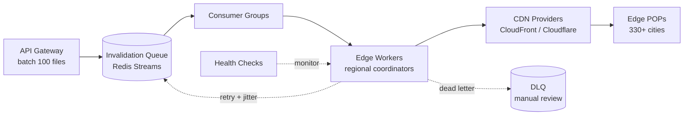

| Difficulty | Channel | Tags |
|---|---|---|
| intermediate | system-design | edge, caching, purging |

When your job is to make the internet fast, a slow cache is a personal insult. Cloudflare — the company that runs the world's largest CDN across 330+ cities in 120+ countries — hit exactly that wall in 2022: global cache purges took 2-5 seconds, throughput had a hard ceiling, and customers demanding near-real-time propagation were left waiting [1]. This is the story of how a rebuild turned purge latency from 1,570ms to 149ms (a 90% improvement), scaled throughput 10x, and what that architecture teaches you about invalidating a global cache in under 5 seconds.

---

> ### Real-World Case — Cloudflare
>
> Cloudflare, running the world's largest CDN across 330+ cities in 120+ countries, was rebuilding its cache purge pipeline because its old centralized design couldn't keep up. Customers needed cache invalidations to propagate globally in near-real-time — especially for purge-by-tag, hostname, and prefix — but the old system took 2-5 seconds and had a hard ceiling on purge throughput.
>
> | | |
> |---|---|
> | **Challenge** | Every purge request had to reach every datacenter caching that content, but the old architecture funneled all purge writes through a small set of 'core' data centers (via the Quicksilver KV store) that don't serve traffic. This created a single write funnel bottleneck and paid a long round-trip latency penalty for any customer far from a core — while the actual purge was executed lazily at request time, wasting ~20% of storage on purge history. |
> | **Solution** | They rebuilt the system as 'Coreless Purge': purge requests now enter any local datacenter and propagate directly peer-to-peer to all other datacenters with no central coordinator, actively deleting content from a local RocksDB-based index (CacheDB) instead of lazily checking on fetch. The system broadcasts the keys to purge, each datacenter immediately invalidates matching cached content, and new rate limits scale purge throughput dramatically. |
> | **Outcome** | Global purge latency dropped from ~1,570ms (May 2022, core-based) to 149ms P50 — a 90% improvement — for purge by tags, hostnames, and prefixes across all 330+ cities, with max throughput scaled ~10x (from ~10K/s to ~100K/s) and storage overhead for purge history halved from ~20% to ~10%. |
> | **Lesson** | A centralized control plane that routes all writes through a single funnel is the wrong architecture for global invalidation; the surprising insight is that avoiding any central coordinator (peer-to-peer fan-out, active deletion, local indexed storage) is what makes propagation 'instant' at planetary scale. |

---

## Hook — The 2-second eternity

Here is the trap at the heart of content delivery networks. A CDN's entire superpower is copying your content to hundreds of edge locations so it is always near your users [2]. That is precisely why removing content is so hard: the purge isn't one deletion, it is thousands of independent deletions that all need to happen before the stale copy stops serving.

Cloudflare knows this pain intimately. Its old purge pipeline took 2-5 seconds to propagate and capped out on throughput, which meant that during heavy invalidation traffic, the pipeline itself became the bottleneck that made everything else feel slow [1]. Every developer who has pushed a hotfix and watched a CDN keep serving the broken version has felt a fraction of this problem. For a CDN whose entire product is speed, seconds are an eternity — and the fix would require rethinking everything about how purge works.

## Problem — The pain of a cache that never forgets

So what is actually at stake? Picture three scenarios. Your pricing engine releases a sale and the cached checkout page keeps showing yesterday's full price — revenue leaks every minute the cache lags. A security patch ships, but a cached copy of the vulnerable JavaScript keeps executing in users' browsers — exposure continues long after the fix lands. You roll back a broken deploy, yet edge nodes keep serving the broken bundle to anyone who hit the site in the last few minutes.

Every one of these is a cache invalidation problem, and every one gets worse as your CDN footprint grows. The naive fixes don't survive contact with reality. Firing one HTTP request per URL at the provider collapses under load — at 10,000 invalidations per second you would drown the API. Purging everything on every deploy nukes your cache hit rate and spikes origin traffic. And the deeper problem is conceptual: distributed systems cannot give you strong consistency during a network partition — the CAP theorem forces you to choose [3].

Therefore the real question isn't how to make purges instant, it's how to design a pipeline that propagates within 5 seconds, handles 10K invalidations per second, and degrades gracefully when things go sideways.

## Real-World Case — Cloudflare's instant purge rebuild

Cloudflare's rebuild is the perfect blueprint because the numbers are impossible to ignore [1]. Before the change, purge operations on the core-based pipeline averaged around 1,570ms P50. After rebuilding, purge-by-tag, purge-by-hostname, and purge-by-prefix propagate in 149ms P50 across all 330+ cities — a 90% improvement. Throughput scaled roughly 10x, from about 10K purges per second to 100K, and storage overhead for purge history was halved, dropping from ~20% to ~10%.

The secret wasn't a faster API. It was an architectural shift from a central pipeline to per-machine replication: every server replicates purge state and processes its own invalidation messages, turning a centralized bottleneck into a distributed fan-out. That single decision — treat the purge pipeline as a distributed system in its own right — is what made the rest possible. If a company whose entire business is scale had to rebuild, you should expect to learn something from how they did it.

## Deep Dive — Anatomy of a purge pipeline

Building on Cloudflare's approach, let's dissect what a production-grade purge pipeline contains. The non-functional requirements set the boundaries: sub-5-second global propagation, 10,000 invalidations per second, 99.99% availability, and strong consistency across regions. That last requirement deserves scrutiny. As established, strict strong consistency at global scale is physically impossible during a partition [3]. Therefore the honest contract is near-immediate propagation in the happy path, with eventual convergence and reconciliation everywhere else.

The architecture has three layers. The API gateway receives purge requests and normalizes them into batches of up to 100 invalidations per API call — batching alone cuts provider API costs by roughly 90%. Next, an invalidation queue built on Redis Streams with consumer groups distributes work to edge workers; consumer groups let many workers pull messages from the same stream without double-processing any of them [4]. Finally, regional cache coordinators fan out to CDN providers, invoking purge APIs such as CloudFront invalidation or Cloudflare's purge_cache endpoint [5][6].

Here is the plot twist that surprises most developers: the cache headers do half the invalidation work for you. Setting Cache-Control: max-age=2, must-revalidate gives dynamic content a 2-second TTL, so stale copies self-heal without any purge at all [7][8]. Under this strategy, a purge is less about deleting everything and more about fast-forwarding what would happen naturally. The trade-off is origin load, which is why the pattern splits content: static assets get versioned URLs with long TTLs and are effectively never purged; dynamic content gets the 2-second window where a purge actually matters.

Failure handling is where naive pipelines die. A circuit breaker trips after 5 consecutive failures so your workers fail fast instead of hammering an already-degraded provider. Exponential backoff with jitter spaces out retries so retry storms don't become the outage [9]. Failed invalidations land in a dead letter queue for manual review. And because a purge acknowledged in one region means nothing if another region dropped the message, health checks plus periodic reconciliation re-issue missed purges after partitions heal.

## Workflow — From click to global expiry in seven steps

With the components in place, here is the end-to-end flow of a single invalidation, visualized in the diagram below: a purge request enters through the API gateway, lands in the Redis Streams queue, gets pulled by consumer groups, fanned out by edge workers to regional coordinators, and finally dispatched to the CDN provider's purge API.

1. Ingest — the API gateway validates the request and batches up to 100 target URLs or patterns into one purge event.
2. Enqueue — the event is written to a Redis Stream; consumer groups let many edge workers consume without collisions [4].
3. Coordinate — each edge worker acts as a regional coordinator responsible for its slice of edge POPs.
4. Fan out — the coordinator calls the provider's purge API with the batched patterns [5][6].
5. Retry — throttling or 5xx responses trigger exponential backoff with jitter, capped at 3 attempts [9].
6. Escalate — anything still failing after retries moves to the dead letter queue for inspection.
7. Reconcile — health checks and reconciliation jobs re-issue missed purges after network partitions, closing the consistency gap.

The genius of this flow is that nothing waits on anything. The origin, the queue, the coordinators, and the providers are all decoupled by asynchronous messaging, so a slow region never blocks a fast one. That decoupling is exactly what makes 10K invalidations per second tractable — and what makes a 5-second SLA achievable without crossing your fingers.

## Code Example — A regional purge coordinator

The heart of this system is the consumer that pulls batches off the queue and talks to the CDN provider. Here is a production-shaped version in JavaScript that runs as an edge worker: it takes a batch of URLs, calls Cloudflare's purge_cache API, retries with exponential backoff and jitter, and escalates to a dead letter queue when the provider refuses to cooperate. Every line below solves a real failure mode you will hit at scale — rate limits, throttling, and synchronized retry storms.

## Lessons Learned — Battle scars and the 5-second playbook

So what should you do differently tomorrow? Here are the takeaways, hard-won by teams who learned them at scale.

- Give the SLA headroom. A 5-second propagation SLA feels comfortable when your dynamic TTL is 2 seconds — the cache self-heals anything the pipeline misses [7].
- Batch aggressively. 100 invalidations per API call cut provider costs by ~90% and reduce rate-limit pressure [5][6].
- Never retry without jitter. Synchronized backoff turns a blip into a retry storm that takes down the provider [9].
- Fail fast with a circuit breaker. Five consecutive failures should stop the bleeding, not start a pile-on.
- Treat the dead letter queue as an audit trail. Every failed invalidation is a potential stale-content incident you can replay later.
- Don't purge what you can version. Static assets with versioned URLs get long TTLs and never need invalidation.
- Design for reconciliation, not perfection. Strong consistency at global scale is a myth [3]; eventual convergence with a reconciliation loop is a contract.

The common battle scar worth calling out: purging by exact URL when the cache actually keys on prefixes or tags. Many developers discover that a successful purge did nothing because the pattern never matched the real cache keys. Match your purge strategy to how your provider stores cache entries — prefix and tag purges exist for exactly that reason [5][6].

The bigger lesson from Cloudflare's rebuild is architectural: the purge pipeline is a distributed system, so build it like one [1]. Queues, consumer groups, backoff, circuit breakers, and reconciliation aren't overhead — they are the difference between a purge that propagates in 149ms and one that silently fails while customers stare at stale content.

---

## Cache Invalidation Pipeline

<strong>Original Interview Question</strong>

**Q:** How would you design a multi-region CDN cache purging system that guarantees content propagation within 5 seconds while handling 10,000 concurrent invalidations per second?

**A:** Implement Cloudflare API + AWS CloudFront with distributed invalidation queue, edge compute coordination, and 2-second TTL. Use batch invalidation, exponential backoff, and regional cache headers for 5-second SLA.

## Conclusion

The story of Cloudflare's instant purge is ultimately a reminder that speed and correctness are not enemies — they are a design problem. By decoupling the pipeline, setting a self-healing TTL, and building failure handling that assumes things will break, teams turned a 2-5 second delay into a 149ms fan-out across 330+ cities [1]. The insight to carry back to your team is disarmingly simple: the best invalidation is the one you never have to send. Make your cache expire fast enough to self-heal, version what you can, and purge the rest through a pipeline designed for 10,000 requests per second and the occasional network partition. Do that, and your cache stops being a source of stale-content anxiety and becomes what it was always meant to be: invisible.

---

## References

1. [Cloudflare incident report](https://blog.cloudflare.com/instant-purge/) — article
2. [Content delivery network](https://en.wikipedia.org/wiki/Content_delivery_network) — documentation
3. [CAP theorem](https://en.wikipedia.org/wiki/CAP_theorem) — documentation
4. [Redis Streams documentation](https://redis.io/docs/latest/develop/data-types/streams/) — documentation
5. [Invalidating files with Amazon CloudFront](https://docs.aws.amazon.com/AmazonCloudFront/latest/DeveloperGuide/Invalidation.html) — documentation
6. [Cloudflare: Purge cache](https://developers.cloudflare.com/cache/how-to/purge-cache/) — documentation
7. [MDN: Cache-Control](https://developer.mozilla.org/en-US/docs/Web/HTTP/Headers/Cache-Control) — documentation
8. [RFC 7234: Hypertext Transfer Protocol (HTTP/1.1): Caching](https://datatracker.ietf.org/doc/html/rfc7234) — documentation
9. [Exponential backoff](https://en.wikipedia.org/wiki/Exponential_backoff) — documentation

---

**Author:** Satishkumar Dhule — [GitHub](https://github.com/satishkumar-dhule) · [LinkedIn](https://linkedin.com/in/satishkumar-dhule) · [Website](https://satishkumar-dhule.github.io)
