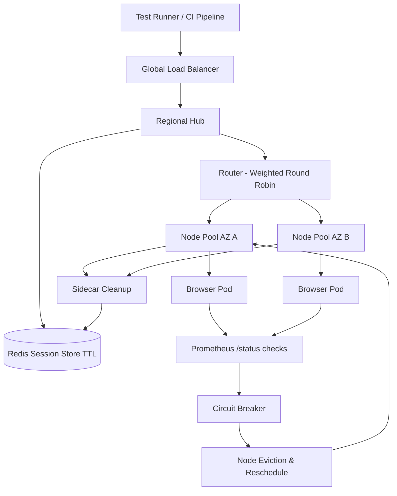

| Difficulty | Channel | Tags |
|---|---|---|
| advanced | system-design | selenium, webdriver, grid |

It is 3am somewhere, and a CI pipeline just fired off 10,000 browser sessions at a grid that was never designed to carry any of them. That is the moment when most test infrastructure quietly dies — not with a bang, but with a memory leak and a queue that never drains. Expedia Group ran one of the largest Selenium Grids ever built on AWS for five years, handling roughly 140,000 UI tests a day across more than 100 hubs, until the economics and the networking physics of that approach collapsed under them [1]. This is the story of how teams like theirs — and like yours — learn to build grids that scale without leaking, without melting, and without a $2.4 million bill from a third-party vendor.

---

> ### Real-World Case — Expedia Group
>
> Expedia's automation infrastructure team ran a Selenium Grid on AWS for 5 years handling ~140,000 UI tests a day across 100+ hubs. As they moved to a microservices world and 'shift-left' testing (testing before code commit), the EC2-based grid showed its limits: spinning up a new hub node took 2-4 minutes, hubs were static and had to be manually stopped/started to save cost, and overlapping private IPs across multiple AWS accounts broke inter-account communication.
>
> | | |
> |---|---|
> | **Challenge** | They needed a test infrastructure that could scale to thousands of parallel browser sessions across CI/CD pipelines, create/destroy entire grids on demand per branch, fail over reliably, and do it without the astronomical cost of third-party cross-browser vendors. |
> | **Solution** | They rebuilt the grid as 'DA-Kube' on Amazon EKS using Selenium Grid + Docker + Helm + Traefik. Each CI/CD pipeline gets its own dynamically-provisioned grid (hub + nodes) via a single helm install, Traefik Ingress routes traffic to the correct hub, and K8s QoS classes (Guaranteed) with one Chrome/Firefox container per pod protect against eviction and make the grid reliable. |
> | **Outcome** | Third-party cross-browser vendors would have cost ~$350K for 120 parallel connections and ~$2.41M for 1000 parallel connections; Expedia's internal containerized solution runs the same load for ~$80,000 annually. The plot twist: on a c5.2xlarge EC2 node they could only run 19 browser pods because AWS reserves 15 private IPs per interface and 2 interfaces = 30 reserved IPs, so scaling 300-500 node pods caused 'IP address bleeding' and pod scheduling failures - a networking constraint nobody expects when scaling browser pods. |
> | **Lesson** | When scaling Selenium Grid on Kubernetes, container-level limits (IP address reservations, node density) and cost-per-parallel-session economics matter more than raw node count - and a well-instrumented internal grid can deliver cloud-vendor-equivalent parallelism at roughly 3% of the cost, if you're willing to own the infrastructure. |

---

## Hook — The Hidden Cost of a Test Grid That Works Too Well

Here is a scenario every developer has lived through: you push code, the pipeline turns green on your machine, and then the real test suite runs. Two minutes later, 40% of the jobs are red — not because your code is broken, but because the grid that runs your Selenium tests is exhausted, leaking memory, and quietly dropping sessions [2]. Now multiply that by a thousand. Expedia's automation team was running roughly 140,000 UI tests a day across 100+ hubs, and their static EC2-based grid was the wall their whole shift-left strategy kept crashing into [1]. Spinning up a fresh hub node took 2-4 minutes. Hubs had to be manually stopped and started to save cost. And because multiple AWS accounts had overlapping private IPs, hubs literally could not talk to each other across account boundaries. The stakes? When you cannot trust your test infrastructure, you stop trusting your releases — and that is a far more expensive failure than any vendor bill. Sound familiar? If your team has ever blamed flaky tests when the grid was the real problem, you are not alone.

## Problem — Why 10,000 Concurrent Sessions Is a Different Beast

Most teams never design a grid. They grow one. Someone starts a hub on a spare server, adds a node, adds another, and five years later you are staring at a fleet of static EC2 boxes that require a human to baby-sit them. That works until the moment it doesn't. The moment is usually triggered by three converging pressures: the shift-left movement (testing before code commit), microservices sprawl (each service with its own UI suite), and parallelization (the obsession with cutting feedback time). Consequently, the session count explodes. At 10,000 concurrent sessions you can no longer eyeball your infrastructure — you need the answer to the design question every senior engineer eventually faces: how do you run 200 browser nodes with 99.9% uptime, zero memory leaks, automatic cleanup, and graceful failure recovery? Memory leaks are the silent killer here. Each WebDriver session holds native browser processes, log buffers, and temp profiles. If a session dies without cleanup, its footprint lingers. Multiply 10,000 sessions by a few MB of leaked memory each, and the cluster begins a slow, predictable death spiral. You might think 'just restart the nodes,' but a restart does not fix the reason sessions leak in the first place.

## Real-World Case — Expedia Group

Expedia Group is the perfect case study because they published every painful detail of the journey. Their team ran Selenium Grid on AWS for five years, serving ~140,000 UI tests per day across 100+ hubs [1]. Then they went all-in on microservices and shift-left testing, and the EC2-based grid hit its limits: 2-4 minutes to boot a new hub node, static hubs that had to be manually stopped and started, and overlapping private IPs across AWS accounts that broke inter-account communication. The plot twist nobody sees coming: on a c5.2xlarge EC2 node, they could only run 19 browser pods. Why? AWS reserves 15 private IPs per Elastic Network Interface, and with 2 interfaces that means 30 reserved IPs per node [8]. When they tried to scale to 300-500 node pods, the grid hit 'IP address bleeding' — pod scheduling failures caused by a networking constraint nobody plans for when scaling browser pods [1][8]. The economics were equally brutal. Third-party cross-browser vendors would have charged roughly $350,000 for 120 parallel connections and about $2.41 million for 1000 parallel connections. Expedia's internal containerized solution runs the same load for approximately $80,000 a year. That is a 30x price difference on the low end — and the real lesson is that the biggest costs in testing infrastructure are the invisible ones: unused parallelism, idle machines, and architectural debt.

## Deep Dive — Anatomy of a Grid That Doesn't Leak

Building on Expedia's experience, the mature design for a 10,000-session grid has four layers that each solve a specific failure mode. First, the hub-node pattern: a central router backed by Kubernetes StatefulSets that manage browser nodes across multiple availability zones [3]. StatefulSets matter because browser pods need stable identity and persistent state — a plain Deployment would reschedule them mid-session. Second, session management via a Redis cluster with TTL-based expiration, connection pooling, and automatic cleanup [5]. Redis gives you a shared, fast session registry that survives individual hub restarts. Every session record carries an expiry; when the TTL fires, the session is reaped regardless of whether the test process remembered to quit. Third, resource isolation: CPU and memory limits per pod (2GB RAM, 1 CPU per node), with horizontal pod autoscaling driven by queue depth rather than raw CPU [4]. Autoscaling on queue depth is the counterintuitive insight — browser sessions are waiting on a queue, not consuming CPU, so queue length is the leading indicator, not CPU usage. Now the numbers. At 50 sessions per node, 10,000 sessions means 200 nodes minimum. At 2GB each, that is 400GB baseline; add a 30% safety buffer and the cluster needs about 520GB of memory. P99 session initiation must stay under 2 seconds, which is only achievable with regional load balancing that routes a session to a node in the same data center. Multi-AZ deployment plus automatic failover buys you the 99.9% uptime target. Finally, failure containment: health checks hit a /status endpoint every 10 seconds, and three consecutive failures trigger immediate node removal [9]. Circuit breakers (the Hystrix pattern) isolate a failing node for a 30-second recovery window so one bad node cannot cascade into a grid-wide outage [9]. Prometheus collects memory trends and session-duration metrics, and Grafana turns them into dashboards that make the next leak visible before it becomes an outage [6].

## Workflow — From Queue to Browser Pod in Seven Steps

Here is how a request actually moves through this architecture, and the diagram below traces the full lifecycle: 1) A test runner submits a new session request to the global load balancer, which routes regionally to keep P99 latency under 2 seconds. 2) The regional hub checks the Redis session store for capacity and writes a new session record with a TTL [5]. 3) The router picks a node using weighted round-robin — weighted by current capacity and recent response time, not just raw load. 4) The node schedules a browser pod; if no node has capacity, the horizontal autoscaler sees queue depth rising and scales out node pools [4]. 5) A sidecar container watches the session; when the test finishes (or crashes), the sidecar kills the browser process and purges the session key from Redis. 6) An init container sweeps stale Docker volumes on pod startup, preventing disk bloat across weeks of runs [3]. 7) Prometheus scrapes every node every 15 seconds; if memory crosses 80% of limit, the circuit breaker opens and alerts trigger, and if a node fails three health checks in a row it is evicted and rescheduled [9]. The Mermaid diagram below shows this flow end to end, including the loop back through monitoring that keeps the whole system honest.

## Code Example — The Session Lease Pattern That Kills Memory Leaks

All the architecture in the world collapses if the test code abandons its sessions. The pattern below is the one teams should paste into every test harness: treat a browser session like a lease — acquire it, use it, and release it in a finally block no matter what happens. The Redis key deletion mirrors the grid's TTL-based cleanup [5], so even if a worker process is killed with a SIGKILL, the session record expires on its own. This is production code, not a toy — the combination of try/finally and server-side TTL is exactly what Expedia's containerized grid relies on to keep 10,000 concurrent sessions from leaking memory [1].

## Lessons Learned — What Survives Contact with Production

After watching teams build and rebuild grids, a few lessons reliably survive contact with production. First, cost is not what you think: Expedia's $80K annual internal spend versus $2.41M for a 1000-parallel vendor connection is not a marketing number, it is a business case [1]. Second, the counterintuitive plot twist — EC2 node capacity is bounded by private IPs, not CPU or memory. With 15 reserved IPs per interface and 2 interfaces, a c5.2xlarge held only 19 browser pods; teams that did not plan for ENI limits watched 300-500 pods fail scheduling [8]. Third, leaks are a lifecycle problem, not a cleanup problem. Server-side TTL expiration [5], sidecar termination [3], and init-container volume sweeps are the difference between a grid that degrades over weeks and one that runs flat for months. Fourth, protect the cluster from itself: Pod Disruption Budgets guarantee minimum 85% capacity during maintenance [7], canary deployments with traffic splitting guard zero-day failures in new node images, and weekly rolling restarts are cheap insurance against slow memory drift [1]. Here is the practical checklist for tomorrow: instrument session duration now, add a TTL to your session store, wire queue-depth autoscaling, and — the non-negotiable one — make every test release its browser session in a finally block. Start with the leak, because a grid that leaks is a grid you cannot trust, and a grid you cannot trust is a release you cannot ship.

---

## Grid Session Lifecycle

<strong>Original Interview Question</strong>

**Q:** Design a scalable Selenium Grid architecture to handle 10,000 concurrent test sessions with 99.9% uptime, ensuring zero memory leaks through automatic session lifecycle management, real-time monitoring, and graceful node failure recovery across multiple data centers?

**A:** Deploy Kubernetes cluster with auto-scaling node pools, Redis session store with TTL policies, Prometheus metrics for memory monitoring, circuit breakers for node isolation, and sidecar containers for session cleanup. Implement health checks, resource quotas, and rolling updates.

## Conclusion

The moral of the story is that a test grid is infrastructure, and infrastructure deserves the same design rigor as production. Expedia proved the economics — $80K a year internally versus $2.41M from a vendor — and proved the physics: scale limits hide in places you would never guess, like private IP addresses on a network interface [1][8]. The next time your suite goes red, ask a different question than 'is the code broken?' Ask whether your grid is healthy, whether sessions are being released, and whether your autoscaler is watching the right metric. Start small: add a TTL to your session store, watch session duration on a dashboard, and make every test quit its driver in a finally block. Tomorrow, ship one of those changes. The insight worth sharing with your team: a grid that leaks memory is a grid you cannot trust, and the cost of that distrust — slow releases, flaky suites, 3am pages — always exceeds the cost of the infrastructure that prevents it.

---

## References

1. [Expedia Group incident report](https://medium.com/expedia-group-tech/da-kube-selenium-grid-using-kubernetes-docker-helm-and-traefik-856b802d1d08) — article
2. [Selenium Grid documentation](https://www.selenium.dev/documentation/grid/) — documentation
3. [Kubernetes StatefulSets](https://kubernetes.io/docs/concepts/workloads/controllers/statefulset/) — documentation
4. [Horizontal Pod Autoscaling](https://kubernetes.io/docs/tasks/run-application/horizontal-pod-autoscale/) — documentation
5. [Redis TTL and key expiration](https://redis.io/docs/latest/develop/using-commands/expire/) — documentation
6. [Prometheus overview](https://prometheus.io/docs/introduction/overview/) — documentation
7. [Kubernetes Pod Disruption Budgets](https://kubernetes.io/docs/tasks/run-application/configure-pdb/) — documentation
8. [Amazon EC2 Elastic Network Interfaces](https://docs.aws.amazon.com/AWSEC2/latest/UserGuide/using-eni.html) — documentation
9. [Circuit Breaker pattern](https://martinfowler.com/bliki/CircuitBreaker.html) — article
10. [Selenium (software)](https://en.wikipedia.org/wiki/Selenium_(software)) — documentation

---

**Author:** Satishkumar Dhule — [GitHub](https://github.com/satishkumar-dhule) · [LinkedIn](https://linkedin.com/in/satishkumar-dhule) · [Website](https://satishkumar-dhule.github.io)
