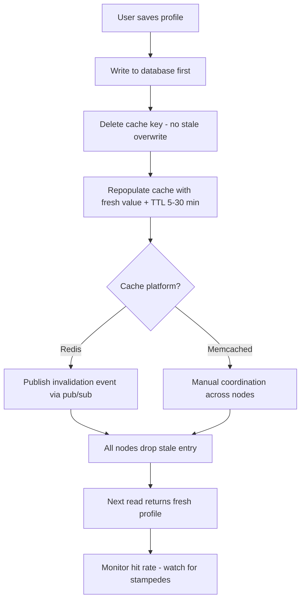

| Difficulty | Channel | Tags |
|---|---|---|
| beginner | backend | redis, memcached, cache-invalidation |

In 2005, a small social network was grinding to a halt under slow page loads, so Mark Zuckerberg installed memcached directly on the Apache web servers — a stopgap that quietly became the backbone of the world's largest social network [1]. Today, Meta's memcached fleet handles billions of requests per second across trillions of cached items, with a single user request fanning out into 24+ cache lookups (500+ at the 95th percentile) [1]. But here is the secret nobody tells you in system design interviews: the cache itself is easy. The cache invalidation — keeping old data from living forever — is the silent killer. This post takes you on the journey from one user editing their bio to a multi-server invalidation strategy that survives the chaos of real traffic.

---

> ### Real-World Case — Facebook (Meta)
>
> Facebook started using memcached in August 2005 when Mark Zuckerberg installed it on Apache web servers to fix slowing page loads, and it eventually became the backbone of the world's largest social network. Their memcached fleet now handles billions of requests per second holding trillions of items for over a billion users, with each user request fanning out into 24+ cache lookups (500+ at the 95th percentile).
>
> | | |
> |---|---|
> | **Challenge** | Pure TTL-based cache invalidation proved insufficient at scale. Facebook hit three hard problems: stale sets (a web server writing an outdated value back into the cache after the DB had already been updated), thundering herds (thousands of clients hammering the database when a popular key expired or a memcached host died), and cross-region invalidation races where cache updates arrived before replicated database writes. |
> | **Solution** | Facebook explicitly rejected write-through caching (schema and cache keys didn't align) and instead kept cache-aside while patching its failure modes. They extended the memcached protocol with 64-bit lease tokens - a client gets a lease on a miss, and if the key is invalidated while it holds the lease, the late SET is dropped (solving stale sets); leases are only granted once per ~10 seconds per key to absorb thundering herds. Invalidation itself was driven by a database change feed (mcsqueal) rather than TTL expiry, embedded in MySQL replication so invalidations can never beat the replicated write. They added a small gutter pool (~1% standby capacity) so a dead memcached host doesn't stampede MySQL, and mcrouter to route deletes across clusters. |
> | **Outcome** | The system scales to billions of requests per second across thousands of memcached servers while storing trillions of items, with single-digit millisecond p95 end-to-end latency. Lease tokens eliminate stale-value overwrites and cap herd traffic to one DB fetch per key per ~10 seconds, and the binlog-embedded invalidation guarantees cache entries can never predate the replicated write that invalidates them. |
> | **Lesson** | TTL-based expiration alone is not a cache invalidation strategy - Facebook relied on explicit invalidation driven by the database change stream, and needed lease tokens to solve the write/write race (stale sets) that delete-on-update alone cannot prevent. There is also a telling Redis-vs-Memcached trade-off angle: Facebook bet on memcached's simplicity and built correctness mechanisms (leases, change-feed invalidation) at the client layer rather than reaching for server-side pub/sub. |

---

## Hook — It starts with a single edit

Picture this: it's a quiet Tuesday, and a user changes their display name. Nothing dramatic — one string swap in a database. Yet a second later, that same user refreshes their profile page and still sees the old name. Then another user. Then a thousand more. Sound familiar? You have just met cache invalidation, the problem that quietly drains hours from every backend engineer's week. The stakes are higher than a cosmetic bug: stale data erodes trust, and — in the worst case — one expensive cache miss cascades into a stampede that takes your database down with it [4]. Every team that has ever cached 'just to speed things up' eventually hits this wall. The question isn't whether you'll face it. The question is whether you'll be prepared when the pager goes off at 2am.

## Problem — The cache is a copy, and copies go stale

Here is the fundamental tension: a cache is a snapshot, a frozen frame of data that was true at some point in the past. The moment the source of truth changes, every snapshot in memory becomes a lie. The naive approach — just add a cache and never think about it again — works right up until the first update, and then it becomes a ticking time bomb. So what is the actual challenge? You need three things at once: reads fast enough to make the cache worthwhile, writes that never serve stale data, and a system that doesn't collapse when hundreds of threads all miss the cache simultaneously. Many developers discover the hard way that deleting a key isn't the end of the story. It's the beginning. Because if you invalidate before the database write commits, you've just re-populated the cache with data that is already outdated. Moreover, if you rely on TTL alone, you're buying eventual consistency with a stopwatch — and every profile you serve between update and expiry is technically wrong. This leads to a deceptively simple interview question with deceptively deep answers: how do you keep a cached user profile fresh?

## Real-World Case — Facebook (Meta) and the memcached empire

Building on this tension, let's look at the company that turned cache invalidation into a science. Facebook started using memcached in August 2005, when Zuckerberg installed it on Apache web servers to fix slowing page loads [1]. What began as a band-aid grew into the backbone of the world's largest social network: thousands of memcached servers, trillions of cached items, and billions of requests per second for over a billion users [1]. Every single user request fans out into 24+ cache lookups — 500+ at the 95th percentile — yet end-to-end latency stays in the single-digit milliseconds [1]. That scale would be impossible with naive TTLs alone, so Meta engineered two elegant weapons. First, lease tokens that eliminate stale-value overwrites and cap herd traffic to exactly one database fetch per key every ~10 seconds [1]. Second, binlog-embedded invalidation: the cache entry can never predate the replicated database write that invalidates it, guaranteeing no stale reads ever slip through [1]. This is the plot twist: the world's largest cache isn't clever about eviction — it's ruthless about invalidation ordering. Consistency, not capacity, is what makes the whole thing work.

## Deep Dive — Redis vs Memcached: the real trade-offs

However, you are not Meta. Your profile service probably runs on a few boxes, and your first decision is the hardest one: Redis or Memcached? Here is the honest breakdown, stripped of marketing. Memcached is a pure caching engine — a hash table with no persistence, no replication story, and a deliberately small feature surface [2]. That simplicity is a superpower: lower memory overhead, a simpler architecture, and famously fast reads for pure cache workloads [2]. But it comes with a catch. When you invalidate a key on a multi-node Memcached cluster, every other node needs manual coordination — there is no built-in way for one server to tell its peers that a key is dead [2]. Redis, by contrast, ships with pub/sub messaging, persistence, and advanced data structures, which makes distributed invalidation almost free: one node publishes an invalidation event, and every subscriber drops the stale key instantly [3][7]. But wait, it gets better — Redis persistence means your cache can survive restarts, which is wonderful until you realize that also means a stale key can survive a restart too. So which do you choose? Use this table as your cheat sheet:

## Workflow — From user update to fresh cache, step by step

Let's turn theory into a repeatable process. Building on everything so far, here is the write-through invalidation workflow that survives production. The diagram below tells the visual story of how one profile update flows through the system. Step one: the user saves their profile, and the database write happens first — the source of truth must always win. Step two: delete the cache key rather than overwriting it, which avoids the classic race where a stale writer repopulates the cache after your fresh write. Step three: repopulate the cache with the new value and set a TTL of 5–30 minutes as a safety net, so even a botched invalidation self-heals [4]. Step four: if you're on Redis, publish an invalidation event over pub/sub so every node in the fleet drops the stale entry simultaneously; on Memcached, you'll need manual coordination or a fan-out mechanism [3]. Finally, monitor cache hit rates relentlessly — a hit rate below 85% means you're paying for caching and getting nothing back. The elegance here is that reads stay cache-aside (fast), writes stay write-through (consistent), and the TTL is your insurance policy, not your primary strategy.

## Code Example — A production-style write-through profile cache in Python

This is where it all comes together. The snippet below implements the pattern discussed above using Redis — the write-through path, the delete-before-repopulate rule, and the cache-aside read path. Every line exists to solve a specific problem from this journey.

## Lessons Learned — Battle scars, and what to do tomorrow

If this feels like a lot, you are not alone — every senior engineer has at least one cache-invalidation scar. Here are the ones worth learning without bleeding for them. First, always write to the database before touching the cache; the write-through pattern guarantees the source of truth leads and the cache follows. Second, delete keys on update instead of overwriting them — overwriting is a race you will lose eventually. Third, never skip the TTL. A 5–30 minute expiry is your safety net when everything else fails, and it converts 'forever stale' into 'temporarily slightly stale' [4]. Fourth, if your cache spans multiple servers, treat invalidation as a distributed problem: Redis pub/sub handles it natively, while Memcached forces manual coordination [2][3]. And finally, protect yourself against the stampede — Meta's lease-token trick of capping one database fetch per key per ~10 seconds is worth stealing even at small scale [1]. The so-what for tomorrow: go look at your profile service, check your hit rates, and ask one honest question — if your cache disappeared right now, what breaks, and what serves stale data while you fix it? Leave this conversation with one memorable insight to share with your team: a cache without an invalidation strategy is not an optimization, it's a liability.

---

## Cache Invalidation Flow

<strong>Original Interview Question</strong>

**Q:** You're building a user profile service that caches frequently accessed profiles. How would you implement cache invalidation when a user updates their profile, and what trade-offs would you consider between Redis and Memcached?

**A:** Implement write-through caching with TTL-based expiration. On profile update, invalidate the cache by deleting the key and writing new data to both the database and cache. Redis offers pub/sub for automatic distributed invalidation, while Memcached requires manual coordination across nodes.

## Conclusion

The moral of this story is that caching is easy, but invalidation is where careers are made. Meta turned a 2005 stopgap into the backbone of the world's largest social network by treating consistency as a first-class engineering problem — ordering writes before invalidations and engineering against stampedes with lease tokens [1]. You don't need a fleet of thousands of servers to apply the same discipline: write to the database first, delete keys instead of overwriting them, keep a TTL as your safety net, and think about invalidation as a distributed problem from day one. Tomorrow morning, pull up your profile service, check your cache hit rate, and audit one endpoint end to end. Ask yourself: if the cache vanished right now, what would break — and what would serve stale data while you fixed it? A cache without an invalidation strategy isn't an optimization. It's a liability wearing a speed costume.

---

## References

1. [Facebook (Meta) incident report](https://www.usenix.org/conference/nsdi13/technical-sessions/presentation/nishtala) — article
2. [Memcached - Wikipedia](https://en.wikipedia.org/wiki/Memcached) — documentation
3. [Redis - Wikipedia](https://en.wikipedia.org/wiki/Redis) — documentation
4. [Cache stampede - Wikipedia](https://en.wikipedia.org/wiki/Cache_stampede) — documentation
5. [Redis GitHub repository](https://github.com/redis/redis) — documentation
6. [memcached GitHub repository](https://github.com/memcached/memcached) — documentation
7. [Amazon ElastiCache for Redis documentation](https://docs.aws.amazon.com/AmazonElastiCache/latest/red-ug/WhatIs.html) — documentation
8. [Amazon ElastiCache for Memcached documentation](https://docs.aws.amazon.com/AmazonElastiCache/latest/mem-ug/WhatIs.html) — documentation
9. [Cache (computing) - Wikipedia](https://en.wikipedia.org/wiki/Cache_(computing)) — documentation

---

**Author:** Satishkumar Dhule — [GitHub](https://github.com/satishkumar-dhule) · [LinkedIn](https://linkedin.com/in/satishkumar-dhule) · [Website](https://satishkumar-dhule.github.io)
