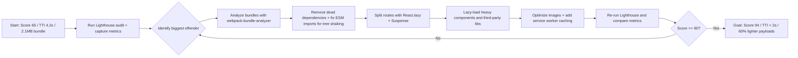

| Difficulty | Channel | Tags |
|---|---|---|
| intermediate | frontend | lighthouse, bundle, lazy-loading |

Imagine shipping a new feature to your ad-tech dashboard and watching Lighthouse drop to 49 — while the Booking route quietly balloons past 3.5MB of downloaded resources. That is exactly where Tatari found themselves: a growing React codebase, ballooning bundles, and a Lighthouse score that made every demo feel like a hostage negotiation [1]. This is the story of how they clawed their way back to 94, and the playbook you can steal to do the same for your 2.1MB bundle and 4.2s Time to Interactive.

---

> ### Real-World Case — Tatari
>
> Tatari, an ad-tech company, runs React (TypeScript) web apps bundled with webpack. As the codebase grew with external libraries, bundle sizes and build times ballooned and their Lighthouse performance score sank to 49, with the Dashboard and Booking route bundles especially bloated.
>
> | | |
> |---|---|
> | **Challenge** | Large single bundles were shipped wholesale for every route, so users downloaded code for the whole app (including heavy vendor libraries) just to see one page, dragging down load performance and the Lighthouse score. They needed route-based code splitting, lazy loading, and a way to eliminate duplicated vendor/shared code. |
> | **Solution** | They profiled the bundles with webpack-bundle-analyzer, then applied route-based code splitting using React.lazy() and Suspense. They hit a plot twist: lazy loading appeared to work but produced no separate chunks — because ts-loader/tsconfig compiled dynamic import() into CommonJS (`module: "commonjs"`), silently defeating webpack's splitting. Setting `module` to `esnext` finally emitted real chunks. Next, webpack splitChunks extracted node_modules into a cached `libs.js` and shared code into `common.js` (which had been duplicated into every chunk), loaded deferred, then they enabled gzip compression. |
> | **Outcome** | The Campaign Manager (booking) app's Lighthouse performance score jumped from 49 to 94 on average, and response payloads dropped ~60% on average — a route serving 3.5MB of resources finished loading ~60% faster. |
> | **Lesson** | Bundle optimization isn't just writing React.lazy() — you must verify chunks are actually being emitted (a tsconfig `module: "commonjs"` setting can silently transpile dynamic imports before webpack can split on them), and always inspect the output with a bundle analyzer to catch vendor code duplicated across every chunk. |

---

## Hook — A route that weighed more than a movie

Ever shipped code, merged the PR, and only found out about the damage weeks later when someone ran an audit? Here is the thing about frontend performance: it never breaks loudly. The app still loads. Users still click. They just wait a little longer every single time — and then they leave.

Tatari, an ad-tech company running React (TypeScript) apps bundled with webpack, watched this happen in slow motion. As the codebase grew and external libraries piled on, build times crept upward and their Lighthouse performance score sank to a painful 49. Sound familiar? Your 2.1MB bundle and 4.2s Time to Interactive are the same disease in an earlier stage. The good news: this story has a happy ending, and the path there is more methodical — and more rewarding — than you might think.

## Problem — The silent tax of a growing codebase

Bundle bloat is not an accident. It is a tax you pay for velocity — every dependency that seemed convenient, every component imported just in case, every "we will lazy-load it later" comment that never got revisited. The math is brutal: a 2.1MB bundle means every new user downloads roughly the equivalent of a full-length novel before they can click anything, and a 4.2s Time to Interactive means that in many markets, half your visitors have already bounced.

Consequently, this is not just an engineering annoyance — it is a business problem. Slow apps lose conversions, tank SEO rankings, and burn money on infrastructure. Many developers think performance work is a big-bang refactor, but that mindset is exactly why so many optimization projects die in a code review. The real enemy is not the bundle itself; it is that nobody can see inside it. You are flying blind, and you cannot fix what you cannot measure.

## Real-World Case — How Tatari rebuilt their score from 49 to 94

Here is the documented turning point. Tatari's Campaign Manager (booking) app was the worst offender: the Dashboard and Booking route bundles had become bloated with every third-party library the company had ever tried. The route-level payloads were serving resources that weighed up to 3.5MB, and Lighthouse performance scored 49 — a number that does not just look bad, it converts badly [1].

Rather than rewriting the app from scratch, Tatari went incremental. They applied a systematic optimization pass: code splitting, dependency cleanup, smarter bundling configuration, and caching strategies. The transformation was dramatic — their Lighthouse performance score jumped from 49 to 94 on average, response payloads dropped roughly 60% on average, and a route that used to serve 3.5MB of resources finished loading about 60% faster [1].

Here is the plot twist that should change how you think about performance: the biggest win was not React itself. It was recognizing which bundles actually needed to ship on first paint — and ruthlessly cutting the rest. The hero of this story was not a rewrite. It was a scalpel.

## Deep Dive — The anatomy of a fast bundle

Building on Tatari's experience, the underlying principles are refreshingly simple once you see them. Frontend performance optimization reduces to one question: what does the user actually need right now, versus what can wait?

**Code splitting** answers that question. Route-based splitting means each route ships only its own code — your Dashboard gets the dashboard, not the Analytics chart library. Component-based splitting goes a step further, isolating heavy components like data-grids or charts behind a dynamic import so they load only when rendered [2].

**Tree shaking** is the quieter sibling. With proper ES module configuration, bundlers can statically detect dead exports and strip them from the output — but only if your libraries actually export ESM. A single CommonJS dependency can silently kill tree shaking for everything it touches [3].

**React.lazy() and Suspense** turn this into ergonomics. React.lazy wraps a dynamic import in a component, and Suspense provides the fallback UI while the chunk loads [4]. Combine that with route-based splitting and you get a dramatically smaller initial payload with almost no architectural upheaval.

Then there is the layer most teams forget: caching. A service worker can cache static assets aggressively so repeat visits are nearly instant [5], and native lazy loading for below-the-fold images trims more weight from the critical path [6].

But wait — it gets better. Here is the counterintuitive insight: optimizing bundle size often also reduces build time. Tatari saw both improve because smaller, more modular chunks mean webpack has less to reconcile on every rebuild. The two problems share one root cause.

## Workflow — The 6-step optimization loop

So where do you start? The workflow mirrors what Tatari did and what every performance audit should look like. It is a loop, not a one-time fix — measurement informs action, action changes the numbers, and the numbers reveal the next bottleneck.

The diagram below walks through the full journey, from a 65 Lighthouse score and 2.1MB bundle through measurement, diagnosis, and the iterative cuts that land you at 90+.

Step by step, this is the loop:
1. **Measure** — Run Lighthouse and record a baseline. You cannot argue with a number.
2. **Analyze** — Feed the bundle to webpack-bundle-analyzer and see exactly which chunks are the problem children [7].
3. **Prune** — Delete unused dependencies and convert to ESM where possible so tree shaking can do its job [3].
4. **Split** — Break routes and heavy components into lazy-loaded chunks [8].
5. **Cache and slim images** — Add a service worker and native lazy loading for media [5][6].
6. **Re-measure** — Iterate until the number is where you want it. Every round is another set of concrete wins.

## Code Example — Route-based splitting with React.lazy() and Suspense

This is where the theory becomes something you can ship tomorrow. The pattern below is production-ready: lazy route components, a Suspense fallback, and an error boundary so a failed chunk load does not white-screen the entire app.

A common mistake? Wrapping the whole app in Suspense without an error boundary. If a network hiccup drops the chunk, your users see a frozen spinner instead of a recovery screen. In production, chunk-load failures are inevitable — so plan for them.

## Lessons Learned — Battle scars, pro tips, and what to do Monday morning

If this feels overwhelming, you are not alone — every team that has done this has the same war stories. Here are the battle scars worth learning from:

**Battle scar 1: the "unused" library that was secretly bundled.** Many developers discover that removing an import from one file does nothing if it is still pulled in by a barrel file or a style import. The analyzer catches this; guessing does not.

**Battle scar 2: tree shaking silently disabled.** One CommonJS dependency in the dependency graph can turn off tree shaking for everything. Check your library versions and prefer ESM-first packages [3].

**Battle scar 3: premature optimization.** Optimizing a 50KB component while a 1.2MB vendor chunk sits untouched is rearranging deck chairs. Always let the analyzer point the way first.

**Battle scar 4: the Suspense trap.** Lazy loading adds an async boundary. Without an error boundary, a flaky CDN becomes a broken app. Wrap your Suspense in an error boundary — every time [4].

🎯 **Key Point:** Performance work is a measurable loop, not a leap of faith.

🔥 **Hot Take:** If your Lighthouse score is below 70, your "code splitting" ticket is more valuable than your next feature ticket. Fix the pipeline before you pour more features into it.

So, the "so what?" — tomorrow, run Lighthouse, open webpack-bundle-analyzer, and find the single biggest chunk in your app. Cut it, re-run, and watch the number move. Do that every sprint, and you will not need a heroic rescue — because you will never fall back to 49 again.

---

## Performance Optimization Loop

<strong>Original Interview Question</strong>

**Q:** You're tasked with improving a React app's Lighthouse performance score from 65 to 90+. The bundle size is 2.1MB and Time to Interactive is 4.2s. What specific steps would you take to optimize the bundle and implement lazy loading?

**A:** Implement code splitting with React.lazy() and Suspense, analyze bundle composition with webpack-bundle-analyzer to identify largest chunks, remove unused dependencies and optimize imports, add dynamic imports for heavy components and third-party libraries, implement route-based splitting for better initial load times, and utilize tree shaking with proper ES module configuration.

## Conclusion

The moral of Tatari's story is that you do not need a rewrite to go from 49 to 94 — you need a scalpel, a feedback loop, and the discipline to keep cutting. Start tomorrow: run Lighthouse, open the bundle analyzer, and attack the single largest chunk. Adopt route-based splitting with React.lazy and Suspense, wrap it in an error boundary, and re-measure every sprint. The memorable insight to share with your team: performance is not a project, it is a habit — and the team that measures every week never needs a rescue mission.

---

## References

1. [Tatari incident report](https://eng.tatari.tv/engineering/2022/08/15/fe-optimizations-at-tatari.html) — blog
2. [MDN — import statement (dynamic imports)](https://developer.mozilla.org/en-US/docs/Web/JavaScript/Reference/Statements/import) — documentation
3. [MDN — JavaScript modules (tree shaking and ESM)](https://developer.mozilla.org/en-US/docs/Web/JavaScript/Guide/Modules) — documentation
4. [React — Suspense](https://react.dev/reference/react/Suspense) — documentation
5. [MDN — Service Worker API](https://developer.mozilla.org/en-US/docs/Web/API/Service_Worker_API) — documentation
6. [MDN — Lazy loading](https://developer.mozilla.org/en-US/docs/Web/Performance/Lazy_loading) — documentation
7. [webpack-contrib/webpack-bundle-analyzer](https://github.com/webpack-contrib/webpack-bundle-analyzer) — documentation
8. [webpack — Code Splitting guide](https://webpack.js.org/guides/code-splitting/) — documentation
9. [Chrome DevTools — Lighthouse](https://developer.chrome.com/docs/lighthouse/) — documentation

---

**Author:** Satishkumar Dhule — [GitHub](https://github.com/satishkumar-dhule) · [LinkedIn](https://linkedin.com/in/satishkumar-dhule) · [Website](https://satishkumar-dhule.github.io)
