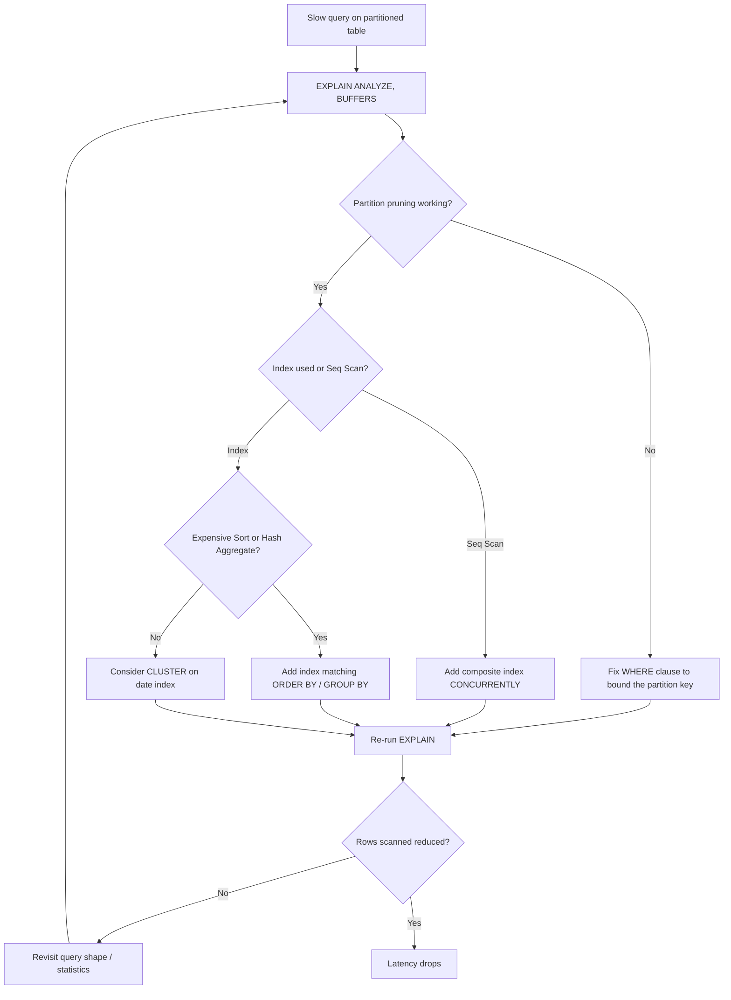

| Difficulty | Channel | Tags |
|---|---|---|
| intermediate | database | explain, query-plan, partitioning |

CoinGecko's hourly crypto price table quietly grew past one terabyte over eight years — 100M+ rows averaging 30+ seconds per query and p99 latency at 4.13 seconds, breaching their SLO daily [1]. Their API hit IOPS limits so often that requests queued like a freeway at rush hour and replicas started lagging. Sound familiar? If you've ever run a query against a huge partitioned table and watched it crawl, you know exactly how that felt. The fix wasn't buying a bigger database — it was learning to read what the query planner was already trying to say.

---

> ### Real-World Case — CoinGecko
>
> CoinGecko's API is a major crypto market data source. One table storing hourly cryptocurrency price data grew past 1TB over 8 years (a table that in production holds over 100M rows and takes 30+ seconds to query on average). Their price endpoints were breaching IOPS limits daily, causing request queues, Apdex score drops, and replica lag that threatened their SLO.
>
> | | |
> |---|---|
> | **Challenge** | A single huge time-series table (hourly prices) where every query scanned the full history. Adding indexes failed because the data was stored in JSONB columns keyed by currency, and an index that only helped one application was considered excessive. They needed to cut the amount of data read per query without downtime for a critical production system. |
> | **Solution** | They adopted PostgreSQL RANGE partitioning by month on the timestamp column (since nearly all queries already filtered on a timestamp range, and users only needed the last ~4 months). They migrated the 1.2TB table into a new partitioned table (partition key added to the composite primary key), warmed partitions with pg_prewarm, used Foreign Data Wrappers to copy data without hammering production IOPS, and flipped to the new table via a rename + sync trigger. |
> | **Outcome** | p99 response time dropped 86% from 4.13s to 578ms; IOPS usage fell 20% (savings multiplied across all replicas); targeted queries got 6-8x faster; replica lag disappeared. Notably, one query that lacked a lower bound on the date range ('created_at > ?' with no upper bound) got WORSE, scanning every partition — fixing it required adding the missing date bound and removing empty future partitions. |
> | **Lesson** | Partitioning only helps when the query gives the planner something to prune on: every performance-sensitive query must bound the partition key on both sides. Partition pruning is not automatic — a query that filters on the partition key with an open-ended or missing range silently scans every partition (and even empty future ones), which can make partitioning a regression instead of a win. |

---

## Hook — The table worked for eight years. Then it stopped.

Picture the moment nobody wants to see: the pager fires at 2am, the dashboard shows the Apdex score sinking, and every request to your price endpoint is queueing behind the last one. Teams at CoinGecko were living that reality — a table holding hourly cryptocurrency prices had been growing for eight years, and one day the math caught up with them [1]. Storage got bigger. Replicas multiplied. Nothing helped, because the problem wasn't capacity. Every query was paying for the table's entire history. Here's the thing that makes this story worth telling: the same table, the same hardware, and a handful of EXPLAIN plans turned 4-second queries into half-second ones. But the path there contained a plot twist that almost nobody sees coming.

## Problem — 'We partitioned it. Why is it still slow?'

Most teams reach for partitioning for one reason: to make big tables feel small. And it does — sort of. PostgreSQL's declarative partitioning lets the planner skip whole chunks of data using a feature called partition pruning, which is exactly what it sounds like: the planner examines your WHERE clause and drops partitions it doesn't need before executing anything [2]. But here's the trap: partitioning only helps when your query actually filters on the partition key, and even then it is not a free pass [8]. A 100M-row table split into monthly partitions still leaves a million rows in the January partition. If the query then sequential-scans all of them, or sorts the results because an index is missing, you are still staring at seconds of latency. Many developers discover the hard way that a partitioned table with no matching index is just a slightly faster way to scan a lot of data. The real problem is that you are looking at one query, when the answer actually lives in three things working together: pruning, indexing, and physical layout.

## Real-World Case — CoinGecko: a terabyte of price history takes its toll

CoinGecko's API is one of the most-used sources of crypto market data in the world, and its hourly price table told the story of the entire industry's boom — eight years of growth that pushed it past a terabyte in production [1]. The result was a steady, painful decline: price endpoints breaching IOPS limits daily, requests queueing, Apdex scores dropping, and replica lag threatening their SLO. Queries averaged over 30 seconds. The fix was a systematic partitioning overhaul, and the numbers were dramatic: p99 latency fell 86%, from 4.13 seconds to 578 milliseconds. IOPS usage dropped 20% — a saving that multiplied across every replica. Targeted queries got 6-8x faster, and replica lag simply disappeared [1]. But here is the plot twist: not every query improved. One query used 'created_at > ?' with no upper bound on the date range, which meant PostgreSQL could not prune anything and scanned every partition. It got worse. The fix was not an index — it was adding the missing date bound and removing empty future partitions [1]. That is the difference between teams who fix symptoms and teams who understand the system.

## Deep Dive — Reading EXPLAIN like a detective reads a crime scene

When a partitioned query is slow, the EXPLAIN plan is the first witness you call. The output is dense, but there is a method to it: you are hunting for three specific red flags, and almost every slow query has at least one of them [3].

The first is partition pruning gone wrong. EXPLAIN shows a Seq Scan node for every partition it actually visits — if you filter on a date range and still see twenty partition nodes, the planner is not pruning, which usually means your filter does not match the partition key's type or format. The second red flag is an index that exists but is never used. You might think a B-tree index on status alone is enough [7], but if the planner estimates that scanning 60% of the rows still beats a per-row index lookup, it will ignore your index and do the sequential scan anyway [3]. The third is an expensive Sort or Hash Aggregate near the top of the plan — the sign that you filter well but pay for a result order no index covers.

This is where composite indexes earn their keep. An index on (event_date, status) covers both the range filter and the equality filter in one structure, so PostgreSQL can answer the query from the index's own ordered pages [4]. Build it with CREATE INDEX CONCURRENTLY so you are not blocking writes on a production table [4].

And then there is the option most people forget: CLUSTER. It physically rewrites the table so rows with matching index keys live on adjacent pages [5]. For a date-partitioned table, clustering on the date index can turn thousands of random page reads into a handful of sequential ones — the single biggest multiplier for range scans.

The trade-off landscape looks like this:

| Approach | What it fixes | Cost | Best when |
|---|---|---|---|
| Composite index | Missing index / seq scan | Index storage, write overhead | Range + equality filters |
| Pruning fix | Scanning too many partitions | Query rewrite | WHERE clause misses partition key |
| CLUSTER | Random I/O on range scans | Table rewrite, blocks reads | Read-heavy tables, stable query patterns |
| BRIN index | Speed vs. size trade-off | Cheap to build, coarse granularity | Append-only data with physical row order [6] |

Notice the recurring theme: the planner is lazy, but it is not stupid. It makes cost-based decisions from statistics — so before you blame the database, verify that the query actually gives it a chance to be smart. Sound familiar?

## Workflow — A five-step triage for any slow partitioned query

Building on the deep dive, diagnosis follows a repeatable flow — the same one you can run next time the pager lights up. It is less of a mystery and more of a checklist:

1. Capture the plan. Run EXPLAIN (ANALYZE, BUFFERS) with the exact query. The BUFFERS clause shows how much I/O the query actually performed — numbers don't lie [3].
2. Check pruning. Count the partition nodes. If you filter on date and still see all of them, your filter and your partition key are not aligning.
3. Check the access method. A Seq Scan on a partition with millions of rows is your second warning. Note whether an index exists but was skipped.
4. Look up the tree. Any Sort or Hash Aggregate before the final result means ordering is costing you — that is your composite index opportunity.
5. Re-run after each change. One change at a time, re-measure every time.

The full flow looks like this (see the diagram below): it is the decision tree from the moment a slow query appears to the moment you have verified the fix. The order matters more than the tools — diagnosis before surgery. This loop is exactly what the CoinGecko engineers ran, and exactly what the incident teaches: measure, fix one thing, measure again [1].

## Code Example — From EXPLAIN to CLUSTER in four steps

Here is the complete sequence, the way you would actually run it against a production system. Every step is deliberate, and every step is verifiable — which is the whole point.

Step-by-step, here is what is happening. The first EXPLAIN is your baseline: with ANALYZE, PostgreSQL actually executes the query, and with BUFFERS it tells you how many pages were read from cache versus disk [3]. If the plan shows a Seq Scan across many partitions, that is your smoking gun — the composite index is missing. The CREATE INDEX CONCURRENTLY step is critical on production tables: the normal CREATE INDEX takes a lock that blocks writes, while the CONCURRENTLY variant builds the index in the background without pausing traffic [4]. CLUSTER is the deeper fix — it rewrites the table in the physical order of the index, so range scans hit contiguous pages [5]. Warning: CLUSTER blocks concurrent access while it runs, so schedule it in a maintenance window. Finally, re-running EXPLAIN gives you the before/after proof, and the number of rows scanned per partition is what you are comparing.

## Lessons Learned — What the incident (and the interview question) actually teaches

So what should you take from this? First, partition pruning is not automatic magic — it is a contract between your query and your table design. If the WHERE clause does not give the planner a bound on the partition key, pruning is impossible, and you are scanning everything [1]. Second, an index is only useful if the planner chooses it, and the planner will not choose it if the query design fights it. Composite indexes that match the filter shape, built concurrently, are the highest-leverage change most teams can make [4]. Third, measure with EXPLAIN (ANALYZE, BUFFERS) before and after every change; the row counts and buffer reads are your ground truth [3].

And the biggest lesson, the one that echoes from the CoinGecko story: the worst query was not the one with too many rows in range — it was the one with no upper bound at all, the one that looked harmless and scanned a terabyte of history. Every optimization you ship today can be undone by a query that arrives tomorrow with no date bound [1]. Add the bound, remove the empty partitions, and treat query shape as part of your data contract.

If this feels overwhelming, you are not alone — but the good news is the checklist fits on one page. Run the triage, make one change, re-measure, repeat.

---

## Partitioned Query Diagnosis Flow

<strong>Original Interview Question</strong>

**Q:** You have a PostgreSQL table with 100M rows partitioned by date. A query filtering on a specific date range is still slow. What would you check in the EXPLAIN plan and how would you optimize it?

**A:** Check partition pruning effectiveness, index utilization patterns, and expensive sort operations. Create composite indexes on (date, filtered_columns) and evaluate clustering strategies for optimal data access.

## Conclusion

The story started with a terabyte table taking 30 seconds to answer. It ends with p99 latency at 578ms, IOPS down 20%, and replica lag gone — all from reading plans, not buying hardware [1]. The through-line for you: when a partitioned query is slow, the database is usually trying to tell you something, and EXPLAIN is how you listen. Tomorrow, pick your slowest query, run it through the five-step triage, and see which of the three red flags appears. You might be one index away from a 6x speedup — and one missing date bound away from the exact opposite.

---

## References

1. [CoinGecko incident report](https://amree.dev/2025/06/13/scaling-postgresql-performance-with-table-partitioning/) — blog
2. [PostgreSQL documentation — Table Partitioning](https://www.postgresql.org/docs/current/ddl-partitioning.html) — documentation
3. [PostgreSQL documentation — Using EXPLAIN](https://www.postgresql.org/docs/current/using-explain.html) — documentation
4. [PostgreSQL documentation — CREATE INDEX](https://www.postgresql.org/docs/current/sql-createindex.html) — documentation
5. [PostgreSQL documentation — CLUSTER](https://www.postgresql.org/docs/current/sql-cluster.html) — documentation
6. [PostgreSQL documentation — BRIN Indexes](https://www.postgresql.org/docs/current/brin-intro.html) — documentation
7. [B-tree — Wikipedia](https://en.wikipedia.org/wiki/B-tree) — documentation
8. [Partition (database) — Wikipedia](https://en.wikipedia.org/wiki/Partition_(database)) — documentation

---

**Author:** Satishkumar Dhule — [GitHub](https://github.com/satishkumar-dhule) · [LinkedIn](https://linkedin.com/in/satishkumar-dhule) · [Website](https://satishkumar-dhule.github.io)
