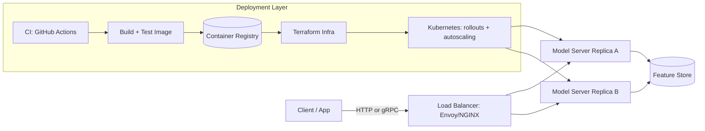

| Difficulty | Channel | Tags |
|---|---|---|
| beginner | devops | mlops, deployment |

In 2017, Uber's internal ML platform Michelangelo was quietly serving roughly one million predictions per second, with P95 online latency under 5 milliseconds for models without feature-store lookups and under 10ms with them [1]. That did not happen because Uber had great model algorithms — it happened because the company finally separated two things developers constantly blur together: deploying a model and serving a model. This article walks the line between them, using Uber's journey as a map, so that your next model makes it to production without the 3am pager call.

---

> ### Real-World Case — Uber
>
> Before 2016, ML at Uber was a patchwork of bespoke, one-off systems where every team hand-rolled training and serving code, making models nearly impossible to productionize at scale. Uber launched Michelangelo in 2016 as a centralized ML-as-a-service platform covering the entire ML lifecycle, and it grew to become the de-facto system for ML across the company.
>
> | | |
> |---|---|
> | **Challenge** | Uber needed to separate the two very different halves of production ML: deployment (infrastructure, packaging, batch vs online rollout, monitoring) and serving (sub-millisecond to low-millisecond real-time inference at massive QPS). Models also had to be deployed in two modes - offline batch jobs and online request/response services - while keeping training and serving features consistent to avoid skew. |
> | **Solution** | Michelangelo splits the system into three planes: a control plane (lifecycle APIs), an offline data plane (Spark for feature compute, training, and batch prediction jobs), and an online data plane (a Java-based Online Prediction Service serving models from memory over Thrift/RPC, backed by a Cassandra feature store). The same trained Spark PipelineModel can be deployed to a scheduled batch job OR to a cluster of online serving containers behind a load balancer with zero code changes. Features are computed once and dual-written to HDFS and Cassandra so training and serving always use identical data. Later iterations added PyML (nested Docker containers for Python models) and migrated to NVIDIA Triton as the low-latency serving engine. |
> | **Outcome** | By the 2017 launch post Michelangelo was serving ~1 million predictions per second with P95 online latency under 5ms (models without Cassandra lookups) and under 10ms (with feature store reads); the highest-traffic models exceeded 250,000 predictions/sec. By 2024 it reached 5,000+ models in production serving 10 million real-time predictions per second at peak, with 20,000+ training jobs per month across ~400 active ML projects. |
> | **Lesson** | Deployment and serving are genuinely different problems that need different subsystems: deployment is about packaging, CI/CD, and infrastructure, while serving is about latency, QPS, and in-memory model loading. Treating them as one problem leads to one-off systems; the counterintuitive win is that the same model artifact can serve both offline batch and real-time online traffic - as long as you guarantee feature parity between training and serving. |

---

## Hook — The Notebook Is Not the Product

Ever wondered why a model that hits 99.4% AUC in a notebook feels like a totally different beast once you put it behind an API? You are not alone. Many developers discover that their carefully tuned model — the one with the beautiful feature engineering and the elegant training loop — starts falling apart the moment real traffic arrives. The stakes are real: a p95 latency that balloons from 2ms to 400ms, requests timing out, GPU memory climbing like a crypto chart. The problem is almost never the model weights. The problem is that deployment and serving are two separate disciplines, and treating them as one job is where production ML goes to die. This is the gap between 'the model works' and 'the model works at 10,000 requests per second, forever.'

## Problem — One Pipeline, Two Very Different Jobs

Here is the trap: when you write `model.predict()` in a training script, you are doing both deployment and serving at once, and you never notice the difference. In production, those two responsibilities split apart like a cell dividing. Deployment is the boring, crucial work of getting a versioned artifact from a developer's laptop into an environment that can run it — CI/CD pipelines, container images, infrastructure provisioning, rollback strategies. Serving is the fast, live, unforgiving work of answering inference requests in real time — loading models into memory, routing requests, batching, and returning predictions within a latency budget. 

The confusion is expensive. Teams often build elaborate training pipelines (the part recruiters love to ask about) and then duct-tape a Flask app around a pickle file for serving, wondering why everything collapses under load. Consequently, the models that matter most — the ones making business decisions in real time — get the least engineering attention. The tension is that deployment rewards careful planning over weeks, while serving punishes anything slower than milliseconds, every single request. Sound familiar? That tension is exactly what separates mature ML operations from the patchwork era Uber lived through.

## Real-World Case — Uber, Before and After Michelangelo

Before 2016, machine learning at Uber was a patchwork of bespoke, one-off systems. Every team hand-rolled its own training and serving code, which made models nearly impossible to productionize at scale [1]. Imagine a company running the world's largest ride-hailing network, with teams duplicating infrastructure, writing their own model servers, and reinventing monitoring — because there was no shared platform to lean on. This is the 'hero journey' moment: Uber recognized that the bottleneck was not model quality, but operational maturity. 

In 2016, Uber launched Michelangelo, a centralized ML-as-a-service platform covering the entire ML lifecycle — from data pipelines and training to deployment and serving. The results were staggering. By the 2017 launch post, Michelangelo was serving about 1 million predictions per second, with P95 online latency under 5ms for models without Cassandra lookups and under 10ms with feature-store reads; the highest-traffic models exceeded 250,000 predictions per second [1]. By 2024, that platform had grown to more than 5,000 models in production, serving 10 million real-time predictions per second at peak, with over 20,000 training jobs per month across roughly 400 active ML projects [1]. The lesson is not that Uber has better data scientists. The lesson is that when you standardize deployment and serving as separate, first-class concerns, the whole company's ML velocity compounds.

## Deep Dive — Deployment vs. Serving: The Real Trade-Offs

Building on the Uber story, the question becomes: what exactly separates these two layers, and what are the actual trade-offs? Start with the cast of characters. Deployment leans on Docker, Terraform, Kubernetes, and CI/CD systems like GitHub Actions [10], plus experiment-tracking and registry tools like MLflow [5]. Serving, meanwhile, is the domain of model servers — TensorFlow Serving [3], TorchServe [4], BentoML [6] — wrapped in FastAPI or Flask and fronted by load balancers like NGINX or Envoy. gRPC often replaces HTTP here because binary protobuf payloads and streaming cut serialization overhead dramatically [9].

Now the trade-offs, which are the heart of the interview question:

| Dimension | Deployment | Serving |
|---|---|---|
| **Primary goal** | Get versioned artifacts into production safely | Answer inference requests within latency budgets |
| **Cadence** | Days-to-weeks lifecycle, staged rollouts | Milliseconds per request, continuous |
| **Core tech** | Kubernetes, Terraform, MLflow, GitHub Actions [10] | TorchServe [4], TensorFlow Serving [3], Envoy, gRPC [9] |
| **Scaling** | Pod replicas, horizontal scaling across nodes [8] | Autoscaling on QPS, GPU memory management |
| **Failure mode** | Bad rollout, drift, silent degradation | Cold start, OOM, request timeouts |

This leads to the plot twist: many developers assume the hard part is training, but the expensive part is serving. Horizontal scaling gives you more replicas, but each GPU has a memory ceiling — vertical scaling of GPU memory and CPU allocation matters just as much [2]. Latency requirements dictate the architecture: sub-100ms for real-time inference, sub-1s for batch, and these are non-negotiable constraints that shape everything downstream. Cold starts are the sneaky killer — a freshly scaled replica that has to load a 500MB model before answering its first request will blow your p95 unless you warm it up. 

The deeper truth, which many teams learn the hard way, is that these layers must be designed together. A perfect serving stack is useless if your deployment pipeline ships untested models; a perfect deployment pipeline is theater if your serving layer cannot survive a traffic spike. This is why mature ML operations maturity — MLOps — treats them as two sides of one system, not two competing hobbies.

## Workflow — From Commit to Serving at Scale

So what does this actually look like as a process? Here is the pipeline that Uber-style platforms converge on, and it flows cleanly from the trade-offs above. First, a code change lands in CI, where GitHub Actions [10] run tests and linting on both the training code and the serving wrapper. Second, a build step packages the trained artifact — model weights plus the serving container — into a registry, versioned with MLflow [5]. Third, infrastructure as code via Terraform provisions the Kubernetes cluster, and the deployment manifests define replicas, resource limits, and rollout strategy [2]. Fourth, Kubernetes deploys the new version behind a load balancer, shifting traffic gradually — the A/B test and gradual rollout pattern that lets you catch a bad model before it catches your users [8]. Finally, the serving layer takes over: routing requests to warmed replicas, autoscaling on QPS, and exposing health and latency metrics for monitoring.

The diagram below shows the complete story — how the deployment layer feeds the serving layer, and how they share the spotlight:



The key insight here is the feedback loop: the serving layer's latency and error metrics flow back into the deployment layer's rollback decisions. If p95 latency crosses your threshold after a rollout, Kubernetes rolls back automatically — deployment and serving acting as one nervous system.

## Code Example — A Production-Shaped Serving Endpoint

Enough theory — here is what a serving endpoint actually looks like when you respect the deployment/serving split. This FastAPI app [11] treats model loading as an explicit lifecycle event, exposes readiness probes for the orchestrator, and keeps the inference path lean. In a real platform, the `load_from_registry` call would be pulling a pinned artifact from your model registry (think MLflow [5]), and the deployment manifest would configure Kubernetes replicas and autoscaling [2].

```python
import asyncio
from contextlib import asynccontextmanager

import numpy as np
from fastapi import FastAPI, HTTPException
from pydantic import BaseModel

class PredictRequest(BaseModel):
    features: list[float]

MODEL = None  # module-level singleton: loaded once, never per-request

def load_model():
    global MODEL
    # Pinned version = deterministic rollback if the rollout misbehaves
    MODEL = load_from_registry("fraud-detector:v3.2.1")
    return MODEL

@asynccontextmanager
async def lifespan(app: FastAPI):
    load_model()       # warm the model before traffic is routed here
    yield
    MODEL.unload()     # clean shutdown during rollout or scale-down

app = FastAPI(title="Fraud Model Serving", lifespan=lifespan)

@app.get("/health/live")
async def liveness():
    return {"status": "ok"}

@app.get("/health/ready")
async def readiness():
    # Tell Kubernetes to stop routing traffic when the model isn't ready
    if MODEL is None:
        raise HTTPException(status_code=503, detail="model not ready")
    return {"status": "ready"}

@app.post("/predict")
async def predict(req: PredictRequest):
    # A real system would micro-batch concurrent requests for GPU efficiency
    pred = MODEL.predict(np.asarray(req.features, dtype=np.float32))
    return {"prediction": float(pred[0])}
```

Walking through the design decisions: the `lifespan` context manager guarantees the model is loaded before any traffic arrives, killing the cold-start surprise during autoscaling. The `/health/ready` endpoint is what Kubernetes polls — returning 503 until the model is warm means the orchestrator never sends a request into an empty replica [2]. And the pinned version string in `load_from_registry` is your rollback lever: when a rollout degrades, you redeploy the previous tag instead of gambling on an in-memory reload. The inference path stays minimal by design — serialization and routing live in the framework, so the per-request work is just one `predict` call. This is the same pattern that lets platforms like TensorFlow Serving add batching and gRPC without you rewriting the model logic [3].

## Lessons Learned — The Battle Scars Worth Collecting

After walking this journey from Uber's patchwork era to 10 million predictions per second, the takeaways crystallize into a short list. First, treat deployment and serving as distinct jobs with different success criteria — deployment optimizes for safety, serving optimizes for latency. Second, never let cold starts sneak into your autoscaling story; warm replicas are the difference between a clean traffic spike and a 502 storm. Third, pin model versions and make rollback a first-class action, not a crisis maneuver. Fourth, decide your latency budget before you choose your stack: sub-100ms real-time inference points at gRPC and model servers [9], while batch workloads can live happily in simpler pipelines. Fifth, monitor like your model depends on it — latency percentiles, throughput, error rate, and drift, because a model silently decaying is worse than one that fails loudly. 

The war stories from production ML systems consistently reinforce one point: the model is a small fraction of the system. Uber's platform succeeded because the serving layer was engineered with the same rigor as any high-QPS distributed system — which is exactly what ML at scale turns out to be [7]. The memorable insight to share with your team: 'Your model is a dependency, not the application. Engineer the serving path like it's the only thing standing between your users and a 500.'

---

## Deploy-to-Serve Architecture


<details>
<summary><strong>Original Interview Question</strong></summary>

**Q:** Explain the key differences between model serving and model deployment in ML systems, including specific technologies, scaling considerations, and real-world implementation patterns?

**A:** Deployment encompasses CI/CD pipelines, infrastructure setup, and monitoring using tools like Kubernetes, MLflow, and SageMaker. Serving focuses on runtime inference APIs with frameworks like TensorFlow Serving, TorchServe, or BentoML, handling request routing, model versioning, and autoscaling. Key trade-offs include latency vs throughput, batch vs real-time inference, and cold start optimization.

</details>

## Conclusion

The journey from Uber's patchwork era to 10 million predictions per second boils down to one shift in mindset: stop treating 'the model' as the product and start treating the serving path as the product. Concretely, tomorrow you can start by splitting your mental model — write your deployment pipeline (CI, registry, versioning, rollback) and your serving layer (warm replicas, readiness probes, latency budgets) as separate, well-defined jobs. Pick a latency budget before you pick a stack, pin your model versions, and add a readiness endpoint your orchestrator can trust. And when you feel tempted to skip the boring parts, remember Uber: the company that served a million predictions per second did not get there with better algorithms — it got there by treating model serving as the same kind of serious engineering as any high-QPS distributed system.

---

## References

1. [Uber incident report](https://www.uber.com/us/en/blog/michelangelo-machine-learning-platform/) — article
2. [Kubernetes Concepts — Architecture](https://kubernetes.io/docs/concepts/architecture/) — documentation
3. [TensorFlow Serving Architecture](https://www.tensorflow.org/tfx/serving/architecture) — documentation
4. [TorchServe Documentation](https://pytorch.org/serve/) — documentation
5. [MLflow — Open Source MLOps Platform](https://github.com/mlflow/mlflow) — documentation
6. [BentoML — Model Serving Framework](https://github.com/bentoml/BentoML) — documentation
7. [Machine Learning Systems are Stuck in a Rut](https://arxiv.org/abs/1912.07327) — paper
8. [An Introduction to Kubernetes](https://www.digitalocean.com/community/tutorials/an-introduction-to-kubernetes) — documentation
9. [gRPC Core Concepts](https://grpc.io/docs/what-is-grpc/core-concepts/) — documentation
10. [GitHub Actions Documentation](https://docs.github.com/en/actions) — documentation
11. [FastAPI Documentation](https://fastapi.tiangolo.com/) — documentation

---

**Author:** Satishkumar Dhule — [GitHub](https://github.com/satishkumar-dhule) · [LinkedIn](https://linkedin.com/in/satishkumar-dhule) · [Website](https://satishkumar-dhule.github.io)
