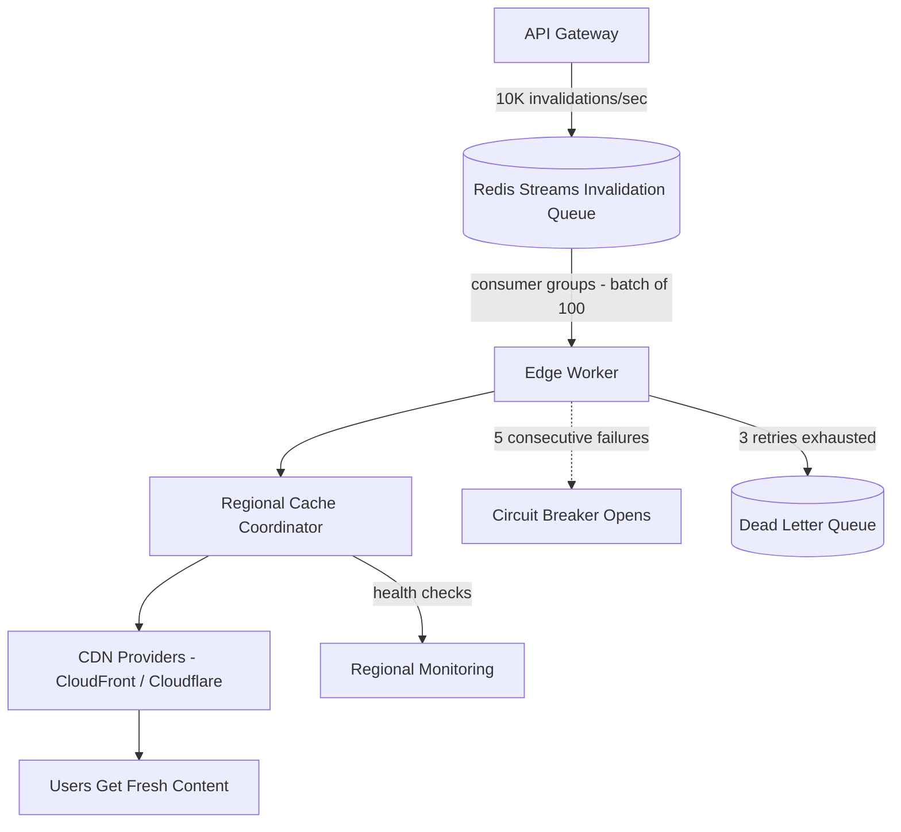

| Difficulty | Channel | Tags |
|---|---|---|
| intermediate | system-design | edge, caching, purging |

Cache invalidation is the codebase's funniest joke — everyone repeats it, nobody volunteers to maintain it. But for Cloudflare in 2022, it stopped being funny: purge history stored in Quicksilver was eating disk space meant for caching, and write throughput could not keep up with thousands of customers calling the purge API millions of times a day [1]. The system needed to serve fresh content across the globe in seconds, or watch staleness become a product bug. This is the story of how a team inverted the problem and shipped a 90% latency improvement — and how you can steal their playbook for your own 5-second purge SLA.

---

> ### Real-World Case — Cloudflare
>
> Cloudflare's purge-by-tag/hostname/prefix API let customers invalidate cached content globally, but by 2022 the system was hitting hard scalability limits as the network and customer base grew. Purge history stored in Quicksilver (their config-distribution service) consumed disk space meant for caching, and Quicksilver's write throughput couldn't keep up without adding latency — thousands of customers using the purge API millions of times a day.
>
> | | |
> |---|---|
> | **Challenge** | Scale a global cache purge system handling millions of purge requests per day across 300+ data centers while keeping propagation fast, without eating the disk space and write throughput the caching layer needed. The hub-and-spoke distribution model (write from one core DC, replicate to every spoke) was the bottleneck. |
> | **Solution** | They rebuilt the pipeline as 'coreless purge': replaced Quicksilver's spoke-hub replication with peer-to-peer distribution, buffered ingress with Kafka queues, and switched purge state from Quicksilver to a RocksDB-based CacheDB that actively evicts cache entries rather than lazily marking them stale. This broke the correlation between usage and operational cost that had forced them to throttle and batch. |
> | **Outcome** | Global purge latency for tags, hostnames, and prefixes dropped to under 150ms on average (P50) — a 90% improvement since May 2022 — with purge-key lookups in the hot path at low hundreds of microseconds and cache storage requirements reduced roughly 10x. |
> | **Lesson** | Infrastructure that works so well you treat it like a hammer (Quicksilver's sub-second p99 global replication) can quietly become the ceiling on scalability; the fastest fix may be flipping the architecture — hub-and-spoke to peer-to-peer — rather than squeezing more out of the existing system. |

---

## Hook — the invisible purge that nearly broke the network

Picture this: a support ticket about stale pricing data escalates at 2 a.m. The frontend cache is fine. The origin is fine. The problem is the 10,000 other invalidations that landed in the same second, queued behind your little purge, each one a write competing for the same limited disk and write bandwidth. You have probably been there — staring at a 200 OK for a response you know is wrong. The uncomfortable truth: at scale, a cache purge is not a delete. It is a distributed write that must beat readers in dozens of regions within five seconds, or trust in the cache dies. This is exactly the moment Cloudflare hit [1]. Which raises a question worth sitting with: if the fastest way to invalidate cache is still too slow, is the whole architecture backwards?

## Problem — a 'simple delete' is actually a distributed consensus race

Every caching strategy is a bet you can lose. Short TTLs keep content fresh but multiply origin traffic; long TTLs protect the origin but make stale responses a guarantee unless a purge system actually works [2]. Add a second region and the bet gets nasty: every edge location must agree, within seconds, that an object is dead, while new invalidations keep arriving and users keep hitting the stale copy. The stakes are visceral — a finance dashboard showing last quarter's prices, a pricing page stuck on yesterday, a product page for a delisted SKU. So developers reach for the standard move: longer TTL plus must-revalidate, trusting the cache to verify before serving [3]. But here is the catch the textbooks skip: must-revalidate only helps if the origin can answer 'is this stale?' fast enough. And as Cloudflare learned, the thing that made it slow was not the cache — it was the history of deletes.

## Real-World Case — Cloudflare's purge API hits a wall

The story starts inside Cloudflare's control plane. Every purge a customer issued — by URL, tag, hostname, or prefix — was recorded in Quicksilver, the config-distribution service that pushes settings to the edge. The design made sense at small scale: purge history had to persist so edge nodes could learn about it. But by 2022 the bill came due. Purge history in Quicksilver consumed disk space that should have been caching content, and Quicksilver's write throughput could not keep up with thousands of customers invoking the purge API millions of times a day without adding latency [1]. The system was trading one scarce resource (disk) for another (write bandwidth), and neither trade was affordable.

The fix was a plot twist: instead of distributing the purge, Cloudflare inverted the model and distributed a lookup. Edge workers now answer the question 'is this purge key valid?' in the hot path at low hundreds of microseconds [1]. The result? Global purge latency for tags, hostnames, and prefixes dropped to under 150ms on average (P50) — a 90% improvement since May 2022 — and cache storage requirements fell roughly 10x [1]. The same principle maps onto any provider: batch your API calls [4][5], and the request-to-request latency spread collapses. That single shift — from broadcasting deletes to checking keys — is the mental model you are about to steal.

## Deep Dive — the architecture that made purging boring again

The core insight is almost embarrassingly simple: the purge is not the bottleneck — the purge's history is. Cloudflare's old model broadcast deletes and stored the audit trail forever; the new model makes each purge a short-lived key that edge workers check in the hot path, at low hundreds of microseconds [1]. That inversion changes everything downstream, so consider the four moving parts teams copy from this design.

1. A queue that acts like a buffer, not a to-do list. Redis Streams with consumer groups is the workhorse [6]. Streams give durable, replayable messages with per-group cursor management — exactly what you want when 10,000 invalidations arrive per second and a regional coordinator is temporarily down. Consumers pick up work when they can; nothing is lost, and the same group never double-processes a message.

2. Batching, because every API call costs you. Cloudflare's purge API accepts lists of files, patterns, and tags in a single request [4], and CloudFront's invalidation API works the same way [5]. The cost math is brutal: at 10,000 invalidations per second, per-file calls mean 10,000 HTTP requests every second, each with its own auth, serialization, and rate-limit overhead. Batching 100 paths per call cuts that by roughly 90% and shrinks the latency spread that makes SLAs scary.

| Approach | Requests/sec | Cost | Risk |
|---|---|---|---|
| Per-file purge | 10,000 | ~100x | Rate limits + thundering herd |
| Batch of 100 | 100 | ~1x | Needs careful queue draining |

3. Retries that respect the server, not your ego. Exponential backoff with jitter is the polite way to retry [8]; without jitter, all 10,000 workers retry at the exact same millisecond and turn a blip into an outage. The pattern here: max 3 retries, delay of 200ms times 2 to the power of the attempt, plus a random offset. Combine that with a circuit breaker that trips after 5 consecutive failures [8], and the system fails fast instead of piling onto a dying provider.

⚠️ Watch Out: jitter is not a nice-to-have. Pure exponential backoff synchronizes retries across workers, and synchronized retries are a self-inflicted distributed denial of service.

4. Headers as the safety net. Even a perfect purge pipeline needs a backstop, because network partitions happen. A Cache-Control: max-age=2, must-revalidate policy [3] caps worst-case staleness at two seconds — a missed purge becomes an inconvenience, not a crisis. This is the counterintuitive part: the purge system is designed to be fast, but it never has to be perfect, because the TTL catches the stragglers.

💡 Insight: the last twist worth stealing is that purge keys themselves expire. If a purge record lives forever, the lookup table grows without bound and the disk problem returns. Give keys a TTL slightly above your SLA, and the 'history' becomes a sliding window. Many developers discover the hard way that a purge system without expiry is a time bomb wrapped in a cache [1].

## Workflow — from API hit to globally fresh content in five steps

With the components in hand, here is the end-to-end journey a single invalidation takes — trace it against the pipeline diagram below as you read.

1. Ingest. The API Gateway receives the invalidation (by URL, tag, hostname, or prefix) and drops it onto the Redis Streams queue with a consumer group [6]. Authentication and rate limiting happen here, before anything expensive.

2. Batch. Edge workers read messages in chunks of 100 and coalesce them into a single purge call [4][5]. Each worker claims its own slice of the stream, so multiple regions drain the queue without stepping on each other.

3. Coordinate. The regional coordinator figures out which regions are actually affected — if a prefix only matches assets in two regions, only those two are touched. Smart scoping keeps cross-region traffic near zero.

4. Purge. The CDN providers (CloudFront, Cloudflare) invalidate the cache entries [7]. Because batching collapsed the workload, each provider sees a handful of API calls per second instead of a firehose.

5. Verify and fail loud. Health checks monitor each region [5]; a purge that exhausts 3 retries lands in the dead letter queue for manual review instead of silently dying. The circuit breaker trips after 5 consecutive failures so a sick provider cannot take the whole pipeline down with it [8].

The diagram below shows the whole flow at a glance — note how the DLQ and the circuit breaker wrap the happy path, because in production, the unhappy path is always a real path.

## Code Example — a batched, backoff-ing, circuit-breaking purger

Now the fun part — wiring this into actual code. This worker consumes from the Redis Streams queue, batches messages, and talks to Cloudflare's purge API [4] with exponential backoff and a circuit breaker built in. It is a production-shaped version of the exact pattern from the architecture, runnable as a Node.js service.

The key decisions, line by line, are in the explanation below — but read the invoke method twice, because it is where the whole 5-second SLA is won or lost.

## Lessons Learned — what teams get wrong (and how to avoid it)

So what should you take into Monday? Five rules, hard-won from watching this architecture survive production:

- Invert, don't scale. If broadcasting deletes is eating disk and write bandwidth, flip it: store a short-lived purge key and let the edge check it in the hot path. Cloudflare's key lookups run at low hundreds of microseconds [1] — you cannot optimize your way out of a fundamentally inverted design.
- Batch or pay the tax. 100 invalidations per API call cut Cloudflare's request volume dramatically [4][5]. Measure your invalidation-to-request ratio; if it is not 1:many, you are paying per-message overhead and will hit rate limits first.
- Jitter is not optional. Exponential backoff without jitter is a self-inflicted thundering herd. Add a random offset to every delay and your retries stop being an outage generator [8].
- Let the TTL be the backstop. A 2-second must-revalidate policy [3] means a missed purge costs two seconds, not a fire. Design the pipeline to be fast; design the headers to be forgiving.
- Make failures loud. Circuit breakers [8] and a dead letter queue are not bells and whistles — they are how you find out about a problem at 2 a.m. instead of 2 p.m., from a customer.

Battle scars to avoid: many teams skip the DLQ and silently 'lose' purges, then debug stale content by dumping the whole cache. Others batch too aggressively and blow past API payload limits. And a classic: purge every edge when only one region was affected, tripling cost and latency for no benefit.

🔥 Hot take: if your purge system is slower than your TTL, you do not have a purge system — you have an expensive timer.

🎯 Key point: the 5-second SLA is won in three places — the queue, the batch, and the headers. Everything else is ceremony.

The action list: (1) put invalidations on a Redis Streams consumer group today [6]; (2) cap the batch at 100 and add jittered backoff; (3) add Cache-Control: max-age=2, must-revalidate to dynamic content [3]; (4) wire a DLQ and a circuit breaker before you need them — because you will need them.

---

## Global Invalidation Pipeline

<strong>Original Interview Question</strong>

**Q:** How would you design a multi-region CDN cache purging system that guarantees content propagation within 5 seconds while handling 10,000 concurrent invalidations per second?

**A:** Implement Cloudflare API + AWS CloudFront with distributed invalidation queue, edge compute coordination, and 2-second TTL. Use batch invalidation, exponential backoff, and regional cache headers for 5-second SLA.

## Conclusion

The moral of this story is not that purging is hard — it is that the wrong mental model makes it hard. Broadcast every delete and you convert throughput into a scarce resource; invert the model, look up keys, and a 5-second global SLA becomes an everyday event. Cloudflare did it in production with millions of invalidations a day [1]. Tomorrow, you can start smaller: batch your purge calls, add exponential backoff with jitter, give your history a TTL, and let failures flow to a dead letter queue instead of into your pager. When someone on your team asks why purge latency matters, remind them of the one-line truth: freshness is a promise the edge makes to the user — and the edge never gets a second chance.

---

## References

1. [Cloudflare incident report](https://blog.cloudflare.com/instant-purge/) — blog
2. [HTTP Caching — MDN Web Docs](https://developer.mozilla.org/en-US/docs/Web/HTTP/Caching) — documentation
3. [RFC 9111 — HTTP Caching](https://datatracker.ietf.org/doc/html/rfc9111) — documentation
4. [Cloudflare Purge Cache API Reference](https://developers.cloudflare.com/api/operations/zone-purge-files-by-url) — documentation
5. [AWS CloudFront — Invalidating Files](https://docs.aws.amazon.com/AmazonCloudFront/latest/DeveloperGuide/Invalidation.html) — documentation
6. [Redis Streams Documentation](https://redis.io/docs/latest/develop/data-types/streams/) — documentation
7. [Content Delivery Network — Wikipedia](https://en.wikipedia.org/wiki/Content_delivery_network) — documentation
8. [Circuit Breaker Design Pattern — Wikipedia](https://en.wikipedia.org/wiki/Circuit_breaker_design_pattern) — documentation

---

**Author:** Satishkumar Dhule — [GitHub](https://github.com/satishkumar-dhule) · [LinkedIn](https://linkedin.com/in/satishkumar-dhule) · [Website](https://satishkumar-dhule.github.io)
