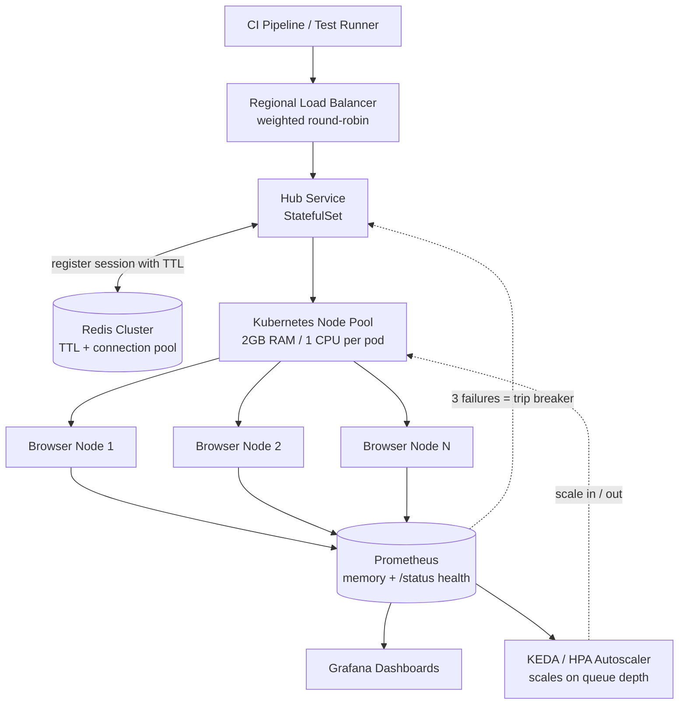

| Difficulty | Channel | Tags |
|---|---|---|
| advanced | system-design | selenium, webdriver, grid |

Picture an e-commerce giant firing thousands of automated UI tests every single hour, backed by a grid that runs 24/7 on idle VMs and burns money every time a browser version changes. That was the reality for Blibli.com, one of Indonesia's largest e-commerce platforms, whose always-on Selenoid grid wasted compute and demanded manual VM provisioning for every upgrade [1]. The fix did not just shrink their bill — it changed how they think about test infrastructure. Here is the journey from always-on chaos to an autoscaling grid, and what your team can steal from it.

---

> ### Real-World Case — Blibli.com
>
> Blibli, one of Indonesia's largest e-commerce platforms, runs thousands of automated UI test scenarios every hour as a mission-critical part of its delivery pipeline. Their previous always-on Selenoid grid ran dedicated VMs 24/7, wasted resources, and required manual VM provisioning plus per-server browser version upgrades. Cost, speed, and scalability were becoming major bottlenecks.
>
> | | |
> |---|---|
> | **Challenge** | Scale browser test execution to handle thousands of test scenarios per hour with reliable throughput, while eliminating the cost of idle always-on infrastructure and the operational burden of manually managing browser versions and VM pools. |
> | **Solution** | They rebuilt the grid as a Selenium Grid deployed on Google Kubernetes Engine, driven by KEDA event-driven autoscaling using the Selenium Grid scaler (a scaler originally built and maintained by Volvo Cars and SeleniumHQ). KEDA polls the Grid's GraphQL API for session-queue depth and scales browser node pods proportionally to pending session requests — spinning up hundreds of browser pods during peak test bursts and scaling down to zero when idle. Cluster autoscaling drains unused nodes, so compute exists only while tests are actually running. |
> | **Outcome** | The grid now auto-scales from zero to hundreds of concurrent browser sessions based on real demand, with no idle capacity. Compared to always-on Compute Engine VMs (an N2 8-core/32GiB instance alone costs ~$371/month each), GKE with KEDA cut cost by an estimated 40-50% per node — with real savings exceeding that since capacity actually reaches zero. Browser version management became a config change instead of a server-by-server upgrade, and burst capacity is now a simple deployment-limit tweak rather than a VM provisioning project. |
> | **Lesson** | Selenium browser pods are a poor fit for Kubernetes' CPU-based HPA because browser resource usage varies wildly regardless of session demand — the real scaling signal is session-queue depth. Scaling test infrastructure on that demand signal and down to zero turns browser testing from a fixed-cost asset into a variable one, and eliminates the classic Selenium problems of idle nodes, manual browser upkeep, and session-capacity limits. |

---

## Hook — the 3am scenario every platform team dreads

Here is the scenario every platform team dreads: 10,000 test sessions hit the queue at once, the grid shudders, memory climbs, nodes start dying — and the memory-leak rumors start flying. Sound familiar? The stakes are ugly. Every timed-out browser session is not just a red test; it is a blocked deploy, a pager at 3am, and a pipeline grinding to a halt at the worst possible moment. You might think the fix is simple — throw more VMs at it. It is not. And Blibli.com's journey from always-on chaos to demand-driven autoscaling is exactly why.

## Problem — three ugly problems hiding in one interview question

The challenge splits into three ugly pieces, and you have to solve all three or none of them hold. Capacity: 10,000 concurrent sessions at roughly 50 sessions per node means 200 nodes minimum — and your scheduler has to keep that entire fleet healthy while demand spikes and crashes like a heart monitor. Memory: browser processes leak like a rusty bucket; a single stuck WebDriver instance can climb from 200MB to 2GB in an hour, and if nothing cleans it up, the whole node dies. Lifecycle: sessions that never terminate are silent assassins — they hold ports, hog RAM, and drag the entire grid down with them. Most teams discover these problems after the dashboard goes red, not before.

## Real-World Case — Blibli.com scales its grid to zero

Blibli.com lived this exact nightmare. Every hour, its delivery pipeline fires thousands of automated UI test scenarios as mission-critical work [1]. The always-on Selenoid grid ran dedicated VMs 24/7 — idle between bursts, expensive during them — and every browser version upgrade meant a manual, server-by-server chore [1]. Consider the arithmetic: a single N2 8-core/32GiB Compute Engine instance runs about $371 per month, before you multiply across the fleet [1]. So the team moved the grid onto GKE with KEDA, scaling from zero to hundreds of browser sessions based on real demand, with no idle capacity at all. The results speak loudly: an estimated 40–50% cost reduction per node (with real savings exceeding that because capacity genuinely reaches zero), browser version bumps reduced to a configuration change, and burst capacity turned into a deployment-limit tweak instead of a VM provisioning project [1].

## Deep Dive — the anatomy of a leak-proof, self-healing grid

Building on Blibli's proof that this works, you can dissect what the architecture actually demands. The hub-node pattern remains the backbone: a central hub manages browser nodes spread across availability zones, and running the nodes as Kubernetes StatefulSets gives each one a stable identity that survives restarts — essential when sessions reference their node directly [2]. Selenium Grid's hub-node split exists precisely to distribute WebDriver sessions across many machines; this architecture is that same idea, containerized and autoscaled [7].

Session management is where memory leaks are won or lost. Every session registers in a Redis cluster with TTL-based expiration: the key dies after 30 minutes whether the test finished or not, converting "forgot to clean up" from a memory leak into a self-resolving event [5]. Connection pooling keeps Redis clients from becoming their own leak, and periodic scans every five minutes sweep up any key that somehow lost its TTL [5].

Resource allocation is blunt arithmetic. At 50 sessions per node, 10,000 sessions means 200 nodes minimum; at 2GB per node, that is a 400GB baseline, and a 30% headroom buffer brings the cluster to roughly 520GB. Horizontal pod autoscaling based on queue depth handles the spikes, and with KEDA the scaling range can even reach zero during quiet hours — the exact trick behind Blibli's savings [3][4].

Memory management needs defense in depth: weekly rolling restarts to reset drifting state, alerting at 80% memory usage before the OOM killer beats you to it, garbage collection tuning for JVM-based nodes, and Kubernetes init containers that scrub stale Docker volumes before a node starts fresh. Prometheus collects the metrics and Grafana turns them into dashboards your team will actually read [6].

Load balancing and health checks keep a dead node from taking everyone down. Weighted round-robin sends new sessions to nodes with more capacity and faster response times [10]. Every node exposes /status, probed every 10 seconds, and three consecutive failures trigger immediate removal from rotation. The circuit breaker — the pattern popularized by Netflix's Hystrix — isolates the failing node for a 30-second recovery window so one bad browser version cannot cascade through the fleet [8].

Edge cases are where grids go to die:
- Network partitions: leader election prevents split-brain, so two hubs do not both claim the same sessions.
- Resource exhaustion: Pod Disruption Budgets guarantee minimum 85% capacity even during rolling updates [9].
- Zero-day failures: canary deployments with traffic splitting let a new node version prove itself before the whole fleet commits.

| Always-on VMs | Autoscaled Kubernetes |
| --- | --- |
| Paid 24/7, idle between bursts | Scales to zero; pays only for real demand |
| Browser upgrades = per-server chore | Version bumps = config change |
| Burst capacity = VM provisioning project | Burst capacity = deployment-limit tweak |
| No real-time cost signal | Metrics drive every scaling decision |

🎯 Key Point: Sessions are disposable; the node is the asset to protect. Design every mechanism around graceful node churn.

💡 Insight: The cheapest node is the one that never boots. Scale-to-zero eliminates 100% of idle cost.

⚠️ Watch Out: A TTL is not a cleanup strategy by itself — without a periodic reaper, keys that lose their TTL leak anyway [5].

If this feels like a lot, you are not alone — but the diagram in the next section turns this checklist into a single mental model.

## Workflow — the end-to-end lifecycle in six steps

Building on the deep dive, the architecture composes into a pipeline that runs end to end. The diagram below (see System Flow) is the story in one frame.

Step by step:
1. A CI runner pushes a session request to the regional load balancer, which picks the healthiest hub using weighted round-robin [10].
2. The hub registers the session in the Redis cluster with a 30-minute TTL and assigns it to a node — the registration is the lease, and the TTL is the bailout [5].
3. The node executes the browser session under hard CPU and memory limits (2GB RAM, 1 CPU per pod) so one runaway process cannot starve its neighbors.
4. Prometheus scrapes /status every 10 seconds and samples memory gauges; Grafana renders trends, and alerts fire at 80% memory [6].
5. KEDA or HPA watches queue depth and scales the node pool in or out — all the way to zero when demand dies [3][4].
6. When a node trips the circuit breaker (3 failed probes in a row), the hub reroutes traffic for a 30-second recovery window while the Redis reaper cleans up its orphaned sessions [5][8].

Each step depends on the one before it — which is exactly why skipping the monitoring step means the autoscaling step is flying blind. The code in the next section shows the three core moves in roughly 50 lines.

## Code Example — the three moves that keep a grid leak-free

All of this lifecycle theory lands somewhere real: the code. The snippet below captures the three moves that keep a grid leak-free — TTL-backed session registration, a circuit-breaker health probe, and a periodic reaper. It is production-shaped, not a toy; each function maps directly to a component your Kubernetes deployment would run.

## Lessons Learned — four takeaways and the battle scars to avoid

Stepping back from the diagrams and code, Blibli's journey from always-on fleet to demand-driven grid teaches four lessons you can apply this week.

- Design for disposal, not for uptime. Sessions die and nodes churn; make both graceful instead of pretending failures will not happen.
- Automate cleanup before you automate scale-up. A grid that scales to 200 nodes but leaks sessions is a bigger bill, not a better platform.
- Instrument what you refuse to debug at 3am. Prometheus metrics and 80% memory alerts turn a mystery into a memo [6].
- Let demand drive capacity, not guesswork. Queue-depth autoscaling — HPA or KEDA — beats every hand-tuned node count [3][4].

Battle scars to avoid:
- Skipping Pod Disruption Budgets means a routine rolling update can dip below 85% capacity during peak load [9].
- Shipping a new browser image to the whole fleet at once turns a canary mistake into a platform-wide incident — traffic splitting exists for a reason.
- Setting TTLs but never running a reaper lets the leak theory become a memory-graph reality.

🔥 Hot Take: if your grid has been "fine" for years, it is probably quietly burning 40% of your cloud bill. Blibli's numbers are not exotic — they are what always-on test infrastructure costs.

The next step is small: instrument queue depth and memory on your current grid, let an autoscaler react to the one metric you trust, and watch what happens to both your dashboard and your bill.

---

## System Flow

<strong>Original Interview Question</strong>

**Q:** Design a scalable Selenium Grid architecture to handle 10,000 concurrent test sessions with 99.9% uptime, ensuring zero memory leaks through automatic session lifecycle management, real-time monitoring, and graceful node failure recovery across multiple data centers?

**A:** Deploy Kubernetes cluster with auto-scaling node pools, Redis session store with TTL policies, Prometheus metrics for memory monitoring, circuit breakers for node isolation, and sidecar containers for session cleanup. Implement health checks, resource quotas, and rolling updates.

## Conclusion

Blibli.com's grid now scales from zero to hundreds of concurrent browser sessions and back, cutting estimated cost per node by 40–50% and turning browser upgrades into configuration changes [1]. What looks like a Kubernetes story is really a mindset shift: treat test infrastructure like production infrastructure — measurable, self-healing, and driven by demand. Start tomorrow with one metric and one autoscaler rule. And the insight to share with your team? A test grid that scales to zero never leaks idle money.

---

## References

1. [Blibli.com incident report](https://medium.com/bliblidotcom-techblog/scaling-selenium-grid-on-gcp-using-keda-which-saves-us-on-the-cost-too-b479c00c5526) — article
2. [Kubernetes StatefulSets](https://kubernetes.io/docs/concepts/workloads/controllers/statefulset/) — documentation
3. [Kubernetes Horizontal Pod Autoscaling](https://kubernetes.io/docs/tasks/run-application/horizontal-pod-autoscale/) — documentation
4. [KEDA — Kubernetes Event-driven Autoscaling](https://github.com/kedacore/keda) — documentation
5. [Redis Keyspace Expiration](https://redis.io/docs/latest/develop/use/keys-expiration/) — documentation
6. [Prometheus Overview](https://prometheus.io/docs/introduction/overview/) — documentation
7. [Selenium Grid Documentation](https://www.selenium.dev/documentation/grid/) — documentation
8. [Netflix Hystrix](https://github.com/Netflix/Hystrix) — documentation
9. [Kubernetes Pod Disruption Budgets](https://kubernetes.io/docs/tasks/run-application/configure-pdb/) — documentation
10. [Load Balancing (computing) — Wikipedia](https://en.wikipedia.org/wiki/Load_balancing_(computing)) — documentation

---

**Author:** Satishkumar Dhule — [GitHub](https://github.com/satishkumar-dhule) · [LinkedIn](https://linkedin.com/in/satishkumar-dhule) · [Website](https://satishkumar-dhule.github.io)
