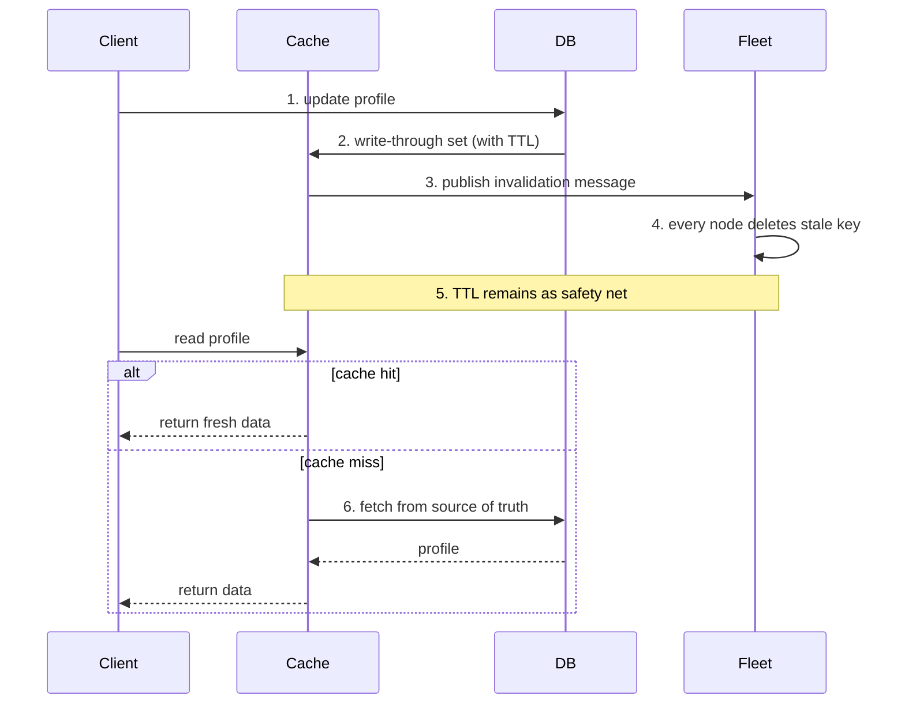

| Difficulty | Channel | Tags |
|---|---|---|
| beginner | backend | redis, memcached, cache-invalidation |

By 2013, Facebook was serving over a billion users from thousands of memcached servers, with every single page load fanning out into hundreds of cache lookups [1]. At that scale, the 'set a TTL and forget it' approach to caching collapses spectacularly — stale data everywhere, thundering herds, and a database drowning in queries. This is the story of how one of the largest systems on Earth kept user profiles consistent, and the lessons it planted for your own profile service.

---

> ### Real-World Case — Facebook (Meta)
>
> By 2013 Facebook served over a billion users and trillions of cached items from thousands of memcached servers, with every page load fanning out into hundreds of cache lookups. They needed to keep cached user data consistent with MySQL while serving billions of requests per second, and discovered that naive cache invalidation breaks at this scale.
>
> | | |
> |---|---|
> | **Challenge** | Cache invalidation on update in a cache-aside architecture: after a write, web servers delete the memcached key, but a flood of concurrent reads then stampede the database (thundering herd), and slow 'old' readers could re-populate the cache with stale data (stale set) — so delete-based invalidation itself caused the failures. |
> | **Solution** | Facebook kept memcached (not Redis) as a demand-filled look-aside cache and solved invalidation with two mechanisms: (1) leases — when a key is deleted, the first reader gets a short-lived lease token; only a client holding the current lease may write the value back, so stale writers are rejected, and (2) a 'gutter' pool of spare servers that temporarily absorbs requests for recently-invalidated hot keys. Cross-region invalidation was done by embedding delete commands in the MySQL binlog stream so cache invalidation never arrives before the replicated write. |
> | **Outcome** | The system handled billions of requests per second with single-digit-millisecond p95 latency. Leases reduced the peak database query rate during thundering herds from roughly 17,000 queries/sec to 1,300 queries/sec (about a 13x drop) while eliminating stale sets, and fine-grained locking in memcached itself raised peak throughput from 600K to 1.8M items/sec. |
> | **Lesson** | Delete-on-update cache invalidation works only until popular keys exist — then you need leases to prevent stale re-population and a gutter/scratch pool to absorb post-invalidation stampedes. Also, memcached's simplicity (vs. Redis's features) is exactly what made it possible to tune and scale, and consistency can be traded for freshness at massive scale. |

---

## Hook — A billion users, thousands of servers, and one wrong cache key

By 2013, Facebook ran one of the largest cache deployments in history: trillions of cached items spread across thousands of memcached servers, with every page load triggering hundreds of cache lookups [1]. The system was blazingly fast — but every time someone edited their profile, that carefully cached data became a time bomb. Serve the old version and you break consistency. Serve nothing and your database gets crushed under the surge. That is the exact tension you inherit the moment you add a cache to a user profile service, and watching how Facebook navigated it is packed with lessons your codebase needs.

## Problem — The silent killer of fast applications

Here is the trap: a cache is only as good as its invalidation strategy. Many developers add a cache, see latency drop, and declare victory — until the first stale-profile bug ticket lands. The classic failure looks like this: a user updates their email, the database writes the new value, but the cache keeps serving the old one for minutes. To users, your app has 'gone back in time.' Sound familiar? The root cause is usually a cache-aside read path combined with an invalidate-on-write path that nobody actually wired together. Meanwhile, the band-aid everyone reaches for — a short TTL — only postpones the problem. It trades staleness for another killer: cache stampedes, where a single expired key lets thousands of concurrent requests stampede straight into the database [4]. The stakes are real: your cache hit rate drives your latency budget, and your invalidation logic decides whether that budget holds up when it matters.

## Real-World Case — Facebook (Meta)

Now the war story. By 2013, Facebook's memcached fleet processed billions of requests per second while keeping p95 latency in the single-digit milliseconds — an astonishing feat [1]. But maintaining consistency between cached user data and MySQL at that scale exposed a brutal truth: naive invalidation breaks. A thundering herd — thousands of requests arriving for a key the moment it expires — hammered the database with roughly 17,000 queries per second. Facebook's answer was 'leases': a lightweight token that lets only one request regenerate a missing value while the rest wait, then re-verify before writing. The result? Peak database query rate dropped from about 17,000 queries/sec to 1,300 — a roughly 13x reduction — while stale writes were eliminated entirely [1]. And fine-grained locking inside memcached itself lifted peak throughput from 600K to 1.8M items per second [1]. The punchline: the fix was not a bigger cache. It was smarter coordination around a cache that already worked.

## Deep Dive — Redis vs Memcached and the anatomy of an invalidation strategy

Building on that story, let us zoom out. Your invalidation strategy needs three ingredients: a write pattern, an expiration policy, and a way to propagate the invalidation to every node holding a stale copy. The write pattern is where most designs live or die. Write-through caching means every update writes to the database and the cache in lockstep, so the cache can never silently diverge from the source of truth. Compare that to cache-aside, where reads populate the cache lazily and writes simply delete the key — simpler, but the cache can serve a stale value in the window between a write and the next read. Many teams combine both: write-through for hot profile data, cache-aside for cold data. For expiration, a TTL of 5–30 minutes works for profiles: short enough to bound staleness, long enough to keep hit rates high. But TTL is a floor, not a ceiling — which is why you still need explicit invalidation. That is where Redis and Memcached diverge sharply. Here is the real trade-off:

## Workflow — From update to consistency in six steps

So what does a production-grade flow actually look like? Start from the moment a user saves their profile, and trace every step a write must take to keep all your cache nodes honest. First, the write lands in the database — the source of truth. Second, the cache is updated or the key is deleted, depending on your write pattern. Third, and this is the step everyone forgets, the invalidation must reach every other server in the fleet — not just the one that handled the write. Fourth, a short TTL stays on the key as a safety net for bugs and missed messages. Fifth, you monitor cache hit rate, expiry-driven stampedes, and invalidation backlog so problems announce themselves before users do. Sixth, you load-test the herd scenario: what happens when your hottest profile expires at peak traffic? That last question is exactly what broke Facebook's naivety, and it is what leases solve [1]. The diagram below tells the whole story in one glance.

## Code Example — A write-through profile cache with pub/sub invalidation

Enough theory. Let us build it. This example uses a write-through profile cache with Redis pub/sub fanning invalidation across nodes — the distributed pattern that keeps every server honest. If this feels like a lot of moving parts, you are not alone; the payoff is that stale data stops being a 'maybe tomorrow' bug.

## Lessons Learned — What to do differently tomorrow

After all of that, here is the distilled wisdom. First, TTLs are a safety net, not a strategy — every key you expire is a potential stampede, and Facebook's 13x herd reduction shows what that costs [1]. Second, always invalidate by deleting the key on writes, never by updating it in place with a different serializer or schema — you avoid stale formats and race conditions in one move. Third, if your fleet has more than one cache node, you have a distributed invalidation problem whether you admitted it or not; pub/sub from Redis, or a dedicated message bus, closes that gap [3]. Fourth, instrument everything: hit rate, p95 latency, invalidation rate, and database query load are the four numbers that tell you whether your cache is an asset or a liability. And fifth, rehearse the thundering herd before it rehearses on you — run a load test that expires your hottest key and watch what hits your database. That is the moment you discover whether you need leases, jittered TTLs, or a redis-backed lock. The memcached paper remains required reading for exactly this reason [1].

---

## Write-Through Invalidation Flow

<strong>Original Interview Question</strong>

**Q:** You're building a user profile service that caches frequently accessed profiles. How would you implement cache invalidation when a user updates their profile, and what trade-offs would you consider between Redis and Memcached?

**A:** Implement write-through caching with TTL-based expiration. On profile update, invalidate the cache by deleting the key and writing new data to both the database and cache. Redis offers pub/sub for automatic distributed invalidation, while Memcached requires manual coordination across nodes.

## Conclusion

The moral of the story: a cache does not make data consistent — your invalidation strategy does. Facebook's memcached fleet proved that the answer at the largest scale is not more hardware but smarter coordination: write-through semantics, TTLs as a safety net, and leases to survive the herd [1]. Tomorrow, audit your profile service with four questions. Is your write path actually invalidating the cache? Do all nodes hear about it? What happens when your hottest key expires? And can you see it in your metrics? Answer those and you will never again be the team explaining why users are seeing yesterday's email. When your team asks why the cache suddenly stops serving stale data, you will know exactly what to say.

---

## References

1. [Facebook (Meta) incident report](https://www.usenix.org/conference/nsdi13/technical-sessions/presentation/nishtala) — paper
2. [Memcached](https://en.wikipedia.org/wiki/Memcached) — documentation
3. [Redis](https://en.wikipedia.org/wiki/Redis) — documentation
4. [Cache stampede](https://en.wikipedia.org/wiki/Cache_stampede) — documentation
5. [HTTP caching](https://developer.mozilla.org/en-US/docs/Web/HTTP/Caching) — documentation
6. [Cache replacement policies](https://en.wikipedia.org/wiki/Cache_replacement_policies) — documentation
7. [AWS ElastiCache for Memcached — What is it](https://docs.aws.amazon.com/AmazonElastiCache/latest/memcached/WhatIs.html) — documentation
8. [redis/redis](https://github.com/redis/redis) — documentation
9. [memcached/memcached](https://github.com/memcached/memcached) — documentation

---

**Author:** Satishkumar Dhule — [GitHub](https://github.com/satishkumar-dhule) · [LinkedIn](https://linkedin.com/in/satishkumar-dhule) · [Website](https://satishkumar-dhule.github.io)
