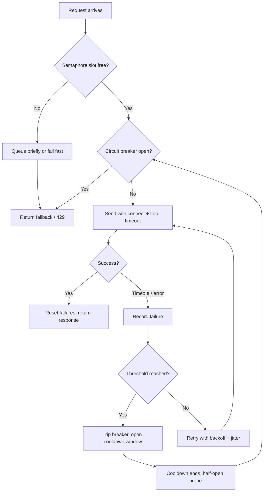

| Difficulty | Channel | Tags |
|---|---|---|
| advanced | backend | asyncio, aiohttp, concurrency |

Late 2011. Netflix's API — a single user request fanning out into dozens of internal service calls across recommendation, billing, encoding, and other backends — begins collapsing during peak traffic. The twist? Nothing is actually broken. One backend dependency is merely slow, and that slowness backs up threads across the fleet, exhausting Tomcat thread pools and cascading the outage across the entire API within seconds [1]. Sound familiar? It should — the same cascade kills modern microservices every week. This is the story of what Netflix learned, and how you can apply it to your own async code with aiohttp before your pager goes off.

---

> ### Real-World Case — Netflix
>
> In late 2011, Netflix's API — a single user request fanning out into dozens of internal service calls across recommendation, billing, encoding and other backends — began suffering catastrophic failures during high-traffic periods. A single backend dependency that was merely SLOW (not even failing) would back up threads across the fleet, exhausting Tomcat thread pools and cascading the outage across the entire API within seconds.
>
> | | |
> |---|---|
> | **Challenge** | How to keep one slow or failing downstream service from saturating the caller's connection/thread pools and taking down the entire system. Coarse timeouts were useless because a dependency that was slow-but-alive never errored, so every request waited the full timeout, connections piled up on the sick service, and the failure cascaded everywhere. |
> | **Solution** | Netflix built Hystrix, a connection/dependency pool manager that isolates each dependency behind its own bounded thread pool or semaphore (the bulkhead pattern — the direct analog of a semaphore-limited aiohttp pool), adds per-command timeouts, a circuit breaker with closed/open/half-open states that stops all traffic to a failing dependency and lets a few test requests through on recovery, and fallback responses for graceful degradation. Critically, Hystrix REJECTS rather than queues when a pool is saturated, and the team's rule was to never increase pool sizes during an incident. |
> | **Outcome** | By late 2012 Hystrix was executing tens of billions of thread-isolated and hundreds of billions of semaphore-isolated calls per day at Netflix — the API system alone running 10+ billion thread-isolated and 200+ billion semaphore-isolated executions daily — with 'a dramatic improvement in uptime and resilience.' In a documented production incident where a single dependency's latency tripped breakers on ~one-third of a 243-server cluster, all other circuits stayed healthy and users received degraded-but-functional fallback responses instead of 500s. |
> | **Lesson** | The counterintuitive insight: when a service gets slow, your instinct to 'give it more connections' is exactly backwards. Netflix documented that 100 servers × 10 connections = 1000 concurrent connections, healthy usage 200-300, but under latency all 1000 back up — and bumping the limit to 20 per box just holds 2000 connections open against the sick backend, making it worse (a self-inflicted DDoS). The circuit breaker exists to release pressure so the downstream can actually recover; pool sizes should be sized small relative to total resources and tuned for a healthy system, not grown in a crisis. |

---

## Hook — One “slow” endpoint, zero code changes, full outage

Picture this: a Tuesday night, 8pm, traffic climbing toward its peak. Your dashboards are green except for a single blip — a third-party API responding in 3 seconds instead of 80ms. You file it under “investigate later.” Then the pager lights up. 500s everywhere — and not just from the service that talks to that API. From everything.

Here is the uncomfortable truth: in a distributed system, you never fail in isolation. Every request you send into a slow dependency becomes a hostage. It holds a socket, a task, a connection — a slice of your finite concurrency budget — and it is not coming back any time soon. The more traffic you have, the more hostages you take, until there are none left for the healthy services that actually need them. That is the stakes. And it is the exact scenario that nearly broke one of the largest streaming platforms on Earth.

## Problem — Why async makes cascading failures worse

You might think async code dodges the classic thread-pool death spiral. After all, aiohttp and asyncio let thousands of coroutines share a single thread, so what is there to exhaust? That is precisely the trap.

The thread pool gets replaced by something just as finite: your file-descriptor budget, your socket limit, your memory. Unbounded concurrency in async code does not remove the ceiling — it moves it, and makes the crash harder to predict and harder to diagnose [4]. A `Semaphore` becomes the bouncer that keeps the club from exceeding fire capacity, but a bouncer only helps if you also have a plan for what happens at the door.

So when would you actually use this pattern? Every time your code talks to a service you do not control — a payment gateway, a recommendation engine, a partner API, a database proxy. If your app fans one request out to several backends, you are running a miniature Netflix API whether you planned for it or not. And the fix has to confront three realities simultaneously: slow services need timeouts, flaky services need retries, and down services need circuit breakers. Most teams handle one of the three. The systems that survive handle all three at once.

## Real-World Case — Netflix's 2011–2012 resilience awakening

This is not a hypothetical, and it is not ancient history — it is the playbook the modern internet is built on. In late 2011, Netflix's API began failing catastrophically during high-traffic periods. A single user request fans out into dozens of internal service calls, and when one of those dependencies was merely slow — not even failing — the slowness backed up threads across the entire fleet. Tomcat thread pools drained to zero, and the outage cascaded across the whole API within seconds [1].

That wake-up call produced Hystrix, a latency-and-fault-tolerance library built on three ideas: isolate, break, degrade. The numbers are staggering. By late 2012, Hystrix was executing tens of billions of thread-isolated and hundreds of billions of semaphore-isolated calls per day — the API system alone running 10+ billion thread-isolated and 200+ billion semaphore-isolated executions daily, with a dramatic improvement in uptime and resilience [1][6].

And here is the proof that it worked. In a documented production incident, a single dependency's latency tripped circuit breakers on roughly one-third of a 243-server cluster. Every other circuit stayed healthy, and users received degraded-but-functional fallback responses instead of a wall of 500s [1]. That is the entire thesis of this article in one sentence: make failure cheap, local, and partial — not catastrophic and global.

## Deep Dive — The four levers of graceful degradation

Building on Netflix's story, four mechanisms do the heavy lifting in any resilient connection pool. Here is what each one actually does — and where it betrays you.

**1. The semaphore: the bouncer.** A `Semaphore` caps how many requests can be in flight at once, so a slow dependency cannot silently consume every connection your process can open [4]. The nuance most teams miss: the semaphore must be acquired before you touch a socket and released reliably in every code path. A leaked acquisition is a leaked connection, and leaks compound exactly like leaks do [3].

**2. Timeouts: your first line of defense.** `aiohttp.ClientTimeout(total=..., connect=...)` puts a stopwatch on every request. A request without a timeout is not a request — it is a zombie holding resources forever [8].

**3. Exponential backoff with jitter: retry, but do not retry-storm.** Here is the plot twist. Naive retries are a force multiplier for outages. When a service is struggling, a thousand clients retrying on the same schedule is effectively a DDoS attack against it. Exponential backoff with randomized jitter desynchronizes those retries, spreading them out so the service can recover [5].

**4. The circuit breaker: stop betting on a broken horse.** Instead of burning a full timeout on every request (seconds each), the breaker trips after N consecutive failures and refuses to even try for a cooldown window [2]. It is the difference between flicking a faulty light switch forever and taping the switch off until an electrician arrives. Netflix built an entire platform on this one idea [6].

**The real trade-offs, side by side:**

| Approach | When it shines | When it bites |
|---|---|---|
| Timeouts only | Simple, zero state | Still burns the full timeout per call; slow cascade |
| Semaphore only | Hard cap on resources | Does not stop repeated attempts at a dead service |
| Retry + backoff | Survives transient blips | Retry storms without jitter; amplifies outages |
| Circuit breaker | Cuts losses fast, protects downstream | Wrong thresholds cause false trips or useless trips |

🎯 Key Point: the trick is not choosing one mechanism — it is stacking all four so each one covers the others' blind spots. Netflix's uptime gains came from the combination, not any single lever [1].

## Workflow — Five stages from request to graceful failure

So how does this all fit together at runtime? Every outgoing request walks the same pipeline, stage by stage — visualized in the **Graceful Degradation Flow** diagram:

1. **Bound concurrency.** Acquire a semaphore slot before doing anything else. No slot, no socket — either queue briefly or fail fast with a clear signal. This is your ceiling [4].
2. **Check the circuit.** If the breaker is open, do not waste a slot or a second on a doomed request — return a fallback immediately [2].
3. **Send with a deadline.** Every request carries both a total timeout and a connect timeout. Slow beats dead — but only if slow has a stopwatch [8].
4. **Retry with backoff + jitter.** On a transient failure, sleep an exponentially growing, randomly jittered delay before the next attempt, capped so a sick service is never hammered [5].
5. **Degrade, don't collapse.** If retries exhaust or the breaker trips, return a fallback, serve a cached stale value, or surface a clear error — and keep every healthy system running while you do [1].

⚠️ Watch Out: one detail worth its own paragraph — reuse a single `aiohttp.ClientSession`. It maintains a connection pool and keeps TCP connections warm with keep-alive. Creating a session per request defeats the entire point of pooling [3][9]. A pool with per-request sessions is not a pool; it is a series of small fires.

Figure: the five-stage pipeline below shows exactly where each mechanism intercepts the request.

## Code Example — A production-flavored aiohttp pool

With the workflow in mind, here is the implementation. This is a tightened, production-flavored version of the classic aiohttp pool: a semaphore for the cap, a proper circuit breaker class, exponential backoff with jitter, and one shared session created once and closed cleanly on shutdown. Every `async with` guarantees release, so neither the semaphore nor the socket leaks. Callers can fan out work with asyncio Task Groups [7] while the pool keeps the whole thing bounded.

**Walking through the code:**
- `CircuitBreaker` — keeps a rolling failure count; trips open after `threshold` failures; after `cooldown` elapses it half-opens and lets a probe through, effectively a health check for the circuit [2].
- `ConnectionPool.start()` — creates one shared `ClientSession` with sane timeouts, created once and reused forever [3].
- `ConnectionPool.get()` — the entire pipeline: semaphore first, breaker check second, then the retry loop with backoff + jitter on each transient failure.
- `ConnectionPool.stop()` — closes the session so keep-alive sockets do not dangle on application shutdown.

🔥 Hot Take: note that retries happen *inside* the semaphore's `async with` — a retrying request still holds its slot. That is deliberate. It prevents retry storms from multiplying effective concurrency. If you free the slot between retries you gain throughput and lose protection; most teams keep the slot.

## Lessons Learned — What to do differently on Monday

Here is the honest recap of the journey — the insights worth taking into your next code review:

- **Slow is scarier than down.** A dead service fails fast; a slow one quietly hoards your entire concurrency budget. Timeout everything, and make slow requests fail before they starve the pool [8].
- **Fail fast when it is hopeless.** Circuit breakers turned Netflix's fleet from a house of cards into a system that absorbed one-third of a cluster failing without a global outage [1][2].
- **Retry with respect.** Backoff with jitter, or not at all [5]. Every retry you skip saves a downstream service from a DDoS on its worst day.
- **Cap everything.** A semaphore [4] and a reused aiohttp session [3] are cheap insurance against both resource exhaustion and connection churn.
- **Design the failure path, not just the success path.** If your team cannot answer “what happens when our payment API is 10x slower?” during design review, the outage has already been shipped.

💡 Insight: battle scars to look for in old code — leaked semaphores (fixed with `async with`), sessions without SSL context validation, missing `close()` on shutdown leaving sockets hanging, and retry loops with no jitter. If you spot any of these, you have found the next incident before it finds you.

---

## Graceful Degradation Flow

<strong>Original Interview Question</strong>

**Q:** How would you implement a connection pool manager for aiohttp that handles graceful degradation under high load and connection timeouts?

**A:** Implement a connection pool manager for aiohttp using a semaphore to limit concurrent connections, exponential backoff for retrying failed requests, and circuit breaker pattern to gracefully degrade under high load and connection timeouts.

## Conclusion

Netflix's 2011 near-miss became the blueprint for how the modern internet stays standing: isolate, break, degrade [1]. The tools have changed — aiohttp, asyncio, semaphores — but the lesson is eternal: resilience is not about making failure impossible; it is about making failure affordable. So here is the action item: this week, pick the one dependency your code talks to most and instrument it. Time it, cap it, break on it, and decide in advance what your users see when it gets sick. When that day comes for real — and it will — the difference between an incident and a non-event is the code you wrote before the pager went off. Share this one insight with your team: you do not build resilience for the happy path. You build it for the day your worst dependency lies to you, and every healthy system still has to keep its promises.

---

## References

1. [Netflix incident report](https://github.com/Netflix/Hystrix/wiki/Operations) — article
2. [CircuitBreaker — Martin Fowler](https://martinfowler.com/bliki/CircuitBreaker.html) — blog
3. [aiohttp ClientSession reference](https://docs.aiohttp.org/en/stable/client_reference.html) — documentation
4. [asyncio synchronization primitives (Semaphore)](https://docs.python.org/3/library/asyncio-sync.html) — documentation
5. [Exponential backoff and jitter — AWS Architecture Best Practices](https://docs.aws.amazon.com/whitepapers/latest/architecture-best-practices/exponential-backoff-and-jitter.html) — documentation
6. [Hystrix (software) — Wikipedia](https://en.wikipedia.org/wiki/Hystrix_(software)) — documentation
7. [asyncio Task Groups — Python documentation](https://docs.python.org/3/library/asyncio-task.html) — documentation
8. [aiohttp client quickstart — timeouts](https://docs.aiohttp.org/en/stable/client_quickstart.html) — documentation
9. [HTTP Keep-Alive header — MDN Web Docs](https://developer.mozilla.org/en-US/docs/Web/HTTP/Headers/Keep-Alive) — documentation

---

**Author:** Satishkumar Dhule — [GitHub](https://github.com/satishkumar-dhule) · [LinkedIn](https://linkedin.com/in/satishkumar-dhule) · [Website](https://satishkumar-dhule.github.io)
