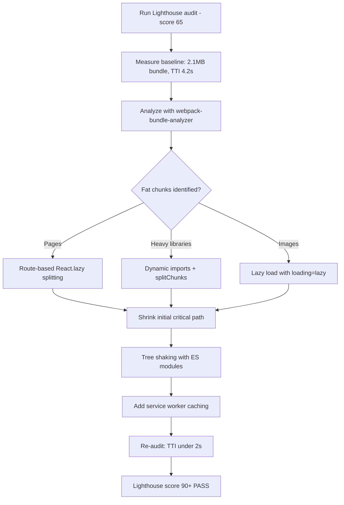

| Difficulty | Channel | Tags |
|---|---|---|
| intermediate | frontend | lighthouse, bundle, lazy-loading |

Picture this: over 80% of your 328 million monthly users open your app on a phone — many on 2G and 3G networks where a single page takes five seconds just to appear. That was Twitter's reality in 2016, and the fix wasn't another native app. It was rebuilding the mobile web as a fast, resilient React Progressive Web App called Twitter Lite [1]. The company cut main bundle load time by roughly 40% and nearly halved Time to Interactive, all while shipping under 3% of the bytes the Android app required [1]. This article walks you through the same playbook so you can drag your own 2.1MB React bundle from a shaky 65 to a rock-solid 90+ Lighthouse score.

---

> ### Real-World Case — Twitter (now X)
>
> In 2016-2017 Twitter faced a mobile web crisis: over 80% of its 328M monthly users were on mobile, many on 2G/3G networks in emerging markets, and the React-based mobile web experience was slow and bloated. They built Twitter Lite, a React Progressive Web App, as the default mobile web experience and documented every optimization in detail.
>
> | | |
> |---|---|
> | **Challenge** | Twitter Lite's initial webpack build shipped just 3 JavaScript files totaling over 1MB (420KB gzipped), and the main bundle took over 5 seconds to load on a simulated 3G connection. Twitter needed to radically cut initial JS payload and Time to Interactive to serve users on low-end devices and slow, expensive networks. |
> | **Solution** | The team implemented route-based code splitting with webpack's CommonsChunkPlugin, splitting vendor, manifest, shared, and main chunks plus roughly 40 on-demand, route-level lazy-loaded chunks following the PRPL pattern. They analyzed the bundle to find bottlenecks, removed unused dependencies, deferred heavy React components, optimized images, and layered a service worker to pre-cache JS/CSS/image assets and the app shell so repeat visits load from cache. A 'build tracker' was added to CI so any bundle regression (e.g., a stray import ballooning a chunk from <100KB to several hundred KB, which once crashed both the service worker and the app) is caught before shipping. |
> | **Outcome** | Main bundle load dropped from ~5s to ~3s on simulated 3G; Time to Interactive was nearly halved per Lighthouse; 99th-percentile TTI latency fell 50% and average load time for logged-in users fell 30%; repeat visits boot in under 3 seconds. Twitter Lite ships ~600KB over the wire vs 23.5MB for the native Android app (less than 3% of the storage). Business results: 65% more pages per session, 75% more Tweets sent, and a 20% lower bounce rate. |
> | **Lesson** | Performance at scale is a continuous process, not a one-time fix: after route-based splitting, the team still hit surprising regressions (e.g., a service worker import silently inflating the bundle and crashing the app), so they built automated bundle-size tracking into CI. The compounding wins also came from pairing code splitting with aggressive caching and PWA strategies — not just smaller JS. |

---

## Hook — That Sinking Feeling When the Score Says 65

The ticket lands on your board on a Friday afternoon: "Improve Lighthouse from 65 to 90+." You open DevTools, run the audit, and there it is in cold black and white — a 2.1MB JavaScript bundle and a Time to Interactive of 4.2 seconds. On a mid-range Android phone over 3G, that means users stare at a blank screen for longer than it takes to brew a pour-over coffee. They don't wait. They bounce. And here is the kicker: every 100ms of load time you shave is measurable revenue for someone else's business. Sound familiar? If you have ever felt the dread of a bundle that grew one dependency at a time until it was too heavy to reason about, you are exactly the developer this journey is for. The good news? The path to 90+ is not a mystery — it has been mapped, measured, and documented by one of the biggest sites on the planet.

## Problem — The 2.1MB Bundle Nobody Asks For, But Everyone Inherits

Here is how it usually happens. The app starts lean — a create-react-app skeleton with three routes and a dream. Then a charting library sneaks in for one dashboard. A date picker. A state management tool. A utilities package because the intern said it was "essential." Nobody is consciously adding bloat; each dependency is justified in isolation. The problem is that bundles are additive, but the cost is not. Every library you import at the top of a file becomes part of the critical path — it must be downloaded, parsed, and executed before the page can respond to a single click. Developers obsess over backend query efficiency while their frontend ships megabytes of JavaScript that must be parsed on a 1GHz phone. This is why Lighthouse flags TTI at 4.2s: the browser is not slow, the bundle is greedy. The stakes are brutal. 53% of mobile visits are abandoned if a page takes longer than three seconds to load, and users who wait develop a Pavlovian distrust of your site. The core challenge, then, is not "add more caching" — it is ruthlessly deciding what the user actually needs at this exact moment, and deferring everything else.

## Real-World Case — Twitter Lite: When the Mobile Web Was Drowning

In 2016, Twitter found itself in a crisis most product teams only fear. More than 80% of its 328 million monthly users accessed the service on mobile, and a huge slice lived in emerging markets where 2G and 3G connections were the norm [1]. The React-based mobile web experience was slow, bloated, and bleeding users to lighter, faster competitors. The stakes were existential: if the mobile web was the front door for 80% of your users, a slow front door is a slow company. Twitter's engineers chose the hardest path — rebuild the mobile web from scratch as a Progressive Web App called Twitter Lite, then document every optimization like field notes from an expedition. The numbers that came back were staggering. Main bundle load time dropped from roughly 5 seconds to about 3 seconds on simulated 3G, and Time to Interactive was nearly halved per Lighthouse audits [1]. The 99th-percentile TTI latency fell by 50%, average load time for logged-in users dropped 30%, and repeat visits boot in under 3 seconds [1]. Twitter Lite ships around 600KB over the wire versus 23.5MB for the native Android app — less than 3% of the storage [1]. The business results speak louder than any metric: 65% more pages per session, 75% more Tweets sent, and a 20% lower bounce rate [1]. The plot twist? They did not invent new technology. They used code splitting, tree shaking, aggressive caching, and lazy loading — tools that were already sitting in your toolbox today.

## Deep Dive — Splitting, Shaking, and the Art of Shipping Less

So what did Twitter actually do, and how does it map to your Lighthouse audit? The journey starts with visibility. You cannot optimize what you cannot see, which is why bundle analysis is step zero. Tools like webpack-bundle-analyzer render your bundle as an interactive treemap, revealing the single charting library eating 40% of your entire payload [8]. More often than not, the largest chunk is one or two dependencies that a past version of you thought was a good idea. The next layer is code splitting — breaking your single monolith into many small chunks loaded on demand [2]. The decision tree is simple: route-based splitting for pages, component-based splitting for heavy widgets, and dynamic imports for third-party libraries you only need after user interaction [3]. You might think tree shaking is automatic — actually, it is not. Tree shaking works only with proper ES module configuration, because bundlers can safely remove unused exports only from statically analyzable `import` statements [3]. CommonJS imports, transpiled Babel plugins, and side-effectful modules silently break the whole thing. Now for the trade-off table, because every optimization is a compromise:

## Workflow — The Step-by-Step Ascent From 65 to 90+

Building on the deep dive, here is the repeatable workflow — the same sequence the Twitter Lite team followed, adapted for any React app. First, measure: run Lighthouse and record the baseline numbers (bundle size, TTI, FCP). Second, analyze: generate a bundle report and identify the largest chunks; you are hunting for the 20% of dependencies that cause 80% of the weight [8]. Third, split: implement route-based splitting with React.lazy and Suspense for every page, then component-based splitting for anything below the fold [2]. Fourth, shake: verify your build uses ES modules end-to-end, remove dead dependencies, and replace heavy libraries with lean alternatives. Fifth, defer: lazy-load images with loading="lazy" and native lazy loading for below-the-fold content [5]. Sixth, cache: add a service worker so repeat visits boot from cache in under 3 seconds, exactly as Twitter Lite does [7]. Finally, re-measure: audit again, compare against the baseline, and iterate. The diagram below captures the flow at a glance.

## Code Example — Lazy Loading in the Wild

Here is where theory becomes practice. The example below shows route-based code splitting with React.lazy and Suspense, wrapped in an error boundary so a failed chunk load never bricks the entire app — a battle-scar lesson from production, because a deploy that removes a route can make a cached browser request a chunk that no longer exists.

## Lessons Learned — What the Bundle Taught Us

After this journey, a few truths stick. First, measure before you move: without a Lighthouse baseline, every change is a guess. Second, chase the biggest chunk first — a single library swap (like replacing a monolithic charting suite with a tree-shakeable one) can reclaim more bytes than a week of micro-optimizations. Third, never trust that tree shaking "just works"; verify your ES module setup, because one CommonJS import poisons the entire dependency tree [3]. Fourth, lazy loading is not free — every Suspense boundary is a new failure mode, so error boundaries are not optional [4]. And finally, the biggest lesson from Twitter Lite: performance is a product feature, not a chore [1]. Those engineers were rewarded with 65% more pages per session and 75% more Tweets sent — the kind of numbers that make executives pay attention [1]. The mistakes to avoid: lazy-loading tiny components (the overhead beats the benefit), ignoring the vendor chunk (shared libraries re-downloaded on every route), and forgetting that images are often half your page weight. Ship smaller, measure constantly, and remember that every second you remove from TTI is a user you keep.

---

## Performance Optimization Flow

<strong>Original Interview Question</strong>

**Q:** You're tasked with improving a React app's Lighthouse performance score from 65 to 90+. The bundle size is 2.1MB and Time to Interactive is 4.2s. What specific steps would you take to optimize the bundle and implement lazy loading?

**A:** Implement code splitting with React.lazy() and Suspense, analyze bundle composition with webpack-bundle-analyzer to identify largest chunks, remove unused dependencies and optimize imports, add dynamic imports for heavy components and third-party libraries, implement route-based splitting for better initial load times, and utilize tree shaking with proper ES module configuration.

## Conclusion

The moral of this story is simple: a 65 Lighthouse score is not a verdict, it is a starting line. Twitter proved that a team can take the web they already had and make it load in three seconds on a 3G connection — by analyzing, splitting, shaking, and caching instead of rebuilding from scratch [1]. So run your audit today, open the bundle analyzer, and cut the single biggest chunk you find. Tomorrow, you will have a number to share with your team that turns a chore into a win — and maybe, like Twitter, a 20% lower bounce rate to show for it. One insight to carry with you: the best performance optimization is deleting code, and the second best is never shipping it until the user actually asks.

---

## References

1. [Twitter (now X) incident report](https://web.dev/case-studies/twitter) — article
2. [Code splitting — MDN Web Docs](https://developer.mozilla.org/en-US/docs/Glossary/Code_splitting) — documentation
3. [JavaScript modules — MDN Web Docs](https://developer.mozilla.org/en-US/docs/Web/JavaScript/Guide/Modules) — documentation
4. [import statement — MDN Web Docs](https://developer.mozilla.org/en-US/docs/Web/JavaScript/Reference/Statements/import) — documentation
5. [Lazy loading — MDN Web Docs](https://developer.mozilla.org/en-US/docs/Web/Performance/Lazy_loading) — documentation
6. [Progressive web app — Wikipedia](https://en.wikipedia.org/wiki/Progressive_web_app) — article
7. [Service worker — Wikipedia](https://en.wikipedia.org/wiki/Service_worker) — article
8. [webpack-bundle-analyzer — GitHub](https://github.com/webpack-contrib/webpack-bundle-analyzer) — documentation
9. [Lighthouse (software) — Wikipedia](https://en.wikipedia.org/wiki/Lighthouse_(software)) — article

---

**Author:** Satishkumar Dhule — [GitHub](https://github.com/satishkumar-dhule) · [LinkedIn](https://linkedin.com/in/satishkumar-dhule) · [Website](https://satishkumar-dhule.github.io)
