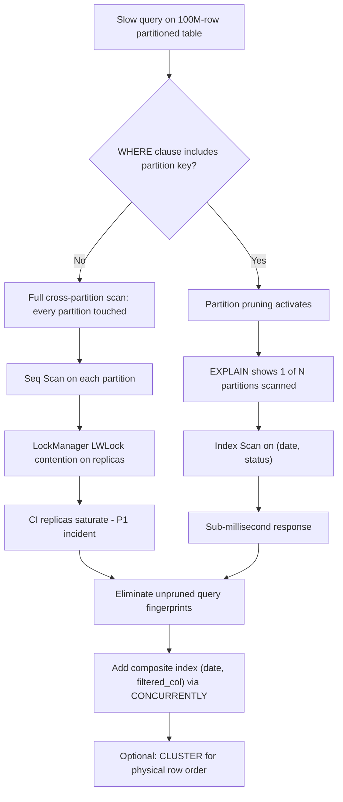

| Difficulty | Channel | Tags |
|---|---|---|
| intermediate | database | explain, query-plan, partitioning |

GitLab partitioned its massive CI data tables — billions of rows across dozens of partitions — only to watch production replicas saturate anyway. An investigation into incident INC-8367 traced the culprit to something embarrassingly simple: background workers querying partitioned tables without the partition key, forcing full cross-partition scans [1]. Sound familiar? You can architect a beautiful partitioned schema and still get crushed by one query that forgot to mention the date. This is the story of how to catch that query, read the EXPLAIN plan like a detective, and bring a 100M-row table back to sub-millisecond territory.

---

> ### Real-World Case — GitLab
>
> GitLab partitioned its massive CI data tables (p_ci_pipelines, p_ci_builds) into many partitions to handle billions of rows, yet production CI replicas kept saturating. An incident investigation (INC-8367) traced the culprit to high-frequency background Sidekiq workers issuing lookups like `SELECT * FROM p_ci_pipelines WHERE id = $1` that did not include the partition key.
>
> | | |
> |---|---|
> | **Challenge** | A partitioned table is only fast when the query planner can prune. These hot queries couldn't prune because partition_id wasn't in the WHERE clause, so PostgreSQL scanned every partition (full cross-partition scans) — and since each partition needs index lookups and locks, the cost grows linearly as partitions multiply, a compounding problem. This was identified as a primary contributor to LockManager LWLock saturation on CI replicas. |
> | **Solution** | GitLab rewired the ORM/finder layer to always inject the partition key (partition pruning wired up in Ci::Deployable and pipeline lookups) so EXPLAIN plans prune to the right partition. For the unavoidable id-only lookups, they built a two-layer lookup (a tiny override table plus a range scan against ci_partitions) to resolve record_id → partition_id in under a millisecond — without changing every worker signature. |
> | **Outcome** | The three highest call-rate unpruned query fingerprints were eliminated, removing the full cross-partition scans that drove LockManager LWLock saturation on CI replicas. Every hot lookup became a sub-millisecond, pruned-to-one-partition scan instead of touching all partitions. |
> | **Lesson** | Partitioning only helps when the planner can prove which partitions matter — check EXPLAIN and count the partitions under the Append node; if all of them appear, the query's WHERE clause is missing the partition key. Design queries and partition keys together, and treat unpruned point lookups on hot paths as a compounding incident waiting to happen. |

---

## Hook — The Monday You Find Out Partitioning Isn't Magic

It usually starts on a Monday. Deployments are rolling, the dashboard looks fine, and then one of your replicas starts choking. CPU climbs, lock waits spike, and somebody mutters the sentence every database team dreads: "The table is partitioned. It should be fast." You have 100 million rows. You split them across dozens of partitions by date. And yet a query filtering on a perfectly sensible date range still crawls. Here is the uncomfortable truth: partitioning is not a performance guarantee — it is an invitation for the query planner to do the right thing, and a single query that ignores the invitation can undo the entire architecture. Before you resize the instance or scream at the latency graph, the real answer is usually hiding in plain sight: the EXPLAIN plan. The question is whether you know how to interrogate it.

## Problem — The Query That Forgot Its Own Schema

Partitioning exists for a reason. It shrinks the search space from "one giant table" to "a handful of relevant shards," letting each partition act like a smaller table the planner can scan independently [2]. For time-series data — events, logs, CI job runs — date-based partitioning is the default choice: old data gets pruned cheaply, retention becomes a simple DROP, and hot rows stay physically isolated from cold ones. But here is the plot twist: the benefit only materializes if the planner knows which partitions to keep. The moment a query filters on id, status, or any column that is not the partition key, the database has no idea which slice of the table holds the answer. So it does the logical thing — it touches all of them [3]. Consequently, a "partitioned" 100M-row table quietly behaves exactly like a non-partitioned one, and the performance cliff you thought you escaped comes right back. Many developers discover this the hard way, usually at the exact moment a third-party background worker starts hammering their tables with parameterized queries that only reference a primary key.

## Real-World Case — GitLab

Nobody demonstrates this better than GitLab. GitLab's CI data is a monster — tables like p_ci_pipelines and p_ci_builds hold billions of rows, which is precisely why the team split them into a large number of partitions. Yet in production, CI database replicas kept saturating, and the incident investigation (INC-8367) uncovered a culprit that had nothing to do with data volume [1]. High-frequency background Sidekiq workers were issuing lookups such as SELECT * FROM p_ci_pipelines WHERE id = $1 — parameterized queries that filter on the primary key but omit the partition key entirely. Every single one of those lookups forced a full cross-partition scan. The fix was remarkably surgical: GitLab identified the highest call-rate unpruned query fingerprints and eliminated the top three. That removed the cross-partition scans driving LockManager LWLock saturation on the CI replicas, and every hot lookup became a sub-millisecond, pruned-to-one-partition scan instead of touching all partitions [1]. The lesson is a gut punch: the fix was not "buy a bigger replica" or "add another connection pool." It was simply giving the query planner the information it had already been begging for.

## Deep Dive — Reading EXPLAIN Like a Detective

Building on GitLab's story, here is what the EXPLAIN plan is actually telling you when a partitioned query is slow. First, verify partition pruning is happening at all — look for Partition Prune nodes and check whether the plan touches one partition or one hundred. If you see a Seq Scan repeated per partition, pruning is not working [4]. Second, check index utilization: is the planner choosing an index scan or falling back to sequential scans because the estimate says it's cheaper? That happens when a filtered column has no usable index or the statistics are stale — run ANALYZE before you add anything [2]. Third, hunt for expensive Sort and HashAggregate nodes; a query that returns a few rows but sorts the entire result set will burn memory and time. Now the optimization play: create a composite index on (date, filtered_columns) so the planner can prune by date and index by status in one pass [7]. Then, for heavy range scans, consider CLUSTER — it rewrites rows into physical order matching the index, slashing the number of heap blocks visited — but be aware it locks the whole table and rewrites everything, so it belongs in a maintenance window [6].

## Workflow — A 6-Step Diagnosis You Can Run Tomorrow

Here is the step-by-step playbook, with the full flow visualized in the Query Diagnosis and Partition Pruning Flow diagram. Start by reproducing the slow query with EXPLAIN (ANALYZE, BUFFERS) and counting how many partitions actually get scanned. Then, if pruning is broken, figure out why — is the WHERE clause missing the partition key, or is the query parameterized in a way the planner can't reason about? Next, confirm whether an index is being used; if a Seq Scan dominates, your filtering columns need a composite index built with CREATE INDEX CONCURRENTLY so you don't lock writes [5]. After that, check for Sort and HashAggregate nodes and consider adding ORDER BY columns to the index. Finally, re-run the plan and compare buffer counts before and after — the numbers are the truth. The diagram below shows the entire flow, from slow query to saturated replica, and exactly where partition pruning turns the story around.

## Code Example — The EXPLAIN Interrogation and Fix Kit

This bash workflow mirrors exactly what GitLab's engineers would have run: reproduce, verify pruning, add the composite index safely, optionally cluster, then prove the win. The code is written for psql but works against any PostgreSQL 12+ deployment.

## Lessons Learned — What GitLab Taught Every Database Team

The whole journey distills into a handful of rules you can carry into your next on-call shift. Partitioning is a contract, not a silver bullet — if your queries don't include the partition key, the planner cannot prune, and you pay for every partition [3]. Always verify pruning in the EXPLAIN output per query pattern; don't assume the architecture is working because the schema looks right [4]. Build composite indexes that cover the WHERE clause, and create them with CONCURRENTLY to avoid write blocking [5]. Reserve CLUSTER for genuinely hot, range-scanned tables, and always schedule it during a maintenance window [6]. Instrument production with auto_explain and track query fingerprints so the next unpruned query is caught by a dashboard, not a P1 page [4]. And above all: audit your parameterized queries. A lookup by primary key on a partitioned table is a landmine unless the caller also supplies the partition key — the exact mistake that brought GitLab's CI replicas to their knees [1].

---

## Query Diagnosis and Partition Pruning Flow

<strong>Original Interview Question</strong>

**Q:** You have a PostgreSQL table with 100M rows partitioned by date. A query filtering on a specific date range is still slow. What would you check in the EXPLAIN plan and how would you optimize it?

**A:** Check partition pruning effectiveness, index utilization patterns, and expensive sort operations. Create composite indexes on (date, filtered_columns) and evaluate clustering strategies for optimal data access.

## Conclusion

GitLab's story ends with a deceptively simple fix: three query fingerprints eliminated, cross-partition scans gone, and hot lookups dropping to sub-millisecond latency [1]. Your takeaway is just as simple — every partitioned query deserves an EXPLAIN audit, and every lookup by primary key on a partitioned table is a potential landmine unless it carries the partition key. Tomorrow, pick your slowest partitioned query, run EXPLAIN (ANALYZE, BUFFERS), count the partitions it touches, and fix the fingerprint before the dashboard forces you to. The memorable insight to share with your team: partitioning doesn't make a query fast — partition pruning does, and pruning only happens when the query tells the planner where to look.

---

## References

1. [GitLab incident report](https://gitlab.com/gitlab-org/gitlab/-/work_items/593701) — article
2. [PostgreSQL Table Partitioning Documentation](https://www.postgresql.org/docs/current/ddl-partitioning.html) — documentation
3. [PostgreSQL Partition Pruning Documentation](https://www.postgresql.org/docs/current/ddl-partition-pruning.html) — documentation
4. [PostgreSQL EXPLAIN Usage Documentation](https://www.postgresql.org/docs/current/using-explain.html) — documentation
5. [PostgreSQL CREATE INDEX Documentation](https://www.postgresql.org/docs/current/sql-createindex.html) — documentation
6. [PostgreSQL CLUSTER Command Documentation](https://www.postgresql.org/docs/current/sql-cluster.html) — documentation
7. [PostgreSQL Indexes Documentation](https://www.postgresql.org/docs/current/indexes.html) — documentation
8. [Wikipedia: Database Partitioning](https://en.wikipedia.org/wiki/Database_partitioning) — documentation
9. [DigitalOcean: SQLite vs MySQL vs PostgreSQL — A Comparison](https://www.digitalocean.com/community/tutorials/sqlite-vs-mysql-vs-postgresql-a-comparison-of-relational-database-management-systems) — blog

---

**Author:** Satishkumar Dhule — [GitHub](https://github.com/satishkumar-dhule) · [LinkedIn](https://linkedin.com/in/satishkumar-dhule) · [Website](https://satishkumar-dhule.github.io)
