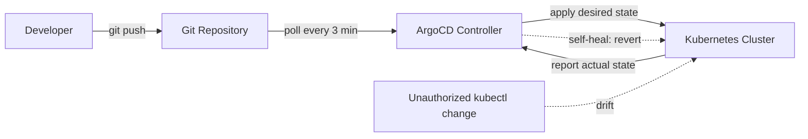

| Difficulty | Channel | Tags |
|---|---|---|
| beginner | devops | argocd, flux, declarative |

In 2018, Intuit was running more than 100 Kubernetes clusters carrying 500 production services for QuickBooks and TurboTax — yet a single deployment cycle still took days [1]. The company had moved to the cloud, but developers felt no faster than before. What finally unblocked them wasn't a fancier tool or a bigger team; it was a mindset shift about who gets to control the cluster. This is the story of that shift — and how you can apply the same playbook to your own deploys.

---

> ### Real-World Case — Intuit
>
> Intuit migrated its infrastructure (QuickBooks, TurboTax, etc.) to public cloud, but the lift-and-shift approach barely improved developer velocity - teams still took days or weeks to create and deploy new software releases. They needed a way to ship to Kubernetes safely at enterprise scale.
>
> | | |
> |---|---|
> | **Challenge** | Intuit runs a regulated fintech business where deployment mistakes are costly, yet its imperative kubectl-driven, pipeline-heavy delivery was slow, error-prone, and impossible to audit. With hundreds of services across dozens of clusters, they needed a declarative, auditable, and automated way to deploy that kept Git as the single source of truth and could self-heal any drift or unauthorized change. |
> | **Solution** | Intuit acquired Applatix (the startup behind Argo), open-sourced Argo CD, and built a GitOps platform: developers commit manifests to Git, and Argo CD continuously reconciles the cluster to that declared state - with self-healing so any manual change or out-of-band edit is automatically reverted to what Git says. At scale, they redesigned Argo CD's app controller to shard reconciliation load, cutting application reconciliation time from minutes to seconds. Argo CD managed 3,000+ applications across 130+ Kubernetes clusters serving 4,000 developers, using auto-sync plus controlled sync for prod. |
> | **Outcome** | Creating or upgrading a service went from days/weeks to under 10 minutes; deployment cycles on the QuickBooks platform dropped from days to minutes; MTTR for a rollback or roll-forward went from 45 minutes to under 5 minutes. In 2018 alone they operationalized 100+ Kubernetes clusters running 500 production services, growing to 130+ clusters and 3,000+ apps. Intuit won the CNCF End User Award (2019). |
> | **Lesson** | The declarative GitOps approach pays off most at scale: because Git is the single source of truth and Argo CD self-heals, there is 'no such thing as an oops' - mistakes are just commits that can be audited and reverted, and manual imperative changes get wiped out automatically. But scaling self-healing controllers (hundreds of clusters) requires investing in the controller's own performance, not just the workflows. |

---

## Hook — the migration that changed nothing

What if the difference between a two-week release and a ten-minute one isn't your CI pipeline, your team size, or your cloud bill — but a single philosophical choice about where the truth lives? For Intuit, that question stopped being abstract the moment their cloud migration hit a wall: creating a new service took days, upgrading one took weeks, even on brand-new infrastructure [1]. The hardware was modern. The way teams drove it was stuck in the past. The real tension wasn't Kubernetes versus legacy — it was between two ways of telling a cluster what to do, and one of them was quietly destroying developer velocity. The stakes are simple: every day your deploy pipeline costs is a day your competitors get closer to your customers.

## Problem — the command that costs you a week

Here is the thing about the "days or weeks" wall that Intuit slammed into: it is rarely about technology. You can containerize every service, migrate to the cloud, adopt all the buzzwords — and still ship at the same miserable pace. Because every time a developer wants to deploy, the real question becomes who touches the cluster and how. With the imperative approach, teams type kubectl commands straight at production. Fast in the moment, sure. But each command leaves a change that nobody logged, nobody reviewed, and nobody can easily undo. Configuration drifts between environments. Staging behaves differently than production, which now has its own secret history of manual fixes. Sound familiar? Every unreviewed manual change is a potential outage with an unsearchable cause — and the bigger the cluster footprint grows, the more dangerous that chaos becomes. Intuit knew this pain intimately long before they solved it.

## Real-World Case — Intuit

The plot twist is how Intuit got out of this hole. They didn't rip out their stack and start over. Instead, they committed to GitOps: Git becomes the single source of truth, and an automated controller constantly reconciles the live cluster to match it [1][4]. The numbers tell the story. Creating or upgrading a service dropped from days or weeks to under ten minutes. Deployment cycles on the QuickBooks platform fell from days to minutes, and rolling back or rolling forward a bad release went from 45 minutes to under five [1]. By the end of 2018, Intuit was operating 100+ clusters with 500 production services on this model — later growing to 130+ clusters and 3,000+ apps [1]. That transformation earned the CNCF End User Award in 2019 [1]. The kicker? None of it required rewriting their applications. It required a change in how the platform thinks about truth.

## Deep Dive — declarative vs. imperative, and why the loser was never the tech

Building on the Intuit story, the technical core of GitOps is a comparison the developer no longer has to make by hand. Declarative means you define the desired end state — a YAML manifest, a Helm chart, a Kustomize overlay — and a controller like ArgoCD keeps reality in sync with it [2][4]. Imperative means you execute actions like kubectl run or kubectl scale that mutate the cluster directly, leaving no durable record behind [5]. ArgoCD operationalizes the declarative approach with two behaviors that matter: auto-sync, which detects drift between Git and the cluster and applies the diff on a configurable interval (typically 1–5 minutes), and self-healing, which automatically reverts any manual change that bypasses Git [3]. Here is the counterintuitive part: many teams that call themselves "automated" are actually the least automated, because humans still SSH into boxes and patch things by hand. GitOps removes the human from the reconciliation loop entirely. The price is discipline — every change flows through a pull request — but that discipline is exactly where auditability and instant rollbacks come from. | Declarative (GitOps) | Imperative (kubectl) | |---|---| | Desired state defined in Git as manifests, Helm, or Kustomize [4] | Desired state lives only in cluster memory | | Controller reconciles drift continuously [3] | Nobody watches for drift until it hurts | | Every change is reviewed, logged, and reversible | Changes bypass review and vanish into the cluster | | Rollback = revert a commit | Rollback = painful reverse-engineering | | Single source of truth | Many sources of truth, none trustworthy |

## Workflow — the reconciliation loop, step by step

Now that the declarative model is clear, here is how the loop actually spins in a real ArgoCD setup. The diagram below shows the full cycle: a developer commits to Git, ArgoCD detects the drift, and the cluster converges — with any stray kubectl change getting silently undone. The workflow breaks down into six steps. First, put your manifests (or Helm chart) under version control. Second, install the ArgoCD controller into your cluster [2]. Third, create an Application CRD that points at your repository [9]. Fourth, enable auto-sync so the controller applies diffs on a schedule — Intuit-style setups run a 3-minute health check interval [1][3]. Fifth, enable self-healing so manual changes get reverted automatically [3]. Sixth, sit back and let the loop run: Git → ArgoCD → cluster → Git, forever. That single airtight loop is the entire secret behind Intuit's sub-ten-minute deploys [1].

## Code Example — the Application CRD that runs the show

The heart of this whole workflow is a single YAML object: the ArgoCD Application. It is a Kubernetes Custom Resource [9], which means you manage it the same declarative way you manage everything else — with Git. Here is the exact pattern to copy. [code]. Each piece matters: the source block tells ArgoCD which repository, branch, and path hold the truth; the destination block says which cluster and namespace to manage; the syncPolicy block is where auto-sync and self-healing get switched on [3]; and the 3-minute syncInterval is the heartbeat that keeps drift windows small. Apply this file once, and the controller becomes a tireless release engineer that works through lunch, nights, and weekends without complaint.

## Lessons Learned — battle scars from the GitOps trenches

Stepping back, the ArgoCD journey has scars worth learning from. Many developers discover the hard way that turning on auto-sync before setting up proper review culture is a fast path to chaos — a bad merge becomes an instant production outage instead of a caught mistake. Another classic: enabling prune and self-heal on day one without testing sync order between dependent services, which can briefly break rolling deploys. Watch out for teams that run several ArgoCD instances with overlapping destinations — the controllers start fighting over the same namespace like rival editors on a doc. The fixes are boring but powerful: start with one Application and one environment, verify a rollback end-to-end before enabling prune, keep every change behind a pull request, and treat the Application YAML itself as version-controlled code [3][5]. A few practical guardrails: pin Helm chart versions, use health checks in sync phases, and set up alerts that fire when a reconciliation fails — because a quiet controller is a sleeping controller.

---

## GitOps Reconciliation Loop

<strong>Original Interview Question</strong>

**Q:** You're setting up GitOps for a microservices deployment. How would you configure ArgoCD to automatically sync changes from your Git repository to Kubernetes, and what's the difference between declarative and imperative approaches in this context?

**A:** I'd configure ArgoCD by setting up a Git repository containing Kubernetes manifests or Helm charts, creating an Application CRD that points to the Git repository, enabling auto-sync with a health check interval of 3 minutes, and implementing self-healing to automatically revert any manual changes. The declarative approach involves defining the desired state in Git through YAML manifests, Helm charts, or Kustomize configurations, where ArgoCD continuously reconciles the actual state with the desired state. In contrast, the imperative approach uses kubectl commands to make direct changes to the cluster, bypassing the Git repository as the single source of truth.

## Conclusion

The moral of the Intuit story is deceptively simple: the cloud didn't make them faster — GitOps did [1]. Moving servers without moving your deployment philosophy just relocates the bottleneck. Tomorrow, commit one of your existing manifests to Git, point a single ArgoCD Application at it, flip on auto-sync and self-heal, and watch what happens when a controller — not a human — owns the reconcile loop. Share this with your team: infrastructure-as-code isn't about automating the deploy; it's about making Git the only door to production. Once you see a rollout go from days to minutes, you won't want to open that door any other way.

---

## References

1. [Intuit incident report](https://www.cncf.io/case-studies/intuit/) — article
2. [ArgoCD Documentation](https://argo-cd.readthedocs.io/en/stable/) — documentation
3. [ArgoCD Auto Sync Documentation](https://argo-cd.readthedocs.io/en/stable/user-guide/auto_sync/) — documentation
4. [GitOps on Wikipedia](https://en.wikipedia.org/wiki/GitOps) — article
5. [Declarative Configuration of Kubernetes Objects](https://kubernetes.io/docs/tasks/manage-kubernetes-objects/declarative-config/) — documentation
6. [Kubernetes Concepts Documentation](https://kubernetes.io/docs/concepts/) — documentation
7. [argoproj/argo-cd on GitHub](https://github.com/argoproj/argo-cd) — documentation
8. [Flux (software) on Wikipedia](https://en.wikipedia.org/wiki/Flux_(software)) — article
9. [Kubernetes Custom Resources Documentation](https://kubernetes.io/docs/concepts/extend-kubernetes/api-extension/custom-resources/) — documentation

---

**Author:** Satishkumar Dhule — [GitHub](https://github.com/satishkumar-dhule) · [LinkedIn](https://linkedin.com/in/satishkumar-dhule) · [Website](https://satishkumar-dhule.github.io)
