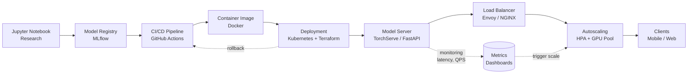

| Difficulty | Channel | Tags |
|---|---|---|
| beginner | devops | mlops, deployment |

In mid-2015, Uber was running machine learning everywhere you looked — ETA prediction, surge pricing, UberEATS delivery times, fraud detection — and yet only about 7 ML workflows had made it into production [1]. Data scientists trained models in R and scikit-learn notebooks, but every single model was productionized as a custom, one-off serving system built by separate engineering teams. There was no standard path from research to runtime. Sound familiar? That bottleneck is the exact story of model serving versus model deployment — two concepts developers constantly confuse, and the difference between a bespoke snowflake and a system that scales.

---

> ### Real-World Case — Uber
>
> In mid-2015, Uber had machine learning all over the business - ETA prediction, surge pricing, UberEATS delivery times, fraud detection - yet had roughly 7 ML workflows in production. Data scientists trained models in R/scikit-learn notebooks, but every model was productionized as a custom, one-off serving system built by separate engineering teams, with no standard path from research to runtime.
>
> | | |
> |---|---|
> | **Challenge** | Uber needed to separate two concerns it was conflating: model deployment (packaging artifacts, CI/CD, infrastructure, monitoring, rollback) and model serving (low-latency runtime inference, request routing, versioning). With models being 'deployed on a case-by-case basis' and no shared training or serving infrastructure, scaling ML across the company was impossible - each new use case meant rebuilding the whole stack. |
> | **Solution** | Uber built Michelangelo, an end-to-end ML-as-a-service platform that cleanly separates the deployment layer from the serving layer. Deployment: models are packaged as ZIP artifacts (metadata, parameters, compiled DSL feature expressions) and pushed through standard CI/CD tooling to clusters, where prediction containers auto-load them - supporting rollback and side-by-side old/new model transitions. Serving: an online prediction service (Java with JNI/C++ scoring) sits behind load balancers, loads multiple models simultaneously, routes requests by model UUID or alias tag for zero-downtime swaps and A/B traffic splitting, and reads precomputed online features from a Cassandra feature store; batch prediction runs as scheduled Spark jobs. Stateless models make horizontal scaling trivial - just add hosts or Spark executors. |
> | **Outcome** | By 2017, Michelangelo was the de-facto ML system at Uber: dozens of teams, deployed across multiple data centers, with P95 online inference latency under 5ms for models not requiring feature store lookups (under 10ms with Cassandra), the highest-traffic models serving over 250,000 predictions per second, and a shared feature store of ~10,000 features. ML use cases scaled from ~7 bespoke systems to over 100+ and eventually 5,000+ production models serving 10M predictions/sec. |
> | **Lesson** | Model serving and model deployment are different engineering problems and conflating them is what blocks ML adoption at scale. Once deployment was standardized via CI/CD pipelines and container auto-loading, Uber could focus serving engineering on what actually matters for the runtime path: sub-5ms latency, model versioning via tags/UUIDs, load-balanced autoscaling, and feature-store reads - enabling A/B tests and instant rollbacks without client code changes. |

---

## Hook — Seven Models, One Nightmare

Picture this: a company with machine learning woven into every corner of its business, yet almost none of it running in production. That was Uber in mid-2015. The ETA that promised riders a five-minute pickup? Machine learning. The surge multiplier that made prices jump at 2am? Machine learning. Fraud detection, UberEATS delivery estimates, driver routing — all powered by models that lived somewhere between a Jupyter notebook and an engineer's best intentions [1].

Here is the uncomfortable truth: only about 7 ML workflows were actually live, and every one of them was a hand-built, one-off serving system. Separate engineering teams, separate codebases, zero shared infrastructure. Researchers trained models in R and scikit-learn; engineers frantically wrapped those models in custom plumbing that worked just well enough to not embarrass anyone.

Why should you care? Because this is not ancient history — it is a snapshot of what teams go through every week at every scale. The fix is not more compute. It is a fundamental rethink of how models travel from research to runtime.

## Problem — The Notebook-to-Runtime Gap

Here is the confusion that quietly breaks pipelines: 'deploy the model' and 'serve the model' sound like the same thing, so most developers treat them as one step. They are not. Deployment is the act of getting a trained model artifact safely into a production environment — CI/CD pipelines, infrastructure provisioning, monitoring, and rollback strategies. Serving is what happens on every single request afterwards: loading the model into memory, routing traffic, handling versioned inference, and returning answers fast enough that users never notice the AI is there at all.

Still fuzzy? Watch the failure modes. A team that believes deployment is the whole job pushes a model out and stops — no request routing, no version pinning, no autoscaling. The model works until traffic spikes, then it melts. A team that only obsesses over serving ships a beautiful inference API with no pipeline behind it, so updating the model means a human manually copying files at 2am. Both teams fail; they just fail in different directions [9].

The stakes are real. Stale features silently degrade predictions. Cold starts make your latency SLA a lie. And every bespoke serving hack you write today becomes the migration you dread next year. Sound familiar? Good — that discomfort is the point. The rest of this post is the way out.

## Real-World Case — Uber's Michelangelo Platform

Two years later, Uber had rewritten the story. The answer was Michelangelo, an ML platform built around a single, non-negotiable idea: one standard path from research to runtime, used by every team [1]. The numbers do the talking better than any architecture diagram:

- P95 online inference latency under 5ms for models that skipped feature store lookups (under 10ms with Cassandra)
- Highest-traffic models handling over 250,000 predictions per second
- A shared feature store of roughly 10,000 features
- ML use cases scaling from ~7 bespoke systems to 100+, then 5,000+ production models serving 10M predictions per second

Here is the plot twist: Uber did not win by inventing better algorithms. The models barely changed. What changed was the plumbing — a standardized training pipeline, a shared model registry, unified serving infrastructure, and a platform where deployment and serving were two clearly separated stages of one machine.

This leads to the insight that matters for your day job: you do not need Uber's budget to steal this idea. The same separation is achievable with open-source tools like Kubernetes, MLflow, and TorchServe, which is exactly what the rest of this article walks through [2][3][5].

## Deep Dive — Deployment vs Serving: The Real Trade-Offs

Now for the core of the matter: what does 'separation of deployment and serving' actually buy you? The simplest answer is different concerns, different trade-offs, different tools.

Deployment is an event. It happens when you ship — containerize the model, push it through CI/CD, provision infrastructure with Terraform or Kubernetes, register the artifact in MLflow or SageMaker, then watch the rollout and roll back if the metrics sour [2][3][8]. Serving is a continuous state. It lives on every request — model loading, request routing, batch orchestration, response optimization — and it lives in tools like TensorFlow Serving, TorchServe, BentoML, FastAPI, and gRPC [4][5][6][7].

| Dimension | Deployment | Serving |
|---|---|---|
| Job | Ship model artifacts safely to prod | Run inference at runtime |
| Tools | Kubernetes, Docker, Terraform, MLflow, SageMaker | TorchServe, TensorFlow Serving, BentoML, FastAPI, gRPC |
| Frequency | Event-driven (every release) | Continuous (every request) |
| Failure cost | Failed rollout | Dropped request or timeout |
| Key metrics | Deploy time, rollback speed | Latency, throughput, availability |

The trade-offs split cleanly along two axes:

**Latency vs throughput.** Real-time systems optimize for the first byte — sub-100ms for interactive features, sub-50ms for the truly snappy ones. Batch systems optimize for volume — process a million rows overnight, where 1s per prediction is perfectly fine. You cannot max both; you choose based on what your product actually promises.

**Batch vs real-time.** Offline scoring lets you queue jobs, amortize compute, and tolerate slow models. Online scoring demands models small enough and engines fast enough to answer inside a user's patience window. Uber chose both, but the real-time path is where the engineering drama lives — and where cold starts murder sleep.

**Cold start is the hidden tax.** Spin up a new pod, and the model must load from disk or the feature store before it can answer. That loading time is latency you do not get to bill anywhere. Autoscaling, pre-warming, and model caching exist because of this one nasty fact [2].

💡 **Insight:** Many developers think GPU allocation is the bottleneck in production. Actually, the bottleneck is usually the model loading path and the request lifecycle around it.

⚠️ **Watch Out:** Horizontal scaling (more pod replicas) fixes throughput; it does not fix cold start latency. Vertical scaling (bigger GPU memory) fixes model size; it does not fix routing inefficiency. Teams routinely fix the wrong axis.

🔥 **Hot Take:** Deployment is the easy half. Kubernetes gives you mature, boring, battle-tested deployment machinery. The genuinely hard engineering lives in the serving layer — versioned routing, autoscaling under load, graceful degradation. Yet most teams spend their budget on the easy half.

🎯 **Key Point:** If you separate the two concerns, you can change one without touching the other. Roll back a bad model without redeploying infrastructure. Scale serving capacity without re-running CI/CD. That freedom is the whole game.

## Workflow — From Notebook to Production in Seven Steps

Building on the deep dive, here is the workflow that turns the theory into a repeatable pipeline. The order matters — each step assumes the previous one is solid.

1. **Register the model.** Push every trained model to a registry (MLflow, SageMaker Model Registry) with a version and a signature [3][8]. No more 'which file is the good one'.
2. **Build a reproducible artifact.** Package the model plus its dependencies into a container with Docker, pinned versions, no surprises [10].
3. **Gate it with CI/CD.** Run validation tests and golden-dataset checks before anything ships. GitHub Actions or Jenkins: same idea, automated.
4. **Deploy the infrastructure.** Provision the cluster with Terraform and Kubernetes — namespaces, resource limits, GPU pools [2].
5. **Serve with a dedicated model server.** Deploy TorchServe, TensorFlow Serving, or BentoML pods behind a load balancer [4][5][6]. This layer owns request routing and versioning.
6. **Route, autoscale, monitor.** Envoy or NGINX split traffic for A/B tests and gradual rollouts. The Horizontal Pod Autoscaler adds replicas as QPS climbs [2]. Dashboards track latency, throughput, and error rate.
7. **Keep the escape hatch.** Blue-green or canary rollouts mean a bad model never takes down the whole service.

The diagram below shows the full journey. Notice where the deployment lane ends and the serving lane begins — that boundary is the separation that makes everything else possible.

## Code Example — A Versioned, Cold-Start-Safe Model Server

Enough theory — here is what a serving layer actually looks like in code. This FastAPI example shows a model server that keeps versioned models hot in memory, routes requests by version (perfect for A/B testing and gradual rollouts), and is trivially deployable as a Kubernetes pod.

```python
from fastapi import FastAPI, HTTPException
from pydantic import BaseModel

import mlflow.pyfunc

app = FastAPI(title="Ride ETA Model Server")

# Model registry: load every version once at startup so
# switching traffic is a routing decision, not a redeploy.
MODEL_REGISTRY = {
    "eta-v1": mlflow.pyfunc.load_model("models:/eta_model/1"),
    "eta-v2": mlflow.pyfunc.load_model("models:/eta_model/2"),
}

class PredictionRequest(BaseModel):
    pickup_lat: float
    pickup_lng: float
    dropoff_lat: float
    dropoff_lng: float
    traffic_scale: float = 1.0

class PredictionResponse(BaseModel):
    eta_seconds: float
    model_version: str

@app.post("/predict/{version}", response_model=PredictionResponse)
async def predict(version: str, request: PredictionRequest):
    """Serve a pinned model version - perfect for A/B testing."""
    if version not in MODEL_REGISTRY:
        raise HTTPException(status_code=404, detail=f"Unknown model: {version}")
    model = MODEL_REGISTRY[version]

    # Build the feature vector the model was trained on.
    features = [[
        request.pickup_lat,
        request.pickup_lng,
        request.dropoff_lat,
        request.dropoff_lng,
        request.traffic_scale,
    ]]
    eta_seconds = float(model.predict(features)[0])

    return PredictionResponse(eta_seconds=eta_seconds, model_version=version)
```

Step by step, this solves the two problems that hurt real systems:

1. **Versioning.** Loading both models at startup means switching traffic between v1 and v2 is a routing decision, not a redeploy. That is the A/B testing superpower: split traffic 90/10 with your load balancer and watch the metrics [7].
2. **Predictable latency.** Models live in memory, so there is no per-request loading cost. That is the cold-start optimization in action — warm pools, no surprises.
3. **A clear contract.** The Pydantic request and response models define the schema in one place, so the serving layer and the client never drift out of sync.

In production, this FastAPI pod sits behind Envoy, which handles traffic splitting and gradual rollouts, while the Horizontal Pod Autoscaler scales replicas from the QPS your monitoring reports [2]. If you need higher throughput at lower latency, the same design translates to a gRPC endpoint with protobuf schemas — the routing and versioning logic does not change [7].

## Lessons Learned — What Uber Taught the Industry

Here is what the Uber story and this workflow add up to — the lessons that survive contact with reality:

- **Deployment and serving are two jobs with two toolchains.** Conflating them is the root cause of most production ML pain [9].
- **The model is not the product; the pipeline is.** Uber's algorithms stayed roughly the same while the platform turned 7 fragile workflows into 5,000+ reliable ones [1].
- **Fix the right axis.** Replicas for throughput, memory for model size, warm pools for cold starts. Diagnosis before scaling [2].
- **Version everything, everywhere.** Models, features, schemas, datasets. 'Which model is live?' should have a one-line answer [3].
- **Plan the exit before you enter.** Every rollout needs a rollback. Canary releases are not a luxury; they are the safety net that keeps the 2am pager quiet.

The battle scars are consistent: teams that skip model registry regret it at the first audit. Teams that skip autoscaling regret it at the first traffic spike. Teams that skip rollback regret it at the first silent model degradation. None of these are exotic failures — they are the standard price of the notebook-to-runtime gap.

If this feels like a lot, you are not alone. Nobody expects you to build Michelangelo in a weekend. Start smaller: register your next model in MLflow, serve it through TorchServe or FastAPI, and add a canary flag. That is the entire pattern in miniature.

---

## Model Deployment to Serving Pipeline



<details>
<summary><strong>Original Interview Question</strong></summary>

**Q:** Explain the key differences between model serving and model deployment in ML systems, including specific technologies, scaling considerations, and real-world implementation patterns?

**A:** Deployment encompasses CI/CD pipelines, infrastructure setup, and monitoring using tools like Kubernetes, MLflow, and SageMaker. Serving focuses on runtime inference APIs with frameworks like TensorFlow Serving, TorchServe, or BentoML, handling request routing, model versioning, and autoscaling. Key trade-offs include latency vs throughput, batch vs real-time inference, and cold start optimization.

</details>

## Conclusion

Uber's journey from 7 bespoke ML workflows to 10 million predictions per second was never about smarter models — it was about building a standard path from research to runtime [1]. The lesson transfers directly to your codebase: separate deployment from serving, version everything, and give every model an escape hatch. Tomorrow, pick one model in your stack and walk it through the seven-step workflow above. That single habit — treating serving as a first-class system instead of a one-off script — is the difference between ML that demos well and ML that survives production.

---

## References

1. [Uber incident report](https://www.uber.com/blog/michelangelo-machine-learning-platform/) — article
2. [Kubernetes Concepts Overview](https://kubernetes.io/docs/concepts/overview/) — documentation
3. [MLflow Documentation](https://mlflow.org/docs/latest/index.html) — documentation
4. [TensorFlow Serving Architecture](https://www.tensorflow.org/tfx/serving/architecture) — documentation
5. [TorchServe (PyTorch Serving)](https://github.com/pytorch/serve) — documentation
6. [BentoML](https://github.com/bentoml/BentoML) — documentation
7. [gRPC Core Concepts](https://grpc.io/docs/what-is-grpc/core-concepts/) — documentation
8. [What is Amazon SageMaker?](https://docs.aws.amazon.com/sagemaker/latest/dg/whatis.html) — documentation
9. [Machine Learning Operations (MLOps)](https://en.wikipedia.org/wiki/Machine_learning_operations) — documentation
10. [Docker Guides](https://docs.docker.com/guides/) — documentation

---

**Author:** Satishkumar Dhule — [GitHub](https://github.com/satishkumar-dhule) · [LinkedIn](https://linkedin.com/in/satishkumar-dhule) · [Website](https://satishkumar-dhule.github.io)
