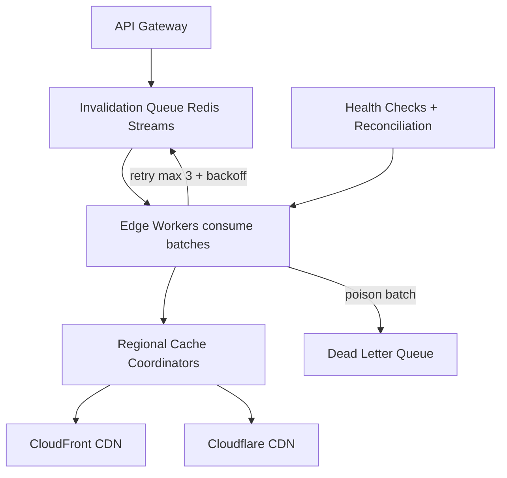

| Difficulty | Channel | Tags |
|---|---|---|
| intermediate | system-design | edge, caching, purging |

In the business of content delivery, speed is the drug and invalidation is the hangover. Fastly built a purging system that pushes a cache-invalidation request from any customer to every cache server across its global network in roughly 150 milliseconds — a feat that kept working even when a firewall misconfiguration tore their network in two [1]. But here is the plot twist: the centralized design that most teams reach for first is exactly the one that would have collapsed. This article walks through how to design a multi-region purge system that hits a 5-second global propagation SLA at 10,000 invalidations per second — without a single point of failure, and with a war story or two along the way.

---

> ### Real-World Case — Fastly
>
> Fastly needed to deliver cache purge (invalidation) requests from any customer to every cache server across its global CDN network almost instantly. They first considered a centralized design where an API drops purges into a central queue that workers fan out to all servers — but realized that system would be a single point of failure that could leave caches stale for extended periods during network outages.
>
> | | |
> |---|---|
> | **Challenge** | How to propagate tens of thousands of cache invalidations per second to hundreds of geographically distributed cache servers while tolerating the network partitions, packet loss, and high latency that regularly occur on the real internet — without a central coordinator. |
> | **Solution** | They built Powderhorn v2, a decentralized system where cache servers propagate purges directly to each other using Bimodal Multicast over UDP gossip — no central queue. Any server that receives a purge broadcasts it to all other servers, so propagation latency is bounded by network delay, not queue processing. The protocol was validated with Jepsen (simulated network partitions, packet loss, high latency) and scaled tests on virtual servers across hundreds of nodes. |
> | **Outcome** | Purges typically reach every cache server in the global network in ~150ms, because inter-POP packet loss rarely exceeds 0.1%. Even under real failures it stayed reliable: during a firewall misconfiguration that caused a network partition, 95th-percentile purge latency rose by two orders of magnitude but purges still completed within ~10 seconds; during a DDoS attack that took a customer network offline for 8 minutes, 100% of purges were recovered with 95th-percentile latency never exceeding one minute. |
> | **Lesson** | For global cache purging, a decentralized gossip/multicast design beats a centralized queue: it eliminates the single point of failure and makes propagation latency proportional to network distance rather than queue depth. Failures are inevitable on a global network, so the design must tolerate partitions and recover every message, not just be fast in the happy path. |

---

## Hook — The 3am Purge You Cannot Send

It is 3am, and your phone is buzzing. The deploy succeeded, the database is consistent, the bug is fixed — but a server on another continent is still cheerfully serving the broken version from a cache you do not control and cannot see. Every caching layer between your origin and your users has turned into a memory palace for the exact response you need to make disappear. This is the moment you learn the uncomfortable truth of content delivery: making content fast is easy, but making it gone — everywhere, at once — is one of the hardest problems in distributed systems [5]. And the stakes are brutal: one stale price, one lingering outage message, one wrong cached response, and user trust evaporates in seconds. Sound familiar?

## Problem — Caching Is Easy; Un-Caching Is the Hard Part

Before designing anything, you need to appreciate why this problem exists at all. HTTP gives you expiration-based caching out of the box — Cache-Control, ETags, TTLs — and for most content, letting time do the cleanup works beautifully [2]. But expiration is a promise about the future, and your users need the present. A deployed hotfix, a revoked image, a corrected product page: none of these care that the cache is 'only' 10 minutes old. This is where invalidation steps in — and where the requirements get genuinely hostile.

Here is the contract your system must keep:
- Propagation under 5 seconds, globally
- 10,000 concurrent invalidations per second
- 99.99% availability on the purge path itself
- Strong consistency: no region serves stale content after the purge completes

A CDN is not one cache; it is thousands — spread across points of presence on five continents [5]. Each one holds a copy of your content. Now multiply that by 10,000 invalidation requests a second, each potentially targeting wildcard patterns, and the phrase 'just delete it from the cache' starts to sound like a punchline. The hard part is not deleting; it is the fan-out.

## Real-World Case — Fastly: The 150-Millisecond Purge

Fastly ran straight into this wall while building its purging system, and the way they avoided it is a masterclass in questioning your first design. Their initial instinct was the architecture most teams reach for: a central API that drops purge requests into a queue, with workers fanning them out to every cache server. Clean. Simple. And, as they quickly realized, a single point of failure — if that central system goes down during a network outage, caches stay stale for extended periods, and every customer feels it [1].

So Fastly flipped the model. Purges are propagated through the network itself, in a decentralized way, reaching every cache server in the global fleet in roughly 150 milliseconds under normal conditions — because inter-POP packet loss rarely exceeds 0.1% [1]. Then reality checked in with two plot twists:

- During a firewall misconfiguration that partitioned the network, 95th-percentile purge latency jumped two orders of magnitude — yet purges still completed within about 10 seconds [1].
- During a DDoS attack that knocked a customer network offline for 8 minutes, 100% of purges were eventually recovered, with 95th-percentile latency never exceeding one minute [1].

The insight that should reframe your thinking: the purge path is not an infrastructure side-quest. It is a correctness guarantee with the same availability bar as the cache itself. If invalidation fails, the entire reason you bought a CDN — serving correct, current content — silently breaks.

## Deep Dive — Centralized vs. Edge-Driven: Choosing Your Weapon

Building on Fastly's lesson, here is how you translate that philosophy into a system you can actually run on commercial CDNs like Cloudflare and CloudFront. You will not be able to build your own propagation protocol, but you can replicate the shape of the solution: decentralized coordination, aggressive fan-out, and a retry story that treats failure as a first-class citizen.

The first design decision is the biggest one, and it is worth putting on paper:

| Option | How it works | The real tradeoff |
| --- | --- | --- |
| Centralized queue | API drops purges into one queue, workers fan out to all edges | Simple to reason about, but a single point of failure that goes stale during outages [1] |
| Edge-coordinated | Queue plus regional coordinators plus edge workers; each region owns its fan-out | More moving parts, but no single region can take the whole system down |

For the queue itself, Redis Streams with consumer groups is a strong fit: it gives you ordered, at-least-once delivery, so if a worker crashes, the batch is still processed by the next consumer [6]. Edge Workers act as the regional coordinators — they pull batches off the stream, translate them into provider API calls, and own retries for their region only. That regional ownership is the trick that keeps a hiccup in, say, Frankfurt from stalling Tokyo.

The next lever is one most people underrate: the batch size. CloudFront lets you include thousands of paths in a single invalidation call, and Cloudflare accepts wildcard-pattern purges [4]. Batching 100 invalidations per API call collapses your API volume by roughly 90% — a number your cloud bill notices. And the wildcards are the real cost killer: one '/shop/*' pattern replaces hundreds of explicit paths [4].

Here is the counterintuitive part, the plot twist that changes how you design the SLA. Your real safety net is not a faster purge; it is a shorter TTL. If dynamic content carries 'Cache-Control: max-age=2, must-revalidate', then even a purge that arrives late only leaves content stale for two seconds [3]. Purge becomes a fail-fast optimization on top of expiration, not the only thing standing between users and stale data [8]. That two-second TTL is what makes a 5-second SLA survivable — the cache is self-healing even when the purge is not [9].

None of this survives contact with reality without failure handling. A circuit breaker that trips after five consecutive failures stops you from hammering an already-degraded provider [7]. A dead letter queue catches the poison batches for manual review instead of losing them. And exponential backoff with jitter keeps 10,000 retrying workers from thundering-herding the API at the same millisecond [7]. The design is not about avoiding failure; it is about making failure boring.

## Workflow — From Origin to Every Edge: The Invalidation Pipeline

With the pieces on the table, the pipeline reads like a well-rehearsed relay race. The diagram below shows the full journey of a purge, from customer API call to every edge node. The pipeline is organized so that no single component can strand the entire planet's caches.

Here is the step-by-step journey:

1. **API Gateway** receives the invalidation request, validates auth, and normalizes the path list — collapsing explicit paths into wildcard patterns where possible.
2. **Enqueue**: the normalized batch is written to the invalidation queue (Redis Streams), where consumer groups own at-least-once delivery [6].
3. **Consume**: Edge Workers pull batches of up to 100 paths, never more, keeping each worker's work bounded and retryable.
4. **Coordinate**: each worker hands off to its regional cache coordinator, which translates the batch into provider-specific API calls.
5. **Fan out**: coordinators call the CDN providers — CloudFront in one region, Cloudflare in another — with pattern-based purges [4].
6. **Retry**: any failed call retries with exponential backoff up to three times; jitter prevents synchronized retry storms [7].
7. **Escalate**: batches that exhaust retries go to the dead letter queue, where they wait for manual review instead of silently vanishing.
8. **Reconcile**: health checks monitor regional purge endpoints; reconciliation sweeps re-send anything that fell through a network partition, accepting eventual consistency during the worst outages [2].

Notice what is not in this pipeline: a single 'boss' queue that every region depends on. Each region can fail, retry, and heal independently — which is precisely the property that kept Fastly's purges completing even when their network split [1].

## Code Example — A Purge With a Safety Net

Every architecture diagram eventually meets the code. Here is the heart of the fan-out, written the way it should actually run: batch, retry, breaker — and never silently drop. The snippet below is the worker that pulls batches off the invalidation queue and drives them into a CDN provider, wrapped in the failure-handling machinery the whole design depends on.

The flow reads top to bottom like a small argument for defensiveness:

- **Batching** — 'BATCH_SIZE = 100' caps the work per API call; Cloudflare and CloudFront both accept wildcard patterns, so '/shop/*' inside a batch is worth hundreds of explicit paths [4].
- **Circuit breaker** — five consecutive failures trip the breaker, and the fast-fail is deliberate: continuing to retry a down provider only queues more damage [7].
- **Exponential backoff with jitter** — 200ms, 400ms, 800ms, each randomized, so thousands of concurrent workers do not synchronize into one retry wave [7].
- **The dead letter queue** — the last-resort 'enqueueDeadLetter' call is the most important line in the function. It converts a lost purge into a traceable, reviewable one, which is exactly the property Fastly needed during their network partition [1].
- **Parallel, not serial** — 'Promise.all' fans batches out concurrently; each one still fails independently, so one bad batch cannot block the queue.

The whole point is that this loop treats the 5-second SLA as an optimization target, not the source of truth. The two-second TTL underneath is what actually protects users [3].

## Lessons Learned — The Cache Never Forgets (Until You Make It Blink)

After walking the full journey — from Fastly's decentralized purge protocol to a batching, backoff-and-breaker implementation — a few lessons survive contact with production:

- **Never centralize the purge path.** One queue for the planet is one outage away from stale-everywhere. Delegate fan-out to regions so each one can fail independently [1].
- **Batching is a superpower.** 100 paths per call collapses API cost by roughly 90%, and wildcard patterns multiply that further [4].
- **TTL is the real SLA.** A 2-second TTL means a slow purge degrades gracefully instead of catastrophically. Treat purge as an accelerator, not a guarantee [3].
- **Make failure boring.** Circuit breakers, dead letter queues, and jittered exponential backoff turn a global catastrophe into a routine retry [7].
- **Assume partitions.** Network splits are not if, they are when — design reconciliation so eventual consistency is a safe end state, not a silent lie [2].

What should you do differently tomorrow? Look at your own invalidations: are they batched? Is there a retry story? Would a network partition strand your cache for minutes? If the answers make you wince, you just found your homework. If this feels overwhelming, you are not alone — but the good news is the pattern above is embarrassingly copyable. The cache may never forget, but with the right pipeline, you will never have to remember it.

---

## Global Cache Invalidation Pipeline

<strong>Original Interview Question</strong>

**Q:** How would you design a multi-region CDN cache purging system that guarantees content propagation within 5 seconds while handling 10,000 concurrent invalidations per second?

**A:** Implement Cloudflare API + AWS CloudFront with distributed invalidation queue, edge compute coordination, and 2-second TTL. Use batch invalidation, exponential backoff, and regional cache headers for 5-second SLA.

## Conclusion

The journey started at 3am with a stale response and a blinking phone, and ended with the quiet miracle Fastly engineers built: purges that traverse the entire planet in roughly 150 milliseconds, and that keep completing even when the network fights back [1]. The moral is deceptively simple — a cache purge is not a delete operation; it is a distributed agreement problem, and the system that wins is the one designed for failure from the first line. Next time you ship a hotfix, you want the same confidence: every edge, everywhere, already agrees the old content is gone. Build the batch. Add the backoff. Trust the TTL. And make your stale cache a memory — literally.

---

## References

1. [Fastly incident report](https://www.fastly.com/blog/building-fast-and-reliable-purging-system) — article
2. [RFC 9111 — HTTP Caching](https://datatracker.ietf.org/doc/html/rfc9111) — documentation
3. [MDN — Cache-Control header](https://developer.mozilla.org/en-US/docs/Web/HTTP/Headers/Cache-Control) — documentation
4. [AWS CloudFront — Invalidating files](https://docs.aws.amazon.com/AmazonCloudFront/latest/DeveloperGuide/Invalidation.html) — documentation
5. [Content delivery network](https://en.wikipedia.org/wiki/Content_delivery_network) — documentation
6. [Redis](https://en.wikipedia.org/wiki/Redis) — documentation
7. [Exponential backoff](https://en.wikipedia.org/wiki/Exponential_backoff) — documentation
8. [MDN — HTTP caching](https://developer.mozilla.org/en-US/docs/Web/HTTP/Caching) — documentation
9. [Understanding Nginx HTTP proxying, load balancing, buffering, and caching](https://www.digitalocean.com/community/tutorials/understanding-nginx-http-proxying-load-balancing-buffering-and-caching) — documentation

---

**Author:** Satishkumar Dhule — [GitHub](https://github.com/satishkumar-dhule) · [LinkedIn](https://linkedin.com/in/satishkumar-dhule) · [Website](https://satishkumar-dhule.github.io)
