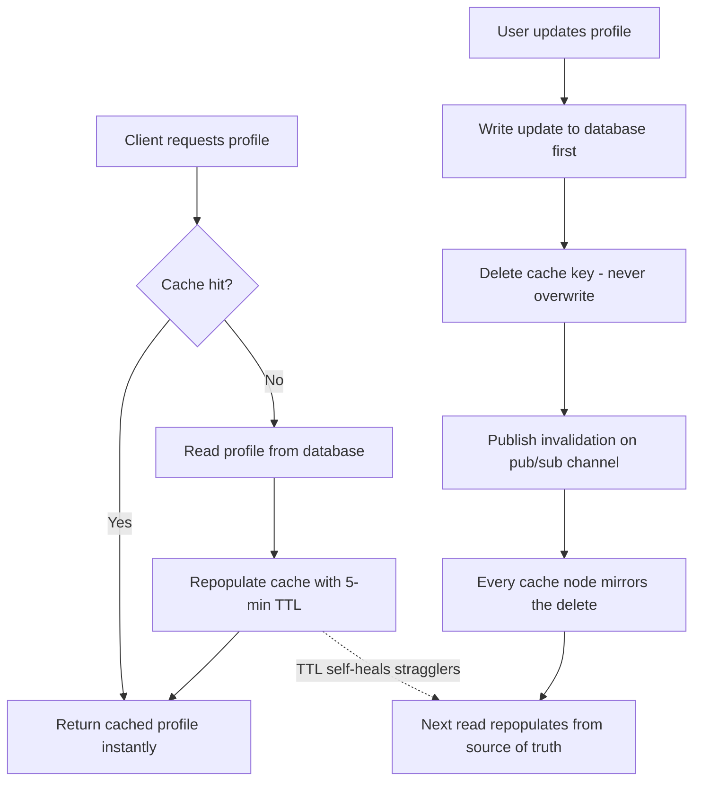

| Difficulty | Channel | Tags |
|---|---|---|
| beginner | backend | redis, memcached, cache-invalidation |

Meta runs some of the largest cache fleets on Earth, and its graph cache TAO alone absorbs more than a quadrillion queries a day — yet a single mishandled cache invalidation can leave stale data sitting in the cache indefinitely, which users experience as data loss [1]. Sound like a problem only a trillion-dollar company faces? Think again. Every developer who adds a cache inherits the same dilemma: the moment you store a copy of data, that copy can go stale. This is the story of why cache invalidation is one of the hardest problems in software — and how you can tame it before it bites you.

---

> ### Real-World Case — Meta (Facebook)
>
> Meta operates some of the largest cache deployments in the world, including TAO (its graph cache) and Memcache, which serve billions of users. TAO alone handles more than one quadrillion queries a day, yet a single mishandled cache invalidation could leave stale data in cache indefinitely, which users experience as data loss. For example, inconsistent TAO replicas once caused messages sent to the same user to be routed to two different storage regions, splitting the user's inbox.
>
> | | |
> |---|---|
> | **Challenge** | Cache invalidation at Meta scale: data in a dynamic cache is mutated on both the read path (cache fills) and the write path (invalidations), creating race conditions that are nearly impossible to reproduce or trace. TAO serves >1 quadrillion queries/day, so even at a 99% hit rate that is >10 trillion cache fills a day — logging every state change would turn a read-heavy cache into an unmanageable write-heavy logging workload, making inconsistency bugs nearly invisible and taking weeks to root-cause. |
> | **Solution** | Meta built two generic systems around the principle that 'an inconsistency only matters if clients can observe it.' Polaris acts as a client to monitor client-observable invariants across all cache replicas, using multi-timescale retries and cache-bypass database checks to eliminate false positives, plus a flag to distinguish transient invalidation lag from permanent inconsistency. They also embedded a stateful consistency-tracing library that logs and traces cache mutations only inside the small race window between a write and its invalidation, reconstructing the exact timeline of every state change that could introduce a bug. On profile-like writes they use versioned invalidation events delivered through their invalidation pipeline rather than relying on TTL alone. |
> | **Outcome** | TAO's cache consistency improved from 99.9999% (six nines) to 99.99999999% (10 nines) of cache writes consistent within five minutes — fewer than 1 in 10 billion writes inconsistent. A 'should be impossible' bug where stale metadata survived at the latest version, triggered by a cache fill racing a tiny transaction window and then an error handler that silently dropped the wrong version, went from weeks of debugging to being found and fixed in under 30 minutes using Polaris alerts plus consistency tracing. |
> | **Lesson** | TTL alone is not cache invalidation; reliable invalidation requires measuring consistency as a first-class metric (with zero false positives), and tracing only the race-prone window between write and invalidation instead of every cache operation. Even at scale, a race between a cache fill and an invalidation can silently poison a cache forever, and the bug often hides in error-handling code rather than the main invalidation path. |

---

## Hook — The Deploy Looked Fine. Then the Avatar Wouldn't Change.

It starts innocently enough. Your profile service is hammering the database with reads, so you add a cache layer and watch p95 latency drop from 80ms to 3ms. Feels great. Then a user changes their display name, and their friend still sees the old one — three hours later. Support tickets pile up: 'I updated my profile but nothing changed.' Sound familiar?

Here is the plot twist you didn't see coming: the cache did exactly what you programmed it to do. The bug was never in the write path or the read path. It lived in the space between them — the moment when a cached copy of a profile outlives the truth in your database. That gap has a name: cache invalidation, and it is the part of caching that keeps senior engineers awake at night [2]. The stakes are higher than a stale avatar, though. Get the ordering wrong at scale, and users don't see an outdated name — they see their data disappear [1].

## Problem — The 2 AM Consistency Nightmare

Here is the core tension: caches exist to serve fast reads, which means they have to hold copies of data. Copies have a life of their own. Whenever the source of truth changes, every copy in every cache on every server must be told about it — and this has to happen before a stale copy gets served. Miss a single node, and you have two versions of the truth fighting each other.

Most engineers reach for one of two default strategies: a TTL (time-to-live) to expire entries, or a read-through/write-through pattern to keep the cache in sync. Both are necessary — neither is sufficient on its own [2]. A TTL alone means every update you ship can be invisible to users for up to the full TTL window. A write-through alone means a single stale replica anywhere in the fleet can keep serving old data forever.

Consider the real failure modes. If you update the cache in-place, a slow or failing write leaves the old value sitting in place. If you update the cache before the database, a crashed write means your cache now holds data that was never persisted — the worst kind of lie. If you delete the key on every node except one, that one node becomes a time bomb. This is why 'just add a cache' is never the end of the story.

## Real-World Case — Meta's TAO: When Stale Data Reads as Data Loss

Meta doesn't just dabble in caching; it runs two of the largest cache systems ever built — Memcache for its web tiers and TAO, a distributed graph cache that answers more than one quadrillion queries a day [1]. At that scale, the 'unlikely' edge cases become routine. Engineers at Meta traced a baffling production bug to inconsistent TAO replicas: a message sent to a user was routed to two different storage regions, and the user's inbox was physically split in two [1]. From the user's perspective, their messages had vanished. From the cache's perspective, everything was fine.

Here is what makes the Meta story instructive rather than just impressive. Meta publicly documented that TAO's consistency improved from 99.9999% (six nines) to 99.99999999% (ten nines) of cache writes consistent within five minutes — fewer than 1 in 10 billion writes inconsistent [1]. And when a 'should be impossible' bug appeared — a cache fill racing a tiny transaction window, with an error handler silently dropping the wrong version — it took weeks of debugging before consistency tracing and Polaris alerts made it fixable in under 30 minutes [1].

The lesson hiding inside those numbers: at scale, consistency is a debugging tool, not just a correctness goal. When a team can't trace a stale value back to the exact fill, update, and invalidation that produced it, they're debugging blind. That tracing ability — not the cache itself — is the real infrastructure.

## Deep Dive — Write-Through, Deletes, TTLs, and the Redis vs Memcached Showdown

The interview-friendly answer is write-through caching with TTL-based expiration: on update, write to the database and delete the cache key; on read, fall back to the database on a miss and repopulate the cache with a TTL (5–30 minutes works well for profile data) [8]. But the interview glosses over the interesting parts. Time to unpack them.

First, the plot twist: delete keys, do not update them. Overwriting a cache value looks cleaner, but it creates a race — a slow stale write from one server can land after your fresh write and resurrect the old value. Deleting the key sidesteps this entirely: whoever repopulates the cache next reads the current database, so there is never a 'wrong version' sitting in the slot [2]. TTLs are the safety net, not the strategy — they guarantee that even a botched invalidation heals itself.

Second, the database must be written first. Ordering matters enormously: DB write, then cache invalidation. Write the cache first, and a crash between the two leaves your cache ahead of your database — cached data that never existed in the source of truth. That is exactly how the 'should be impossible' bugs get born [1].

Now for the storage engine debate [3][4]:

| Trade-off | Redis | Memcached |
|---|---|---|
| Distributed invalidation | Pub/sub channels for automatic fan-out | Manual coordination across nodes |
| Persistence | Yes (RDB/AOF) | No — restart means cold cache |
| Data structures | Strings, hashes, sorted sets, streams | Simple key-value only |
| Memory overhead | Higher | Lower and more predictable |
| Best for | Complex invalidation patterns, durability | Pure caching at minimal cost |

Here is the nuance most interview answers miss: Redis isn't 'better', it's differently armed. For a profile service where one user's update must invalidate copies across a fleet of app servers, the pub/sub channel turns a coordination problem into a one-liner — publish and move on [3]. Memcached is faster at pure get/set and eats less RAM, but every node must be told to invalidate by some external mechanism, which means you're writing that coordination yourself [4]. If invalidation complexity is your bottleneck, Redis earns its weight. If you're cache-aside-ing a single service that can afford short-lived stale reads, Memcached is leaner and cheaper [6].

## Workflow — Invalidating a Profile Update Without Dropping the Ball

Here is the end-to-end flow, from a user clicking 'Save' to every copy of the profile being consistent again. Figure 1 below maps the whole journey.

1. Read path (cache-aside): check the cache first. On a hit, return the profile instantly. On a miss, read the database, populate the cache with a 5-minute TTL, and return. Every miss is a paid database round trip, so your cache hit rate is your health metric [8].
2. Write path (write-through): the update hits the database first — the source of truth. Only after the DB commit succeeds do you touch the cache.
3. Invalidate, don't update: delete the key rather than overwriting it. A deleted key forces the next reader to pull fresh data, closing the race window where stale writes can land after fresh ones [2].
4. Fan out across the fleet: with Redis, publish a message on a pub/sub channel; every app server subscribes and mirrors the delete locally [3]. This is the step Memcached makes you hand-roll.
5. Let the TTL sweep up stragglers: any node that missed the invalidation message — a network blip, a restart — self-heals within the TTL window. The TTL is your insurance policy [7].
6. Monitor relentlessly: track cache hit rate, invalidation lag, and errors around the pub/sub pipeline. You can't fix what you can't measure — Meta's Polaris alerts and consistency tracing are precisely what turned a weeks-long bug hunt into a 30-minute fix [1].

Building on those steps, the Mermaid flow below (Figure 1: Cache Invalidation Flow) shows how a single update ripples through the read and write paths until every node is telling the same story. The beauty of this design is its asymmetry: reads are fast and optimistic, writes pay a little more, and the delete guarantees that wrong data never lingers.

## Code Example — Write-Through Invalidation with Redis in Python

Time to make it concrete. This is a minimal but production-shaped version of the pattern using redis-py and the official Redis client [5]. It implements cache-aside reads, write-through updates with delete-on-invalidate, and a pub/sub channel so the whole fleet can react to one user's update.

See the code block below, then the walkthrough:

- The read path uses a single `client.get` call — one network round trip on a hit. On a miss it queries the database and repopulates the key with a 5-minute TTL using `setex`, so even a failed invalidation eventually heals itself.
- The write path orders operations deliberately: database first, then `delete`, then `publish`. Deleting instead of overwriting means no stale value can ever race back into the slot after a fresh write.
- The subscriber mirrors deletes on every app node. In-process caches like `functools.lru_cache` sidestep all of this because there is only one owner of the data [9]; the moment a cache is shared across servers, invalidation becomes a distributed problem, and that is exactly the problem pub/sub is solving here.

If you're tempted to skip all of this and rely on TTLs alone, it might work for a day. Then a user complains that their profile changes take five minutes to appear, and the team is back to building the delete path anyway. Might as well start there.

## Lessons Learned — What a Trillion-Dollar Cache Fleet Taught Everyone

After walking the full journey — from a stale avatar to Meta's ten nines — here is what to carry back to your codebase [1][2][8]:

- TTLs are safety nets, not strategies. They bound the damage; they don't prevent it. Set 5–30 minutes for profiles and treat expiry as the backstop, not the plan.
- Delete, don't overwrite. In-place updates create write-after-write races that resurrect stale values. A delete forces the next read to fetch truth.
- Database first, cache second. Persist before you invalidate. Any other ordering risks serving data that never actually existed in the source of truth.
- Pub/sub turns distributed invalidation into a one-liner in Redis; in Memcached you write that coordination yourself. Choose based on your invalidation complexity, not just memory cost [3][4].
- Traceability is the killer feature. Meta's 30-minute fix came from visibility — Polaris alerts and consistency tracing — not from luck [1]. Wire up the equivalent for your own caches before you need it.
- Start simple. Write-through + TTL + delete-on-update handles most services. Introduce pub/sub fan-out only when multiple nodes genuinely share the cache.

Here is the battle scar most teams hit: they add monitoring for latency but not for correctness — hit rates, yes; stale-served-after-update, rarely. That blind spot is where the weeks-long debugging sessions live.

The fastest cache in the world is just a faster way to serve the wrong data. The good news? A delete, an ordering rule, and a TTL make 'wrong' almost impossible.

---

## Cache Invalidation Flow

<strong>Original Interview Question</strong>

**Q:** You're building a user profile service that caches frequently accessed profiles. How would you implement cache invalidation when a user updates their profile, and what trade-offs would you consider between Redis and Memcached?

**A:** Implement write-through caching with TTL-based expiration. On profile update, invalidate the cache by deleting the key and writing new data to both the database and cache. Redis offers pub/sub for automatic distributed invalidation, while Memcached requires manual coordination across nodes.

## Conclusion

Meta moved TAO from six nines to ten nines of consistent writes not by inventing exotic machinery, but by treating invalidation as a first-class system concern: delete on update, TTLs as the backstop, and visibility everywhere [1]. Your profile service can do the same thing in a few dozen lines of code. Tomorrow, draw the three paths — read, write, invalidate — and write a test that proves a stale value can never be served after an update. That one test is the difference between a cache that helps you and a cache that haunts you. And when a teammate asks why you delete instead of overwrite, you can tell them the story of the trillion-query cache and the inbox that split in two.

---

## References

1. [Meta (Facebook) incident report](https://engineering.fb.com/2022/06/08/core-infra/cache-made-consistent/) — article
2. [Cache invalidation - Wikipedia](https://en.wikipedia.org/wiki/Cache_invalidation) — documentation
3. [Redis - Wikipedia](https://en.wikipedia.org/wiki/Redis) — documentation
4. [Memcached - Wikipedia](https://en.wikipedia.org/wiki/Memcached) — documentation
5. [redis/redis - GitHub](https://github.com/redis/redis) — documentation
6. [memcached/memcached - GitHub](https://github.com/memcached/memcached) — documentation
7. [RFC 9111 - HTTP Caching](https://datatracker.ietf.org/doc/html/rfc9111) — documentation
8. [AWS ElastiCache - Cache strategies](https://docs.aws.amazon.com/AmazonElastiCache/latest/red-ug/CacheStrategies.html) — documentation
9. [Python functools.lru_cache documentation](https://docs.python.org/3/library/functools.html) — documentation

---

**Author:** Satishkumar Dhule — [GitHub](https://github.com/satishkumar-dhule) · [LinkedIn](https://linkedin.com/in/satishkumar-dhule) · [Website](https://satishkumar-dhule.github.io)
