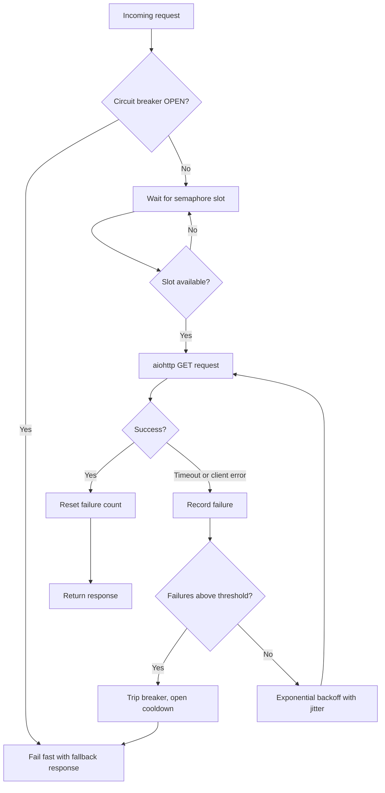

| Difficulty | Channel | Tags |
|---|---|---|
| advanced | backend | asyncio, aiohttp, concurrency |

Every day, Netflix's API absorbs over 1 billion incoming calls that fan out into several billion outgoing dependency requests — and a single slow backend once had the power to exhaust every Tomcat thread and take the entire platform down [1]. When Netflix accidentally skipped its cache and got throttled by the database, circuit breakers tripped on 157 of 200 server instances, which quietly served fallback responses from a local query cache and kept member video views rolling with minimal impact [1]. That story is not really about Netflix — it is about your service. A single slow upstream in your aiohttp app can do the same thing to your event loop, and this post walks through the semaphore, backoff, and circuit-breaker playbook that keeps systems standing when their dependencies are not.

---

> ### Real-World Case — Netflix
>
> Netflix's API brokers between internal services and hundreds of device types, receiving over 1 billion incoming calls per day that fan out to several billion outgoing calls (a 1:6 ratio) with peaks over 100k dependency requests per second. In a service-oriented architecture with dozens of dependencies, a single slow or failing backend could rapidly saturate all Tomcat request threads and take the entire API down.
>
> | | |
> |---|---|
> | **Challenge** | Prevent cascade failures: any dependency becoming latent (slow but not down) is worse than outright failure, because blocked request threads saturate quickly (seconds or sub-seconds) and take down the whole API. With 30 dependencies each at 99.99% uptime, aggregate uptime drops to 99.7% — over 2 hours of downtime per month. Latency piles up queues and threads, whereas failures naturally 'fail fast' and shed load. |
> | **Solution** | Netflix built a resilience layer (which became Hystrix) combining exactly the mechanisms in this answer: aggressive network timeouts with retries, per-dependency isolation via thread pools and semaphores (tryAcquire, not blocking), and circuit breakers that trip at a threshold (e.g. 50% error rate over a 10-second rolling window), then short-circuit requests to failing services until health checks succeed. Failed calls route through fallbacks (custom fallback, fail-silent, or fail-fast) so users get a degraded but working experience instead of a dead API. |
> | **Outcome** | Circuit breaker isolation and graceful degradation became a default requirement for Netflix services. During a real incident where Netflix accidentally bypassed a cache and got throttled by the database, the circuit breaker tripped on 157 of 200 server instances and served fallback responses from a local query cache — with minimal impact on member video views. Today tens of billions of thread-isolated and hundreds of billions of semaphore-isolated calls execute through Hystrix daily, with what Netflix describes as 'a dramatic improvement in uptime and resilience.' |
> | **Lesson** | In distributed systems, failing fast and shedding load beats trying harder: deliberately rejecting or short-circuiting requests to an unhealthy dependency keeps your request threads free to serve healthy dependencies and enables rapid recovery once the dependency heals. Latency is the silent killer — it blocks threads that would otherwise be freed by an immediate failure, so timeouts, isolation, and backpressure are not optional. |

---

## Hook — 1 Billion Calls a Day and One Slow Dependency From Disaster

Picture this: it is 2:37 AM, the pager goes off, and a ticket appears that reads "API latency at 47 seconds." You open the dashboard and watch a single yellow line — one dependency you have not thought about in months — climb past its red threshold. Behind that line, an entire chain is buckling: requests pile up, sockets leak, and every naive retry you added last sprint is now multiplying the damage instead of fixing it. This is the story of how that failure mode nearly took down one of the busiest APIs on Earth — and how three small, unglamorous patterns (a semaphore, some backoff, and a circuit breaker) turned it into a solved problem. By the time you finish this post, you will know exactly how to keep your aiohttp service standing when its upstreams are not.

## Problem — Async Doesn't Automatically Make You Resilient

Here is the uncomfortable truth many developers discover too late: async does not make you resilient, it just makes you fail at scale. With aiohttp, your code can juggle thousands of concurrent requests on a single event loop — which is exactly why you chose it. But that concurrency is a budget, and budgets get spent. When one slow upstream holds its response for 60 seconds, every connection slot in your pool stays parked on that same dependency. New requests arrive, find no free slots, and wait. The queue grows, timeouts stack, and your event loop starts breathing heavily under the weight of work it can no longer shed.

Sound familiar? You have probably seen the output: memory creeping upward, latency curves turning vertical, and a support channel full of screenshots from an API that used to respond in milliseconds. The danger is not the slow dependency — it is the absence of a plan for what happens when one appears. Without a cap on concurrency, a strategy for retrying, and a way to stop hammering a service that is already on its knees, every client becomes the cause of the next outage.

## Real-World Case — Netflix

The definitive lesson comes from Netflix, whose API is the connective tissue between internal services and hundreds of device types. Every day it absorbs over 1 billion incoming calls that fan out into several billion outgoing dependency requests — a 1:6 ratio — with peaks above 100,000 dependency requests per second [1]. In that world, one slow backend was not an inconvenience; it was an extinction event. With dozens of dependencies in play, a single sluggish service could rapidly saturate every Tomcat request thread and take the entire API down [1].

So Netflix built the patterns this post is about, then watched them save the day in real time. In a documented incident, Netflix accidentally bypassed a cache and got throttled by the database. Circuit breakers tripped on 157 of 200 server instances, and those instances served fallback responses from a local query cache instead of failing — with minimal impact on member video views [1]. The numbers since then are staggering: tens of billions of thread-isolated and hundreds of billions of semaphore-isolated calls now flow through Netflix's Hystrix library daily, and the company credits it with "a dramatic improvement in uptime and resilience" [1][2].

Notice the plot twist: Netflix does not run all those calls on threads anymore. The semaphore — the same primitive you will use in your aiohttp pool — is doing most of the heavy lifting, and it is the isolation strategy this article is built around [2].

## Deep Dive — Semaphores, Breakers, and the Art of Failing Fast

Building on Netflix's playbook, the architecture for a gracefully degrading aiohttp pool rests on four principles, and each one answers a specific failure mode. The semaphore sets a hard ceiling on concurrent in-flight requests, turning your connection pool into a finite budget you can actually reason about [5]. The circuit breaker introduces the fail-fast philosophy: once a dependency trips, you stop visiting it entirely for a cooldown window, serving cached or degraded responses instead [3][7]. Exponential backoff with jitter keeps retries honest — a retry storm amplifies outages, so delays that grow 0.5s, 1s, 2s, plus a little randomness, give a struggling service room to breathe [6]. Health checks and cleanup complete the loop by pruning dead sockets and closing sessions on shutdown, and connection keepalive lets the pool reuse established sockets instead of paying the three-way handshake on every call [4][8].

The real trade-off lives in a decision table:

| Strategy | What it does | When it shines | The cost |
|---|---|---|---|
| Retry forever | Keeps hammering until success | One-off transient blips | Turns a 5-minute blip into a 5-hour outage |
| Fixed retries + backoff | Bounded retries with growing delay | Most production workloads | Needs jitter, or you create thundering herds |
| Fail fast (breaker open) | Returns fallback immediately | Persistent outages | You must actually build the fallback |

Most teams under-invest in the third row, and it shows. The hardest part of a circuit breaker is not tripping it — it is the half-open state that decides when to let traffic back through and probe for recovery [3]. Martin Fowler's canonical write-up makes the same point: the breaker exists to fail fast so the system degrades gracefully instead of collapsing [10]. Notice, too, what this design deliberately sacrifices: throughput during an outage. That is the point. Graceful degradation means surviving at reduced capacity, not pretending nothing is wrong.

## Workflow — The Request's Journey from Arrival to Recovery

With the theory in place, here is the step-by-step workflow that turns those principles into a running system. This is the exact journey your request takes, and it is what the diagram below maps out:

1. **Budget your concurrency** — create a semaphore sized from measured capacity, not from hope [5].
2. **Check the breaker** — if the dependency is open, fail fast with a fallback instead of adding to the queue [3].
3. **Acquire a slot** — requests wait politely at the semaphore until the pool has room.
4. **Send with a hard timeout** — never a request without a deadline; the event loop cannot cut ties with a ghost [9].
5. **Reward success** — reset the failure counter; health is sticky when it has been earned.
6. **Punish failure** — record it, and when the threshold breaks, open the circuit for a cooldown window [7].
7. **Back off and retry** — bounded attempts, exponential delay, plus jitter to break synchronization [6].
8. **Heal** — half-open probes test the waters, and a shutdown hook closes the session so nothing leaks [4].

The diagram below shows the whole loop — notice that the two "escape hatches" (fail fast and the fallback response) are what make the system graceful rather than fragile.

## Code Example — A Production-Grade ConnectionPoolManager

Now the pattern takes shape in code. This implementation is built to be dropped into a real service: it caps concurrency with a semaphore, enforces a hard timeout on every request, tracks health in a three-state circuit breaker, and retries with exponential backoff plus jitter. You can read the full walkthrough in the explanation below the snippet.

## Lessons Learned — Battle Scars and What to Do Differently Tomorrow

After watching production pools struggle, here is the short list of scars worth avoiding. Connection leaks are the silent killer — a session you never close is a socket that haunts your process until it dies [4]. SSL context validation is not optional; skipping it trades a security hole for a few microseconds of speed. Timeouts are a system, not a single number — you want connect, read, and total budgets configured separately, and per-request asyncio.timeout() wrappers give you surgical control [9]. Error propagation matters: swallow an exception inside your pool and the outage becomes invisible; propagate it naively and one bad dependency takes down every caller. The pattern that works: isolate failures, degrade loudly, and always leave a trace.

The actionable next steps, in order: 1) Measure your real concurrency ceiling with load tests before picking a semaphore size. 2) Implement the three-state breaker — closed, open, half-open — before your next incident, not after [3]. 3) Add jitter to every backoff; synchronized retries are a thundering herd in disguise [6]. 4) Make fallback responses a first-class citizen, not a TODO [7]. 5) Close your session on shutdown, in production, always [4].

---

## Graceful Degradation Request Flow

<strong>Original Interview Question</strong>

**Q:** How would you implement a connection pool manager for aiohttp that handles graceful degradation under high load and connection timeouts?

**A:** Implement a connection pool manager for aiohttp using a semaphore to limit concurrent connections, exponential backoff for retrying failed requests, and circuit breaker pattern to gracefully degrade under high load and connection timeouts.

## Conclusion

This journey started with Netflix staring down a billion-call flood and ended with your aiohttp pool doing the same work with three unglamorous tools: a semaphore that budgets, a breaker that admits defeat early, and a backoff that knows when to wait [1]. Resilience is not about never failing — it is about failing small, failing loudly, and recovering fast. The memorable insight to take back to your team: every retry you add without a circuit breaker is a vote for your own outage. Tomorrow, start with one dependency, one semaphore, and one breaker — and let the fallback responses prove their worth under real load.

---

## References

1. [Netflix incident report](https://netflixtechblog.com/fault-tolerance-in-a-high-volume-distributed-system-91ab4faae74a) — article
2. [Netflix/Hystrix — latency and fault tolerance library](https://github.com/Netflix/Hystrix) — documentation
3. [Circuit breaker design pattern — Wikipedia](https://en.wikipedia.org/wiki/Circuit_breaker_design_pattern) — documentation
4. [aiohttp — asynchronous HTTP client/server for asyncio](https://docs.aiohttp.org/en/stable/) — documentation
5. [asyncio synchronization primitives — Python docs](https://docs.python.org/3/library/asyncio-sync.html) — documentation
6. [Error retries and exponential backoff in AWS](https://docs.aws.amazon.com/general/latest/gr/api-retries.html) — documentation
7. [Circuit breaker pattern — Azure Architecture Center](https://learn.microsoft.com/en-us/azure/architecture/patterns/circuit-breaker) — documentation
8. [HTTP connection management in HTTP/1.x — MDN](https://developer.mozilla.org/en-US/docs/Web/HTTP/Connection_management_in_HTTP_1.x) — documentation
9. [Coroutines and Tasks (asyncio.timeout) — Python docs](https://docs.python.org/3/library/asyncio-task.html) — documentation
10. [CircuitBreaker — Martin Fowler](https://martinfowler.com/bliki/CircuitBreaker.html) — blog

---

**Author:** Satishkumar Dhule — [GitHub](https://github.com/satishkumar-dhule) · [LinkedIn](https://linkedin.com/in/satishkumar-dhule) · [Website](https://satishkumar-dhule.github.io)
