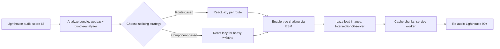

| Difficulty | Channel | Tags |
|---|---|---|
| intermediate | frontend | lighthouse, bundle, lazy-loading |

Twitter's web team faced a quiet catastrophe: their mobile app shipped several megabytes of JavaScript and took over five seconds just to fetch the main bundle — a fatal friction for users stuck on 2G and 3G networks in emerging markets [1]. Their response was Twitter Lite, a React Progressive Web App engineered to hit a Time to Interactive under five seconds on simulated 3G, and the numbers that followed read like a growth marketer's fantasy: 75 percent faster repeat loads and a 65 percent jump in pages per session [1]. That same discipline is what your own project needs. Consider your situation: a 2.1MB bundle, a 4.2-second Time to Interactive, and a Lighthouse score sitting at 65 — with a target of 90+. This is the story of how to close that gap.

---

> ### Real-World Case — Twitter
>
> Twitter's web team needed to reach users on 2G/3G networks in emerging markets, where their existing mobile web app loaded several megabytes of JavaScript and took over 5 seconds just to fetch the main bundle. They rebuilt it as Twitter Lite, a React Progressive Web App, targeting a Lighthouse-measured Time to Interactive of under 5 seconds on 3G.
>
> | | |
> |---|---|
> | **Challenge** | The original webpack setup produced just 3 monolithic JS files totaling over 1MB (420KB gzipped) due to CommonsChunkPlugin fighting with circular dependencies, forcing mobile users to download and parse the entire app before the HomeTimeline could render — a huge bottleneck for Time to Interactive on low-end devices and slow networks. |
> | **Solution** | They implemented route-based code splitting, breaking the app into ~40 on-demand lazy-loaded chunks (using CommonsChunkPlugin, then SplitChunksPlugin) so the initial load only shipped code for the visible screen. They applied the PRPL pattern with a service worker that pre-caches assets, deferred service worker registration to avoid blocking critical requests, optimized React rendering with shouldComponentUpdate, moved heavy work from componentWillMount to componentDidMount, and shipped modern/legacy split bundles to drop parsing time. |
> | **Outcome** | Main bundle load time dropped from ~5s to ~3s on simulated 3G; service worker caching cut repeat page loads from ~6s to ~1.5s (a 75% improvement); the 99th percentile time-to-interactive latency fell 50%; logged-in users saw a 30% average load-time reduction; and engagement soared — a 65% increase in pages per session and 75% increase in tweets sent, while cutting data usage. |
> | **Lesson** | A single large bundle is the enemy of mobile performance, and code splitting isn't just about file size — combining route-based lazy loading with service worker pre-caching lets you cut TTI dramatically (nearly halved per Lighthouse) because the browser only downloads, parses, and executes what the current view needs. |

---

## Hook — The Five-Second Load That Decides Your User's Fate

Imagine a user tapping a link to your app on a bargain Android phone, one bar of signal, the icon flickering between E and 3G. Five seconds crawl by and the browser is still downloading JavaScript before a single pixel has rendered. That user does not wait around, and the industry has known for years that slower loads bleed engagement. You might be tempted to wave this off as a hosting problem or an 'infra issue,' but the JavaScript that makes up a 2.1MB bundle is executed on the user's device, line by line, and every kilobyte you ship is a tax on their battery, their data plan, and their patience. Here is the uncomfortable part: the same teams that agonize over a 200-millisecond API call will ship a bundle that takes four seconds to parse without a second thought. Sound familiar? 🎯 Key Point: A Lighthouse score of 65 is not a design opinion — it is the report card your users' real-world devices just handed you.

## Problem — When 2.1MB of JavaScript Becomes a Business Liability

Every project starts lean. The first release ships a tidy bundle, then someone adds a date-picker, then a charting library, then analytics, then a 'tiny' utility that pulls in three indirect dependencies. Before you know it, the entry bundle has ballooned to 2.1MB and Time to Interactive — the moment when the page actually responds to user input — has crept past four seconds [8]. The 65 Lighthouse score is the visible symptom; the real disease is architectural: everything is shipped to everyone on every load, whether or not it is used [4]. You might assume minification and default tree shaking are quietly handling the mess. They help, but only up to a point. Therefore, the real question is not 'how do I make Lighthouse happy' but 'how do I stop shipping code nobody asked for yet.' ⚠️ Watch Out: Lighthouse runs on a simulated device; a 90 on your laptop can still be a 45 on a mid-range phone. Optimize for the real fleet, not the benchmark.

## Real-World Case — Twitter

This is precisely the wall Twitter hit in the mid-2010s. Their mobile web app loaded several megabytes of JavaScript and took over five seconds just to fetch the main bundle — a non-starter for the 2G and 3G users they wanted to reach in emerging markets [1]. So the team did something radical: they rebuilt the product as Twitter Lite, a React Progressive Web App with a hard engineering target of a Lighthouse-measured Time to Interactive under five seconds on simulated 3G [1]. The results read like a growth marketer's wish list. Main-bundle load time fell from about five seconds to about three on simulated 3G; service worker caching slashed repeat page loads from six seconds to 1.5 — a 75 percent improvement — and the 99th percentile time-to-interactive latency dropped by half [1][9]. Logged-in users saw a 30 percent average load-time reduction, and engagement exploded: 65 percent more pages per session and 75 percent more tweets sent, all while cutting data usage [1]. Here is the plot twist: the breakthrough was not a faster server or a magic CDN. It was the discipline of shipping less — and building a loading strategy around what users actually need at any given moment. So how, exactly, does that translate to your 2.1MB bundle?

## Deep Dive — Code Splitting, Tree Shaking, and the Art of Shipping Less

Any serious optimization campaign starts with a measurement you can trust. Point webpack-bundle-analyzer at your build and the visualization will show you exactly which packages are eating your budget [6]. Nine times out of ten, the biggest offenders are a handful of libraries — a charting suite, a date library, a form library — and, all too often, the same library bundled twice with two different versions. 🔥 Hot Take: The highest-ROI performance work is rarely clever; it is deletion. Removing a dependency you do not truly need beats splitting one you do. Once the dead weight is gone, the real art begins: code splitting. The idea is almost embarrassingly simple — do not load what you do not need yet [4]. React supports this natively with React.lazy() and Suspense, which defer component loading until render time [2]. You get to choose the granularity, and the choice matters:

| Strategy | Best for | Real trade-off |
|---|---|---|
| Route-based splitting | Every page of an SPA | Great default; each route loads its own chunk, but a weak fallback makes navigation feel flashy |
| Component-based splitting | Heavy widgets — charts, editors, maps | Fine-grained control, yet over-splitting creates a waterfall of tiny requests |

Consequently, most teams ship route-based splitting first and reach for component-level splitting only for genuinely heavy interactive pieces. There is a catch hiding in plain sight, though: tree shaking only works if your code is written as ES modules. Bundlers can statically analyze import statements and drop unused exports, but CommonJS require() calls are dynamic, which is why that legacy module in node_modules is immune to your best intentions [3]. Switching to a modern ESM-first toolchain is what unlocks the full payoff. Building on that, the same mindset extends past JavaScript. Images are often the largest bytes on the page, and lazy-loading them with the IntersectionObserver API only when they scroll into view is a classic double win for data and parse time [10]. Finally, once the app is lean, a service worker can cache those hashed chunks so repeat visits feel instantaneous — the exact lever that gave Twitter its 75 percent repeat-load win [9].

## Workflow — Your 7-Step Roadmap From 65 to 90+

Here is a battle-tested sequence that takes a project from 65 to 90+ without guesswork. The Mermaid diagram below — the Bundle Optimization Pipeline — shows the loop at a glance; the steps are the map:

1. Baseline it. Run Lighthouse before touching anything and record the score, bundle size, and TTI [7]. This is your before-picture; you will need it for the after.
2. Dissect the bundle. Generate the analyzer report and list your top ten chunks by size [6]. Circle anything you did not know was in there.
3. Delete before you split. Remove dead dependencies, deduplicate versions, and swap heavy libraries for lighter or native alternatives.
4. Enable tree shaking. Verify that your build emits ES modules and that your bundler configuration has optimization flags such as sideEffects tuned correctly [3].
5. Split by route, then by widget. Wrap route components in React.lazy() and Suspense, then split heavy widgets separately once the routes are lean [2].
6. Lazy-load everything non-critical. Images below the fold, off-screen modals, and low-priority analytics all become dynamic [10].
7. Cache and verify. Register a service worker for the hashed chunks, then re-run Lighthouse and compare against your baseline [9][7].

Each step closes the gap, and every step is independently verifiable — which means no more 'trust me, it is faster' debates. When the numbers move, you know exactly which change moved them. Once the workflow clicks, the implementation almost writes itself — which brings us to the code.

## Code Example — Lazy Loading Without Breaking Your App

The code below is a production-shaped pattern, not a toy. It routes lazy-loaded pages through Suspense, isolates the heaviest shared widget behind its own named chunk, and wraps that widget in an error boundary so a failed network fetch degrades gracefully instead of blanking the screen. The React.lazy() calls are the story here: each one returns a promise that the bundler turns into a separate chunk, fetched only when the route or component actually renders [2]. The webpackChunkName comment keeps the generated filename readable in devtools and in the bundle analyzer. The error boundary matters more than most developers think: when a deploy happens mid-session, users hold stale chunks in their cache, and the fetch can 404 — without a boundary, that is a white screen. With one, it is a reload button. Suspense gives you the fallback for free, so the user sees a spinner instead of a blank tab.

## Lessons Learned — Battle Scars From the Performance Trenches

If this all feels like a lot, you are not alone — performance work is 80 percent measurement and 20 percent heroics. The patterns that actually move Lighthouse scores are boring in the best way: analyze, delete, split, lazy-load, cache, re-measure. A few battle scars worth carrying with you: do not split so aggressively that you create a waterfall of small requests — a handful of well-planned chunks beats forty fragments; always pair React.lazy() with an error boundary, because deploy races are real; and remember that tree shaking is a lie for CommonJS dependencies, so audit node_modules for legacy modules [3]. Many developers discover that the single biggest number on the analyzer report was a library the product team had already stopped using — one delete that was worth more than a week of micro-optimizations. The memorable insight to carry into your next retro: Measure first, delete second, split third. Ship the smallest thing that can possibly work, then make the rest lazy.

---

## Bundle Optimization Pipeline

<strong>Original Interview Question</strong>

**Q:** You're tasked with improving a React app's Lighthouse performance score from 65 to 90+. The bundle size is 2.1MB and Time to Interactive is 4.2s. What specific steps would you take to optimize the bundle and implement lazy loading?

**A:** Implement code splitting with React.lazy() and Suspense, analyze bundle composition with webpack-bundle-analyzer to identify largest chunks, remove unused dependencies and optimize imports, add dynamic imports for heavy components and third-party libraries, implement route-based splitting for better initial load times, and utilize tree shaking with proper ES module configuration.

## Conclusion

Twitter Lite did not win because the team found a faster server; it won because they refused to ship bytes nobody had asked for yet, and then made everything else lazy [1]. Your 2.1MB bundle and 4.2-second TTI are exactly the same story waiting to be rewritten. Start today: baseline your Lighthouse score, run the analyzer, and delete one dependency you are almost certain you no longer need. Then split, lazy-load, and cache your way toward 90+. The journey from 65 to 90 is a straight line — but only if you start measuring, and stop shipping everything to everyone on every load.

---

## References

1. [Twitter incident report](https://web.dev/case-studies/twitter) — article
2. [Dynamic import operator](https://developer.mozilla.org/en-US/docs/Web/JavaScript/Reference/Operators/import) — documentation
3. [Tree shaking (MDN glossary)](https://developer.mozilla.org/en-US/docs/Glossary/Tree_shaking) — documentation
4. [Code splitting](https://en.wikipedia.org/wiki/Code_splitting) — documentation
5. [Progressive web app](https://en.wikipedia.org/wiki/Progressive_web_app) — documentation
6. [webpack-bundle-analyzer](https://github.com/webpack-contrib/webpack-bundle-analyzer) — documentation
7. [Lighthouse](https://github.com/GoogleChrome/lighthouse) — documentation
8. [Time to interactive](https://en.wikipedia.org/wiki/Time_to_interactive) — documentation
9. [Service Worker API](https://developer.mozilla.org/en-US/docs/Web/API/Service_Worker_API) — documentation
10. [Intersection Observer API](https://developer.mozilla.org/en-US/docs/Web/API/Intersection_Observer_API) — documentation

---

**Author:** Satishkumar Dhule — [GitHub](https://github.com/satishkumar-dhule) · [LinkedIn](https://linkedin.com/in/satishkumar-dhule) · [Website](https://satishkumar-dhule.github.io)
