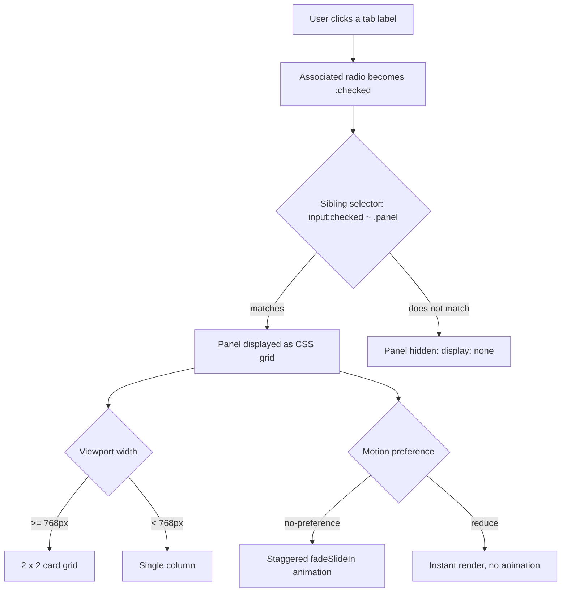

| Difficulty | Channel | Tags |
|---|---|---|
| beginner | frontend | css, flexbox, grid, animations |

In 2013, Apple shipped iOS 7 — a billion devices' worth of parallax wallpapers, zooming launch animations, and perspective tilt effects — and promptly discovered that motion can make people physically ill [1]. Users with vestibular disorders reported nausea, dizziness, and vertigo triggered by constant animation, forcing Apple into a mainstream accessibility crisis [1]. Out of that chaos came `prefers-reduced-motion`, now a W3C standard in every major browser [2]. This is the story of how you can build a polished, animated, fully accessible tab panel using nothing but CSS — and why honoring that humble media query matters more than any animation you ship.

---

> ### Real-World Case — Apple
>
> In 2013, Apple shipped iOS 7 — its most motion-heavy operating system ever, with parallax wallpapers, full-screen zoom launch animations, and perspective tilt effects. Users with vestibular disorders reported real physical symptoms: nausea, dizziness, and vertigo triggered by the constant motion. The company that had made slick animation a design identity suddenly had a mainstream accessibility crisis on its hands.
>
> | | |
> |---|---|
> | **Challenge** | A significant portion of users (those with vestibular disorders, plus people with migraines, epilepsy, or motion sensitivity) could not use the interface because the non-essential motion physically sickened them. Apple needed a way to let users disable these animations — and, once the same motion patterns moved to the web, web developers needed a standard way to detect that preference and serve calmer animation variants. |
> | **Solution** | Apple added the 'Reduce Motion' accessibility switch to iOS 7 (2013), exposed a native API in 2014, and then championed the exact mechanism this topic is built on: in 2014 Apple engineer James Craig proposed the `prefers-reduced-motion` media query to the CSS Working Group, and in 2016/2017 WebKit shipped it in Safari 10.1. Apple then applied the pattern in production on its own site: the Apple.com team used `prefers-reduced-motion` to disable the scaling effect and background video motion on the homepage — the reference implementation of the very CSS feature in the topic's answer. |
> | **Outcome** | `prefers-reduced-motion` went from an Apple accessibility setting to a W3C standard (CSS Media Queries Level 5) now supported in every major browser — Safari, Chrome, Firefox, Edge — and codified into WCAG (C39 technique for meeting WCAG 2.1's animation requirements). It became the global, dependency-free way to respect users' motion preferences, adopted across the web from design systems like GitHub's Primer to media-heavy sites. |
> | **Lesson** | The accessible way to build entrance animations (like the staggered card fade-slide-in in this tab panel) is static-first: write the fully-visible, no-motion state as the default, and only add animation behind `@media (prefers-reduced-motion: no-preference)` — the exact pattern the topic's answer uses. Apple's own history shows why: the company that popularized motion-heavy UI also had to invent the standard to let users turn it off, and even Apple.com's homepage animation must degrade to a static scroll view for users who need it. |

---

## Hook — The 2013 Crisis That Made Motion a Four-Letter Word

Picture this: a designer opens the iOS 7 settings menu, flicks a switch labeled "Reduce Motion," and sighs in relief. That switch exists because in 2013, Apple's most motion-heavy operating system ever — parallax wallpapers that shift with every tilt of the wrist, launch animations that zoom from a single icon to a full screen, perspective effects that make icons hover over wallpaper — was making a significant slice of users physically ill [1]. Nausea. Dizziness. Vertigo. Real symptoms, reported by real people with vestibular disorders, triggered by nothing more than a design choice. Now consider the humble tab panel on a design-system docs page: a tiny UI atom, a handful of cards, a few keyframes. It looks innocent. But every animation you ship sits on the same spectrum as that iOS 7 parallax — and the web answered with `prefers-reduced-motion`, a single CSS media query that became a global standard [1][2]. So here is the challenge: build that tab panel beautifully, with a stagger and a bounce, and still respect every visitor who asked for calm. Oh, and do it without a single line of JavaScript. Sound impossible? It is not.

## Problem — The JavaScript Tab Panel Trap

Most developers reach for JavaScript the moment a UI needs to switch between panels. The pattern is drilled in: add a click handler, toggle a class, hide the siblings. For a demo, that works. But in a real design system, that habit quietly piles up costs. Every tab needs a listener, every state change needs a sync, and every deferred script or failed bundle turns your docs into a frozen wall of dead buttons. A design-system docs page is the worst possible place for fragile interactivity — it is the first thing every new developer touches, the reference they trust while building their own components, and the one page where broken behavior erodes confidence faster than anywhere else. Moreover, there is a second, subtler problem hiding behind the first. Even teams that nail the interactions rarely think about motion sensitivity until an accessibility audit lands on their desk. Animations get added as polish — a fade here, a stagger there — with no guardrail for the users who find that polish literally nauseating. Sound familiar? Here is the thing though: both problems share one elegant root cause, and a forty-year-old HTML element is the unlikely hero.

## Real-World Case — Apple and the iOS 7 Motion Crisis

The stakes aren't hypothetical — the industry has a scar to prove it. In September 2013, Apple shipped iOS 7, and its marketing celebrated exactly the thing that would soon land on the accessibility radar: depth. Parallax wallpapers, layered home screens, zoom transitions everywhere [8]. Within weeks, forums filled with reports from people with vestibular disorders — and people without them — describing nausea and vertigo triggered by the constant motion [1]. Motion sensitivity affects a meaningful share of the population, and for some it is a disabling condition. Apple's response was a system-level "Reduce Motion" accessibility setting that toned the effects down [1]. Here is the plot twist: that setting didn't stay trapped in Cupertino. WebKit engineers took the same idea and proposed `prefers-reduced-motion` for CSS Media Queries Level 5, and it became a W3C standard supported in every major browser — Safari, Chrome, Firefox, Edge [1][2]. The technique is codified in WCAG as the C39 technique for meeting WCAG 2.1's animation requirements, and design systems like GitHub's Primer adopted it as a first-class concern [7]. An Apple accessibility setting became the global, dependency-free contract for respecting motion preferences. Now here is the question that should keep you up at night: is your CSS honoring that contract?

## Deep Dive — The Machinery Behind a JavaScript-Free Tab Panel

Building on that, let's look at the machinery that makes a JS-free tab panel work — because it is genuinely clever, and understanding it beats copy-pasting it. The engine is a set of radio inputs sharing one `name` attribute, paired with `` elements [6]. Radios have a built-in superpower: within a group, exactly one can be `:checked` at a time, and clicking a label activates its radio with zero JavaScript. The CSS then does the rest. Here is the trick most people miss: the general sibling combinator (`~`). When the input comes before the panels in the DOM, `.tabs input:checked ~ .panel` targets every panel that follows the checked radio — letting the `:checked` state drive visibility entirely in CSS [6]. You might think hiding panels from assistive technology is unavoidable without ARIA tab roles. The counterintuitive insight is that the native radio group actually gives you keyboard navigation for free — arrow keys move between radios, Space activates, and screen readers announce the checked state, because these are real form controls, not divs wearing a costume [6]. There's another quiet revolution in the card layout: `aspect-ratio: 16/9` [3]. For a decade, the standard way to force a 16:9 image box was the padding-top percentage hack — 56.25% of an element's width — a trick that worked but felt like incantation. Modern CSS handles it in one declaration. Meanwhile `:focus-visible` solves the outline dilemma — visible focus rings for keyboard users without annoying mouse-click outlines [4]. The grid itself is the responsive workhorse: `repeat(2, 1fr)` on desktop collapsing to `1fr` on mobile [5]. Finally, the animation gate: wrap every motion declaration in `@media (prefers-reduced-motion: no-preference)` [2]. Every piece of this pattern exists to serve one quiet idea: the browser already has the primitives — you just have to let them do the work.

## Workflow — Nine Steps From Radio Inputs to a Living Docs Page

Here is a step-by-step path that turns the theory into a working pattern. The diagram below shows the whole decision flow at a glance: a label click flips the radio state, the CSS engine decides which panel lives and which hides, the layout picks a grid shape based on viewport width, and the animation gate decides whether you see the choreography or skip straight to the result.

Step 1 — Structure the HTML: drop the radios and their labels at the top of the tabs container, with every panel after them. Order is not cosmetic; the sibling combinator only sees following siblings.
Step 2 — Wire the labels: give each label a `for` attribute pointing at its radio's `id`.
Step 3 — Hide the radios visually, not with `display: none`: an off-screen position and `opacity: 0` keep them focusable and announced.
Step 4 — Show and hide panels with `:checked ~ .panel` and `:not(:checked) ~ .panel`.
Step 5 — Lay out the grid with `repeat(2, 1fr)`, then collapse to `1fr` under a 768px breakpoint [5].
Step 6 — Fix the image area with `aspect-ratio: 16/9` [3].
Step 7 — Add the staggered animation, gated behind `prefers-reduced-motion: no-preference` [2].
Step 8 — Restore keyboard visibility with `:focus-visible` [4].
Step 9 — Test the flow with a keyboard only, then with a screen reader, then toggle reduced-motion emulation in DevTools.

Here is the real tradeoff, laid bare in a table:

| Concern | JavaScript tabs | CSS radio tabs |
|---|---|---|
| Script needed | Yes | None |
| Keyboard navigation | Hand-built or ARIA + JS | Native radio group behavior [6] |
| URL / back-button state | Possible via hash or History API | Not without JS |
| Hidden content in the DOM | Your call | Always present in the tree |
| Motion control | Manual matchMedia code | One media query [2] |
| Screen reader semantics | ARIA roles to manage | Native form-control announcements |

The one genuine limitation worth knowing: pure CSS tabs can't reflect state in the URL, so deep-linking to a tab needs a hash link or JavaScript — a reasonable trade for a docs page, where most visitors never leave the first tab.

## Code Example — Building the Pattern, Line by Line

Now the fun part — turning the workflow into markup and styles that actually hold up in a design system. The full example below solves the card wall, the responsive collapse, the motion gate, and the focus story all at once.

## Lessons Learned — What iOS 7 Taught Us That Your Tab Panel Forgot

The journey comes full circle here. Apple's iOS 7 taught the industry that motion is not free — it has real physiological consequences for real users, and the respect it demands became a standard rather than a courtesy [1][2]. For your tab panel, that translates into a short list of habits worth keeping. First, keep the radios in the DOM: hiding them with `display: none` silently breaks keyboard and screen-reader access — the number one mistake in this pattern. Second, watch the selector order: `:not(:checked) ~ .panel` must precede `:checked ~ .panel`, or the hidden rule wins and every panel disappears. Third, treat animation as a privilege, not a default: gate it behind `prefers-reduced-motion: no-preference`, and remember `animation-fill-mode: backwards` so staggered cards don't flash before their delay [2]. Fourth, verify with the tools that matter: a keyboard, a screen reader, and reduced-motion emulation in DevTools — the three settings that catch ninety percent of the regressions. And fifth, don't cargo-cult grid columns: `repeat(2, 1fr)` is right for a docs card wall, but the same markup collapses cleanly to one column with a single breakpoint [5]. Here is the memorable insight to take back to your team: the most accessible interactive component is often the one that stops pretending to be a button. A radio group isn't a hack — it is an accessibility contract with decades of browser support behind it [6]. Tomorrow, before you reach for the script tag, ask yourself what the browser already gives you for free.

---

## CSS-Only Tab Switching Flow

<strong>Original Interview Question</strong>

**Q:** Build a CSS-only tab panel for a design-system docs page. Use radio inputs to switch tabs (no JavaScript). Desktop: a 2x2 grid of cards under each tab; mobile: single column. Each card has a fixed 16:9 image area, a title, and a short meta line. Add a subtle entrance animation with a stagger and keep focus-visible outlines; ensure prefers-reduced-motion is respected?

**A:** Use a set of radio inputs with a shared `name` attribute and corresponding `` elements for each tab section. The `:checked` state of each radio controls visibility of its associated panel via adjacent sibling selectors. Each panel renders a 2×2 card grid on desktop and collapses to a single column on mobile. Cards use `aspect-ratio: 16/9` for fixed image containers, with a title and meta line below.

## Conclusion

Apple's motion crisis is the cautionary tale that turned a personal accessibility setting into the web's global motion standard [1]. The tab panel you just built is the payoff: zero JavaScript, native keyboard support, a 16:9 card wall that collapses gracefully, and an entrance animation that only ever plays for people who asked for it. Ship it, share the pattern, and the next time someone says "can we make it shinier?" you can answer — only if we keep it accessible. Because in the end, the best animation is the one that knows when to stay silent.

---

## References

1. [Apple incident report](https://webkit.org/blog/7551/responsive-design-for-motion/) — article
2. [MDN — prefers-reduced-motion](https://developer.mozilla.org/en-US/docs/Web/CSS/@media/prefers-reduced-motion) — documentation
3. [MDN — CSS aspect-ratio property](https://developer.mozilla.org/en-US/docs/Web/CSS/aspect-ratio) — documentation
4. [MDN — :focus-visible](https://developer.mozilla.org/en-US/docs/Web/CSS/:focus-visible) — documentation
5. [MDN — CSS Grid Layout](https://developer.mozilla.org/en-US/docs/Web/CSS/CSS_grid_layout) — documentation
6. [MDN — <input type="radio">](https://developer.mozilla.org/en-US/docs/Web/HTML/Element/input/radio) — documentation
7. [GitHub — Primer CSS design system](https://github.com/primer/css) — documentation
8. [Wikipedia — iOS 7](https://en.wikipedia.org/wiki/IOS_7) — article

---

**Author:** Satishkumar Dhule — [GitHub](https://github.com/satishkumar-dhule) · [LinkedIn](https://linkedin.com/in/satishkumar-dhule) · [Website](https://satishkumar-dhule.github.io)
