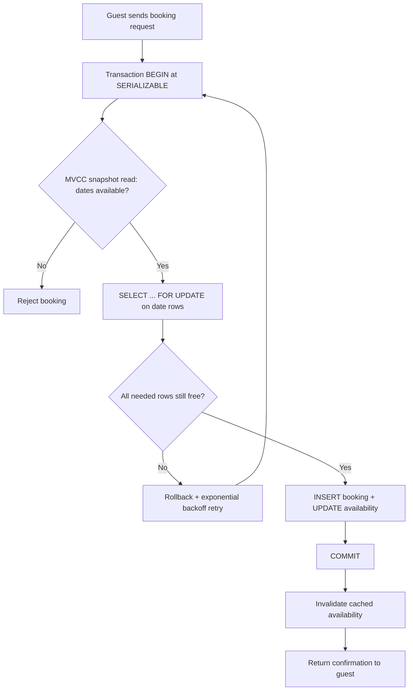

| Difficulty | Channel | Tags |
|---|---|---|
| intermediate | database | acid, isolation-levels, mvcc |

November 15, 2022. Ticketmaster's presale for Taylor Swift's Eras Tour opened, and 3.5 million verified fans hit the buy button at the same instant [1]. The platform buckled mid-sale, leaving millions staring at error screens for hours and forcing the company to cancel the general on-sale entirely [1]. That meltdown is a masterclass in a problem every backend engineer eventually inherits: how do you let thousands of people race to claim the same scarce resource — without letting two of them win?

---

> ### Real-World Case — Ticketmaster
>
> In November 2022, Ticketmaster's presale for Taylor Swift's Eras Tour hit 3.5 million verified-fan registrations—its largest on-sale ever. The platform buckled mid-sale, leaving millions of fans in error screens for hours and forcing Ticketmaster to cancel the general on-sale entirely.
>
> | | |
> |---|---|
> | **Challenge** | Reserve finite ticket inventory atomically (no double-sells, no lost phantom holds) while surviving a concurrency spike of millions of simultaneous reservation attempts plus bot traffic, and do it without the whole booking layer crashing. |
> | **Solution** | Ticketmaster's existing architecture used queueing plus per-session inventory holds with atomic allocation to prevent overbooking, but the presale exposed the availability half of the equation: the reservation API and queue tiers weren't provisioned for the demand shape. In the aftermath Ticketmaster added stricter bot filtering, tiered/verified queues, and capacity throttling so booking demand degrades gracefully instead of taking the system down—showing that a transactionally correct core is worthless if the surrounding availability machinery can't hold the peak. |
> | **Outcome** | Over 2 million tickets sold (a record single-day sale), but with site outages, thousands of fans left empty-handed, class-action lawsuits, a January 2023 Senate Judiciary hearing, and a May 2024 US DOJ antitrust lawsuit against Live Nation/Ticketmaster that cited the presale meltdown. |
> | **Lesson** | Preventing double-bookings is only half the problem: a booking system must pair atomic inventory reservation (locks/optimistic concurrency) with availability engineering (queues, load-shedding, capacity planning), because one public on-sale failure can cascade into regulatory and legal consequences. |

---

## Hook — 3.5 million fans, one checkout, zero margin for error

November 15, 2022. The presale for Taylor Swift's Eras Tour opened at a specific hour, and 3.5 million verified fans all wanted the same 2.4 million tickets at the same moment [1]. The queue collapsed, checkout pages turned into error screens, and the biggest ticket sale in history became a public-relations catastrophe that ended in Senate hearings and a US DOJ antitrust lawsuit [1]. Sound dramatic? Here is the part that should keep you up at night: the exact failure mode that broke Ticketmaster is lurking in every booking system, every inventory system, every e-commerce cart you will ever build. Your version may not have 3.5 million users. But the moment two users reserve the same property, seat, or SKU, you inherit the same problem — with less warning and fewer engineers to catch it.

## Problem — The race condition hiding inside every checkout button

Every double booking is a race condition wearing a customer-service uniform. Picture two guests clicking 'Reserve' on the same beach house in the same millisecond. Both requests run a quick availability check, both see the calendar clear, both commit. Congratulations — you just sold the same three nights to two different families. The classic sequence that causes this is a lost update: transaction A reads the calendar, transaction B reads the calendar, A writes 'booked', then B overwrites with its own 'booked', silently destroying A's work [5]. Because databases batch reads and writes with the illusion of instant completion, many developers never see the race until support tickets start piling up. The stakes are real: one overbooked property means refunds, rebooking costs, angry reviews, and churn. For a marketplace, that is your trust, not just your data. Moreover, the problem compounds with scale — the faster your system handles concurrent requests, the more collisions it produces. Consequently, fixing this is not about writing 'better' business logic. It is about understanding exactly how your database orders concurrent writes, and that starts with isolation.

## Real-World Case — Ticketmaster's Eras Tour meltdown

By November 2022, Ticketmaster had been selling tickets for decades, so the Eras Tour presale should have been routine. Instead, the platform hit 3.5 million verified-fan registrations — its largest on-sale ever — and then choked [1]. Millions of fans sat in error screens for hours, the general on-sale was canceled, and the fallout escalated quickly: class-action lawsuits, a January 2023 Senate Judiciary hearing, and a May 2024 US DOJ antitrust suit against Live Nation/Ticketmaster that explicitly cited the presale meltdown [1]. Despite the chaos, Ticketmaster still sold over 2 million tickets that day, a record single-day sale [1] — which is the plot twist. The system did not fail from inability to process transactions. It failed because demand concentrated on a single hot resource, and the architecture treated every fan's request as if it were the only one in flight. When thousands of transactions fight over the same rows, locks queue up, retries pile on, and a system tuned for low concurrency suffocates under high contention. This is precisely the scenario the original interview question describes: a property with dozens of simultaneous reservation attempts. Therefore, to design for that world, you need to understand the tools your database gives you — isolation levels, row locks, and versioning — and, crucially, their trade-offs.

## Deep Dive — SERIALIZABLE, MVCC, and the trade-offs nobody mentions

The textbook answer to double-booking is 'use SERIALIZABLE isolation,' and it is both right and incomplete. Here is what SERIALIZABLE actually does: it guarantees the outcome matches some serial order of the transactions, as if they ran one after another [3]. That sounds perfect. But most databases — PostgreSQL included — implement isolation with Multiversion Concurrency Control, or MVCC, where readers see a snapshot of the data rather than blocking on writers [7]. Snapshot reads are why your availability check can return 'free' even while another transaction is mid-commit, and that is exactly how the lost update sneaks through [5]. The critical insight: many databases run even their 'SERIALIZABLE' transactions on MVCC snapshots, catching conflicts at commit time rather than blocking at read time. Consequently, you cannot assume SERIALIZABLE alone protects you. The second tool is row-level locking. By locking the specific availability rows with SELECT FOR UPDATE, a transaction claims those rows so no competing transaction can modify them until it commits or rolls back [4][9]. This converts 'hope nobody collides' into 'nobody can collide,' which is why it is the workhorse pattern for booking systems. But here is the plot twist: row locks only protect what you lock. Lock the wrong granularity — say, one row per property instead of one row per date — and you turn a mild contention problem into a serial bottleneck for that entire property. You must also decide between two philosophies: pessimistic locking (lock now, argue later) versus optimistic locking (validate a version column at commit time and retry on mismatch) [8]. The table below shows the real trade-off. Regardless of choice, availability reads should be cheap MVCC snapshot reads served from read replicas, while writes funnel through the primary with locks [3]. Finally, hot properties need a circuit breaker so one viral listing cannot starve the rest of your writes — the exact failure Ticketmaster demonstrated at company scale.

## Workflow — The five-step reservation protocol

Building on the deep dive, here is the workflow that turns a naive checkout into a double-booking-proof reservation system. It is the same shape whether you serve tickets, hotel rooms, or beach houses. Step 1: Begin a transaction at SERIALIZABLE isolation [3]. Step 2: Read availability with a cheap MVCC snapshot — this is your fast reject, typically against a read replica. Step 3: If dates look free, acquire row-level locks with SELECT FOR UPDATE on exactly the date rows you need [4]. Step 4: Re-validate under the locks; if a row vanished or flipped to booked, roll back and retry with exponential backoff. Step 5: On success, commit, then invalidate the cached availability so stale reads do not resell the night you just booked. The diagram below traces the full journey, including the retry loop that absorbs transient conflicts without hammering the database.

## Code Example — Turning the protocol into Python

Here is the workflow made concrete. This example uses PostgreSQL and psycopg2, but the pattern translates to any database with SELECT FOR UPDATE support. Notice three deliberate choices: the transaction is wrapped in a retry loop, the lock covers exactly the requested date range, and the availability check happens twice — once cheaply on a snapshot, once authoritatively under the lock.

## Lessons Learned — What two million tickets taught the industry

So what should you actually take away? First, SERIALIZABLE isolation is a contract, not a shield — because MVCC snapshot reads can bypass it, you still need explicit row locks for the write path [3][7]. Second, lock the right granularity: per-date rows for bookings, never per-property rows, or every reservation becomes a queue. Third, design for the hot row. Ticketmaster's problem was not throughput — it was millions of transactions fighting over the same inventory [1]. Circuit breakers, backoff with jitter, and cached reads are how you keep one viral property (or tour) from taking down your database. Fourth, make your retry loop a first-class citizen. Serialization conflicts are not rare corner cases; at scale they are a normal occurrence, and your code should treat them as expected. Finally, remember the human cost: every overbooked night is a guest with no place to stay and a host with a ruined calendar. The engineering fix is elegant, but the reason it matters is far more mundane — trust.

---

## Booking Transaction Flow

<strong>Original Interview Question</strong>

**Q:** You're building a booking system for Airbnb where multiple users can reserve the same property simultaneously. How would you design the transaction handling to prevent double bookings while maintaining high availability?

**A:** Use SERIALIZABLE isolation with optimistic concurrency control. Implement row-level locks on property availability tables, use MVCC snapshot reads for checking availability, and apply application-level validation to ensure atomic booking operations.

## Conclusion

Two million tickets sold, a record — and still, thousands of fans went home empty-handed [1]. That is the sharpest lesson of the Ticketmaster story: high throughput does not protect you from correctness failures when every user wants the same resource. Tomorrow, when you design that booking flow or review a colleague's checkout code, ask three questions: are availability reads served from cheap MVCC snapshots, are writes guarded by row-level locks at the right granularity, and is the retry loop designed to absorb conflict instead of amplifying it [3][4]? Fix those three, and your system handles the stampede. The database gave you the tools — SERIALIZABLE, FOR UPDATE, MVCC — and the entire art is knowing which one to reach for, and when.

---

## References

1. [Ticketmaster incident report](https://en.wikipedia.org/wiki/The_Eras_Tour) — article
2. [Ticketmaster](https://en.wikipedia.org/wiki/Ticketmaster) — article
3. [PostgreSQL Transaction Isolation](https://www.postgresql.org/docs/current/transaction-iso.html) — documentation
4. [PostgreSQL Explicit Locking](https://www.postgresql.org/docs/current/explicit-locking.html) — documentation
5. [ACID](https://en.wikipedia.org/wiki/ACID) — article
6. [Isolation (database systems)](https://en.wikipedia.org/wiki/Isolation_(database_systems)) — article
7. [Multiversion concurrency control](https://en.wikipedia.org/wiki/Multiversion_concurrency_control) — article
8. [Optimistic concurrency control](https://en.wikipedia.org/wiki/Optimistic_concurrency_control) — article
9. [PostgreSQL SELECT documentation](https://www.postgresql.org/docs/current/sql-select.html) — documentation

---

**Author:** Satishkumar Dhule — [GitHub](https://github.com/satishkumar-dhule) · [LinkedIn](https://linkedin.com/in/satishkumar-dhule) · [Website](https://satishkumar-dhule.github.io)
