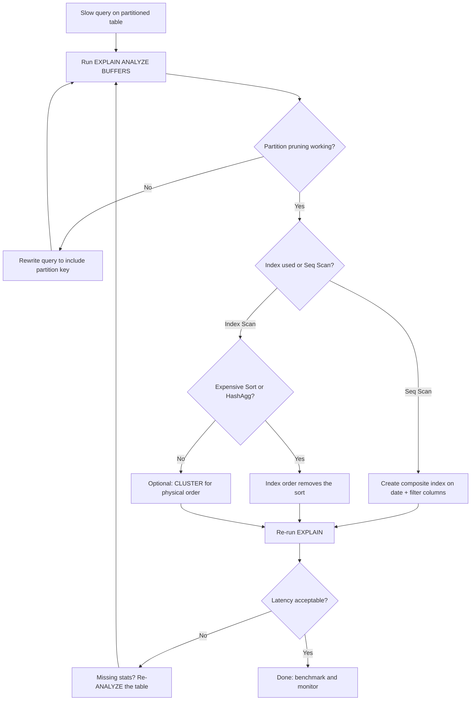

| Difficulty | Channel | Tags |
|---|---|---|
| intermediate | database | explain, query-plan, partitioning |

Every database has a day of reckoning. For GitLab, it arrived when the audit_events table on GitLab.com ballooned to 112GB, and a single audit-log query could sit there for over 13 seconds [1]. The fix — partitioning by month — turned that 13-second query into a 5.7-millisecond blip. This is the story of how one team diagnosed a slow PostgreSQL query against 100M rows, what they found hiding in the EXPLAIN plan, and how you can apply the same playbook before your own table reaches critical mass.

---

> ### Real-World Case — GitLab
>
> GitLab's `audit_events` table on GitLab.com was growing by ~20M rows/month (up to 112GB), pushing the primary database toward capacity and making audit-log queries with date filters unacceptably slow — some took over 13 seconds. The database team partitioned the table by month on `created_at`, the first time they partitioned an application table.
>
> | | |
> |---|---|
> | **Challenge** | A date-partitioned PostgreSQL table (240M events across 4 years, partitioned into 48+ monthly partitions) whose queries filtering on specific date ranges were still slow. They needed to prove partition pruning + composite indexes would actually fix it before swapping tables in production, and had to enforce that all queries filter on the partition key. |
> | **Solution** | The team benchmarked the partitioned table against the single table using realistic queries. The plot twist: the first benchmark showed almost NO improvement — EXPLAIN revealed every query was still doing a Seq Scan over all partitions because the freshly loaded partitions had not been ANALYZEd and the composite indexes hadn't been created yet. After running VACUUM FREEZE ANALYZE and adding composite indexes like (created_at, author_id), they re-ran EXPLAIN and saw index scans with proper partition pruning. They also enforced a max 30-day date-range filter on all audit_events queries so the planner could prune to 1-2 partitions. |
> | **Outcome** | Dramatic speedups: a count query over a large project dropped from 13,158ms to 5.7ms (~2,300x), a medium-project count from 1,305ms to 2.1ms, and a group count from 13,022ms to 2.6ms. In production, the main audit query's mean time dropped to ~0.5ms with 10x-100x improvements on queries that include the partitioning key. |
> | **Lesson** | Partitioning alone is not a performance fix — you must verify it with EXPLAIN. The exact gotcha in the interview question happened in real life at GitLab: after partitioning, queries were still slow because partitions were un-analyzed and composite indexes were missing, so the planner did full sequential scans on every partition. Check that partition pruning is actually kicking in, create composite indexes matching the WHERE clauses, run ANALYZE, and enforce queries to filter on the partition key. |

---

## Hook — the pager keeps going off

Picture this: a support ticket lands with a familiar refrain — “audit log queries are timing out.” You trace it to a single query. It filters on a date range, checks a status column, and touches a table with 100 million rows. That table is already partitioned by date. The partitioning was supposed to make this fast. And yet the query crawls.

This is one of the most common — and most confusing — failure modes in database work: you did the big thing, the partition-the-huge-table thing, and still the planner shrugs. The stakes are real. Every slow query is a user staring at a spinner, a dashboard timing out, an alert waking someone at 3am.

But here is the twist: the diagnosis is hiding in plain sight. An EXPLAIN plan is not a mysterious oracle. It is a confession written by the query planner — and once you learn to read it, the fix usually falls out in minutes.

Ever wondered why a partitioned table can still be slow? Buckle up — the answer is more interesting than you think.

## Problem — 100 million rows don't get faster on their own

Before diving into fixes, it helps to understand why partitioning fails you in the first place. Here is the uncomfortable truth: partitioning is a shortcut the planner may take, not a guarantee. A date-partitioned table stores each month's rows in its own physical chunk, and the planner is allowed to skip irrelevant chunks — a trick called partition pruning [2]. When it works, a 100M-row table suddenly behaves like a 10M-row table.

However, pruning only works when the planner can prove a partition is irrelevant. The moment your query hides the partition key inside a function call, a NOT IN list, or a data-type mismatch, the planner gives up and scans every partition [2]. The result? A query that touches 100M rows when it only needs 2M — and nobody warned you.

To make matters worse, pruning is just the first filter. Even with perfect pruning, you can still hit sequential scans inside the relevant partitions, expensive sort operations, or hash aggregates that chew through memory [3]. Each of these is a separate failure mode with its own fix.

Sound familiar? If this feels overwhelming, you're not alone. Every database team hits this wall — usually right after a table crosses the 10M-row mark and nobody remembers to revisit the queries.

## Real-World Case — GitLab

Nobody illustrates this journey better than GitLab. In 2019, their audit_events table on GitLab.com was growing by roughly 20 million rows per month, pushing past 112GB and edging toward the capacity of the primary database [1]. Audit-log queries filtered by date were painful: one count query over a large project sat at 13,158ms. Another took 13,022ms. Users did not need a stopwatch to notice.

This is where the story takes a plot twist. The database team decided to partition audit_events by month on the created_at column — and it was the first time they had ever partitioned an application table [1]. First attempt, huge table, production traffic. No pressure.

The results rewrote the team's expectations. The large-project count query dropped from 13,158ms to 5.7ms — a roughly 2,300x speedup. A medium-project count went from 1,305ms to 2.1ms, and a group count from 13,022ms to 2.6ms [1]. In production, the main audit query's mean latency fell to about 0.5ms, with 10x to 100x improvements on any query that included the partition key [1].

Why did this work so dramatically? Because partitioning by month made pruning trivially effective: any query with a created_at filter could prove which monthly chunks it needed and skip the rest [2]. The database stopped reading 100M rows and started reading the 1M it actually wanted.

However — and here is the crucial catch — GitLab's success hinged on queries actually including the partition key. A partitioned table whose queries ignore the key behaves exactly like a regular slow table. Which is precisely the scenario at the heart of this article: a partitioned table that is still slow. That is what the Deep Dive attacks next.

## Deep Dive — reading the EXPLAIN plan like a detective

Building on the GitLab story, let's dissect the moment a partitioned query is still slow: reading the EXPLAIN plan. Think of the plan as the planner's thought process laid bare. With EXPLAIN (ANALYZE, BUFFERS), you get not just the intended plan, but what actually happened — which is where the truth lives [3].

The three suspects to interrogate, in order:

1. **Partition pruning** — Look for a plan that scans a handful of partitions instead of all of them. If you see every month being touched despite a date filter, pruning failed, and the query needs fixing, not indexing [2].
2. **Index vs. sequential scan** — A Seq Scan on a partition holding millions of rows means the planner judged your index useless. Sometimes it is right; more often, your index simply does not match the WHERE clause.
3. **Expensive sort or hash aggregate** — A Sort node with a large row count is a red flag. Sorting 2M rows in memory is fine; sorting them on disk is a trip to the hospital.

Option A vs Option B — here is the real tradeoff:

| Fix | When it works | The catch |
|---|---|---|
| Composite index (date, col) | WHERE clauses that include both columns | Adds write overhead; useless if the date filter alone is the bottleneck [4] |
| CLUSTER by index | Physical row order matches the query access pattern | Locks the table while it runs; needs a maintenance window [6] |
| BRIN index on date | Very large, naturally ordered tables | Poor selectivity for random lookups; not a general fix [9] |

💡 **Insight:** a B-tree index is a sorted structure, so the planner can use it to satisfy a range filter like event_date BETWEEN ... while scanning only the matching portion [7]. Make the date column the leading column, and the planner can also use the index to eliminate a separate sort — one data structure, two wins [4].

This leads to an uncomfortable truth many developers discover the hard way: an index is not a magic wand, it is a maintenance contract. Every index you add slows writes, so the goal is a small set of indexes that precisely match your hot queries — not one index per column.

## Workflow — a five-step diagnostic ritual

The diagnosis flow is simple enough to fit on a sticky note — the Query Diagnosis Flow diagram below captures it in one glance:

flowchart TD
    A[Slow query on partitioned table] --> B[Run EXPLAIN ANALYZE BUFFERS]
    B --> C{Partition pruning working?}
    C -- No --> D[Rewrite query to include partition key]
    D --> B
    C -- Yes --> E{Index used or Seq Scan?}
    E -- Seq Scan --> F[Create composite index on date + filter columns]
    F --> J[Re-run EXPLAIN]
    E -- Index Scan --> G{Expensive Sort or HashAgg?}
    G -- Yes --> H[Index order removes the sort]
    G -- No --> I[Optional: CLUSTER for physical order]
    H --> J
    I --> J
    J --> K{Latency acceptable?}
    K -- No --> L[Missing stats? Re-ANALYZE the table]
    L --> B
    K -- Yes --> M[Done: benchmark and monitor]

Follow this five-step ritual every time a partitioned query misbehaves:

1. **Get a baseline.** Run EXPLAIN (ANALYZE, BUFFERS) on the exact production query [3].
2. **Verify pruning.** Confirm the plan touches only relevant partitions. If it touches all of them, fix the query before you fix anything else [2].
3. **Inspect the access method.** A sequential scan on a huge partition means the index does not fit the query — your cue to design a composite index around the WHERE clause [4].
4. **Hunt for sorts.** Look for Sort and HashAggregate nodes with big row counts. An index ordered the way the query needs can remove the sort entirely.
5. **Iterate.** Re-run the EXPLAIN after every change. Optimization is measurement, not guessing.

⚠️ **Watch Out:** adding an index inside a transaction locks writes. Use CREATE INDEX CONCURRENTLY in production and be patient — on a big table it takes a while, and it still holds a brief lock at the end [5].

Consequently, this workflow is a loop, not a one-shot: change, measure, decide. Teams that skip step 5 tend to “optimize” in the dark — and the database punishes assumptions.

## Code Example — the psql diagnostic and fix sequence

Now for the part you have been waiting for — putting the workflow into practice. The sequence below is the exact diagnostic-and-fix ritual GitLab's team relied on, and the one every PostgreSQL shop should have memorized.

**Walking through it step by step:**

- The first command is the investigation. EXPLAIN (ANALYZE, BUFFERS) actually executes the query, so it reports real execution time and buffer activity instead of estimates [3]. Look for two things in the output: how many partitions were scanned, and whether the node is a Seq Scan or an Index Scan.
- If the plan shows a Seq Scan on a giant partition, that is the smoking gun. The composite index in the second command — leading with the date, then the status column — hands the planner exactly what the WHERE clause needs [4].
- The third step is pure discipline: re-run the EXPLAIN and confirm the plan flipped to Index Scan and the execution time collapsed. No flip? Then the query or index still does not match, and it is back to the workflow diagram.
- CLUSTER is the optional final move. It rewrites the table so rows sit in index order, which can further cut I/O for range-heavy workloads — but it locks the table while running, so schedule it in a maintenance window [6]. GitLab's dramatic speedups came from partitioning; clustering is the icing, not the cake.

Reserve clustering for workloads where one access pattern dominates. Otherwise you pay the reorder cost and the next hot query wants a different order anyway.

## Lessons Learned — takeaways from the 2,300x journey

After the GitLab journey and this diagnostic ritual, here is what to carry forward:

- **Partitioning is a promise, not a guarantee.** It only helps when queries let the planner prune partitions. Teach your queries to lead with the partition key [2].
- **Read the plan before you index.** The EXPLAIN output tells you whether the problem is pruning, access method, or sorting. Most failed “just add an index” fixes target the wrong node [3].
- **Design indexes for queries, not tables.** A composite index's leading column should match the most selective part of the filter — date first for range-heavy workloads [4].
- **Every index has a tax.** Writes pay for read speedups. Keep the index portfolio small and deliberate [4].

🎯 **Key Point:** GitLab turned a 13-second query into a 5.7ms blip by making pruning trivially easy for the planner [1]. The same logic applies to any 100M-row table: the biggest speedup is not a faster algorithm — it is reading fewer rows.

🔥 **Hot Take:** if your slow query does not touch the partition key, no amount of partition tuning will save it. Rewrite the query first, then reach for indexes.

If this feels like a lot, you are not alone — but here is the practical reality. The next time a slow partitioned query lands on your desk, you have a ritual: diagnose, prune, index, measure. That is the whole job.

---

## Query Diagnosis Flow

<strong>Original Interview Question</strong>

**Q:** You have a PostgreSQL table with 100M rows partitioned by date. A query filtering on a specific date range is still slow. What would you check in the EXPLAIN plan and how would you optimize it?

**A:** Check partition pruning effectiveness, index utilization patterns, and expensive sort operations. Create composite indexes on (date, filtered_columns) and evaluate clustering strategies for optimal data access.

## Conclusion

The story comes full circle. GitLab stared down a 112GB table growing 20M rows a month, partitioned it for the first time in company history, and watched a 13,158ms query collapse to 5.7ms [1]. The magic was not the partition command itself — it was the planner finally being able to prune, and the queries being written to cooperate with it [2].

Your move for tomorrow: before you add another index, run EXPLAIN (ANALYZE, BUFFERS), verify pruning, and make sure your query is letting the planner do its job. The insight to share with your team: the fastest query is the one that reads the fewest rows — and a well-pruned partition is a read you never have to make.

---

## References

1. [GitLab incident report](https://gitlab.com/gitlab-org/gitlab/-/issues/216658) — article
2. [PostgreSQL Documentation: Table Partitioning](https://www.postgresql.org/docs/current/ddl-partitioning.html) — documentation
3. [PostgreSQL Documentation: EXPLAIN](https://www.postgresql.org/docs/current/using-explain.html) — documentation
4. [PostgreSQL Documentation: Indexes](https://www.postgresql.org/docs/current/indexes.html) — documentation
5. [PostgreSQL Documentation: CREATE INDEX](https://www.postgresql.org/docs/current/sql-createindex.html) — documentation
6. [PostgreSQL Documentation: CLUSTER](https://www.postgresql.org/docs/current/sql-cluster.html) — documentation
7. [Wikipedia: B-tree](https://en.wikipedia.org/wiki/B-tree) — article
8. [How To Use Table Partitioning in PostgreSQL 12](https://www.digitalocean.com/community/tutorials/how-to-use-table-partitioning-in-postgresql-12) — blog
9. [PostgreSQL Documentation: BRIN Indexes](https://www.postgresql.org/docs/current/brin.html) — documentation

---

**Author:** Satishkumar Dhule — [GitHub](https://github.com/satishkumar-dhule) · [LinkedIn](https://linkedin.com/in/satishkumar-dhule) · [Website](https://satishkumar-dhule.github.io)
