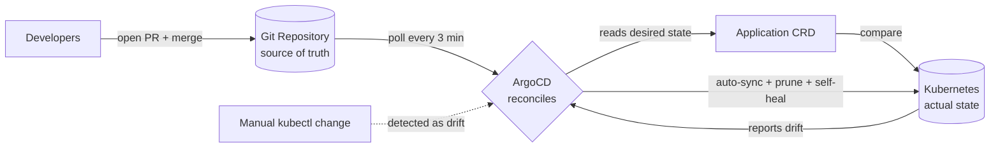

| Difficulty | Channel | Tags |
|---|---|---|
| beginner | devops | argocd, flux, declarative |

Intuit didn't just adopt GitOps — it created the tool that made the term a standard. When its platform org, "Answer," rolled out ArgoCD to 5,000 engineers spanning more than 350 Kubernetes clusters, the declarative dream hit a wall that even the inventors couldn't ignore [1]. This is the story of how the creators of ArgoCD ended up disabling auto-sync on roughly 30,000 applications, why they fell back to imperative Jenkins-driven promotions, and what that says about your own GitOps journey.

---

> ### Real-World Case — Intuit
>
> Intuit — the company that created ArgoCD — needed to roll out GitOps-based deployments for microservices across a Fortune 500 fintech organization. The platform org ("Answer") had to let 5,000 engineers deploy to 350+ Kubernetes clusters without configuration drift or losing the Git-as-source-of-truth model.
>
> | | |
> |---|---|
> | **Challenge** | How to scale a declarative GitOps deployment platform (ArgoCD Application CRDs, auto-sync, self-healing) to tens of thousands of applications and hundreds of clusters — while avoiding the imperative anti-pattern of kubectl/CI-pipeline commands bypassing Git. Kubernetes itself caps cluster size, so multi-cluster management and reconciliation performance (controller workers, sharding, repo-server caching) became the real bottleneck. |
> | **Solution** | Intuit built and operated ArgoCD as its enterprise GitOps control plane: one ArgoCD instance per business segment (140+ instances), all of which are themselves managed declaratively via GitOps with the App-of-Apps pattern. They tuned the Application Controller (raising worker counts and sharding by cluster) and repo servers to keep reconciliation fast, delivered GitOps as a platform service, and standardized on YAML/Helm/Kustomize in Git as the single source of truth with auto-sync and self-healing. |
> | **Outcome** | ArgoCD scales to manage 12,000–40,000 applications from 3,000+ Git repositories across ~370 clusters with 15,000 nodes, powering roughly 1,000 deployments per day for 5,000 engineers. The plot twist: even the creators hit the ceiling — they turned autosync off on the vast majority of their ~30,000 applications and fell back to imperative Jenkins-driven promotions (346KB of logs per promotion), which is why they later open-sourced the GitOps Promoter and Source Hydrator to restore PR-based, Git-native promotion. |
> | **Lesson** | Declarative GitOps (Git as source of truth + ArgoCD reconciliation) is the right model, but autosync alone doesn't survive enterprise scale — environment promotion must also live in Git (PR-based) so the pipeline stays declarative and auditable instead of degrading into imperative Jenkins/kubectl steps. |

---

## Hook — The one-liner that broke the source of truth

It starts with a single command. Someone on the team runs `kubectl scale deploy payments --replicas=4` at 6 PM on a Friday because a promo campaign is spiking traffic. The deployment works perfectly. But Git still says 2 replicas. Nobody commits the change. Nobody even remembers it. Then Monday morning, ArgoCD notices the drift and — if self-healing is on — snaps that deployment straight back to 2 replicas, mid-traffic, without warning. Sound familiar?

Every GitOps rollout carries this tension: Git is the source of truth, but a keyboard is a terrible version-control system. The stakes are configuration drift, broken rollbacks, and 2 AM on-call pages. And as you are about to see, even the teams who built the tools struggle with exactly this.

## Problem — Configuration drift: the silent killer of microservices

Building on that tension, here is the core problem: microservices multiply the attack surface for drift. A monolith has one config; a platform with 300 microservices has 300. Now multiply by dozens of environments and hundreds of clusters. Somewhere in the tangle, a ConfigMap gets patched by hand, a Deployment gets force-applied, an HPA threshold gets nudged. None of it lands in Git. Consequently, your "single source of truth" quietly becomes fiction.

This matters for three reasons. First, rollbacks break: you can't roll back to a state that was never recorded. Second, audits fail: a fintech or healthcare company cannot explain which version ran in production on a given date. Third, debugging becomes archaeology: the production behavior you observe no longer matches the code you review [4]. Many developers discover this the hard way — the "works on my cluster" problem is usually drift, not code. Ever wondered why the same manifest behaves differently in staging and prod? That's drift whispering. The question is whether the tooling that promises to fix drift can survive contact with a real organization.

## Real-World Case — Intuit: when the inventors hit the ceiling

However, the fix for drift has its own failure modes, and the best proof is the company that wrote the playbook. Intuit created ArgoCD, the tool most teams reach for when they adopt GitOps. At its peak, the platform org "Answer" used ArgoCD to manage an estimated 12,000 to 40,000 applications sourced from more than 3,000 Git repositories across roughly 370 clusters and 15,000 nodes, powering around 1,000 deployments per day for 5,000 engineers [1]. That scale is staggering.

But here is the plot twist: the inventors themselves stopped trusting the tool they made. On the vast majority of their ~30,000 applications, they turned auto-sync off and fell back to imperative, Jenkins-driven promotion pipelines — pipelines that generated 346KB of logs per single promotion [1]. This is the uncomfortable truth the marketing slides skip: at massive scale, the fully declarative, auto-healing dream produced operational chaos. Consequently, Intuit later open-sourced the GitOps Promoter and Source Hydrator to claw back PR-based, Git-native promotion [1]. If the creators of ArgoCD can't run it fully declaratively, what does that mean for a team with two clusters and one sleepy on-call rotation? The answer, it turns out, is nuanced — and that nuance is the rest of this article.

## Deep Dive — Declarative vs imperative: a spectrum, not a war

This leads to the heart of the matter: what declarative and imperative actually mean, and why teams keep blurring the line. The imperative approach is what you do when you type `kubectl create`, `kubectl scale`, or `kubectl patch`. You are executing a sequence of actions that mutate the cluster directly, and the cluster's state depends on the order and history of those commands [5]. It is fast, flexible, and completely untraceable in Git.

The declarative approach flips the model: you write the desired state — a YAML manifest, a Helm chart, or a Kustomize overlay — commit it to Git, and let a controller reconcile reality toward that state [2][4]. ArgoCD is that controller: it polls your repository, compares live state to desired state, and applies whatever is needed to converge [3][8]. Here is the real tradeoff in one table:

| | Imperative (kubectl) | Declarative (GitOps) |
|---|---|---|
| Where the truth lives | In the cluster and your muscle memory | In Git, versioned and reviewable |
| Change flow | Direct commands | Pull requests + merge |
| Rollback | Manual — guess the prior state | Automated — revert the commit |
| Auditability | Poor | Complete history |
| Speed of change | Instant | A PR cycle away |
| Drift risk | High | Low — if auto-sync is on |

See that last row? That's the catch. Declarative only eliminates drift if reconciliation actually runs. Disable auto-sync and you have paper GitOps — nice dashboards, zero enforcement. But enable full self-healing and you inherit a different problem: the cluster can now fight human decisions in real time. That's why Intuit's choice — auto-sync off for ~30,000 applications [1] — is not a failure of the concept but a calibration of it.

⚠️ Watch Out: full self-heal will stomp legitimate imperative actions like debugging with `kubectl run`, autoscaler tweaks, or emergency scale-outs. 🎯 Key Point: GitOps gives you knobs — auto-sync on or off, pruning, self-healing, sync windows — and choosing which ones to turn is the actual skill.

## Workflow — From Git commit to live cluster in six steps

Now that the concept is clear, let's turn it into a workflow you can actually run. Moreover, every step below maps to something ArgoCD does natively [3].

1. **Put everything in Git.** Manifests, Helm charts, or Kustomize overlays — your choice. Helm is great for parameterized releases [6]; Kustomize shines for environment overlays [9]. Whatever you pick, it must render deterministically.
2. **Install ArgoCD** in its own namespace (`argocd`) and expose the UI or CLI.
3. **Register the source.** Point ArgoCD at your repository and the target revision (usually `main`).
4. **Define the Application CRD.** This is the contract: source repo + destination cluster/namespace + sync policy.
5. **Enable automated sync** with an interval you can live with — typically 1 to 5 minutes. Set `prune: true` so resources deleted from Git actually get deleted from the cluster.
6. **Watch and tune.** Health checks, sync waves, and sync windows let you sequence dependencies and schedule risky changes.

Here is the whole loop in a single picture — the flow the diagram below captures: developers merge PRs into Git, ArgoCD polls and reconciles, the cluster reports actual state back, and any manual drift gets detected and corrected. But watch the dotted line — the drift path. That's where Intuit's story lives, and it brings us straight to the code.

## Code Example — Your first ArgoCD Application, the GitOps way

This is where it becomes concrete. Below is a production-style Application definition — the kind of object that turns your repository into an enforcement mechanism. It declares the source, the destination, and the automated sync policy in one readable file, and it is applied through a standard bash workflow.

## Lessons Learned — What the inventors' own failure teaches you

If this feels like a lot, you are not alone — Intuit's own journey shows even the tool's creators wrestle with these knobs [1]. Here is what to take with you.

- **Declarative is the right default.** Git as the source of truth, reviewable changes, automated rollbacks [2][4].
- **Auto-sync is a sharp knife, not a religion.** Intuit turned it off for the vast majority of ~30,000 applications and still moved 1,000 deployments a day [1] — the reliability came from pipeline discipline, not a magic controller.
- **Plan for the manual escape hatch.** When you need an emergency imperative action, your tooling should make bypassing Git awkward — awkward, but never impossible.
- **Treat drift visibility as a feature.** Dashboards and alerts that surface "out-of-sync" states are more valuable than policies that silently fight them.
- **At platform scale, copy Intuit's opensource.** GitOps Promoter and Source Hydrator exist precisely because PR-based, Git-native promotion is the durable pattern [1]. The ecosystem also offers Flux with its own comparable reconciliation loop if you want an alternative [7].

🎯 Key Point: the deepest lesson is that automation without judgment becomes its own kind of drift.

---

## GitOps Reconciliation Loop

<strong>Original Interview Question</strong>

**Q:** You're setting up GitOps for a microservices deployment. How would you configure ArgoCD to automatically sync changes from your Git repository to Kubernetes, and what's the difference between declarative and imperative approaches in this context?

**A:** I'd configure ArgoCD by setting up a Git repository containing Kubernetes manifests or Helm charts, creating an Application CRD that points to the Git repository, enabling auto-sync with a health check interval of 3 minutes, and implementing self-healing to automatically revert any manual changes. The declarative approach involves defining the desired state in Git through YAML manifests, Helm charts, or Kustomize configurations, where ArgoCD continuously reconciles the actual state with the desired state. In contrast, the imperative approach uses kubectl commands to make direct changes to the cluster, bypassing the Git repository as the single source of truth.

## Conclusion

The story of GitOps isn't about a tool that makes everything automatic. It's about a discipline — declare the truth, reconcile toward it, and make every change a reviewable event. Intuit built ArgoCD to scale that discipline to 15,000 nodes and roughly 1,000 deployments a day, then learned the hard way that automation without judgment becomes its own kind of drift [1]. Tomorrow, do one thing differently: check your ArgoCD dashboard for applications that are "out of sync" and ask why. If the answer is "someone ran kubectl again," you have found your next PR. The insight worth sharing with your team: the most important source of truth isn't Git. It's the conversation about what the system is supposed to be — Git just writes it down.

---

## References

1. [Intuit incident report](https://www.youtube.com/watch?v=ESQLqjbM8h0) — article
2. [GitOps - Wikipedia](https://en.wikipedia.org/wiki/GitOps) — blog
3. [Argo CD Documentation](https://argo-cd.readthedocs.io/en/stable/) — documentation
4. [Declarative Management of Kubernetes Objects Using Configuration Files](https://kubernetes.io/docs/tasks/manage-kubernetes-objects/declarative-config/) — documentation
5. [Kubernetes Imperative Commands](https://kubernetes.io/docs/tasks/manage-kubernetes-objects/imperative-command/) — documentation
6. [Helm Documentation](https://helm.sh/docs/) — documentation
7. [Flux Documentation](https://fluxcd.io/) — documentation
8. [Argo CD GitHub Repository](https://github.com/argoproj/argo-cd) — documentation
9. [Kustomize Documentation](https://kubectl.docs.kubernetes.io/) — documentation

---

**Author:** Satishkumar Dhule — [GitHub](https://github.com/satishkumar-dhule) · [LinkedIn](https://linkedin.com/in/satishkumar-dhule) · [Website](https://satishkumar-dhule.github.io)
