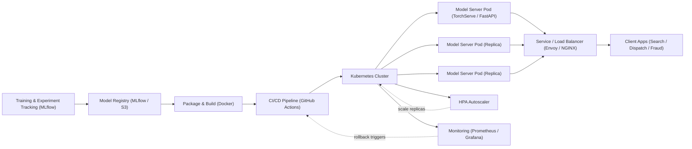

| Difficulty | Channel | Tags |
|---|---|---|
| beginner | devops | mlops, deployment |

Back in 2020, DoorDash quietly hit an ML wall: every team was building bespoke prediction logic inside its own microservices, and none of it scaled [1]. The ML platform team answered with a centralized real-time prediction service so fast that teams chose to call it instead of scoring models in-house, and it grew to serve 6 million predictions per second across 200+ models [1]. The whole saga comes down to one distinction too many developers underestimate: model deployment and model serving are not the same job. This is the story of what each one really means, and why getting the split right changes everything.

---

> ### Real-World Case — DoorDash
>
> As DoorDash scaled to millions of users ordering food across a three-sided marketplace, teams were building bespoke prediction logic inside their own microservices (search ranking, dispatch, fraud, dasher pay). The ML platform team needed a centralized real-time prediction service that would be so fast that other teams would rather call it than keep scoring models in-house, while handling hundreds of thousands of predictions per second.
>
> | | |
> |---|---|
> | **Challenge** | Build a model serving system capable of ultra-low latency (<100ms-class) and high throughput real-time inference across dozens of models, separating the serving concern from feature computation and model training, and then scale it to absorb the search team's massive QPS and strict latency budget without letting one noisy model degrade everyone else. |
> | **Solution** | They built 'Sibyl', a centralized Kotlin/gRPC prediction service running on Kubernetes. It caches all models in memory at startup, pulls features on-demand from a Redis feature store, runs LightGBM and PyTorch inference through C++ APIs bridged via JNI to minimize latency, uses Kotlin coroutines for non-blocking parallelism, and supports batched predictions. They tuned request chunking (finding ~100-200 stores per batch as the sweet spot) and when multi-tenancy caused a 'noisy neighbor' problem, they moved high-traffic models into isolated clusters scaled independently. Autoscaling on pod replicas handled traffic patterns. |
> | **Outcome** | Load testing handled over 100,000 predictions per second; production rollout to fraud and dasher-pay models delivered a 3x reduction in latency versus the prior prediction service. Isolating noisy neighbors enabled 10x peak predictions. The platform eventually scaled to serve 6 million predictions per second across 200+ models. |
> | **Lesson** | Model serving is a distinct discipline from model deployment: the serving layer needs its own latency-memory trade-offs (in-memory model caching vs cold start), batching strategies, and multi-tenancy isolation mechanisms, while deployment concerns like CI/CD and infrastructure live in separate pipelines. Scaling serving often comes down to operational choices like cluster isolation and autoscaling rather than model changes. |

---

## Hook — The model worked in the notebook. Then production happened.

It starts the same way every production ML story does: the model works. Metrics look great, the leaderboard smiles back at you, and your slide deck brags about a 94% AUC. Then you ship it and reality shows up. The pager goes off at 2am because your scoring endpoint is returning 50-second responses while your autoscaler spins up pods faster than they can die [2]. Sound familiar?

Here is the uncomfortable truth you learn the hard way: getting a model deployed is not the same thing as getting a model served. DoorDash lived this lesson while scaling to millions of users ordering food across a three-sided marketplace, and the fix rebuilt how their entire ML platform operated [1]. Before you ship your next model, you need to understand the difference — because the stakes are a lot higher than a badge in a README.

## Problem — Deployment and serving get merged, and it costs you

Deployment and serving get lumped together in conversation, in job descriptions, and in badly scoped sprints. That conflation is expensive.

Deployment is the act of getting your model into an environment. It covers CI/CD pipelines, infrastructure provisioning, container orchestration, and the monitoring and rollback strategies that let you sleep at night [3]. Serving is what happens after: the runtime that actually answers inference requests, routes traffic, loads model weights, and squeezes every millisecond out of a response. One is about shipping; the other is about performing.

Teams that blur the line hit the wall quickly. They spend two weeks perfecting a Kubernetes deployment, then discover the model takes 900ms to cold-start and blows every latency budget. Or they nail a blazing-fast inference endpoint but have no pipeline to update the model without a manual SSH session. Neither outcome is a production system — both are demos with extra steps. The fix starts with naming the problem correctly, which is exactly what DoorDash's platform team did.

## Real-World Case — DoorDash builds a prediction service teams actually want to call

Here is where DoorDash's story gets interesting. By 2020, the company was running a three-sided marketplace — customers, merchants, dashers — with prediction logic everywhere: search ranking, dispatch, fraud detection, dasher pay [1]. Every team had a slightly different bespoke approach, which meant duplicated effort, inconsistent latency, and no shared infrastructure. The classic scrape-by model of ML at scale.

The ML platform team made a contrarian bet: build a centralized real-time prediction service so fast that other teams would rather call it than keep scoring models in-house [1]. Speed was the adoption strategy. Load tests handled over 100,000 predictions per second, and in production, fraud and dasher-pay models saw a 3x reduction in latency versus the prior prediction service [1]. Isolating noisy neighbors unlocked a 10x peak in prediction throughput, and the platform eventually scaled to serve 6 million predictions per second across more than 200 models [1].

The plot twist: the magic was not a smarter model. It was a serving architecture done right — the difference between a pipeline that ships models and a runtime that actually performs under load.

## Deep Dive — Deployment vs serving: the tools, the trade-offs, the battle

Building on DoorDash's win, let's map the two layers so you can spot where your own systems are missing one.

| Dimension | Deployment | Serving |
|---|---|---|
| **Core job** | Get the model into production | Answer inference requests at scale |
| **Tech stack** | Kubernetes, Docker, Terraform; MLflow, SageMaker, Vertex AI [5][6] | FastAPI, Flask, gRPC [10][11]; TorchServe, TensorFlow Serving [2][7] |
| **Key concern** | Reproducibility, CI/CD, rollback | Latency, throughput, model loading |
| **Success metric** | Time-to-production, deploy frequency | P99 latency, QPS, error rate |
| **Failure mode** | Config drift, unreproducible environments | Cold starts, memory spikes, noisy neighbors |

Trade-offs are where the real decisions live:
- **Latency vs throughput** — real-time serving demands sub-100ms responses; batch scoring can tolerate seconds because you trade response time for efficiency. DoorDash's service leaned hard on low latency to win teams over [1].
- **Batch vs real-time inference** — a fraud check that runs per-transaction is real-time; a nightly churn report is batch. Mixing the two in one endpoint is how you get 2am pages.
- **Cold start optimization** — serverless functions and freshly-spun pods pay a startup tax loading model weights. Warm pools, model pre-loading, and keeping weights in memory are the standard defenses [2].
- **Scaling** — horizontal scaling adds pod replicas through the Horizontal Pod Autoscaler [4]; vertical scaling adds GPU memory and CPU. You will need both, just not at the same time.
- **Safe releases** — A/B testing, traffic splitting, and gradual rollouts are how you deploy a new model version without angering every user at once.

⚠️ **Watch Out:** your favorite serving framework is not a deployment pipeline, and your deployment pipeline is not a serving runtime. Treating either as the other is how the 50-second responses happen.

## Workflow — From trained weights to 6M predictions per second

Now that the layers are clear, here is the step-by-step journey your model takes from notebook to production, with the full flow visualized in the diagram below (Diagram 1: Deployment to Serving Pipeline).

1. **Train and track** — log experiments in MLflow so the winning run is reproducible [5].
2. **Register** — promote the model to a registry with a version tag. Versioning is non-negotiable: it is your rollback lever [8].
3. **Package** — build a Docker image containing the model weights and the serving code [2][7].
4. **Ship via CI/CD** — GitHub Actions or Jenkins runs tests, then pushes the image through your pipeline [3].
5. **Orchestrate** — Kubernetes schedules pods, keeps replicas healthy, and restarts what dies [3].
6. **Route and scale** — a service and load balancer (Envoy, NGINX) route requests, while the HPA grows and shrinks replicas based on CPU and custom metrics [4][9].
7. **Monitor and roll back** — Prometheus-style metrics feed dashboards and alerting; when latency regresses, you roll back to the previous registered version.

💡 **Insight:** DoorDash's noisy-neighbor isolation worked by giving heavy models dedicated capacity so one spike couldn't starve everyone else — horizontal scaling without isolation just scales the chaos [1].



## Code Example — A versioned serving endpoint with FastAPI

Theory is great, but you are here to build. The snippet below is a minimal-but-real serving pattern: a FastAPI app that loads models at startup, exposes a health probe for Kubernetes, and routes requests by version — the exact piece that makes rollbacks trivial [11].

```python
# serving.py — a tiny, versioned model server
from fastapi import FastAPI, HTTPException
from pydantic import BaseModel
import torch
import time

app = FastAPI(title="Food-Rank Model Serving API")

# Registry of version -> model handle.
# In production, pull from MLflow/S3 instead of local paths [5].
MODELS = {
    "rank-v1": {"path": "models/rank-v1.pt", "model": None},
    "rank-v2": {"path": "models/rank-v2.pt", "model": None},
}

class PredictionRequest(BaseModel):
    features: list[float]

class PredictionResponse(BaseModel):
    prediction: float
    version: str
    latency_ms: float

@app.on_event("startup")
def load_models():
    """Load weights once at boot to avoid cold starts per request."""
    for version, info in MODELS.items():
        info["model"] = torch.load(info["path"], map_location="cpu")
        info["model"].eval()  # switch to inference mode

@app.get("/healthz")
def health():
    """Kubernetes readiness probe: healthy only when models are ready."""
    return {"status": "ok", "models": list(MODELS.keys())}

@app.post("/predict/{version}", response_model=PredictionResponse)
def predict(version: str, request: PredictionRequest):
    """Score a request against a specific model version."""
    entry = MODELS.get(version)
    if entry is None or entry["model"] is None:
        raise HTTPException(status_code=404, detail="unknown model version")
    start = time.perf_counter()
    with torch.no_grad():
        result = entry["model"](torch.tensor(request.features)).item()
    latency_ms = (time.perf_counter() - start) * 1000
    return PredictionResponse(prediction=result, version=version, latency_ms=latency_ms)
```

Here is what this code is actually doing:
- **Startup loading** — weights load once into memory at boot instead of per-request. This is the classic cold-start fix; a real platform like TensorFlow Serving does the same with model pre-loading [2].
- **The `/healthz` probe** — Kubernetes polls this to decide whether your pod is ready for traffic. If loading failed, the pod stays out of rotation instead of serving garbage [3].
- **Versioned route** — `/predict/rank-v2` targets one exact model. New versions get a new registry entry, and rolling back is just a routing change, not a redeploy [8].

🔥 **Hot Take:** if your serving API has no version in the URL or header, you have not built rollback — you have built a hope-based deployment.

## Lessons Learned — What to do differently starting tomorrow

After the DoorDash story and the deep dive, the takeaways fit on one whiteboard:

- **Separate the two jobs explicitly** — deployment pipelines ship artifacts; serving runtimes answer requests. Design and budget for each independently [3][2].
- **Speed is an adoption strategy** — DoorDash made teams *want* to call the shared service by being fast, not by mandate. If your platform is slower than bespoke code, nobody migrates [1].
- **Version everything, always** — the registry is your rollback lever. No version tag, no safe rollback [8].
- **Isolate noisy neighbors** — one spike should not starve every model. Dedicated capacity beats shared chaos [1].
- **Instrument before you scale** — you cannot autoscale what you cannot measure. Track P99 latency, QPS, and error rate from day one.

🎯 **Key Point:** the battle-tested workflow is train → register → package → CI/CD → orchestrate → serve → monitor → rollback. Skip a step and production will find you.

Common battle scars, so you can dodge them: cold-start latency on serverless, unbounded GPU memory, autoscalers reacting to stale metrics, and endpoints that leak model versions. You will probably trip on at least two of these — but now you know what they look like.

---

## Deployment to Serving Pipeline


<details>
<summary><strong>Original Interview Question</strong></summary>

**Q:** Explain the key differences between model serving and model deployment in ML systems, including specific technologies, scaling considerations, and real-world implementation patterns?

**A:** Deployment encompasses CI/CD pipelines, infrastructure setup, and monitoring using tools like Kubernetes, MLflow, and SageMaker. Serving focuses on runtime inference APIs with frameworks like TensorFlow Serving, TorchServe, or BentoML, handling request routing, model versioning, and autoscaling. Key trade-offs include latency vs throughput, batch vs real-time inference, and cold start optimization.

</details>

## Conclusion

DoorDash did not scale to 6 million predictions per second with a better model — it scaled with a serving architecture that treated deployment and serving as two distinct, well-engineered jobs [1]. The moral for your next model is simple: version your artifacts, separate shipping from scoring, instrument before you autoscale, and isolate the heavy hitters. Tomorrow, pick one model you own, add a versioned endpoint and a readiness probe, and run it through the full pipeline once. When your pager stays quiet at 2am, you will know the difference between deployment and serving — and you will never confuse them again.

---

## References

1. [DoorDash incident report](https://doordash.engineering/2020/06/29/doordashs-new-prediction-service/) — article
2. [TensorFlow Serving](https://github.com/tensorflow/serving) — documentation
3. [Kubernetes Deployments](https://kubernetes.io/docs/concepts/workloads/controllers/deployment/) — documentation
4. [Kubernetes Horizontal Pod Autoscaling](https://kubernetes.io/docs/tasks/run-application/horizontal-pod-autoscale/) — documentation
5. [MLflow documentation](https://mlflow.org/docs/latest/) — documentation
6. [What is Amazon SageMaker?](https://docs.aws.amazon.com/sagemaker/latest/dg/whatis.html) — documentation
7. [TorchServe](https://github.com/pytorch/serve) — documentation
8. [BentoML](https://github.com/bentoml/BentoML) — documentation
9. [Envoy Proxy](https://github.com/envoyproxy/envoy) — documentation
10. [Introduction to gRPC](https://grpc.io/docs/what-is-grpc/introduction/) — documentation
11. [FastAPI documentation](https://fastapi.tiangolo.com/) — documentation

---

**Author:** Satishkumar Dhule — [GitHub](https://github.com/satishkumar-dhule) · [LinkedIn](https://linkedin.com/in/satishkumar-dhule) · [Website](https://satishkumar-dhule.github.io)
