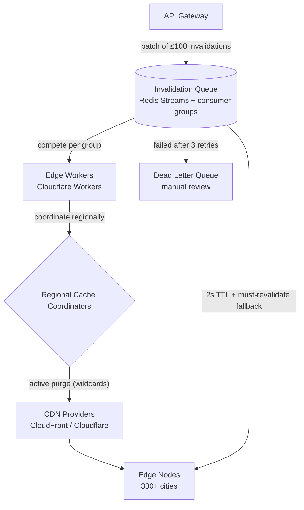

| Difficulty | Channel | Tags |
|---|---|---|
| intermediate | system-design | edge, caching, purging |

For over a decade, Cloudflare ran its cache purge system on a centralized spoke-hub model, backhauling every purge request to core data centers before propagating it across the network [1]. As the network grew to 330 cities and customers issued millions of purge API calls daily, that centralized ingest became a throughput bottleneck — and remote customers in Australia watched multi-second round trips [1]. A full rearchitecture flipped those numbers: global purge latency crashed from 1,570ms P50 to 149ms P50, a 90.5% improvement [1]. This article walks that journey, and by the end, you will know exactly how to design a multi-region invalidation system that hits a 5-second propagation SLA without breaking the bank.

---

> ### Real-World Case — Cloudflare
>
> For over a decade Cloudflare ran its cache purge system on a centralized spoke-hub model where every purge request was backhauled to core data centers and propagated via Quicksilver, a config-distribution system. As the network grew to 330 cities and customers issued millions of purge API calls daily, the centralized ingest became a throughput bottleneck, remote customers (e.g., in Australia) saw multi-second round-trips, and storing purge history on every machine ate into cache disk space.
>
> | | |
> |---|---|
> | **Challenge** | How to scale global cache invalidation to handle high concurrency and far-flung users without a centralized bottleneck — purging across 330 cities in 120+ countries in well under a second, while avoiding huge per-machine storage overhead for purge history. |
> | **Solution** | They rebuilt the system as 'Coreless Purge': a peer-to-peer distribution mesh using Cloudflare Workers and Durable Objects instead of hub-and-spoke; and replaced lazy purge (comparing purge timestamps on cache HITs) with an active-purge design. Each cache machine runs CacheDB, a Rust service on RocksDB, indexing cached files by hostname/cache-tag/URL and maintaining a local queue that deletes matching files from disk, with Consul handling intra-datacenter health and fan-out. The cache proxy checks CacheDB's queue on HITs so content stops being served the instant a purge lands on a machine. |
> | **Outcome** | Global purge latency for tags, hostnames, and prefixes dropped from 1,570ms P50 (May 2022) to 149ms P50 — a 90.5% improvement. Worst region (Africa) went from 1,420ms to 303ms; Western North America from 1,000ms to 115ms. The shift to active deletion cut lazy-purge storage 10x, freeing disk for better cache retention, higher hit ratios, and lower origin egress. |
> | **Lesson** | Centralized ingest is the enemy of global invalidation — a coreless, peer-to-peer distribution mesh scales without a single choke point; and 'purge everywhere cheaply' can be achieved by pairing per-machine active deletion (indexes + local queues) with instant logical invalidation on the read path, rather than lazy timestamp comparisons. |

---

## Hook — The 2AM Purge That Wouldn't Go Through

Ever wondered why the internet can stream 4K video from the other side of the planet without breaking a sweat, yet still serves you a deleted page three hours after it is gone? Picture this: it is 2am, a deploy carrying a broken image slipped past review, and now every edge node on Earth is happily serving that mistake to millions of visitors. You fire off a cache purge and watch the clock — your content propagation SLA is five seconds, but the pipeline in front of you feels closer to five minutes. This is the silent tax every CDN charges: invalidation. And the fix turns out to be far stranger than simply adding more servers.

## Problem — Invalidation Is a Distributed Coordination Problem, Not a Delete

Here is what many developers get wrong: a CDN is not one cache, it is thousands of independent caches spread across hundreds of cities, and each one needs to hear about a purge [9]. That turns a trivial delete into a fan-out coordination problem. Now stack on the requirements from the interview that kicked this off: 10,000 concurrent invalidations per second, global propagation under 5 seconds, and strong consistency across regions. The naive approach — loop through every edge node and delete one by one — collapses immediately. Backhauling every request to a single core introduces round-trip latency, a centralized ingest queue becomes a throughput bottleneck, and storing purge history on every machine eats disk that should be holding cached content [1]. The stakes are brutal: stale content means broken checkouts, wrong pricing, and angry users; slow purges mean an incident stays live long after the fix ships.

## Real-World Case — Cloudflare's Decade-Long Purge Bottleneck

Cloudflare lived this exact nightmare for over a decade [1]. Their purge system ran on a spoke-hub model: every purge request was backhauled to core data centers and propagated through Quicksilver, a config-distribution system [1]. When the network was small, that was fine. But as it grew to 330 cities and customers started issuing millions of purge API calls every day, the math stopped working [1]. Remote customers in Australia watched multi-second round trips, and storing purge history on every machine chewed into cache disk space [1]. The fix was a rearchitecture to active, edge-driven deletion — and the results are stunning. Global purge latency for tags, hostnames, and prefixes dropped from 1,570ms P50 in May 2022 to 149ms P50: a 90.5% improvement [1]. The worst region, Africa, went from 1,420ms to 303ms, while Western North America fell from 1,000ms to 115ms [1]. Active deletion also cut lazy-purge storage 10x, freeing disk for better cache retention, higher hit ratios, and lower origin egress [1]. That is the bar the rest of this article is trying to help you hit.

## Deep Dive — The Anatomy of a 5-Second Purge

Building on those Cloudflare numbers, the interview answer breaks the system into four moving parts: an invalidation queue, edge workers, regional cache coordinators, and the CDN providers themselves [1]. The queue is Redis Streams with consumer groups — groups let many workers process the same stream without double-processing entries, which is exactly the semantics a purge pipeline needs [5]. Consequently, throughput scales with worker count rather than Redis instance count [5]. Then come the three load-bearing decisions. **Batching.** Pattern-based, batched invalidation is the cost lever: one call can carry a wildcard like `/products/*`, and CloudFront offers the same wildcard semantics for invalidation paths [4]. Batching 100 invalidations per call cuts API costs by up to 90% [1]. **TTL as a safety net.** Every purge pipeline is really a hybrid: active invalidation for the urgent stuff, plus a short TTL (`Cache-Control: max-age=2, must-revalidate`) so that even if a purge misses, stale content dies on its own within two seconds [2][3]. RFC 7234 governs how those headers behave in practice [8]. **Failure handling.** Three layers: exponential backoff with jitter so a wave of retries does not thundering-herd the provider [6], a circuit breaker that fails fast after five consecutive failures instead of hammering a degraded endpoint [7], and a dead-letter queue so the rare lost invalidation lands in front of a human instead of vanishing forever [1]. Here is the real tradeoff in table form: 

| Strategy | Propagation latency | Cost | Consistency | Sweet spot |
| --- | --- | --- | --- | --- |
| Short TTL only (2s) | ~2s | cheapest | eventual | dynamic content |
| Active purge only (wildcards) | <1s | expensive at scale | strong | emergencies |
| Hybrid: purge + TTL + reconciliation | <5s | moderate | strong | production [1] |

⚠️ Watch Out: pattern-based purging is seductive and dangerous at the same time. A wildcard like `/products/*` nukes an entire subtree — expensive, and occasionally explosive if someone typos a broader prefix. Many teams discover the hard way that wildcard scope deserves its own review step. 🔥 Hot Take: you do not need your cache to be strongly consistent everywhere — you need it consistent enough. Short TTLs shrink the window where 'eventually' is embarrassing.

## Workflow — From API Call to Global Propagation

Consequently, the workflow becomes a choreographed pipeline rather than a hammer. This leads to seven steps happening behind the scenes after a developer fires a purge request: **1. Ingest** — the API Gateway accepts the call, validates the token, and normalizes paths into patterns. **2. Enqueue** — the invalidation lands in a Redis Stream, and consumer groups start competing for entries [5]. **3. Fan out** — Edge Workers pick up batches of 100 or fewer and push them to the regional coordinators nearest the affected regions. **4. Coordinate** — each Regional Cache Coordinator decides which CDN providers and which wildcards actually need to hear about this purge; smart invalidation only touches affected regions [1]. **5. Propagate** — providers such as CloudFront and Cloudflare push the invalidation to the edge nodes that hold the content [4]. **6. Self-heal** — anything that misses is covered by the 2-second TTL fallback and eventually reconciled [2][3]. **7. Audit** — failures after three retries land in the dead-letter queue for review, while regional health checks watch every coordinator [7]. That whole path is what the interview answer calls the 5-second SLA. The diagram below shows it end to end.

## Code Example — The Batched, Circuit-Broken Purger

This is where the theory becomes code. Here is a production-flavored edge worker implementing the same patterns the interview answer leans on: batch, retry with backoff and jitter, and a circuit breaker. Notice the interplay — batching keeps the request count low, backoff keeps retries polite, and the breaker keeps a degraded provider from being kicked while it is already down.

## Lessons Learned — Five Rules From Cloudflare's Playbook

If this journey has one moral, it is that a purge system is only as good as its worst edge case. Here is what to take back to your team: 

- **Batch or go broke** — group invalidations aggressively; one wildcard call beats a thousand exact-path calls on both cost and latency [1].
- **Every cache needs a TTL safety net** — active purge plus `max-age=2, must-revalidate` means a missed invalidation is a two-second blip, not an outage [2][3].
- **Treat retries like a herd, not a queue** — exponential backoff with jitter, capped retries, and a dead-letter queue for the stragglers [6].
- **Fail fast when the provider fails** — a circuit breaker turns 'the CDN is down' into a 5-millisecond error instead of a 5-minute timeout storm [7].
- **Storage is currency** — Cloudflare freed disk by deleting actively instead of lazily, and that disk became cache hits and lower egress [1].

💡 Insight: the cheapest invalidation is the one you never send. Short TTLs shrink the blast radius of a slow purge before you ever touch an API. 🎯 Key Point: the 90.5% latency win did not come from faster hardware — it came from moving coordination closer to the edges and deleting actively instead of lazily [1]. Battle scars: do not forget the obvious ones — unauthenticated purge endpoints are a free way for anyone to nuke your cache, and a wildcard `/*` purge during a traffic spike is a self-inflicted origin stampede.

---

## Multi-Region Cache Invalidation Pipeline

<strong>Original Interview Question</strong>

**Q:** How would you design a multi-region CDN cache purging system that guarantees content propagation within 5 seconds while handling 10,000 concurrent invalidations per second?

**A:** Implement Cloudflare API + AWS CloudFront with distributed invalidation queue, edge compute coordination, and 2-second TTL. Use batch invalidation, exponential backoff, and regional cache headers for 5-second SLA.

## Conclusion

The story that opened this article — a 1,570ms purge that took a decade to kill — closes with a 149ms answer, and the lesson transfers directly to your codebase: invalidation is a distributed coordination problem, not a delete [1]. Tomorrow, audit your own pipeline. Are you batching? Is there a TTL safety net? Does a failing provider crash your whole purge, or just trip a breaker? Start with the smallest change that buys the most headroom — set that 2-second fallback TTL and watch your 5-second SLA stop being a fantasy. The insight worth sharing with your team: a cache purge is not about deleting content; it is about the speed of trust between your origin and the rest of the world.

---

## References

1. [Cloudflare incident report](https://blog.cloudflare.com/instant-purge) — article
2. [HTTP caching - MDN Web Docs](https://developer.mozilla.org/en-US/docs/Web/HTTP/Caching) — documentation
3. [Cache-Control - MDN Web Docs](https://developer.mozilla.org/en-US/docs/Web/HTTP/Headers/Cache-Control) — documentation
4. [Invalidating files with Amazon CloudFront](https://docs.aws.amazon.com/AmazonCloudFront/latest/DeveloperGuide/Invalidation.html) — documentation
5. [Redis Streams documentation](https://redis.io/docs/latest/develop/data-types/streams/) — documentation
6. [Error retries and exponential backoff - AWS General Reference](https://docs.aws.amazon.com/general/latest/gr/api-retries.html) — documentation
7. [CircuitBreaker - Martin Fowler](https://martinfowler.com/bliki/CircuitBreaker.html) — blog
8. [RFC 7234 - Hypertext Transfer Protocol (HTTP/1.1): Caching](https://datatracker.ietf.org/doc/html/rfc7234) — documentation
9. [What is a CDN? - Cloudflare Learning Center](https://www.cloudflare.com/learning/cdn/what-is-a-cdn/) — documentation
10. [Redis consumer groups - streams tutorial](https://redis.io/docs/latest/develop/data-types/streams-tutorial/) — documentation

---

**Author:** Satishkumar Dhule — [GitHub](https://github.com/satishkumar-dhule) · [LinkedIn](https://linkedin.com/in/satishkumar-dhule) · [Website](https://satishkumar-dhule.github.io)
