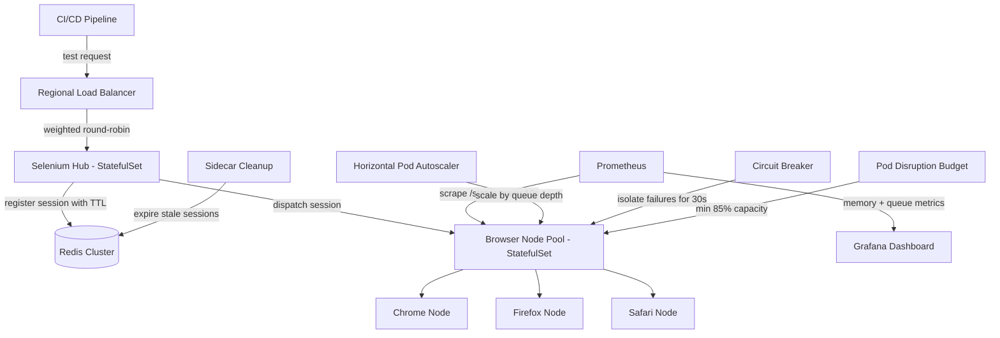

| Difficulty | Channel | Tags |
|---|---|---|
| advanced | system-design | selenium, webdriver, grid |

Picture this: a vendor quote for 1,000 parallel browser connections lands on the table at $2.41M per year [1]. That is what Expedia's quality engineering team faced while scaling one of the largest Selenium Grid deployments on AWS — 100+ hubs running 140,000+ UI tests daily across hundreds of microservices [1]. Instead of paying, they rebuilt the grid on Kubernetes and cut that cost to roughly $80,000 a year — a ~97% reduction [1]. This is the story of how they did it, and how you can design a grid that handles 10,000 concurrent sessions with 99.9% uptime, zero memory leaks, and graceful node failure. By the end, you will know exactly where the bottlenecks hide and the battle-tested pattern to fix them.

---

> ### Real-World Case — Expedia
>
> Expedia's quality engineering team ran one of the largest Selenium Grid deployments on AWS — 100+ hubs running 140k+ UI tests daily across hundreds of microservices, each with its own CI/CD pipeline. Their old EC2-based grid took 2-4 minutes to scale up nodes, hubs were static (stopped when idle to save money, costing feedback time), and third-party cross-browser vendors quoted ~$2.41M/year for the 1,000 parallel connections they actually needed.
>
> | | |
> |---|---|
> | **Challenge** | They needed a Selenium Grid that could scale instantly to hundreds of concurrent browser sessions, keep costs low, and give every branch/team its own isolated grid with different browser versions — without paying millions to external SaaS vendors. |
> | **Solution** | Expedia rebuilt the grid as 'DA Kube' — Selenium Grid on Kubernetes (EKS) using Docker, Helm, and Traefik. Browser nodes became Kubernetes pods scaled with `helm upgrade --set chrome.replicas=50`, each deployed branch got its own hub routed via Traefik ingress, and they used guaranteed QoS pod specs (matching CPU/memory requests and limits) to protect browser pods from eviction. They also documented IP address exhaustion edge cases (c5.2xlarge supports 19 browser pods vs 30 reserved IPs) and spot-instance strategies. |
> | **Outcome** | Grid scale dropped from 2-4 minutes to seconds on warm node pools, 140k+ tests/day across 100+ hubs, and running it internally cost roughly $80,000/year versus $2.41M for 1,000 parallel connections from a commercial cross-browser vendor — a ~97% cost reduction. They use commercial vendors only for a small subset of cross-browser coverage. |
> | **Lesson** | At scale, self-hosted containerized Selenium Grids are dramatically cheaper than per-parallel-connection SaaS pricing — but only if you design for reliability (Kubernetes QoS, per-branch isolated grids) and understand platform edge cases like pod IP exhaustion and node pool warm-up latency. |

---

## Hook — The Quote That Made a Room Go Quiet

It was a number that made the room go quiet: $2.41M per year [1]. That was the price of 1,000 parallel browser connections from a commercial cross-browser vendor — exactly what Expedia's quality engineering team needed to keep pace with 100+ hubs driving 140,000+ UI tests every day across hundreds of microservices, each with its own CI/CD pipeline [1].

Here is the thing though: the commercial solution would have worked. It would have absorbed the load, ticked the compliance boxes, and drained the testing budget in a single stroke. The team said no. Instead, they asked a far more interesting question: what would it take to run this scale on infrastructure they already owned — Kubernetes, Docker, Helm, and Traefik [1]?

This is that journey. By the end, you will know how to design a grid that handles 10,000 concurrent test sessions with 99.9% uptime, zero memory leaks, and graceful node failure. Spoiler: the answer starts with arithmetic, not YAML.

⚠️ Watch Out: the grid that works at 500 sessions is not the grid that works at 10,000. The failure modes are different, and they arrive quietly.

## Problem — Why Grids Rot Before They Scale

The uncomfortable truth about Selenium Grid is that a browser is a memory-hungry creature with a built-in talent for leaking. Every WebDriver session you spawn grabs RAM, file handles, and lingering processes. Selenium Grid routes commands from your tests to remote browser instances and enables parallel execution across machines [2] — but it does not promise to clean up after itself. That is your job.

Many developers discover that their grid does not scale; it just grows until it breaks. The classic failure pattern plays out like this:

- Nodes take minutes to provision, so a burst of CI builds queues up and tests time out
- Memory creeps upward session by session until a node becomes unresponsive
- One unhealthy node drags down the hub, which drags down everything behind it
- Restarting the whole grid becomes the only fix, and you lose feedback time every time

Consequently, teams end up in a spot where the grid is simultaneously the most critical and the most fragile part of the pipeline. Every flaky session is a false red in CI. Every false red erodes trust in the suite. And the moment you mention "scale to 10,000 sessions", the real questions surface: how much memory, how many nodes, and what happens when nodes die mid-run?

The stakes are higher than an uptime percentage. A slow grid throttles the development velocity of your entire organization. But here is the good news: other teams have already paid the tuition for these lessons.

## Real-World Case — Expedia's EC2 Grid vs. the Kubernetes Rebuild

Expedia's old EC2-based grid was the definition of "works in theory". It supported 100+ hubs and hundreds of microservices, but every part of it fought against the others. Scaling a node took 2-4 minutes — an eternity when CI is waiting. Hubs were static, and to save money they were stopped when idle, which only made the feedback loop slower [1]. When the team priced a commercial alternative for the 1,000 parallel connections they truly needed, the quote came back at roughly $2.41M per year [1].

That was the turning point. Instead of paying, they rebuilt the grid on a warm node pool managed by Kubernetes, using Docker, Helm, and Traefik as the ingress router in front of multiple hub services [1]. The results were staggering:

- Node provisioning dropped from 2-4 minutes to seconds on warm pools [1]
- 140,000+ UI tests now run daily across 100+ hubs
- Internal operating cost: roughly $80,000 per year — versus the $2.41M vendor quote, a ~97% cost reduction [1]

And crucially, they kept commercial vendors in the picture — but only for the small subset of cross-browser coverage that genuinely needs it [1]. The long tail stays external; the heavy lifting comes home.

🔥 Hot Take: "we need a vendor because the grid is hard" is often really "the grid is hard because we never treated it as a production system." Expedia treated it as one, and the math changed.

## Deep Dive — The Anatomy of a 10,000-Session Grid

Building on Expedia's story, let's reverse-engineer the architecture that holds up at 10,000 concurrent sessions. Start with the numbers, because everything else follows from them.

Selenium Grid runs a hub-and-node model: a central hub routes session requests to browser nodes [2]. If each node comfortably hosts 50 parallel sessions, then 10,000 sessions ÷ 50 sessions per node = 200 nodes minimum. At 2GB of RAM per node, that is 400GB of baseline memory. Add a 30% buffer for overhead and headroom, and the cluster needs roughly 520GB of RAM. These are the numbers that should drive capacity planning — not vibes.

Now layer in the demands:

- P99 session initiation under 2 seconds, delivered through regional load balancing
- 99.9% uptime, which means less than 8.76 hours of downtime per year — spread across availability zones, not concentrated in one outage
- Automatic session lifecycle management, because "the test finished" and "the process died" must be distinguishable

The hub itself should run as a Kubernetes StatefulSet so each hub keeps stable identity and persistent state across restarts [3]. Node pools scale horizontally with a twist: scale on queue depth, not CPU. Horizontal pod autoscaling keys off how many sessions are waiting to be picked up — the metric that actually predicts demand [4].

Sessions live in a Redis cluster with TTL-based expiration [5]. TTL is the quiet hero here: a session key that expires automatically is a session that cannot leak. Connection pooling keeps Redis from becoming the bottleneck, and an expiration scan every five minutes sweeps up stragglers [5].

Then come the resilience layers. Health checks hit an HTTP /status endpoint every 10 seconds; three consecutive failures remove a node immediately. Circuit breakers — the pattern Martin Fowler popularized — isolate a failing node for a 30-second recovery window so it cannot poison the hub [7]. Pod Disruption Budgets guarantee at least 85% capacity even during maintenance, so the grid survives a deliberate teardown, let alone an accidental one [8]. And because "when do you deploy?" is a schedule, not a question, rolling updates keep sessions alive while new node images roll through [9]. Canary deployments with traffic splitting catch zero-day failures before they touch the fleet.

The old way vs. the Kubernetes way:

| | Static EC2 grid | Kubernetes grid |
|---|---|---|
| Node provisioning | 2-4 minutes | seconds (warm pools) |
| Scaling trigger | manual / scheduled | HPA on queue depth |
| Session cleanup | manual, leak-prone | Redis TTL + sidecar sweep |
| Node failure | cascading | circuit breaker isolation |
| Deploys | downtime window | rolling + canary |
| Memory management | react after alert | 80% alerts, GC tuning, weekly restart |

A table like this is a checklist. If your grid looks like the left column, you already know the destination.

## Workflow — From CI Pipeline to Browser Session and Back

Here is the playbook that turns those pieces into a system. The diagram below shows the flow from CI to browser node and back — every component earning its keep.

The step-by-step workflow:

1. **Route the load.** Regional load balancers accept test requests and distribute them with weighted round-robin based on node capacity and response time.
2. **Track every session.** The hub registers each session in the Redis cluster with a TTL; connection pooling keeps Redis hot without melting it [5].
3. **Scale on demand.** The autoscaler watches queue depth and grows or shrinks the node pool accordingly — scaling in seconds on warm pools, not minutes on cold EC2 [4].
4. **Watch the vitals.** Prometheus scrapes the /status endpoint every 10 seconds and feeds Grafana dashboards showing memory trends and session duration [6].
5. **Cut out the rot.** Three consecutive health-check failures trip a circuit breaker that isolates the node for 30 seconds; expired Redis keys are swept every five minutes [7].
6. **Deploy without fear.** Rolling updates and canary traffic splitting ship new node images while Pod Disruption Budgets hold capacity at a minimum of 85% [8][9].

If this feels like a lot, you are not alone — that is normal for a system touching compute, state, networking, and observability at once. The payoff is a grid where node death is an event, not an incident.

## Code Example — A Session Lifecycle Manager with Circuit Breaking

The heart of zero-leak operation is the session lifecycle manager. Here is a stripped-down version in Python that shows the two patterns doing the heavy lifting: Redis TTL for automatic cleanup, and a circuit breaker for node isolation.

```python
import time
import redis

class CircuitBreaker:
    """Isolate a node after repeated failures, then allow recovery."""
    FAIL_THRESHOLD = 3
    RECOVERY_WINDOW = 30  # seconds

    def __init__(self):
        self._failures = 0
        self._open_until = 0.0

    @property
    def is_open(self):
        if time.time() > self._open_until:
            self._failures = 0  # recovery window passed: reset and retry
            return False
        return True

    def record_failure(self):
        self._failures += 1
        if self._failures >= self.FAIL_THRESHOLD:
            self._open_until = time.time() + self.RECOVERY_WINDOW

class SessionManager:
    SESSION_TTL = 3600  # 1 hour; the key expires even if a process dies

    def __init__(self, redis_client):
        self.redis = redis_client
        self.breakers = {}

    def create_session(self, node_id):
        breaker = self.breakers.setdefault(node_id, CircuitBreaker())
        if breaker.is_open:
            raise RuntimeError(f"node {node_id} isolated (circuit open)")

        # Reserve the node, then persist the session with an expiry.
        token = f"session:{node_id}:{int(time.time())}"
        self.redis.set(token, "active", ex=self.SESSION_TTL)
        return token

    def heartbeat(self, token):
        # Only refresh the TTL for sessions still alive.
        return bool(self.redis.expire(token, self.SESSION_TTL))

    def report_failure(self, node_id):
        self.breakers.setdefault(node_id, CircuitBreaker()).record_failure()

    def cleanup_stale(self):
        # TTLs do the real work; this sweeps keys that outlived their TTL.
        for key in self.redis.scan_iter("session:*"):
            if not self.redis.get(key):
                self.redis.delete(key)
```

Walk through what happens on a bad day. A session is created and written to Redis with a one-hour TTL [5]. Even if the worker process is killed, the key expires on its own — that is the memory-leak prevention doing its job without any manual cleanup. The heartbeat refreshes the TTL only for sessions still in use, so idle sessions expire instead of accumulating. And the circuit breaker: after three recorded failures, the node is quarantined for 30 seconds; sessions route around it, and nobody has to page anyone [7]. The periodic sweep exists as a backstop for edge cases, but the system does not depend on it.

## Lessons Learned — What to Do Differently Tomorrow

The journey from "it works" to "it works at 10,000 sessions" leaves you with a handful of principles you can carry anywhere:

- **Do the arithmetic before the YAML.** 10,000 ÷ 50 = 200 nodes and roughly 520GB of RAM is not trivia; it is the specification. Capacity planning starts with a calculator.
- **Scale on the metric that predicts demand.** For a grid, that is queue depth, not CPU utilization [4].
- **Make cleanup automatic, not aspirational.** TTLs and sidecar sweeps turn "we should clean up" into "it is impossible to leak" [5].
- **Design for node death as a normal event.** Health checks, circuit breakers, and Pod Disruption Budgets mean a failed node is a metric, not an outage [7][8].
- **Keep the expensive specialist for the long tail.** Expedia's 97% cost cut came from bringing the bulk of the load in-house and reserving the vendor for niche cross-browser coverage [1].

🎯 Key Point: a grid is a production system. Treat memory as a budget, node failure as an expectation, and observability as non-negotiable — and the grid stops being the scariest part of your pipeline.

The final insight to take back to your team: every minute of node provisioning is a minute of developer feedback you are paying for. Expedia turned minutes into seconds and turned a $2.41M quote into an $80K line item [1]. The same math is waiting on your capacity spreadsheet.

---

## Selenium Grid Autoscaling Architecture



<details>
<summary><strong>Original Interview Question</strong></summary>

**Q:** Design a scalable Selenium Grid architecture to handle 10,000 concurrent test sessions with 99.9% uptime, ensuring zero memory leaks through automatic session lifecycle management, real-time monitoring, and graceful node failure recovery across multiple data centers?

**A:** Deploy Kubernetes cluster with auto-scaling node pools, Redis session store with TTL policies, Prometheus metrics for memory monitoring, circuit breakers for node isolation, and sidecar containers for session cleanup. Implement health checks, resource quotas, and rolling updates.

</details>

## Conclusion

The Expedia story is not really about Selenium Grid — it is about what happens when a team refuses to accept "expensive and slow" as the price of scale [1]. They took a system that took minutes to provision, was fragile under load, and leaked memory by design, and rebuilt it into something that scales in seconds, fails gracefully, and costs 97% less to run [1].

So what should you do differently tomorrow? Run the numbers on your own grid. Check your session TTLs, your health-check cadence, and whether your autoscaling metric actually predicts demand. If your node provisioning is measured in minutes, that is not a detail — it is the smell that started this entire story.

And the one insight to share with your team: in distributed testing, memory leaks and slow scaling are not infrastructure problems. They are feedback problems — and feedback time is the most expensive resource a development organization owns.

---

## References

1. [Expedia incident report](https://medium.com/expedia-group-tech/da-kube-selenium-grid-using-kubernetes-docker-helm-and-traefik-856b802d1d08) — article
2. [Selenium Grid documentation](https://www.selenium.dev/documentation/grid/) — documentation
3. [Kubernetes StatefulSets](https://kubernetes.io/docs/concepts/workloads/controllers/statefulset/) — documentation
4. [Kubernetes Horizontal Pod Autoscaling](https://kubernetes.io/docs/tasks/run-application/horizontal-pod-autoscale/) — documentation
5. [Redis data structure store documentation](https://redis.io/docs/latest/) — documentation
6. [Prometheus overview](https://prometheus.io/docs/introduction/overview/) — documentation
7. [CircuitBreaker pattern by Martin Fowler](https://martinfowler.com/bliki/CircuitBreaker.html) — blog
8. [Kubernetes Pod Disruption Budgets](https://kubernetes.io/docs/tasks/run-application/configure-pdb/) — documentation
9. [Kubernetes Rolling Updates](https://kubernetes.io/docs/tutorials/kubernetes-basics/update/update-intro/) — documentation
10. [Kubernetes multi-zone clusters](https://kubernetes.io/docs/setup/best-practices/multiple-zones/) — documentation

---

**Author:** Satishkumar Dhule — [GitHub](https://github.com/satishkumar-dhule) · [LinkedIn](https://linkedin.com/in/satishkumar-dhule) · [Website](https://satishkumar-dhule.github.io)
