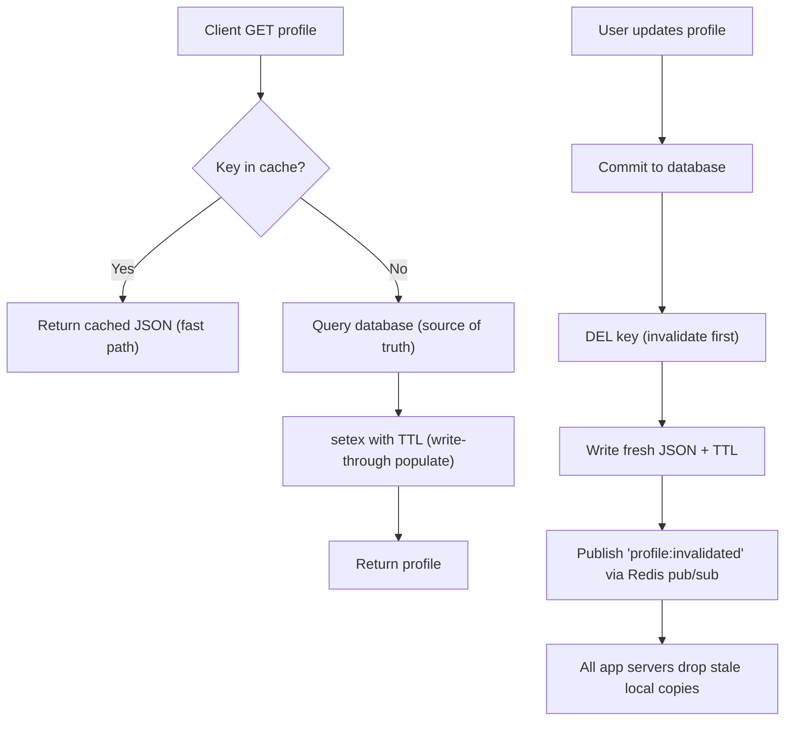

| Difficulty | Channel | Tags |
|---|---|---|
| beginner | backend | redis, memcached, cache-invalidation |

By 2014, Twitter's Timeline service was answering every user's home feed from a fleet of more than 10,000 machines holding roughly 105TB of RAM [1]. All of it dedicated to one question: what does this feed look like right now? The answer, for engineers across the industry, starts with the same humble building block you will face in your very first system design interview — the cache. But here is the plot twist: Twitter originally bet on Memcached for that workload, hit a wall, and shipped a specialized fork of Redis to handle the fanout pattern Memcached could not [1]. Understanding why is the difference between cache code that works on a laptop and a cache that survives a billion users.

---

> ### Real-World Case — Twitter
>
> By 2014, Twitter's Timeline service - the index of tweets that powers every user's home and profile timelines - was being cached across tens of thousands of machines. They had originally tried Memcached for this workload, but hit a wall: tweets are tiny writes fanned out to millions of follower timelines, while timeline reads want a large batch of entries.
>
> | | |
> |---|---|
> | **Challenge** | Memcached's key-value model required an expensive read-modify-write cycle for incremental writes on large cached objects (the timeline), which created a network bandwidth bottleneck on gigabit links at 100K+ reads/writes per second. Timeline objects also vary wildly in size (a celebrity home timeline is huge, a normal user's is small), making memory usage and write latency unpredictable. They needed a cache that could store ordered lists, update them atomically, and handle fanout invalidation across millions of keys on every new tweet. |
> | **Solution** | Twitter moved timeline caching from Memcached to Redis (first used internally in 2010, scaled out via the 'Scaling Redis at Twitter' effort). They forked Redis 2.4 and added two custom data structures: Hybrid List (a linked list of ziplists) for predictable memory and write latency on timelines, and BTree for range queries on hierarchical keys. Caches were run as look-aside caches in a proxy-routed cluster (Twemproxy lineage), with the client responsible for fetching missing keys on a miss - i.e., explicit invalidation/replenishment on writes rather than stale TTL reads. |
> | **Outcome** | By late 2014 the Timeline Service alone ran ~40TB of allocated heap at ~30MM qps across >6,000 instances, and the BTree cluster added ~65TB at ~9MM qps across >4,000 instances - about 105TB of RAM, 39MM queries per second, and 10,000+ instances total. Redis proxy hops stayed under 0.5ms latency, and Twitter shipped a specialized fork that handled the fanout-heavy timeline workload that Memcached could not. |
> | **Lesson** | The right cache isn't just about raw GET/SET speed - Memcached was faster per-core for simple lookups, but Redis won because the workload (ordered lists, atomic append/trim operations, read-modify-write on large objects) needed data structures, not just strings. Fanout-heavy systems must consider the network cost of every cached object: when one write touches millions of cache keys, the data structure and memory model of the cache matter more than raw throughput. |

---

## Hook — The Stale Profile Picture Staring Back at You

Picture this: a user edits their profile photo, and for the next fifteen minutes, thousands of other users still see the old face staring back at them. Nobody told the cache what changed. This is the quiet, unglamorous problem hiding behind most so-called "cache bugs" — invalidation. It is the reason a well-intentioned developer can add Redis, watch every read get dramatically faster, and still ship a feature that serves stale data for hours. And when the profile service belongs to a platform like Twitter, "hours of stale data" is measured in millions of users [1]. Sound familiar? Good — because that tension between speed and truth is exactly what this article is about.

## Problem — Caching Is Easy, Invalidation Is Where the Pain Lives

So you are building a user profile service, and reads are getting hot. Every GET request is hammering the database, response times are climbing, and the ops dashboard looks like a cardiogram at the end of a marathon. The instinct is to reach for a cache — Redis or Memcached — and the instinct is right. But many developers discover the hard way that caching is the easy part; invalidation is where the pain lives. A cache with a weak invalidation strategy is a lie machine: it returns data that is confident, fast, and wrong. The classic failure modes are all familiar. Write to the database but forget the cache, and stale data lingers until the TTL finally expires. Or clear the cache before the write commits, and a racing read repopulates it with the old value. Every profile update becomes a consistency decision, and every decision you get wrong erodes user trust, one out-of-date avatar at a time.

## Real-World Case — Twitter's 105TB Timeline Fleet

Nobody illustrates the stakes better than Twitter, which by 2014 had grown its Timeline service into one of the largest caching systems on the planet [1]. The workload was brutal: tweets are tiny writes that fan out to millions of follower timelines, while a timeline read wants a large batch of entries in a single shot. Twitter originally tried Memcached for this job and hit a wall — the fanout-heavy pattern is exactly what a simple key-value store handles poorly. By late 2014 the Timeline service alone ran roughly 40TB of allocated heap at about 30 million queries per second across more than 6,000 instances, while the BTree cluster added another ~65TB at ~9 million QPS across ~4,000 instances [1]. That is roughly 105TB of RAM, 39 million queries per second, and more than 10,000 instances, all to serve one timeline read. Twitter shipped a specialized fork of Redis that absorbed the fanout workload, with proxy hops staying under 0.5ms of added latency [1]. The lesson is not "Redis beats Memcached." It is that your choice of cache engine shapes how — or whether — you can solve invalidation at scale.

## Deep Dive — Write-Through Strategy and the Redis vs Memcached Trade-off

Building on that story, the interview question that opened this article asks you to do two things at once: design an invalidation strategy and pick an engine. Start with the strategy, because the engine should follow the workflow, not the other way around. The write-through pattern is the workhorse: on update, write to the database, then delete the cache key, then write fresh data with a TTL of 5–30 minutes for profiles. Why delete before write? Because a concurrent read that lands between your delete and your fresh write triggers a cache miss, which safely repopulates from the database — the classic cache-aside flow [7]. On a single node, this is trivially consistent. The plot twist arrives when you scale. Now the cache is distributed across many app servers, and a delete on one node does nothing for the copy sitting in another node's local heap. That is precisely where Redis and Memcached diverge [2][3]. Redis offers pub/sub and keyspace notifications, so one instance can broadcast an invalidation event that every peer hears in milliseconds [6]. Memcached has no such mechanism — coordination is manual, and teams end up solving it with short TTLs and hope. The trade-off table tells the rest of the story.

## Workflow — Six Steps from Read to Verified Consistency

So what does this look like as a sequence a team can actually run? Here is the step-by-step workflow, mapped to the diagram below. First, serve reads with cache-aside: check the cache; on a hit, return immediately; on a miss, query the database and populate the cache with a TTL. Second, treat the database as the source of truth for every update. Third, invalidate — delete the cache key before touching the cache with new data. Fourth, repopulate with the fresh serialized profile, always under the same TTL. Fifth, broadcast an invalidation event through Redis pub/sub so every application server drops its stale local copy, not just the one that handled the write [6]. Finally, monitor the numbers that matter: cache hit rate, miss latency, and eviction counts — a sudden dip in hit rate is your first warning that a TTL is too aggressive or a key pattern has changed. The flow diagram below ties all six steps into one picture:

## Code Example — The Boring Write-Through Pattern That Wins

Here is that entire workflow in roughly thirty lines of Python against redis-py. This is the pattern that has survived production for a reason: it is boring, and boring wins. The code directly implements the invalidation strategy from the interview answer — write-through, delete on update, TTL as the safety net, and a pub/sub broadcast for the moment your cache spans multiple nodes [6].

## Lessons Learned — Battle Scars from the Cache War

Circle back to Twitter one more time. The takeaway is not nostalgia about a 2014 fleet; the takeaway is that the caching decisions you make today are the architecture you will debug at 3am next year. A few battle scars worth collecting: a TTL is not a strategy, it is a safety net — always set one, even when your deletes are perfect [7]. Delete-before-write beats write-before-delete, because the window between them lets racing reads repopulate from the database instead of from stale heap memory. Choose the engine for the invalidation pattern, not the benchmark — Twitter's problem was not that Memcached was slow, it was that Memcached could not broadcast change [1]. Measure your hit rate; a 95% hit rate with a 15-minute TTL still serves stale data for 15 minutes. And when you scale past one node, treat pub/sub invalidation as a requirement, not an optimization — it is the difference between eventual consistency measured in seconds versus hours [6]. For tomorrow, start small: instrument the cache, define a TTL policy, and — before adding a single new cache — decide who tells every node when a key dies.

---

## Cache Invalidation Flow

<strong>Original Interview Question</strong>

**Q:** You're building a user profile service that caches frequently accessed profiles. How would you implement cache invalidation when a user updates their profile, and what trade-offs would you consider between Redis and Memcached?

**A:** Implement write-through caching with TTL-based expiration. On profile update, invalidate the cache by deleting the key and writing new data to both the database and cache. Redis offers pub/sub for automatic distributed invalidation, while Memcached requires manual coordination across nodes.

## Conclusion

The article opened with Twitter's 105TB timeline cache [1] and a deceptively simple interview question about invalidating a user profile. They are the same problem at different altitudes. The interview answer — write-through, delete on update, a TTL, and a pub/sub broadcast the moment you scale — is not trivia; it is the condensed version of a decade of production lessons [1][6]. So the next time a profile edit shows up on screen and the whole world stays consistent, you know exactly who to thank: the delete call, the TTL, and the boring pattern that just works. Go instrument your cache today, define your TTL policy, and share this with the teammate who keeps asking why the data looks wrong — tomorrow, the wrong answer will be a 2am pager instead of a question.

---

## References

1. [Twitter incident report](https://highscalability.com/how-twitter-uses-redis-to-scale-105tb-ram-39mm-qps-10000-ins/) — blog
2. [Redis — Wikipedia](https://en.wikipedia.org/wiki/Redis) — documentation
3. [Memcached — Wikipedia](https://en.wikipedia.org/wiki/Memcached) — documentation
4. [Workload Analysis of a Large-Scale Key-Value Store (Facebook Memcached workloads)](https://arxiv.org/abs/1203.5540) — paper
5. [Redis or Memcached — AWS ElastiCache documentation](https://docs.aws.amazon.com/AmazonElastiCache/latest/red-ug/SelectEngine.html) — documentation
6. [Redis keyspace notifications](https://redis.io/docs/latest/develop/use/keyspace-notifications/) — documentation
7. [Cache invalidation — Wikipedia](https://en.wikipedia.org/wiki/Cache_invalidation) — documentation
8. [memcached/memcached — GitHub repository](https://github.com/memcached/memcached) — documentation

---

**Author:** Satishkumar Dhule — [GitHub](https://github.com/satishkumar-dhule) · [LinkedIn](https://linkedin.com/in/satishkumar-dhule) · [Website](https://satishkumar-dhule.github.io)
