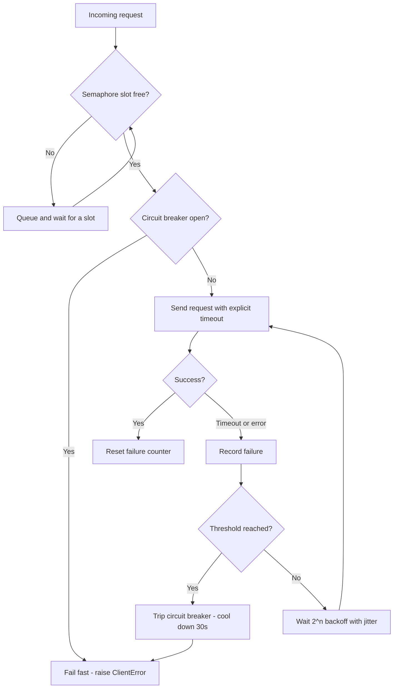

| Difficulty | Channel | Tags |
|---|---|---|
| advanced | backend | asyncio, aiohttp, concurrency |

By 2011, Netflix's API was fielding over a billion requests a day—and collapsing under the weight of its own success. A single sluggish backend, one hung connection, and every available request thread evaporated, sending the entire API into a cascade failure that crippled every device and client at once [1]. Sound familiar? If you run any async service, the same invisible menace is waiting for your next evening peak. This article shows you how to build an aiohttp connection pool that degrades gracefully instead of imploding.

---

> ### Real-World Case — Netflix
>
> By 2011, the Netflix API was a massive distributed system handling over 1 billion requests per day, but it kept failing during evening and holiday peak hours. A single misbehaving backend service — one that returned a slow response or hung — could tie up all available request threads and take the entire API down, causing cascading outages that affected all of Netflix's devices and clients.
>
> | | |
> |---|---|
> | **Challenge** | Netflix needed to control concurrent access to dozens of backend dependencies (each API instance called 40+ different services) and prevent connection/thread-pool exhaustion, latency buildup, and cascading failures when any single dependency degraded — exactly the graceful-degradation-under-load and timeout problem posed by connection pool management. |
> | **Solution** | Netflix built Hystrix, a fault-tolerance library that combines every pattern in the topic's answer: a per-dependency thread pool or semaphore (the bulkhead pattern) to cap concurrent connections and shed load instead of queueing forever; timeouts on every dependency call so slow requests fail fast; a circuit breaker that trips when error rates exceed a threshold and short-circuits requests to the failing dependency for a sleep window (half-open probing); and fallback responses for graceful degradation. |
> | **Outcome** | Hystrix grew from the API team's 2011 resilience work to a company-wide standard: tens of billions of thread-isolated and hundreds of billions of semaphore-isolated calls are executed through Hystrix every day at Netflix, and Netflix reports 'a dramatic improvement in uptime and resilience.' The API alone processes 10+ billion Hystrix command executions per day, with each instance running 40+ thread pools of 5–20 threads (most sized at 10), and thread-isolation overhead measured at only 3ms at the 90th percentile and 9ms at the 99th. |
> | **Lesson** | Resilience is deliberately failing fast, not trying harder: capping concurrency with semaphores/thread pools and tripping a circuit breaker protects the whole system by sacrificing requests to a sick dependency, and it works even when the client library is a 'black box' whose behavior you can't control. The counterintuitive insight was spending real CPU on thread isolation — and accepting that a timed-out request may still be running underneath — because a single unconstrained dependency could previously black out the entire API during peak hours. |

---

## Hook — The Billion-Request Crunch

It is 8pm on a holiday. Families are streaming movies, and Netflix's API is juggling more than a billion requests every single day [1]. Then one backend service—maybe the catalog, maybe recommendations—starts answering just a little slower than usual. Harmless, right? Wrong.

Each slow response parks a request thread in a holding pattern. Threads pile up, memory climbs, and before anyone can page an engineer, the entire API has fallen over. Every streaming device, every client, every user—dark, because one connection refused to die gracefully.

This is a story about connection exhaustion, why it takes down whole systems, and how disciplined connection pool management turns a potential meltdown into a barely noticeable blip. You are about to build the exact tool Netflix's engineers wish they had in 2011: a resilient aiohttp connection pool manager.

## Problem — The Domino Effect of Slow Downstream Calls

Here is the uncomfortable truth: most services do not fail because of hardware or bad code. They fail because of a quiet, compounding resource leak—stalled connections.

Every async service talks to other services: databases, payment gateways, content APIs. Each conversation occupies a connection, and connections are finite. When a downstream service slows or hangs, its partners hold connections open far longer than they should. Push enough concurrent slow calls and the pool is exhausted. New requests wait. Waiting becomes timeouts. Timeouts trigger retries. Retries pile onto an already-congested pool. Welcome to the retry storm [4].

The stakes are concrete: one misbehaving dependency can cap a service's effective throughput at near zero while the pool churns. Many teams discover this the hard way at 2am, staring at a wall of 500s. The good news is that the failure mode is predictable—which means it is also preventable.

## Real-World Case — Netflix and the Hystrix Legend

By 2011 the Netflix API was processing over 1 billion requests per day, and during evening and holiday peaks, it kept breaking. The root cause was the classic cascade: a single misbehaving backend that returned a slow response—or hung entirely—could tie up every request thread and take the whole API down, affecting every device Netflix shipped [1].

Netflix's response became an industry legend: Hystrix, a resilience library built on two ideas. First, isolate calls into separate thread pools or semaphore buckets so one failing service cannot starve the rest. Second, wrap every dependency call in a circuit breaker that trips after repeated failures and fails fast instead of hanging [3].

The results were staggering. Today Hystrix executes tens of billions of thread-isolated and hundreds of billions of semaphore-isolated calls every day. The API alone runs 10+ billion Hystrix command executions per day, each instance managing 40+ thread pools of 5–20 threads (most sized at 10). The price of that insurance? Thread-isolation overhead measured at just 3ms at the 90th percentile and 9ms at the 99th [1][2]. Netflix reported a dramatic improvement in uptime and resilience.

Here is the plot twist: you do not need Netflix's scale to hit Netflix's failure mode. The same cascade waits for any service running a naive connection pool.

## Deep Dive — The Anatomy of a Resilient Connection Pool

Building on the Hystrix story, a resilient aiohttp connection pool is really five layers working together.

First, bounding. A semaphore caps concurrent connections at a hard limit, exactly like the semaphore buckets Hystrix uses to isolate traffic [6][9]. When the limit is hit, requests queue instead of piling up uncontrollably. The tradeoff: queueing adds latency, so the pool size is a business decision, not a knob you crank to maximum.

Second, timeouts. This is where many teams fail first. aiohttp's default timeouts are generous—fine for a home project, dangerous in production. You need a short connect timeout and a total timeout so a hung service burns seconds, not minutes [7]. Without explicit timeouts, your graceful degradation is just a slow death.

Third, exponential backoff. Retrying instantly after a failure is the most reliable way to make things worse [4]. Backoff with jitter spaces retries out—2s, 4s, 8s—giving the downstream service room to recover and preventing a synchronized retry stampede.

Fourth, the circuit breaker. Even backoff cannot save you from a service that is down for ten minutes. A circuit breaker watches failure counts; after a threshold it trips and rejects requests instantly for a cool-down window [3][8]. This is the difference between a slow, grinding outage and a fast, clean one.

Finally, hygiene: connection keepalive to avoid TLS handshake overhead on every call, periodic pruning of dead sockets, connection warmup at startup, and a guaranteed shutdown path that releases everything on exit [5][7].

A common misconception: more connections equals more throughput. Not true. Beyond a saturation point, extra connections add context-switching overhead and hammer the downstream. Netflix deliberately sized its pools small (5–20 threads) for exactly this reason [1].

Here is the real tradeoff between the isolation styles Netflix weighed:

| Approach | Isolation | Overhead | Best for |
|---|---|---|---|
| Thread pool isolation | Strong | 3–9ms per call [1] | Mixed workloads, blocking dependencies |
| Semaphore isolation | Medium | Near zero | High-frequency, fast calls |
| No isolation | None | 0 | Prototypes only |

## Workflow — Seven Steps to a Pool That Fails Gracefully

The deep dive gives you the ingredients. This is the recipe—the sequence to follow when wiring a pool manager into a real service, from first request to shutdown.

1. Size the pool. Measure steady-state concurrency and latency; start conservative and watch queue depth.
2. Configure timeouts first. Set connect and total timeouts before writing any retry logic—they are the foundation [7].
3. Wrap access in a semaphore. Guarantee no code path touches the network without a slot [6].
4. Add the circuit breaker. Track failures with timestamps; trip after a threshold and refuse requests during cool-down [8].
5. Layer in exponential backoff with jitter for transient failures [4].
6. Add keepalive and warmup. Pre-open connections at startup; reuse them with TCPConnector keepalive.
7. Handle shutdown explicitly. On SIGTERM, stop accepting new work, drain in-flight requests, then close the session [5].

The diagram below shows how these layers cooperate on a single request. Follow the red path to see the graceful-degradation story: fail fast, back off, and trip the breaker instead of stacking retries.

[Diagram: Graceful Degradation Flow]

Each step is testable in isolation. That matters, because it means you can rehearse the failure before it happens in production.

## Code Example — A Production-Grade Pool Manager for aiohttp

Here is the real thing: a ConnectionPoolManager that puts all five layers together—semaphore bounding, explicit timeouts, exponential backoff, a circuit breaker, and graceful shutdown. Every line exists for a reason; none of them are decorative.

## Lessons Learned — Battle Scars and Actionable Next Steps

Every pattern in this article was learned by someone at 3am in front of a production incident. Here are the scars, so you can avoid reopening them.

- Never leak connections. Grab a response, consume it or close it—an unread response body is a silent pool leak that eventually freezes your app. A team once traced a mystery outage to a response never read [7].
- Validate SSL. In the rush to fix latency, teams disable TLS verification—and then wonder why the pool got compromised. Keep SSL context validation on in production.
- Do not trust default timeouts. aiohttp's defaults are permissive; a hung service will happily hold connections for minutes. Explicit, tight timeouts are non-negotiable [7].
- Trip the breaker, not your nerves. Do not retry forever. After N failures, fail fast for a cool-down window—your downstream needs a moment to breathe [8].
- Shut down properly. Skipping session.close() on shutdown causes the classic 'works in dev, hangs in prod' exit stall [5].
- Add jitter to backoff. A pure 2^attempt backoff synchronizes all your retries into a coordinated stampede. Randomize the delay [4].

The memorable takeaway: resilience is not about handling more—it is about failing with discipline. Netflix measured its insurance policy at 3–9ms per call [1]. That is a rounding error compared to the cost of a cascade failure.

Start small: add explicit timeouts to your session today, then a semaphore, then a circuit breaker. Each layer is independently valuable. Together they change the question from 'when will it break?' to 'how gracefully will it degrade?'

---

## Graceful Degradation Flow

<strong>Original Interview Question</strong>

**Q:** How would you implement a connection pool manager for aiohttp that handles graceful degradation under high load and connection timeouts?

**A:** Implement a connection pool manager for aiohttp using a semaphore to limit concurrent connections, exponential backoff for retrying failed requests, and circuit breaker pattern to gracefully degrade under high load and connection timeouts.

## Conclusion

Netflix learned in 2011 that a billion-request API is only as healthy as its worst-behaved dependency [1]. The same principle applies to your service: one hung connection, one retry storm, one unmanaged pool—and the entire house of cards comes down.

Tomorrow, do not try to build all five layers at once. Ship the timeouts. Then add the semaphore. Then the circuit breaker. Every layer you add is minutes of pain you will not live through at 2am. When the next peak hour comes, your pool will be the reason nobody notices.

And when a colleague asks why you keep nagging about connection pools, tell them about Netflix, Hystrix, and the 3ms insurance policy. That is the story that sticks.

---

## References

1. [Netflix Hystrix — How it Works](https://github.com/Netflix/Hystrix/wiki/How-it-Works) — article
2. [Netflix Hystrix — GitHub repository](https://github.com/Netflix/Hystrix) — documentation
3. [Circuit breaker design pattern](https://en.wikipedia.org/wiki/Circuit_breaker_design_pattern) — article
4. [Exponential backoff](https://en.wikipedia.org/wiki/Exponential_backoff) — article
5. [asyncio — Asynchronous I/O in Python](https://docs.python.org/3/library/asyncio.html) — documentation
6. [asyncio synchronization primitives — Semaphores](https://docs.python.org/3/library/asyncio-sync.html) — documentation
7. [aiohttp Client Reference](https://docs.aiohttp.org/en/stable/client_reference.html) — documentation
8. [Martin Fowler — Circuit Breaker](https://martinfowler.com/bliki/CircuitBreaker.html) — blog
9. [Semaphore (programming)](https://en.wikipedia.org/wiki/Semaphore_(programming)) — article

---

**Author:** Satishkumar Dhule — [GitHub](https://github.com/satishkumar-dhule) · [LinkedIn](https://linkedin.com/in/satishkumar-dhule) · [Website](https://satishkumar-dhule.github.io)
