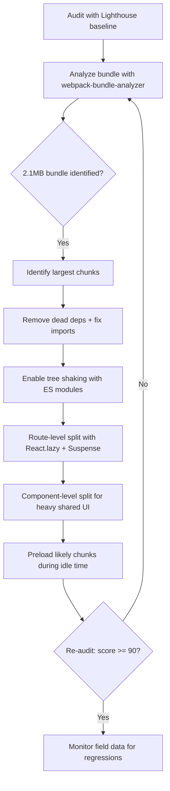

| Difficulty | Channel | Tags |
|---|---|---|
| intermediate | frontend | lighthouse, bundle, lazy-loading |

When Google announced that site speed would officially factor into search rankings via Core Web Vitals, GoDaddy's Websites + Marketing team found themselves staring down an SEO crisis — their shared JavaScript bundle had ballooned past 200KB, and average customer Lighthouse scores hovered near 40 [1]. It is the same silent tax behind that familiar engineering request: a React app with a 2.1MB bundle, a 4.2-second Time to Interactive, and a Lighthouse score stuck at 65. This is the story of how systematic bundle analysis and lazy loading turned those numbers around — and the playbook you can run on your own app tomorrow.

---

> ### Real-World Case — GoDaddy
>
> GoDaddy's Websites + Marketing service hosts millions of small-business websites, and when Google announced Core Web Vitals would factor into SEO rankings, site speed became a business-critical ranking lever. Their common JavaScript bundle had ballooned to over 200KB, dominated by heavy dependencies (immutable.js and draft.js), and average customer Lighthouse scores sat around 40 points.
>
> | | |
> |---|---|
> | **Challenge** | Reduce a large React-based common bundle so browsers could parse and execute critical scripts earlier, improving Largest Contentful Paint and First Input Delay across millions of heterogeneous sites — all while maintaining feature flexibility across templates and widgets. |
> | **Solution** | They ran Lighthouse audits at scale via an internal 'Lighthouse4u' service, identified the largest chunk of the JS bundle came from external dependencies, and restructured consumers to lazy load those dependencies on demand. They also deferred non-critical JavaScript (e.g. popup modals), externalized inline scripts for async parsing, optimized images with breakpoint-aware clamping and quality scaling, and used aspect-ratio/CSS placeholders to reserve space for images. |
> | **Outcome** | Common JavaScript bundle dropped by over 50%, from ~200KB to ~90KB minified. Average customer Lighthouse score rose from ~40 (Nov 2020) to above 70 (May 2021), and Core Web Vitals pass rate jumped from ~40% to ~70% — a 75% improvement. Notably, lab Lighthouse data missed the CLS problem entirely; field data was required to drive the final wins. |
> | **Lesson** | Bundle analysis plus lazy loading is the highest-leverage first step, but lab-only metrics (Lighthouse) can mislead — 'popup modal' sites scored 12 points lower, and CLS only surfaced in real-user field data. Measure with real-world Core Web Vitals to find what the lab hides. |

---

## Hook — Google Changed the Rules, and Your Bundle Became a Liability

Stop for a second and imagine your Lighthouse report being graded by an algorithm that decides who gets to find you in search. That stopped being hypothetical in 2020, when Core Web Vitals — Largest Contentful Paint, First Input Delay, and Cumulative Layout Shift — officially entered Google's ranking signals [8]. GoDaddy felt the pressure first and hardest: their Websites + Marketing product hosts millions of small-business sites, and every single one of them was wearing the same 200KB shared JavaScript bundle around its neck [1]. For a developer handed a 2.1MB bundle and a 4.2-second Time to Interactive, the question is no longer "how do we ship features?" but "how do we ship the least code possible, in the right order, at the right time?" Sound familiar? Then this journey is for you.

## Problem — The Bundle Bloat Tax You Didn't Sign Up For

Here is the uncomfortable truth: bundle bloat is never one mistake. It is a thousand small ones compounding silently. A UI library you imported for a single component. A utility package pulled in by three teammates who never noticed it already existed. A date formatter that ships to users who never open a calendar. Every dependency adds weight, and every byte you ship on the critical path costs you twice — once in download time, once in parse and execute time that pushes Time to Interactive further out [7]. The stakes are brutal: Lighthouse scores under 90 fail Google's recommended thresholds [9], and in the post-Core Web Vitals world, a slow app doesn't just shed users, it sheds rankings [8]. Many teams discover this the hard way — the ticket says "improve Lighthouse from 65 to 90+" and the reply is a 2.1MB bundle and 4.2 seconds of interactive latency staring back at them. That is the problem. The good news is that it is a solvable one, and GoDaddy proved exactly how.

## Real-World Case — GoDaddy's 50% Bundle Shrink

GoDaddy's Websites + Marketing service was in a precarious spot: millions of small-business websites, a shared JavaScript bundle dominated by two heavyweight dependencies — immutable.js and draft.js — and an average customer Lighthouse score around 40 [1]. In November 2020 they committed to a performance initiative, and the results were anything but incremental: the common JavaScript bundle dropped over 50%, from roughly 200KB to about 90KB minified. Average customer Lighthouse scores climbed from ~40 to above 70 by May 2021, and the Core Web Vitals pass rate jumped from ~40% to ~70% — a 75% improvement in just six months [1]. But here is the plot twist that should reshape how you approach every optimization project: lab Lighthouse data completely missed the Cumulative Layout Shift (CLS) problem. It was only field data — real users, real devices, real network conditions — that surfaced the final wins [1]. That single lesson — trust field data over lab scores — is worth the price of admission on its own, and it sets up everything that follows.

## Deep Dive — Code Splitting, Tree Shaking, and the Trade-Offs Nobody Tells You About

Building on GoDaddy's story, the real work begins with three complementary techniques: bundle analysis, code splitting, and tree shaking. First, you cannot optimize what you cannot see — webpack-bundle-analyzer renders your bundle as an interactive treemap, exposing the chunks that are eating your payload alive [6]. The horror stories are always in there: a 400KB charting library imported for one pie chart, or a text editor dragging in half its ecosystem. Second, code splitting changes when code loads. React.lazy() and Suspense make this idiomatic in React — you tell the bundler "this module does not belong on the critical path," and it splits it into its own chunk fetched only when needed [2][5]. Third, tree shaking relies on ES modules' static analysis to strip dead exports from your final bundle — which only works if your dependencies are actually built as ES modules and your build tool is configured to use them [7]. The trade-offs, however, deserve a hard look:

## Workflow — The Six-Step Optimization Loop

This leads to a repeatable workflow — a loop, not a one-and-done fix. The diagram below maps the full pipeline from audit to shipped improvement. Start by running Lighthouse to get a baseline [9], then open webpack-bundle-analyzer to see exactly what is inside the 2.1MB gorilla [6]. Identify the largest chunks and ask one question per module: "does this need to exist on the critical path?" Strip dead dependencies, fix imports to pull only what you use, and configure tree shaking by ensuring your dependencies resolve to their ES module builds [7]. Then split — first by route with React.lazy() and Suspense [2], then by heavy component for anything shared [5]. Finally, re-audit and compare against the baseline, and here is the pro tip: watch the field data (CrUX / RUM), not just lab scores — GoDaddy's CLS discovery proves lab data will lie to you [1]. Iterate until the number moves, then monitor so it never regresses.

## Code Example — Lazy Loading That Survives Production

Here is where the theory becomes practice. This pattern — route-level splitting wrapped in an error boundary with an idle-time preload — is the production-grade version of what GoDaddy's team effectively systematized: ship only what the current screen needs, and warm up the rest before anyone asks for it.

## Lessons Learned — What Survives Contact with the Real World

So what should you do differently tomorrow? First, measure before you optimize — a bundle analysis is a 10-minute investment that prevents weeks of cargo-cult optimization [6]. Second, treat lazy loading as a surgical tool, not a blanket: split by route first, then by heavy component, and verify each split with a fresh audit [5]. Third, embrace the counterintuitive truth GoDaddy discovered: field data matters more than lab data, so instrument real-user metrics early [1]. Battle scars from teams who have been through this: don't lazy-load everything (network waterfalls await), don't forget error boundaries around lazy chunks, and never assume a "fast" dependency is actually tree-shakeable — check its package.json for an `exports`/`module` field pointing at ES output [7]. And if this feels overwhelming, you are not alone — every team starts at a 65. The path to 90+ is simply: analyze, remove, split, verify, repeat.

---

## Bundle Optimization Pipeline

<strong>Original Interview Question</strong>

**Q:** You're tasked with improving a React app's Lighthouse performance score from 65 to 90+. The bundle size is 2.1MB and Time to Interactive is 4.2s. What specific steps would you take to optimize the bundle and implement lazy loading?

**A:** Implement code splitting with React.lazy() and Suspense, analyze bundle composition with webpack-bundle-analyzer to identify largest chunks, remove unused dependencies and optimize imports, add dynamic imports for heavy components and third-party libraries, implement route-based splitting for better initial load times, and utilize tree shaking with proper ES module configuration.

## Conclusion

The moral of GoDaddy's story is deceptively simple: performance is not a one-time cleanup, it is a feedback loop — analyze, remove, split, verify, and monitor with field data [1]. You do not need a platform hosting millions of sites to apply the same discipline; a 10-minute bundle analysis, a handful of route-level splits, and a tree-shaking audit can take a 2.1MB bundle and a 4.2-second TTI and turn them into a Lighthouse score your CEO will brag about. The one insight worth carrying into tomorrow's standup: trust real-user metrics over lab scores, because the algorithm and your customers both measure your app in the field. Ship less code, load it on demand, and let the data tell you when you are done.

---

## References

1. [GoDaddy incident report](https://web.dev/case-studies/godaddy) — article
2. [React lazy — React documentation](https://react.dev/reference/react/lazy) — documentation
3. [Dynamic import() — MDN Web Docs](https://developer.mozilla.org/en-US/docs/Web/JavaScript/Reference/Operators/import) — documentation
4. [React Suspense — React documentation](https://react.dev/reference/react/Suspense) — documentation
5. [Code Splitting — webpack documentation](https://webpack.js.org/guides/code-splitting/) — documentation
6. [webpack-bundle-analyzer — GitHub repository](https://github.com/webpack-contrib/webpack-bundle-analyzer) — documentation
7. [Tree Shaking — webpack documentation](https://webpack.js.org/guides/tree-shaking/) — documentation
8. [Learn Core Web Vitals — web.dev](https://web.dev/learn-core-web-vitals/) — documentation
9. [Lighthouse overview — Chrome for Developers](https://developer.chrome.com/docs/lighthouse/overview/) — documentation

---

**Author:** Satishkumar Dhule — [GitHub](https://github.com/satishkumar-dhule) · [LinkedIn](https://linkedin.com/in/satishkumar-dhule) · [Website](https://satishkumar-dhule.github.io)
