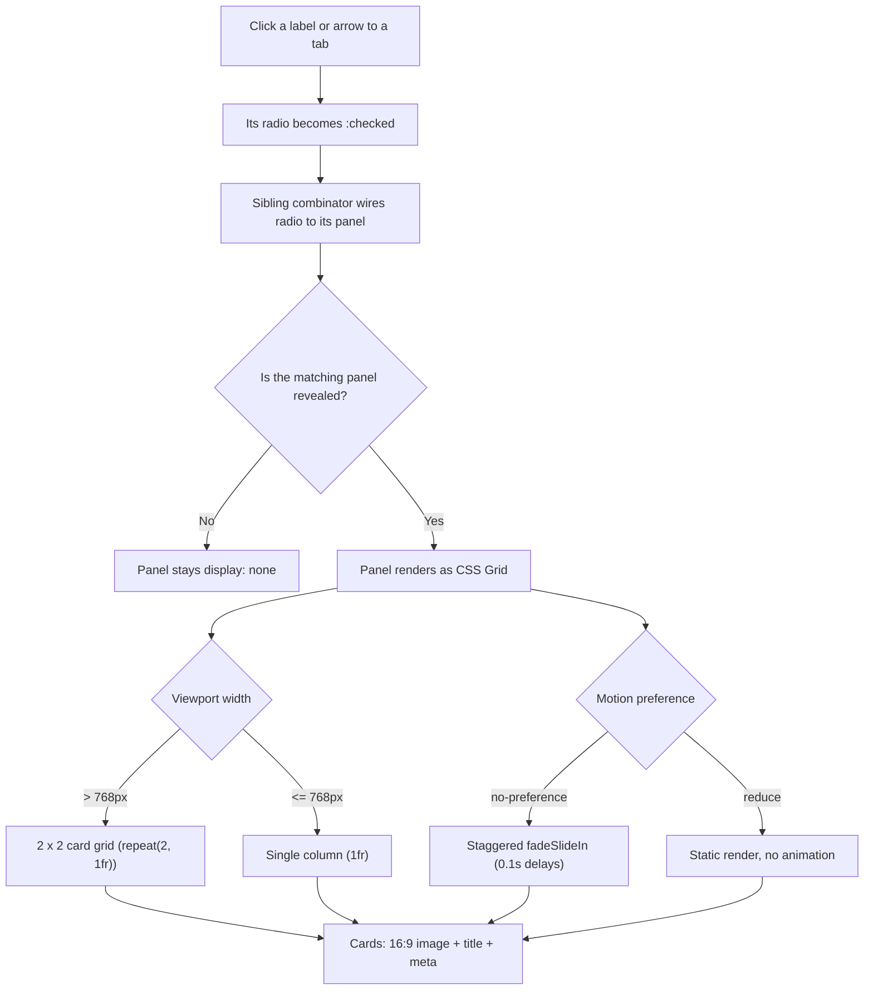

| Difficulty | Channel | Tags |
|---|---|---|
| beginner | frontend | css, flexbox, grid, animations |

In September 2013, Apple shipped iOS 7 with animations so aggressive that users reported nausea, vertigo, and headaches almost immediately [1]. The fix took four years to reach the web as a standard — and it is the same idea you need for a seemingly trivial component: the CSS-only tab panel. This is the story of how a few radio buttons and one media query solved a problem that once sent a trillion-dollar company scrambling.

---

> ### Real-World Case — Apple
>
> In September 2013, Apple shipped iOS 7, a dramatic redesign built on heavy UI animation — home-screen parallax, folder zoom effects, and apps that 'flew' toward the screen when opened. Almost immediately, users began reporting nausea, vertigo, and headaches, with some saying they had to close their eyes during transitions or downgrade to iOS 6. The Guardian, The Verge, and NBC News covered the wave of motion-sickness complaints, and vestibular-disorder advocates confirmed it could affect millions.
>
> | | |
> |---|---|
> | **Challenge** | Apple's decorative motion design (parallax, scaling, zoom) was a real vestibular trigger, causing physical symptoms — dizziness, nausea, loss of balance — in people with inner-ear and motion-sensitivity disorders. Their initial 'Reduce Motion' accessibility switch only disabled the parallax effect, not the app-zoom and folder animations that users complained about most, and there was no API or standard way for web developers to detect the user's motion preference. |
> | **Solution** | After the backlash, Apple expanded Reduce Motion in iOS 7.0.3 so it replaced zooms and parallax with fast cross-fades, then in 2014 exposed the setting to native developers via an API. The same concept was proposed to the CSS Working Group in 2014 and shipped in 2017 as the `prefers-reduced-motion` media query in Safari/WebKit — letting web authors wrap entrance animations, parallax, and carousels (exactly like the staggered card animation in this topic's answer) in a `@media (prefers-reduced-motion: no-preference)` block. Apple.com itself adopted it to disable scaling effects and background-video motion for sensitive users. |
> | **Outcome** | iOS 7.0.3 (October 2013) shipped a functional Reduce Motion toggle replacing zoom/parallax with cross-fades; iOS 8 exposed a Reduce Motion API to developers in 2014; the CSSWG proposal came the same year and `prefers-reduced-motion` shipped in Safari 10.1 in 2017, later in Chrome 74 and Firefox 63. The motivating scale: vestibular disorders affect up to 69 million people in the US alone, and Apple.com implemented the media query on its own product pages. |
> | **Lesson** | Decorative animation is not a neutral design choice — it can physically harm users with vestibular disorders (an estimated 69 million in the US). One company's misstep with pretty parallax/zoom effects produced both a real accessibility scandal and the `prefers-reduced-motion` web standard that frontend developers now use to gate every entrance animation. |

---

## Hook — A Design So Slick It Made People Physically Sick

Close your eyes and imagine it is September 2013. The phone upgrade your friends bragged about is now making strangers on the subway go pale. With iOS 7, every icon suddenly has depth, the home screen tilts as you move your device, and opening an app feels like watching it launch itself at your face. For most users it was the most gorgeous update in Apple's history; for a shockingly large slice of humanity it triggered nausea, vertigo, and headaches severe enough that people downgraded back to the flat, boring iOS 6 [1][2]. That is the stakes of this article: motion is not decoration. It is a physical experience, and when you ignore it, you exclude real people. By the end of this journey you will have built a genuinely accessible, CSS-only tab panel for a design-system docs page — and you will know exactly why that 69-million-person figure makes your job bigger than it looks [1].

## Problem — Tabs Without JavaScript, Motion Without Misery

Now drag that lesson down from the flagship keynote to something far less glamorous: the design-system docs page. Tab panels are the plumbing of documentation — API reference, usage guides, accessibility notes — and the default instinct is to reach for a JavaScript tab component. And why not? JavaScript has been the answer to "interactive thing on a page" since 2007, and the ecosystem quietly normalized a 30–40 KB dependency for what is, at its core, a visibility toggle. Here is the thing though: that dependency is a performance tax on every docs visitor, a potential accessibility minefield (ARIA roles, keyboard focus, and focus trapping all need hand-tuning), and a failure mode a static content page has no business carrying. So the real question lands: can you build the same UX with zero JavaScript — a 2×2 grid of cards on desktop, a single column on mobile, fixed 16:9 image areas, a title, a meta line, and a staggered entrance animation that respects prefers-reduced-motion? It sounds like a beginner interview question. It is also the exact component your team should be shipping today.

## Real-World Case — Apple's iOS 7 Motion-Sickness Fiasco

Nobody proved the cost of ignoring this question more publicly than Apple. In September 2013, iOS 7 shipped a dramatic redesign built on heavy UI animation — home-screen parallax, folder zoom effects, and apps that 'flew' toward the screen when opened [1]. Almost immediately, users reported nausea, vertigo, and headaches; some said they had to close their eyes during transitions, and others downgraded to iOS 6 [2]. The Guardian, The Verge, and NBC News covered the wave of motion-sickness complaints, and vestibular-disorder advocates warned it could affect millions. Then comes the plot twist: this was never a bug. It was a design decision colliding with a medical reality, which means the fix had to be a policy, not a patch. Apple shipped iOS 7.0.3 in October 2013 with a functional Reduce Motion toggle that replaced zoom and parallax with cross-fades; iOS 8 exposed a Reduce Motion API to developers in 2014; and the CSSWG proposal for prefers-reduced-motion came the same year [4]. Safari 10.1 landed the media query in 2017, followed by Chrome 74 and Firefox 63 [5]. And the scale behind all that effort: vestibular disorders affect up to 69 million people in the US alone — a number Apple.com now accounts for on its own product pages with the very media query this article is about [1].

## Deep Dive — Radio Buttons, Sibling Selectors, and the Specificity Trap

Building on that history, the CSS-only tab pattern starts making complete sense. It rests on three pillars: the :checked pseudo-class [6], the general sibling combinator [7], and the radio input's native exclusivity. Each tab is a radio input sharing one name attribute — the browser guarantees only one can be checked, for free. Each label is the visual button. And when a radio flips to :checked, a rule like #tab-overview:checked ~ .panel:nth-of-type(1) turns exactly one panel from display:none to display:grid [7]. You might think the obvious selector is input:not(:checked) ~ .panel — plenty of developers reach for it, and this is where the pattern quietly betrays them. That generic rule hides every panel that follows an unchecked input, so the moment you switch tabs, the panel you are trying to reveal gets hidden by another input's rule. The fix is discipline: every panel gets an explicit, ID-qualified reveal rule, and the generic rule is banished. The layout layer is just as elegant. CSS Grid reduces a 2×2 card grid to one line — repeat(2, 1fr) — and a 768px media query collapses it to a single column [9]. Old-school developers remember burning hours on the padding-top: 56.25% hack for fixed image ratios; the modern aspect-ratio: 16 / 9 property does it declaratively [8]. Two accessibility pillars complete the build: :focus-visible restores a crisp keyboard outline without wrapping every mouse click in a ring [10], and prefers-reduced-motion gates the whole entrance animation behind one query [4].

JavaScript tabs vs CSS-only tabs — the real tradeoff:

| Aspect | JavaScript tab component | CSS-only radio tabs |
| --- | --- | --- |
| Runtime dependency | 30–40 kB shipped | Zero bytes |
| 'One tab open' invariant | Hand-written state | Browser radio semantics |
| ARIA & keyboard wiring | Manual, easy to get wrong | Labels + native focus order |
| Deep linking / hashes | Trivial | Requires extra hacks |
| Lazy-loaded panels | Native | Not supported |
| Motion gating | Library-specific flags | prefers-reduced-motion |

The counterintuitive conclusion: the 'beginner' pattern wins on the docs use case precisely because it does less. The tradeoff flips only when you outgrow it.

## Workflow — Six Steps From Markup to a Shippable Panel

So how do you assemble this into something you would actually ship? The workflow is six deliberate steps. First, mark up radios, labels, and panels in strict order — input, label, panel — because the sibling combinator is order-sensitive [7]. Second, write one explicit reveal rule per panel and delete any generic input:not(:checked) rule from your memory. Third, define the panel grid with repeat(2, 1fr) and add the mobile media query that collapses it to 1fr. Fourth, build the card anatomy: an aspect-ratio 16:9 image area, a title, and a meta line. Fifth, wrap the entrance animation in prefers-reduced-motion: no-preference, staggering each card by 0.1s with backwards fill. Sixth, and crucially, audit the result with a keyboard only — Tab in, Enter to switch, and confirm the focus outline never vanishes. The Mermaid diagram below traces that entire journey from a single click to the rendered card grid, including both the responsive and the motion-preference branches. 🔥 Hot Take: if a docs page needs a JavaScript runtime just to swap visibility, the bundle is not the only thing that is bloated — the design decision is too.

## Code Example — The Whole Pattern, Wired Together

This is where the theory becomes a shippable component. The markup below is deliberately boring: three siblings repeated — a radio, a label, and a panel. The magic lives in the six CSS rules that connect them. Paste it into a file, open it in a browser, and you have a tab panel with zero JavaScript, a responsive 2×2 grid, staggered entrance animation, and full keyboard support. The comments in the code mark each decision point discussed in the Deep Dive.

## Lessons Learned — What iOS 7 Taught Design Systems Everywhere

Time to collect the battle scars, because this pattern has a few. First, the specificity trap is real: a generic hide rule will sabotage you the moment a second tab exists — always pair each panel with its own explicit reveal rule [7]. Second, same-name radios are not a hack; their native exclusivity is exactly what removes a whole class of state bugs. Third, keep the animation cheap — a 0.3s opacity-and-transform fade runs fine on mid-range phones, and backwards fill-mode prevents a flash of unstyled content before the animation begins. Fourth, never ship motion without a reduced-motion escape hatch; the 69-million figure from the iOS 7 era is the entire reason that query exists [1]. And fifth, know this pattern's ceiling: if you need lazy-loaded panels, dynamic tab counts, or deep-linking to a specific tab, JavaScript is the honest answer — knowing when a CSS trick has run its course is a senior-level call. 💡 Insight: a fast, accessible interaction is a design-system team's most underrated performance win. ⚠️ Watch Out: ordering matters — put the panel after the input, or the sibling selector silently matches nothing. 🎯 Key Point: if a radio button can express the state, a radio button should own the state.

---

## CSS-Only Tab Panel Flow

<strong>Original Interview Question</strong>

**Q:** Build a CSS-only tab panel for a design-system docs page. Use radio inputs to switch tabs (no JavaScript). Desktop: a 2x2 grid of cards under each tab; mobile: single column. Each card has a fixed 16:9 image area, a title, and a short meta line. Add a subtle entrance animation with a stagger and keep focus-visible outlines; ensure prefers-reduced-motion is respected?

**A:** Use a set of radio inputs with a shared `name` attribute and corresponding `` elements for each tab section. The `:checked` state of each radio controls visibility of its associated panel via adjacent sibling selectors. Each panel renders a 2×2 card grid on desktop and collapses to a single column on mobile. Cards use `aspect-ratio: 16/9` for fixed image containers, with a title and meta line below.

## Conclusion

The iOS 7 story ends with a media query that took four years to ship, and it taught the industry something that keeps getting re-learned: the animation you add to delight some users can literally sicken others, and the price of ignoring that is measured in lost trust [1]. The CSS-only tab panel is the same lesson in a smaller package — a few inputs, two grid rules, one motion query, and a component that loads instantly, stays keyboard-friendly by default, and costs your docs page absolutely nothing to render. So tomorrow, before you reach for the tab library, ask yourself one question: "Can a radio button and a sibling selector do this?" If the answer is yes, ship the 16 lines. If it is no, you will know exactly which part crossed the line. Either way, 69 million users will feel the difference [1]. Share that sentence with your team: motion is a user interface, not a cosmetic layer.

---

## References

1. [Apple incident report](https://webkit.org/blog/7551/responsive-design-for-motion/) — article
2. [iOS 7 - Wikipedia](https://en.wikipedia.org/wiki/IOS_7) — article
3. [Vestibular disorders - Wikipedia](https://en.wikipedia.org/wiki/Vestibular_disorders) — article
4. [prefers-reduced-motion - MDN Web Docs](https://developer.mozilla.org/en-US/docs/Web/CSS/@media/prefers-reduced-motion) — documentation
5. [prefers-reduced-motion: Sometimes less is more - web.dev](https://web.dev/articles/prefers-reduced-motion) — article
6. [:checked - MDN Web Docs](https://developer.mozilla.org/en-US/docs/Web/CSS/:checked) — documentation
7. [General sibling combinator - MDN Web Docs](https://developer.mozilla.org/en-US/docs/Web/CSS/General_sibling_combinator) — documentation
8. [aspect-ratio - MDN Web Docs](https://developer.mozilla.org/en-US/docs/Web/CSS/aspect-ratio) — documentation
9. [CSS Grid Layout - MDN Web Docs](https://developer.mozilla.org/en-US/docs/Web/CSS/CSS_Grid_Layout) — documentation
10. [:focus-visible - MDN Web Docs](https://developer.mozilla.org/en-US/docs/Web/CSS/:focus-visible) — documentation

---

**Author:** Satishkumar Dhule — [GitHub](https://github.com/satishkumar-dhule) · [LinkedIn](https://linkedin.com/in/satishkumar-dhule) · [Website](https://satishkumar-dhule.github.io)
