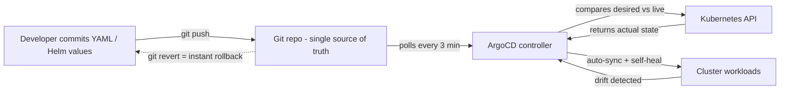

| Difficulty | Channel | Tags |
|---|---|---|
| beginner | devops | argocd, flux, declarative |

It used to take Intuit—the company behind TurboTax, QuickBooks, and Mint—days to roll a release across its fleet, driven by engineers hand-editing shell scripts under mounting pressure [1]. Then they discovered GitOps. By making Git the single source of truth for their Kubernetes clusters, Intuit slashed deployment cycles from days to minutes and cut rollback time from 45 minutes to under 5. Here is the story of that transformation, and what your teams can learn from it before your next release goes sideways.

---

> ### Real-World Case — Intuit
>
> Intuit (TurboTax, QuickBooks, Mint) was a fintech giant running releases as a painful manual ceremony: engineers updated hand-written shell scripts to roll a release across their fleet, so a full QuickBooks rollout took days. To modernize, Intuit acquired Applatix in 2018, the startup behind the Argo project, and began building a Kubernetes-based developer platform for its 5,000+ engineers.
>
> | | |
> |---|---|
> | **Challenge** | Imperative, script-driven deployments caused slow release cycles (days to release across the fleet), high MTTR (45 minutes), and no single auditable source of truth. Intuit needed a way to manage thousands of services across hundreds of clusters without configuration drift or manual toil. |
> | **Solution** | Intuit adopted the declarative GitOps model it helped invent: every deployment and ArgoCD instance itself is defined as YAML in Git, with Argo CD continuously reconciling the live cluster state to the declared state. They run Argo CD at massive scale (one instance per business segment rather than one global instance to limit blast radius), with Application CRDs pointing at Git repos, self-healing reconciliation, and ArgoCD managing its own instances (140+) via GitOps. Developers declare what they want in Git and the system makes it so — no kubectl bypassing version control. |
> | **Outcome** | Deployment cycles dropped from days to minutes; MTTR for rollback/roll-forward dropped from 45 minutes to under 5 minutes; a new service with full CI/CD pipelines can be created in under 10 minutes. Intuit grew from 0 to ~2,000 services on Kubernetes in 18 months, eventually running ~1,000 production deployments per day across 350+ clusters, 3,000+ Git repos, and 40,000+ ArgoCD applications for 5,000 engineers. |
> | **Lesson** | The declarative vs imperative divide is the whole point of GitOps: the same releases that took days with imperative manual scripts became rollbacks-as-git-reverts in minutes. Git-as-single-source-of-truth enables auditability, self-healing, and speed that imperative kubectl workflows can't match — and even the GitOps tool itself should be managed via GitOps. |

---

## Hook — The deploy looked fine. Then it didn't.

Picture this: it's 3 a.m., and an engineer is staring at a hand-written shell script, the last line of defense for rolling out a release to thousands of servers. One wrong variable, one missed server group, and the rollout that was supposed to take a few hours now bleeds into days. Sound familiar? That was the daily reality for Intuit, the fintech giant behind TurboTax, QuickBooks, and Mint, before they reinvented how they ship software [1]. The stakes could not be higher—when a tax-season update breaks, customers feel it instantly. But here is the thing that changes everything: the manual ceremony wasn't the problem. It was a symptom. The real problem was that nobody could agree on what "deployed" actually meant.

## Problem — The imperative trap: when kubectl becomes a liability

Every team that runs Kubernetes eventually faces the same slow slide into chaos. It starts innocently enough: a quick `kubectl scale deployment payments --replicas=12` during a traffic spike. Then a `kubectl edit` to hotfix a config in production. Each command works, in the moment, and each one quietly writes a change that exists nowhere in version control. Fast-forward six months and the cluster is a snowflake: the manifest in your repo says one thing, the live cluster says another, and nobody can explain the difference. This is configuration drift, and it is the silent killer of reliable releases [4]. We have all been there—deploying "the same image" to staging and production and getting wildly different behavior. The imperative approach of typing commands directly at the cluster bypasses your Git repository entirely, leaving you with no audit trail, no rollback path, and no single source of truth. Ever wondered why post-mortems keep blaming "environment differences"? Now you know.

## Real-World Case — Intuit: from shell scripts to 1,000 deployments a day

Enter Intuit's war story, because it is the proof that this problem is worth solving at scale. For years, releases were a painful manual ceremony: engineers updated hand-written shell scripts to roll a release across the fleet, meaning a full QuickBooks rollout took days. Every release was an adrenaline event with a real chance of production incident. Then, in 2018, Intuit acquired Applatix—the startup behind the Argo project—and began building a Kubernetes-based developer platform for its 5,000+ engineers [1]. The transformation was staggering: deployment cycles dropped from days to minutes, and MTTR for rollback or roll-forward fell from 45 minutes to under 5 minutes. A brand-new service with full CI/CD pipelines now launches in under 10 minutes [1]. The numbers tell the rest of the story: Intuit grew from zero to roughly 2,000 services on Kubernetes in 18 months, eventually running around 1,000 production deployments per day across 350+ clusters, 3,000+ Git repos, and 40,000+ ArgoCD applications [1]. The lesson is not that they scaled Kubernetes. It's that they made Git the contract between intent and reality—and ArgoCD the enforcement mechanism.

## Deep Dive — Declarative vs. imperative: the two philosophies of cluster management

So what exactly changed? It comes down to a philosophical shift in how you interact with your cluster. The imperative approach treats the cluster as an interactive system: you issue commands, it responds, and the state lives wherever the last command left it [4]. It is fast, but it is unaccountable. The declarative approach flips this: you write down the desired end state in YAML, Helm charts, or Kustomize overlays, commit it to Git, and let the controller make reality match your description [3]. ArgoCD's job is to run that reconcile loop continuously—polling your repository, diffing desired state against live state, and applying any differences, typically on an interval of one to five minutes [2]. Here is the plot twist that catches most developers off guard: ArgoCD is not a deployment tool in the way you're used to. It does not push changes out. It pulls—and then it watches. If someone sneaks in a `kubectl patch` to bypass the pipeline, self-healing detects the drift and reverts it automatically [2]. That is the difference between a system that trusts humans to remember and a system that corrects them.

## Workflow — Your first GitOps sync, step by step

Building on that understanding, let's walk through what a GitOps workflow actually looks like in practice. First, you create a Git repository holding your Kubernetes manifests, Helm charts, or Kustomize configurations—this becomes your single source of truth [5][6]. Second, you define an ArgoCD Application CRD that points at that repository, specifying which path, which branch, and which destination cluster it manages [2]. Third, you enable automated sync with a health-check interval (the classic default is three minutes) and flip on self-healing. From that moment, the loop looks like this: developers commit → ArgoCD sees the change → it reconciles the cluster → any manual drift gets reverted. The diagram below shows the full flow. A few pro tips after watching teams struggle: use `prune: true` so resources deleted from Git actually disappear from the cluster, and put the Application definition itself in Git so your GitOps bootstrap is also version-controlled. 💡 Insight: the three-minute interval is a sweet spot—too fast and you hammer the API server; too slow and drift lingers. ⚠️ Watch Out: enable `selfHeal` before you are ready for it. The first time it reverts someone's emergency hotfix, emotions run high. Have the conversation about process before you ship the safety net.

## Code Example — Bootstrapping ArgoCD and declaring your first Application

Now for the hands-on part. This bash script takes a fresh cluster from zero to a self-healing GitOps deployment. The first block installs ArgoCD into its own namespace; the second declares an Application that tells ArgoCD which repo to watch; the third verifies the sync actually completed. What matters most is the `syncPolicy` block—`prune: true` and `selfHeal: true` are what turn a nice dashboard into an automated enforcement engine. Note that the source is a path (`apps/payments`) inside a repo rather than a raw manifest: this pattern keeps multiple services in one repo while scoping each Application to its own directory, which is exactly how Intuit manages thousands of repos and tens of thousands of applications at scale [1][8].

## Lessons Learned — Battle scars, and what to do differently tomorrow

If this journey feels overwhelming, you are not alone—even the engineers running 40,000 ArgoCD apps got there one Application at a time. Here is what the Intuit story and countless production incidents teach us:
- Start declarative from day one. A repo that exists but is ignored is better than no repo at all.
- The imperative habit is the real enemy. Add a break-glass policy, but make every hotfix a commit by end of day.
- Self-healing is a culture change, not a checkbox. Brief your team before ArgoCD starts reverting their manual tweaks.
- Your code is not the only artifact that drifts—config, secrets, and infrastructure all need the same Git contract.
- Measure what you fix. Intuit tracked MTTR and deployment lead time because you can't improve what you don't measure [1].
- Alternatives exist: Flux is a credible choice with its own strengths, so evaluate both before you commit [9].

🎯 Key Point: the goal is not to automate everything. It's to make every state-changing action observable, reviewable, and reversible.

---

## GitOps Sync and Self-Healing Loop

<strong>Original Interview Question</strong>

**Q:** You're setting up GitOps for a microservices deployment. How would you configure ArgoCD to automatically sync changes from your Git repository to Kubernetes, and what's the difference between declarative and imperative approaches in this context?

**A:** I'd configure ArgoCD by setting up a Git repository containing Kubernetes manifests or Helm charts, creating an Application CRD that points to the Git repository, enabling auto-sync with a health check interval of 3 minutes, and implementing self-healing to automatically revert any manual changes. The declarative approach involves defining the desired state in Git through YAML manifests, Helm charts, or Kustomize configurations, where ArgoCD continuously reconciles the actual state with the desired state. In contrast, the imperative approach uses kubectl commands to make direct changes to the cluster, bypassing the Git repository as the single source of truth.

## Conclusion

The moral of the story: GitOps is less about tooling and more about trust. Intuit didn't just install ArgoCD and call it a day—they rebuilt their entire relationship with production around the idea that the only thing you can trust is version-controlled intent [1]. Tomorrow, you don't need 350 clusters to start. Pick one service, put its manifests in a repo, point ArgoCD at it, and let self-healing do its job. The first time a hotfix gets reverted by your own pipeline, you'll feel it in your stomach—and then you'll realize that system just saved you from a 3 a.m. shell-script session. The memorable insight to share with your team: in GitOps, your deployment strategy stops being a script and becomes a version control history—and that is a history you can finally trust.

---

## References

1. [Intuit incident report](https://www.cncf.io/case-studies/intuit/) — article
2. [Argo CD Documentation](https://argo-cd.readthedocs.io/en/stable/) — documentation
3. [Kubernetes Declarative Configuration Management](https://kubernetes.io/docs/tasks/manage-kubernetes-objects/declarative-config/) — documentation
4. [Kubernetes Imperative Configuration Management](https://kubernetes.io/docs/tasks/manage-kubernetes-objects/imperative-command/) — documentation
5. [Helm Documentation](https://helm.sh/docs/) — documentation
6. [Kustomize Repository](https://github.com/kubernetes-sigs/kustomize) — documentation
7. [GitOps - Wikipedia](https://en.wikipedia.org/wiki/GitOps) — documentation
8. [Argo CD GitHub Repository](https://github.com/argoproj/argo-cd) — documentation
9. [Flux2 GitHub Repository](https://github.com/fluxcd/flux2) — documentation

---

**Author:** Satishkumar Dhule — [GitHub](https://github.com/satishkumar-dhule) · [LinkedIn](https://linkedin.com/in/satishkumar-dhule) · [Website](https://satishkumar-dhule.github.io)
