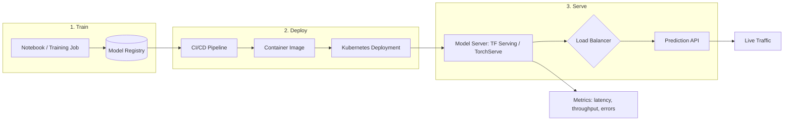

| Difficulty | Channel | Tags |
|---|---|---|
| beginner | devops | mlops, deployment |

By 2015, Uber was running machine learning across the heart of its business — ETA prediction, surge pricing, and delivery time estimates — yet every production model was a hand-built, one-off project. Models were trained in R and scikit-learn on desktop machines while separate engineering teams built bespoke serving containers per use case, which meant most models never reached production at all [1]. Sound familiar? The gap that strangled Uber's ML program is the same one that quietly caps most teams' machine learning impact: the confusion between deployment and serving. This article follows Uber's escape from that trap and shows how understanding the difference changes everything about your production systems.

---

> ### Real-World Case — Uber
>
> By 2015, Uber was running ML across its core business - ETA prediction, surge pricing, UberEATS delivery times - yet every production model was a bespoke project. Data scientists trained in R/scikit-learn on desktop machines, while separate engineering teams hand-built one-off serving containers per use case, so most models never reached production and ML impact was capped by manual effort.
>
> | | |
> |---|---|
> | **Challenge** | Uber had no standardized path from model experiment to production: no reproducible pipelines for training/prediction data, no way to train models larger than a laptop, no experiment store, no CI/CD for ML, and no reusable serving infrastructure. Every model meant a new custom serving container with no versioning, rollback, or monitoring. |
> | **Solution** | Uber built Michelangelo, an end-to-end ML-as-a-service platform covering the full lifecycle: standardized data management, a shared feature store (Cassandra-backed), CI/CD-backed deployment with one-click containerized rollouts and version history for rollback, a low-latency prediction service with models pre-loaded in memory, and automated monitoring that logs sampled predictions and joins them to observed outcomes (e.g., UberEATS predictions vs. actual delivery times) to detect drift. It unified deployment (pipelines, containers, monitoring) and serving (real-time feature fetch + model scoring) in one system. |
> | **Outcome** | Within a year Michelangelo was the de-facto ML platform at Uber, serving 250,000+ predictions/second at sub-10ms P95 latency (sub-5ms without feature-store lookups), and over the next 8 years scaled to 5,000+ models in production handling 10 million real-time predictions per second at peak across ETA, rider-driver matching, fraud detection, and Eats ranking. |
> | **Lesson** | Deployment and serving are separate problems that need separate abstractions: deployment is about reproducible pipelines, containers, CI/CD, versioning and rollback, while serving is about pre-loaded models, feature fetching, and low-latency routing - and conflating them (custom serving containers per project) is what prevents ML from scaling. Also, monitoring by joining predictions to outcomes is the missing safety net that makes rapid, automated deployment trustworthy. |

---

## Hook — Your model is perfect. Until it has to serve 10,000 requests a second.

Picture this: it is 3 a.m. and the pager is going off. The model your team shipped yesterday passed every offline test, yet prediction latency just spiked past 900ms, the load balancer is drowning in timeouts, and somewhere in the cluster a container is cold-starting a 2GB model while live requests pile up behind it. This is not a training failure. This is a failure of the boundary between deployment and serving. Here is the uncomfortable truth: most engineers use the two terms interchangeably, and that blurriness is precisely what turns a perfectly good model into a 3 a.m. incident. The good news? The fix is a mental model, not a rewrite.

## Problem — The handoff that eats your models

Here is the thing though — the confusion is understandable, because both words describe the same journey: getting a model out of the notebook and into production. However, they are two very different jobs with different tools, different metrics, and different failure modes. Deployment is the assembly line: infrastructure setup, CI/CD pipelines, monitoring, and rollback strategies. Serving is the storefront: runtime inference, request routing, model loading, and response optimization. When teams blur these boundaries, they ship deployment pipelines that stop at "the container is running" and serving layers that get bolted on as an afterthought. The research community even has a name for the result: the hidden technical debt of ML systems, where the model code becomes the smallest, easiest part of the whole system [8]. Consequently, the cost is concrete — models that never see live traffic, engineers manually babysitting inference endpoints, and performance cliffs that appear exactly when traffic spikes. Which raises the question: what does it look like when a company that cannot afford this failure gets it right?

## Real-World Case — Uber and the Michelangelo platform

Building on the stakes above, look at what happened when a company that absolutely needed ML in production hit this wall head-on. By 2015, Uber ran ML across its core business — ETA prediction, surge pricing, and UberEATS delivery times — yet every production model was a bespoke project. Data scientists trained in R and scikit-learn on desktop machines, while separate engineering teams hand-built one-off serving containers per use case, and most models never reached production. ML impact was capped by manual effort [1]. The plot twist? Uber did not fix this with better algorithms. It fixed it with a platform. Within a year of building Michelangelo, its ML platform, Uber was serving 250,000+ predictions per second at sub-10ms P95 latency — sub-5ms without feature-store lookups [1]. Over the next eight years, that platform scaled to 5,000+ models in production handling 10 million real-time predictions per second at peak across ETA, rider-driver matching, fraud detection, and Eats ranking [1]. The lesson hiding in these numbers: Michelangelo separated the concerns — deployment (getting models packaged, tested, and rolled out) from serving (running inference fast and reliably).

## Deep Dive — Deployment vs serving, and where the trade-offs really live

With the destination in sight, map the terrain. Deployment and serving live at different layers of the stack, use different technologies, and — most importantly — fail in different ways. Deployment owns the lifecycle: packaging models into containers, pushing them through CI/CD, and orchestrating rollouts and rollbacks across a cluster [2][9]. Serving owns the runtime: loading model weights into memory, routing requests to the right model version, and returning predictions inside a tight latency budget [3][4]. That split is why the technology lists rarely overlap.

| Concern | Deployment | Serving |
|---|---|---|
| Core job | Get the model to production safely | Keep inference fast and available |
| Typical tools | Kubernetes, Docker, Terraform, MLflow, GitHub Actions | TensorFlow Serving, TorchServe, FastAPI, gRPC, Envoy |
| Key metric | Deploy frequency, rollback time | Latency, throughput, error rate |
| Failure mode | Failed rollout, config drift | Cold start, memory pressure, timeout |
| Scaling lever | Horizontal replicas; vertical GPU/CPU allocation | Horizontal replicas; vertical batch size |

Now for the plot twist: serving is where most teams underestimate the difficulty. Training can be slow and forgiving; serving must be fast and predictable. Real-time inference like fraud scoring during checkout demands sub-100ms latency, while batch jobs such as nightly churn prediction can happily take more than a second per record. Choosing between them changes everything downstream — in-memory models and gRPC for real-time, offline workers and bulk processing for batch [6]. Similarly, the latency-versus-throughput trade-off is real: you can often have both, but rarely by accident. Binary serialization over gRPC cuts per-request overhead dramatically compared to JSON-over-HTTP, which is exactly why production model servers lean on it [3][6].

⚠️ Watch Out: cold start is the silent killer. When a replica spins up, it must pull the container image, load the model weights, and initialize the runtime — during which incoming requests either queue or fail. Production model servers preload models into memory for exactly this reason, and autoscaling policies for ML workloads need predictive signals, not just reactive CPU thresholds [3]. Scaling considerations also differ by axis: horizontal scaling adds pod replicas behind the load balancer [10], while vertical scaling buys GPU memory and CPU allocation. And once traffic can shift between versions, A/B testing and canary rollouts become your safety net for every change [7].

## Workflow — From notebook to live traffic, end to end

With the mental model in place, here is the workflow that turns a trained model into live predictions under load. It is the assembly line plus the storefront, wired end to end:

1. Register the model. Save the trained artifact with its version, metrics, and parameters in a model registry so every later stage can reference it by version [7].
2. Package it. Build a container image with a pinned runtime and bake the version into the artifact, so you always know which model you are serving [9].
3. Roll it out. Push the image through CI/CD with automated tests and a staged rollout — canary first, then full — on a Kubernetes cluster [2].
4. Load and serve. Point a model server at the deployed version; it loads weights into memory and exposes a prediction endpoint [3][4].
5. Route and shift. Place a load balancer in front, split traffic for A/B tests, and gradually shift live traffic to the new version [10].
6. Observe everything. Stream latency percentiles, throughput, error rates, and drift signals back into monitoring so rollbacks become a decision, not a guess [7].

The diagram below captures the whole flow from model registry to live traffic.

## Code Example — A serving endpoint that handles the handoff

A serving endpoint is the seam where deployment meets traffic, and a few defensive patterns separate production code from prototype code. This example builds a minimal FastAPI model server that loads a specific model version from an MLflow registry, exposes a health check for Kubernetes to probe, and validates inputs before inference [5][7]. Pin the version in the artifact, preload the model at startup, and fail loudly on bad input — three habits that prevent most serving incidents.

## Lessons Learned — What Uber's journey teaches your serving layer

If this feels like a lot, you are not alone — even Uber needed a platform-level push to get it right [1]. Here is what to take away and where to start:

- 🎯 Key Point: Deployment gets models to the door; serving makes them useful. Never let one team or one tool blur the two.
- ⚠️ Watch Out: Version everything, always. A model artifact without a version cannot be rolled back, and rollback is your last line of defense [7].
- 💡 Insight: Cold starts are the hidden tax on every scaling event. Preload models, warm replicas, and scale on predicted traffic, not just CPU spikes.
- 🔥 Hot Take: Choose your latency budget before you choose your architecture. Sub-100ms real-time and batch are different systems, not different settings [6].
- A/B traffic splitting and canary rollouts turn every risky change into a testable event [10].
- The goal is boring deployments. If shipping a model requires heroics, your pipeline — not your model — is the bottleneck.

---

## Deployment to Serving Pipeline

<strong>Original Interview Question</strong>

**Q:** Explain the key differences between model serving and model deployment in ML systems, including specific technologies, scaling considerations, and real-world implementation patterns?

**A:** Deployment encompasses CI/CD pipelines, infrastructure setup, and monitoring using tools like Kubernetes, MLflow, and SageMaker. Serving focuses on runtime inference APIs with frameworks like TensorFlow Serving, TorchServe, or BentoML, handling request routing, model versioning, and autoscaling. Key trade-offs include latency vs throughput, batch vs real-time inference, and cold start optimization.

## Conclusion

Uber's Michelangelo story ends in transformation: within a year the platform served 250,000+ predictions per second at sub-10ms P95 latency, and eight years later it handled 10 million real-time predictions per second at peak across ETA, matching, fraud, and Eats ranking [1]. Your team does not need that scale to benefit from the same discipline. Tomorrow, take one concrete step: pin a version on your next model artifact, or add a health check to your serving container. Small moves — the same ones that took Uber from bespoke containers to a platform. The models are ready. Is your serving layer?

---

## References

1. [Uber incident report](https://www.uber.com/us/en/blog/michelangelo-machine-learning-platform/) — blog
2. [Kubernetes Concepts: Cluster Architecture](https://kubernetes.io/docs/concepts/architecture/) — documentation
3. [TensorFlow Serving](https://github.com/tensorflow/serving) — documentation
4. [TorchServe](https://github.com/pytorch/serve) — documentation
5. [FastAPI Documentation](https://fastapi.tiangolo.com/) — documentation
6. [gRPC Documentation](https://grpc.io/docs/) — documentation
7. [MLflow Documentation](https://mlflow.org/docs/latest/index.html) — documentation
8. [Hidden Technical Debt in Machine Learning Systems](https://arxiv.org/abs/2010.02868) — paper
9. [Docker Get Started Guide](https://docs.docker.com/get-started/) — documentation
10. [Envoy Proxy](https://github.com/envoyproxy/envoy) — documentation

---

**Author:** Satishkumar Dhule — [GitHub](https://github.com/satishkumar-dhule) · [LinkedIn](https://linkedin.com/in/satishkumar-dhule) · [Website](https://satishkumar-dhule.github.io)
