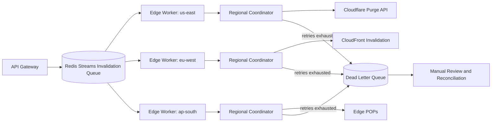

| Difficulty | Channel | Tags |
|---|---|---|
| intermediate | system-design | edge, caching, purging |

In 2012, Cloudflare built its cache purge system for a network of roughly 20 data centers. By the time the network had exploded to 270+ cities, that same system had silently become the bottleneck — every purge request had to round-trip through a handful of centralized 'core' data centers running a bare-metal message queue [1]. The fix was not a faster queue; it was deleting the layer entirely. Global purge latency dropped from ~1,570ms to 149ms at P50, a 90.5% improvement across 330 cities in 120+ countries, beating the 5-second SLA by over 30x [1]. This is the story of how that happened, and the blueprint it hands every team that must purge a global cache in seconds.

---

> ### Real-World Case — Cloudflare
>
> Cloudflare's cache purge system, first designed in 2012 when the network had about 20 data centers, silently became the bottleneck as the network exploded to 270+ cities. By 2022, every purge request had to round-trip through a handful of centralized 'core' data centers for authorization, filtering, and fan-out, and the core message queue was still running on bare-metal servers.
>
> | | |
> |---|---|
> | **Challenge** | Guaranteeing that a cache invalidation propagates to every data center in under 5 seconds (ideally close to the ~200ms speed-of-light limit) while scaling to handle bursts of concurrent purge requests — without a central core that becomes a single point of failure and scale ceiling for the whole network. |
> | **Solution** | They tore out the core entirely and built 'Coreless Purge': a fully decentralized architecture running on Cloudflare Workers and Durable Objects. A purge request enters the nearest data center, a Worker handles auth and filtering, and a Durable Object queues the request and broadcasts it directly to every data center in parallel — ripping out the central relay and its bare-metal queue. |
> | **Outcome** | Global purge latency for tags, hostnames, and prefixes dropped from ~1,570ms to 149ms at P50 — a 90.5% improvement — across 330 cities in 120+ countries, beating their 5-second SLA by over 30x and approaching the theoretical speed-of-light floor. This let customers treat cache purging as a real-time primitive rather than a batch operation. |
> | **Lesson** | An architecture that's fine at one scale can become the critical bottleneck at another: central coordination (a 'core' of datacenters serializing every purge) doesn't scale with geographic growth. Decentralizing coordination to the edge — making every data center both entry point and executor — is how you reach speed-of-light-bounded, strongly consistent cache invalidation at global scale. |

---

## Hook — The stale page that ruined a perfect deploy

The release looks perfect. Green pipelines, passing tests, a confident commit message. You hit deploy and wait for the congratulatory pings — then the first complaint rolls in: "Why am I still seeing the old pricing page?" You refresh. Still old. Ten minutes later, still old. Welcome to the quiet nightmare of cache invalidation, where your content is live everywhere except where your users actually are.

Here is the uncomfortable truth about CDNs: they are brilliant at making reads fast and terrible at making updates fast. Every cached byte that makes your site feel instant is a promise that breaks the moment you publish something new [3]. And when you need an update to reach every edge within seconds — while thousands of other invalidations are racing through the same pipes — "just purge it" stops being a button and becomes a distributed systems problem.

The stakes could not be higher: a stale checkout flow, a broken payment link, a corrected price that keeps showing the wrong number. Sound familiar? Then keep reading, because the fix is more counterintuitive than you think [1].

## Problem — Why purging a global cache is a distributed systems trap

Every cache purge request must travel to a decision point, get authorized, get filtered, and then fan out to every edge that could possibly hold a copy. In a small network, that round-trip is nothing. In a global network, it is everything [1].

The interview question that kicked off this journey nails the brutal part of the job: design a purge system that guarantees content propagation within 5 seconds while absorbing 10,000 concurrent invalidations per second. Pull those numbers apart and the constraints collide — 5 seconds is a real-time budget, 10K/s is industrial throughput, and "guarantee" means failure handling, not hope. Add 99.99% availability and strong consistency across regions, and you have the hardest four-line spec in distributed systems.

Why does this hurt? Because CDNs trade write speed for read speed [3]. There is no global clock, no transaction manager, no single database — just many autonomous edge caches spread across continents, always drifting. When you purge, you are not deleting from one store; you are coordinating hundreds of independent stores that are never in sync.

The common answer — call the CDN's purge API in a loop and hope for the best — is exactly how you get a 90.5% latency problem you did not know you had. The real challenge is architectural: who decides, where the decision happens, and how the fan-out stays fast as the network grows [1].

## Real-World Case — Cloudflare's silent bottleneck

In 2012, Cloudflare designed its cache purge system for a network of about 20 data centers. The architecture was simple and sensible: every purge request would round-trip through a handful of centralized 'core' data centers that handled authorization, filtering, and fan-out. Back then, that indirection was invisible — a blip in the metrics [1].

Then the network exploded. Twenty data centers became 270+ cities. And here is the plot twist: the purge system did not break loudly — it degraded silently. The core message queue, still running on bare-metal servers, became a growing pile of round-trips that every purge request had to survive. Nobody flipped a switch and killed the feature; it just got slower and slower, until purging felt like a batch job in a real-time world [1].

The fix was not a bigger queue or faster hardware. It was removing the layer entirely. Cloudflare rebuilt purge as a 'coreless' system where edge data centers process purges directly, using a cache-key-based check to prove whether a purge actually needs to fan out at all — touching other edges only when the keys genuinely match [1].

The result reads like a fairy tale with numbers: global purge latency for tags, hostnames, and prefixes dropped from ~1,570ms to 149ms at P50 — a 90.5% improvement — across 330 cities in 120+ countries. That beats the 5-second SLA by over 30x and approaches the speed-of-light floor for a round trip around the planet [1]. The transformation? Customers began treating cache purging as a real-time primitive instead of a batch operation. That is the bar this whole problem is judged against.

## Deep Dive — The anatomy of a 5-second purge

So what does a purge system designed for this world actually look like? The interview answer hands you a blueprint: an API gateway, an invalidation queue, edge workers, regional coordinators, and the CDN providers at the bottom. Every layer exists to answer one question, and none of them can answer it alone [6].

Start with the queue. Redis Streams with consumer groups [2] give you an append-only log that many workers can consume in parallel without double-processing — exactly the pattern you need when 10,000 events arrive every second and no single worker can keep up. Redis is the muscle behind it all: in-memory latency with durable, replayable stream semantics [10].

Then the edge workers. Cloudflare's story makes this look obvious only in hindsight: the decision should happen as close to users as possible, not in a core data center. Edge workers act as regional coordinators that validate a purge locally and fan out only to regions that could actually hold matching content [1].

Next, the batching trick. Purge APIs charge per call, and one-call-per-file is the most expensive way to operate. Batching 100 paths into a single call cuts API spend by up to 90% and slashes the number of requests your queue has to process [6].

And now the plot twist many developers miss: the most powerful cache-control tool you own is not the purge API at all — it is the TTL [3]. A short TTL like 2 seconds on dynamic content, with `Cache-Control: max-age=2, must-revalidate` [4], converts purging from the source of truth into a safety net. If a purge quietly fails, the cache corrects itself two seconds later anyway. RFC 5861 goes further with stale-while-revalidate, letting edges serve deliberately stale bytes while refreshing in the background — controlled staleness instead of chaos [7].

Finally, the failure toolkit. A circuit breaker that trips after five consecutive failures keeps a struggling provider from being hit even harder [9]. A dead letter queue catches invalidations that refuse to die so a human can inspect them instead of silently dropping them. Conditional requests and validators like ETags make revalidation cheap with "is this actually different?" checks [8].

Then the deep truth: strong consistency across regions is expensive, and CDN behavior is fundamentally eventually consistent [3]. Cloudflare's answer was to make propagation so fast that 'eventually' collapses into 'effectively now', with short TTLs underneath to guarantee correctness during hiccups [1][3]. Speed plus forgiveness — that is the real design.

Centralized vs. coreless — the real tradeoff:

| Dimension | Centralized (2012) | Coreless / edge-driven |
| --- | --- | --- |
| Where decisions happen | A handful of core data centers | The local edge, next to users |
| Latency driver | Queue hops that grow with the network | Local validation + targeted fan-out |
| Failure mode | Core queue becomes a silent bottleneck | Partitions handled by reconciliation |
| Scaling behavior | Degrades as cities multiply | Scales with the network itself |
| Measured latency | ~1,570ms P50 | ~149ms P50 |

That last row is not a benchmark. It is a verdict [1].

## Workflow — From publish to every edge, in seven steps

Building on the architecture above, here is the happy path from "user hits publish" to "every edge is correct" — plus the path when things go sideways.

1. **Ingest.** The API gateway validates the request and appends the invalidation to a Redis Streams consumer group [2]. Every message carries the target type — tag, hostname, or prefix — and the affected regions.
2. **Claim.** Edge workers consume the stream in parallel, each taking a batch of messages. Consumer groups guarantee that no two workers process the same message [2].
3. **Coordinate.** Each edge worker acts as a regional coordinator, checking whether its local cache keys match the purge targets before fanning out — skipping edges that cannot possibly hold the content [1].
4. **Purge.** The coordinator batches up to 100 paths per call and sends a pattern-based purge to the CDN provider API — Cloudflare's purge_cache endpoint or CloudFront's invalidation API [6][5].
5. **Back off.** On rate limits or 5xx responses, retry with exponential backoff and jitter, up to three attempts. The jitter is not optional — synchronized retries are how thundering herds are born [6][9].
6. **Fail safe.** Anything still failing after retries lands in a dead letter queue for manual review, and the circuit breaker opens to protect the provider [9].
7. **Reconcile.** Regional health checks monitor propagation; if a network partition splits the system, an eventual-consistency reconciliation pass catches stragglers and re-purges only the affected regions [1].

The diagram below tells the whole story in one glance: requests flow through the gateway, fan out through independent edge workers, and only touch the providers that genuinely need touching — with failed retries detouring to the dead letter queue instead of vanishing.

## Code Example — The batched purge client with real retry muscle

This is the beating heart of the pipeline: a batched purge client that honors the 100-paths-per-call rule, retries with exponential backoff plus jitter, and refuses to swallow failures silently. This is roughly what runs inside each regional coordinator.

The code below is the direct descendant of the patterns above — one recursive `purgeBatch` function, one `drain` loop that slices paths into manageable chunks, and one hard rule: exhausted retries throw an error instead of quietly disappearing.

## Lessons Learned — What a 90.5% latency improvement teaches you

So what should you take from Cloudflare's journey and apply on Monday morning?

- **Design for the network you will have in ten years.** Cloudflare's 2012 design was correct for 20 data centers and structurally wrong for 270+ cities [1]. Every layer you centralize today is a bottleneck you are pre-approving for tomorrow.
- **Short TTLs are the best purge system you will ever have.** A 2-second TTL with must-revalidate [4] means invalidation is an optimization, not your only correctness mechanism [3][7].
- **Remove layers instead of adding them.** The breakthrough was going coreless — eliminating the round-trip, not buying a faster queue [1]. When in doubt, flatten.
- **Batch, back off, and jitter.** 100 paths per call cuts API spend by up to 90% [6], and jittered exponential backoff keeps retries from becoming their own outage [9].
- **Embrace eventual consistency with reconciliation.** You cannot bolt strong consistency onto a global cache. You can, however, make propagation so fast that 'eventually' reads as 'now' — and catch the stragglers with reconciliation [1].

**Battle scars worth knowing:** teams often discover the hard way that wildcard purges are dramatically more expensive than exact-path purges, that purging per-file burns API quota and rate limits, and that a health check on one region gives a false sense of certainty. None of these show up in a demo. All of them show up at 2am.

Here is the memorable insight to share with your team: **cache purging is not a batch operation you fire and forget — it is a real-time primitive with a 5-second budget, and the architecture that wins is the one that gets out of its own way.** The next time you reach for the purge button, ask where the decision happens. If the answer is "far away," you have found tomorrow's incident [1].

---

## Coreless Purge Pipeline

<strong>Original Interview Question</strong>

**Q:** How would you design a multi-region CDN cache purging system that guarantees content propagation within 5 seconds while handling 10,000 concurrent invalidations per second?

**A:** Implement Cloudflare API + AWS CloudFront with distributed invalidation queue, edge compute coordination, and 2-second TTL. Use batch invalidation, exponential backoff, and regional cache headers for 5-second SLA.

## Conclusion

The journey started with a deceptively simple question — how do you purge a global CDN within 5 seconds while absorbing 10,000 invalidations per second — and it ends at a counterintuitive answer: stop making the purge carry the whole load. Cloudflare's coreless redesign proved that deleting a layer beats upgrading it, that a 90.5% latency improvement is a real outcome, and that a short TTL is the quietest hero in the entire system [1].

Tomorrow, do this: audit your own caching stack. Where is invalidation decided, and how far does a purge request travel? Put a 2-second TTL on dynamic content [4], batch purge calls by 100 [6], and wire up a dead letter queue so failures are visible instead of silent. You do not need 330 cities to feel the difference — you need the discipline to design for the network you are becoming, not the one you have [1].

And the next time you deploy and the old page refuses to die, remember: it was never the cache's fault. It was the architecture's [1].

---

## References

1. [Cloudflare incident report](https://blog.cloudflare.com/part1-coreless-purge) — article
2. [Redis Streams documentation](https://redis.io/docs/data-types/streams/) — documentation
3. [HTTP caching — MDN Web Docs](https://developer.mozilla.org/en-US/docs/Web/HTTP/Caching) — documentation
4. [Cache-Control — MDN Web Docs](https://developer.mozilla.org/en-US/docs/Web/HTTP/Headers/Cache-Control) — documentation
5. [Invalidating files — Amazon CloudFront documentation](https://docs.aws.amazon.com/AmazonCloudFront/latest/DeveloperGuide/Invalidation.html) — documentation
6. [Cloudflare API — Purge cached content](https://developers.cloudflare.com/api/operations/zones-purge-purge-cached-content) — documentation
7. [RFC 5861 — HTTP Cache-Control Extensions for Stale Content](https://datatracker.ietf.org/doc/html/rfc5861) — paper
8. [HTTP conditional requests — MDN Web Docs](https://developer.mozilla.org/en-US/docs/Web/HTTP/Conditional_requests) — documentation
9. [Circuit Breaker pattern — Azure Architecture Center](https://learn.microsoft.com/en-us/azure/architecture/patterns/circuit-breaker) — documentation
10. [Redis — Wikipedia](https://en.wikipedia.org/wiki/Redis) — article

---

**Author:** Satishkumar Dhule — [GitHub](https://github.com/satishkumar-dhule) · [LinkedIn](https://linkedin.com/in/satishkumar-dhule) · [Website](https://satishkumar-dhule.github.io)
