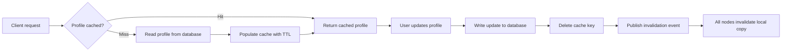

| Difficulty | Channel | Tags |
|---|---|---|
| beginner | backend | redis, memcached, cache-invalidation |

Picture this: 130 new countries go live at once, and the instant a user changes their name in one region, another region keeps serving the old one [1]. That is exactly the bind Netflix hit when it expanded globally, because its Memcached-based EVCache had no built-in way to invalidate a key in a remote region [1]. This is the same problem hiding in every profile service: how do you keep the cache consistent without slowing the app to a crawl? The answer, as you are about to see, is a careful dance between write-through caching, TTLs, and picking the right cache engine.

---

> ### Real-World Case — Netflix
>
> After Netflix expanded to 130+ new countries, user-facing services like profiles and recommendations had to serve reads from whichever AWS region a user happened to hit, while writes happened in other regions. Their workhorse cache, EVCache (a Memcached-based distributed cache across tens of thousands of instances), had no built-in way to invalidate a key in a remote region, so stale profile data could linger.
>
> | | |
> |---|---|
> | **Challenge** | Memcached (unlike Redis) has no native pub/sub or cross-node invalidation, so propagating cache updates across multiple regions and hundreds of clusters required building coordination by hand. Replicating every write to every region was cheap for small hot keys but wasteful for data that was written in one region yet rarely read in another. |
> | **Solution** | EVCache's client writes to the local cache and pushes key metadata to a Kafka replication queue; a 'Replication Relay' service fetches the value and sends it to remote regions. Critically, for caches with low cross-region read traffic they flip this around: instead of replicating the new data, they propagate only a DELETE for the key, so a remote GET misses and lazily refetches from the source of truth — write-through, TTL-based, delete-on-update invalidation at global scale. |
> | **Outcome** | At peak the production EVCache deployments handle upwards of 30 million requests/sec and just under 2 trillion requests per day, storing hundreds of billions of objects across tens of thousands of Memcached instances, with end-to-end cross-region invalidation/replication latency under one second at the 99th percentile. |
> | **Lesson** | Cache invalidation doesn't have to mean shipping the new value — sometimes the cheapest correct move is shipping just the DELETE and letting a cache miss (and a fresh DB read) heal the remote cache. Stale data is expensive; a cache miss is cheap. This is the manual-coordination problem the Redis-vs-Memcached trade-off warns about, solved with a client-side replication layer plus Kafka. |

---

## Hook — The 2am profile photo that refused to change

It is 2am somewhere, and a user on the other side of the planet just updated their profile photo. They reload the app, and there it is: the old face, grinning back at them. The database knows the truth, but the cache is still telling yesterday's story. Sound familiar? Most developers meet cache invalidation the hard way — not in an interview, but in production, where a single stale entry quietly erodes trust in the product. The stakes go far beyond a profile photo, though. For a service serving hundreds of millions of users, stale data does not just annoy people; it makes the whole system feel broken, and it makes your on-call pager feel deeply personal. Buckle up, because the fix is less about a clever line of code and more about understanding the physics of distributed systems.

## Problem — Why invalidating a cache entry feels like defusing a bomb

The core challenge is brutally simple to state and surprisingly hard to execute: the cache must never disagree with the database for longer than you can tolerate. There is an old joke that there are only two hard things in computer science: cache invalidation and naming things [2]. The joke lands because invalidation is a race condition wearing a trench coat. Consider the moment a user updates their profile. If you write the new value straight into the cache, you risk write-ordering problems. If you do nothing, you serve stale data until the TTL expires. If you delete the key, you open the door to a cache stampede where thousands of requests pile into the database at once [7]. Every option carries a hidden tax — and the tax grows with every server, every region, and every request you add.

## Real-World Case — Netflix

When Netflix expanded to 130+ new countries, its architecture changed overnight. User-facing services like profiles and recommendations had to serve reads from whatever AWS region a user happened to hit, while writes happened in another region entirely [1]. The workhorse behind it all was EVCache, a Memcached-based distributed cache spread across tens of thousands of instances [1]. Here is the plot twist: EVCache had no built-in way to invalidate a key in a remote region, so a profile updated in one region could linger stale in another [1]. The scale makes the stakes vivid — at peak, EVCache handles more than 30 million requests per second and just under 2 trillion requests per day, storing hundreds of billions of objects across tens of thousands of Memcached instances [1]. Netflix solved this by building cross-region invalidation and replication that completes in under one second at the 99th percentile [1]. The lesson is uncomfortable but clear: the moment your cache outgrows a single machine, invalidation stops being a function call and becomes a distributed-systems problem.

## Deep Dive — Write-through, TTLs, and the Redis vs Memcached showdown

Building on Netflix's story, the standard playbook starts with two patterns that developers mix up all the time. Cache-aside means the application checks the cache first, and only on a miss does it read the database and populate the cache — great for reads, risky for consistency. Write-through means every write goes to the database and the cache together, which keeps the cache fresher at the cost of more write traffic [6]. The interview answer you keep hearing — write-through with TTL-based expiration, and delete the key on update — is the industry default for profile data, and AWS's own caching-strategy documentation points in the same direction [6]. A TTL of 5–30 minutes for profiles is the sweet spot: short enough that stale data self-heals, long enough to keep hit rates healthy [5]. The semantics of that expiration mirror what HTTP itself standardized in RFC 9111, so the mental model transfers across every layer of your stack [7].

## Deep Dive — The Redis vs Memcached trade-off table

Now for the engine decision — this is where teams split into camps. Memcached is a pure in-memory key-value store: brutally simple, low memory overhead, and famously fast at exactly one job, caching [3]. Redis adds persistence, richer data structures, and pub/sub, which turns out to be a superpower for invalidation [4]. Therefore, the honest comparison looks like this [3][4]:

## Workflow — The six-step rhythm of consistent caching

With the theory in place, here is the workflow that ties everything together. Follow this loop and the stale-profile problem largely disappears.

1. Read path uses cache-aside: check the cache first; on a miss, read the database and repopulate with a TTL of 5–30 minutes [6].
2. On profile update, persist the write to the database first — the source of truth always wins.
3. Delete the cache key immediately after the write, rather than overwriting it. Deleting avoids serving torn data and lets the next read write a clean value.
4. Treat the TTL as a safety net, not the primary strategy. Even if an invalidation event is lost, the entry eventually expires on its own.
5. If the cache spans multiple nodes or regions, broadcast an invalidation event — Redis pub/sub makes this one call, while Memcached forces you to build the coordination yourself [4][9].
6. Monitor hit rates and eviction counts. A hit rate that suddenly drops means your TTLs or invalidation logic have become too aggressive.

The diagram below shows the full loop as a single visual story: requests flowing in, misses repopulating, and updates cascading into deletes and broadcasts.

## Code Example — Write-through invalidation in Python

Time to make this concrete. Below is a minimal write-through profile service in Python using Redis. It implements every idea from the workflow: cache-aside reads, database-first writes, key deletion on update, and a pub/sub broadcast so every cache node hears about the change. This is the same shape of solution teams ship in production — just stripped down to its skeleton. The full walkthrough follows the code.

## Lessons Learned — What Netflix taught us and what to do tomorrow

After following the journey from stale profile to consistent cache, a few truths stand out. First, invalidation beats overwriting: deleting the key avoids torn reads and lets the next read populate a clean value [6]. Second, TTLs are a parachute, not the plan — rely on explicit invalidation and let the TTL be the backstop [5][7]. Third, choose the engine by invalidation needs, not hype: Memcached wins on simplicity and memory overhead, while Redis wins on distributed invalidation, persistence, and durability [3][4][8][9]. Fourth, design for multiple regions from day one, because a single-cluster cache becomes a bottleneck the moment your service expands. Fifth, measure everything — Netflix's 30 million requests per second and sub-second 99th percentile invalidation were not accidents, they were engineered and monitored [1]. Finally, respect the cache stampede: after you delete a hot key, expect a thundering herd and add locks or small random jitter to your TTLs [7]. Many teams learn this exact lesson at 2am, staring at a database melting under read amplification — do not be one of them.

---

## Cache Invalidation Flow

<strong>Original Interview Question</strong>

**Q:** You're building a user profile service that caches frequently accessed profiles. How would you implement cache invalidation when a user updates their profile, and what trade-offs would you consider between Redis and Memcached?

**A:** Implement write-through caching with TTL-based expiration. On profile update, invalidate the cache by deleting the key and writing new data to both the database and cache. Redis offers pub/sub for automatic distributed invalidation, while Memcached requires manual coordination across nodes.

## Conclusion

Netflix's cache does not lie anymore, because its invalidation is explicit, measured, and replicated across regions [1]. The journey from stale profile to consistent cache comes down to a short list of choices: cache-aside for reads, write-through for writes, delete before you serve, a TTL as the safety net, and pub/sub once your cache outgrows a single node. Tomorrow, ask yourself one question about your own profile service: if a user updates their data right now, how long until every cache node agrees? If the honest answer is whenever the TTL expires, you have just found your next bug — and now you know exactly how to fix it.

---

## References

1. [Netflix incident report](https://netflixtechblog.com/caching-for-a-global-netflix-7bcc457012f1) — article
2. [Cache invalidation](https://en.wikipedia.org/wiki/Cache_invalidation) — documentation
3. [Memcached](https://en.wikipedia.org/wiki/Memcached) — documentation
4. [Redis](https://en.wikipedia.org/wiki/Redis) — documentation
5. [MDN — Cache-Control](https://developer.mozilla.org/en-US/docs/Web/HTTP/Headers/Cache-Control) — documentation
6. [AWS — ElastiCache caching strategies](https://docs.aws.amazon.com/AmazonElastiCache/latest/mem-ug/Strategies.html) — documentation
7. [RFC 9111 — HTTP Caching](https://datatracker.ietf.org/doc/html/rfc9111) — documentation
8. [GitHub — redis/redis](https://github.com/redis/redis) — documentation
9. [GitHub — memcached/memcached](https://github.com/memcached/memcached) — documentation

---

**Author:** Satishkumar Dhule — [GitHub](https://github.com/satishkumar-dhule) · [LinkedIn](https://linkedin.com/in/satishkumar-dhule) · [Website](https://satishkumar-dhule.github.io)
