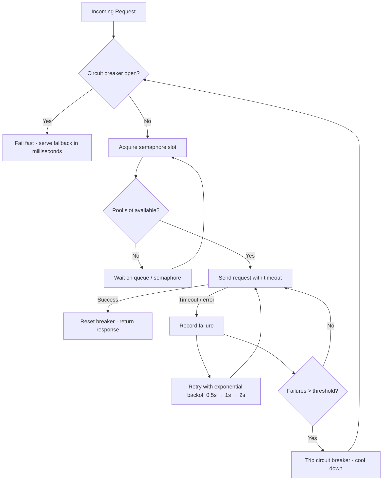

| Difficulty | Channel | Tags |
|---|---|---|
| advanced | backend | asyncio, aiohttp, concurrency |

By 2012, Netflix faced a nightmare most engineering teams only glimpse in a post-mortem: 1+ billion incoming API calls a day, fanning out to billions more across dozens of backend dependencies, where one slow service could take down the entire platform in seconds [1]. The same dynamics play out in miniature inside every aiohttp application that talks to external APIs. What happens to your connection pool when a dependency gets slow — really slow? This is the story of how to build a pool that degrades gracefully instead of collapsing, one failure at a time.

---

> ### Real-World Case — Netflix
>
> By 2012, Netflix's API received 1+ billion incoming calls per day that fanned out to several billion outgoing calls (averaging 1:6) across dozens of backend dependencies, with peaks over 100k dependency requests per second. A single latency-afflicted dependency could saturate every Tomcat request thread within seconds, taking down the entire API — and cascading failures meant 30 dependencies at 99.99% uptime still produced 2+ hours of downtime per month.
>
> | | |
> |---|---|
> | **Challenge** | How to build a connection/resource pool manager that limits concurrent calls to each backend dependency, times out slow connections, trips circuits under failure, and gracefully degrades with fallbacks — instead of letting one slow or hung dependency exhaust all threads and cascade into a full outage. |
> | **Solution** | Netflix built Hystrix (open-sourced in 2012): per-dependency thread pools/semaphores as connection and concurrency limits (40+ pools of 5-20 threads per API instance), explicit network + execution timeouts, a circuit breaker that trips at ~50% error rate over a 10-second rolling window and rejects all requests until a half-open probe succeeds, request collapsing to reduce connection count, and fallback/caching for graceful degradation. Retries were deliberately constrained — the circuit breaker exists to shed load and stop pummeling a failing dependency, not to retry harder. |
> | **Outcome** | Hystrix went from a Netflix API-only tool to company-wide adoption, now executing 10+ billion thread-isolated and hundreds of billions of semaphore-isolated command executions per day, producing a dramatic improvement in uptime and resilience. Latent dependencies are isolated to their own pool — when a circuit tripped on ~one-third of a cluster, the other circuits and systems remained completely unaffected, with users served fallbacks in milliseconds instead of waiting for timeouts. |
> | **Lesson** | The counterintuitive insight: when a dependency fails, your instinct is to enlarge pools, queues, and timeouts to give it breathing room — but that is exactly wrong. Keep pools small and timeouts tight so the system sheds load, fails fast, and lets the underlying dependency recover, instead of blocking threads on hung connections and amplifying the failure. |

---

## Hook — The 3 a.m. dashboard that turned red for no reason

Imagine the on-call rotation just pinged you. The dashboard you stared at all week is now a wall of red: HTTP 500s climbing by the second, p95 latency heading for the stratosphere, and the connection pool that felt generous this morning suddenly looks like a full parking lot — every slot occupied by a request that is never coming back. You have not shipped a line of code today. The outage lives upstream, in a dependency that got slow for reasons you cannot see. That is the moment you understand the stakes: without deliberate failure handling, your connection pool is not a safety net, it is a funnel that routes every slow upstream response straight into your own availability [2]. The good news? The exact playbook Netflix used to survive this at planetary scale fits inside a single aiohttp class.

## Problem — Every outbound request is a bet on someone else's uptime

The underlying problem is brutally simple: every outbound HTTP request is a bet on someone else's uptime. Open a pool of connections to a service that has started timing out, and those connections do not bounce back — they sit parked, blocked, burning event-loop time until the timeout budget expires. In asyncio the blast radius is worse than in a threaded server, because everything shares one event loop: a pool full of stuck awaits does not just stall one request handler, it starves the entire process — health checks, metrics, and happy-path traffic included [6]. Consequently, most pool configurations fail in the same two ways. Either the pool is sized optimistically ('we have 16 cores, so 500 connections is fine') and a slow upstream multiplies the damage, or the timeouts are missing entirely and one hung dependency becomes the queue every subsequent request waits behind. This is precisely why the HTTP spec spends so much effort defining connection semantics: persistent connections assume cooperation, and a misbehaving peer can stall an entire pipeline [9]. Add naive retries on top — fire, fail, fire again — and you are running a denial-of-service attack on your own backend, with the attacker's IP being your own.

⚠️ Watch Out: Beware the zombie retry loop. Three retries × 500 pooled requests × a 30-second timeout equals a dependency outage that consumes your entire process for minutes.

## Real-World Case — Netflix

But why should a Python developer care about a Java library from 2012? Because the problem is timeless, and the numbers are staggering. By 2012, Netflix's API received more than 1 billion incoming calls per day, each fanning out to several billion outgoing calls — an average 1:6 ratio — across dozens of backend dependencies, with peaks above 100,000 dependency requests per second [1]. Here is the math that should chill you: 30 dependencies, each at 99.99% uptime, still yields 2+ hours of downtime per month. And because failures cascade, it was never 30 independent outages — it was usually one. A single latency-afflicted dependency could saturate every Tomcat request thread within seconds and take down the entire API [1]. Netflix's response was Hystrix: a fault-tolerance library that isolates every dependency into its own thread pool or semaphore pool, enforces timeouts, and wraps each call in a circuit breaker [4]. The transformation is the plot twist: when a circuit tripped on roughly one-third of a cluster, the remaining circuits and systems stayed completely healthy, and users received fallback responses in milliseconds rather than waiting out timeouts [1]. Today Hystrix executes over 10 billion thread-isolated and hundreds of billions of semaphore-isolated command executions per day [1]. The pattern that scales to that volume is exactly the pattern your aiohttp client needs — just smaller.

## Deep Dive — Semaphores, backoff, and the circuit that thinks

Building on that story, the architecture breaks down into four cooperating mechanisms, each with a distinct job and a hidden cost. The semaphore is your admission control: it caps concurrent requests so a pool can never be over-subscribed [7]. Exponential backoff shapes your retries — waiting 0.5s, then 1s, then 2s — so a burst of failures never piles into a stampede [3]. The circuit breaker is the decision-maker: it counts failures, flips from closed to open, and after a cooldown lets a single probe through (half-open) to test whether the dependency has recovered [2]. Health checks and warm-up keep the pool honest by pruning dead connections before they poison new requests [5].

| Strategy | Protects against | The hidden cost |
|---|---|---|
| Semaphore limiting | Pool over-subscription | Queued requests add latency under saturation |
| Exponential backoff | Retry storms and stampedes | Every retry delays the user's fallback |
| Circuit breaker | Cascading failures | Wrong threshold = unnecessary fail-fast |
| Health checks + warm-up | Stale and dead connections | Startup time and extra monitoring traffic |

Here is the counterintuitive insight — the plot twist: a circuit breaker does not save the failing dependency. It saves you. When the breaker is open, you fail fast: one cheap exception in microseconds instead of 30 seconds of timeout. That freed capacity is what keeps the rest of your system healthy, which is the entire point Netflix learned at 100,000 requests per second [1].

🔥 Hot Take: Retries are not resilience. A retry without a circuit breaker is just a more polite way to crash.

## Workflow — Five steps to a self-healing pool

This leads to a concrete, repeatable workflow — five steps that take your pool from 'dumb buffer' to 'self-healing system'. Step 1: measure the baseline. Log latency percentiles per dependency before changing anything — you cannot size a pool you cannot see. Step 2: size the semaphore. Start with the throughput you need, not the cores you have; for aiohttp, tune the TCPConnector's limit and limit_per_host [5]. Step 3: set a timeout budget end to end — connect, read, and total — and make it shorter than your own HTTP server's client-facing timeout, otherwise your errors arrive too late to matter [8]. Step 4: add the circuit breaker with a threshold and cooldown tuned to your SLO. Step 5: add backoff and warm-up, then run the test that matters: pull the plug on a dependency and watch what happens. The diagram below maps the whole flow — every path leads somewhere intentional, and the only way out of the open state is time plus a successful probe.

## Code Example — The ConnectionPoolManager that refuses to fall over

With the workflow in hand, the implementation is almost anticlimactic. The class below is a production-shaped ConnectionPoolManager: semaphore-gated concurrency, a circuit breaker that trips after five failures, exponential backoff capped at 8 seconds, one shared keep-alive session, a warm-up probe at startup, and an explicit close() so the event loop never leaks sockets.

💡 Insight: Notice where the retry loop lives — inside the semaphore. That means a failing dependency can only burn its own pool slots, never the slots of healthy dependencies. That is Hystrix's thread-isolation idea, ported to async [4].

## Lessons Learned — What a decade of failure teaches

After all that, the takeaways distill into a short list you can take to your next code review:

- Put the semaphore first: cap concurrency explicitly — a TCPConnector alone is not admission control [7].
- Put a circuit breaker on every dependency, not on 'the client' as a whole — isolation is the entire point [2].
- Use exponential backoff with jitter; without it, synchronized clients still stampede the moment a dependency recovers [3].
- Set timeouts everywhere — connect, read, total — and keep them shorter than your own server's client-facing timeout [8].
- Clean up on shutdown; unclosed sessions are a slow, invisible socket leak.
- Never swallow the error: fail fast and hand the caller a typed fallback, not silence.

Actionable next step: ship it tomorrow. Instrument p95 per dependency, add the semaphore, wire in a breaker with a 5-failure / 60-second cooldown, and run one chaos test — kill the dependency and watch your own service stay green. That experiment will tell you more than any blog post ever could.

---

## Request Flow with Circuit Breaker and Backoff

<strong>Original Interview Question</strong>

**Q:** How would you implement a connection pool manager for aiohttp that handles graceful degradation under high load and connection timeouts?

**A:** Implement a connection pool manager for aiohttp using a semaphore to limit concurrent connections, exponential backoff for retrying failed requests, and circuit breaker pattern to gracefully degrade under high load and connection timeouts.

## Conclusion

The story that began with a billion calls a day and a single slow dependency ends the same way for every system, at every scale: resilience is not a feature you bolt on during the outage — it is the shape of the code you write on a calm Tuesday [1]. The circuit breaker that kept Netflix serving fallbacks in milliseconds now fits in a single Python class you can copy into your service today. Tomorrow, when the dependency naps, your pool will not panic — it will shed load, back off, and wait for the recovery that is coming. That is the whole journey: from surviving failures to making them invisible.

---

## References

1. [Netflix incident report](http://techblog.netflix.com/2012/02/fault-tolerance-in-high-volume.html) — article
2. [Circuit breaker design pattern](https://en.wikipedia.org/wiki/Circuit_breaker_design_pattern) — article
3. [Exponential backoff](https://en.wikipedia.org/wiki/Exponential_backoff) — article
4. [Netflix/Hystrix](https://github.com/Netflix/Hystrix) — documentation
5. [aiohttp (aio-libs)](https://github.com/aio-libs/aiohttp) — documentation
6. [asyncio — Asynchronous I/O](https://docs.python.org/3/library/asyncio.html) — documentation
7. [asyncio synchronization primitives (Semaphore)](https://docs.python.org/3/library/asyncio-sync.html) — documentation
8. [asyncio Tasks and timeouts](https://docs.python.org/3/library/asyncio-task.html) — documentation
9. [HTTP Semantics — RFC 9110](https://datatracker.ietf.org/doc/html/rfc9110) — documentation

---

**Author:** Satishkumar Dhule — [GitHub](https://github.com/satishkumar-dhule) · [LinkedIn](https://linkedin.com/in/satishkumar-dhule) · [Website](https://satishkumar-dhule.github.io)
