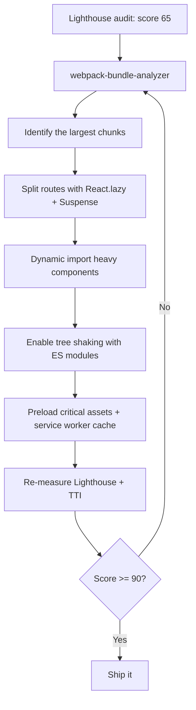

| Difficulty | Channel | Tags |
|---|---|---|
| intermediate | frontend | lighthouse, bundle, lazy-loading |

Picture this: a swipe that takes eleven seconds to respond. That was the reality for Tinder users on low-end Android devices in 2017, when the company's React-based progressive web app took roughly 11.91 seconds to become interactive on a Moto G4-style phone [1]. The native app felt instant in comparison, and every lost second meant abandoned swipes. This is the same story unfolding on thousands of React apps today - hidden inside a 2.1MB bundle and a 4.2 second time-to-interactive. Here is the playbook Tinder used, and how you can use it to drag your Lighthouse score from 65 to 90+.

---

> ### Real-World Case — Tinder
>
> Tinder rebuilt its mobile web experience as a React PWA but discovered that large, monolithic JavaScript bundles were delaying time-to-interactive, especially on low-end Android devices over slow connections. On a Moto G4-style device, the web experience took ~11.91s to load, making it feel sluggish next to the native app.
>
> | | |
> |---|---|
> | **Challenge** | Their React single-page app shipped a single monolithic JS bundle containing code not needed to boot the core experience. They needed to shrink the initial bundle, defer non-critical code, and enforce performance budgets without regressions as the app grew. |
> | **Solution** | Tinder applied route-level code-splitting with React Router + React Loadable and webpack dynamic import() to split the monolith into lazy-loaded chunks, moved shared libraries into a cached vendor bundle with CommonsChunkPlugin, used webpack-bundle-analyzer and source-map-explorer to find the biggest offenders, added  for critical bundles, adopted strict performance budgets (~155KB main+vendor, ~55KB async chunks), upgraded to webpack 3 scope hoisting and React 16, and used Workbox to precache route bundles. |
> | **Outcome** | Main bundle shrank from 166KB to 101KB, DCL improved from 5.46s to 4.69s, total load dropped from ~11.91s to ~4.69s, and first paint went from ~1000ms to ~500ms via preloading. Scope hoisting cut vendor JS parsing time by 8% and React 16 cut the vendor chunk ~7%. The resulting PWA delivered Tinder's experience at just ~10% of the native app's data cost. |
> | **Lesson** | A single large 'everything bundle' is the silent killer of time-to-interactive; split by route, lazy-load everything not needed for first paint, analyze bundles with visualizers instead of guessing, and lock in the gains with hard performance budgets — otherwise regressions sneak back in. |

---

## Hook — The moment Lighthouse humbles you

Picture this: you push a feature, pat yourself on the back, and run Lighthouse to show off. The score stares back at you - 65. A barely passing grade in a class you thought you aced. You dig deeper and the numbers get worse: a 2.1MB JavaScript bundle, a 4.2 second time-to-interactive, and a user who will wait roughly... nothing. Sound familiar? Most engineers have been exactly here. The honest truth is that performance is invisible during development - your fiber connection and beefy laptop mask every problem. Then real users show up on slow networks with modest phones, and the facade crumbles. The question this article answers is not whether you should fix it, but exactly how.

## Problem — The invisible tax of a 2.1MB bundle

Why is a 2.1MB bundle such a disaster? Because loading JavaScript is not a download-and-go operation. The browser must download every byte, then parse it, then compile it, then execute it - and until all of that finishes, the page cannot respond to the user [8]. Time to interactive is precisely this gap. On a flagship phone with a fat pipe, 2.1MB is annoying. On a Moto G4 over a congested 3G connection, it is a customer vanishing. The bundle gets bloated one sin at a time: a utility library imported for two functions, a charting package dragged in for a single graph, an entire UI kit bundled when only a button is used. None of these are 'wrong code.' They are invisible architecture decisions that compound silently. Moreover, the pressure is rising - performance scores are becoming de facto quality gates, and teams that ignore them pay in conversion, retention, and credibility. The fix is not mysterious. It is a set of well-understood techniques that begin with one admission: you cannot fix what you have not measured.

## Real-World Case — Tinder's 11-second awakening

Tinder faced exactly this wall in 2017. After rebuilding its mobile web experience as a progressive web app, the engineering team discovered that large, monolithic JavaScript bundles were wrecking time-to-interactive, especially on low-end Android devices over slow connections [1]. On a Moto G4-style device, the web experience took about 11.91 seconds to load - an eternity next to the native app, and a genuine product crisis for a company whose entire product is a swipe. So the team went to work, methodically. The main bundle shrank from 166KB to 101KB. Document content load improved from 5.46s to 4.69s, and total load dropped from roughly 11.91s to 4.69s. First paint fell from about 1000ms to about 500ms thanks to preloading. Scope hoisting reduced vendor JavaScript parsing time by 8%, and the React 16 upgrade trimmed the vendor chunk by another 7%. The final result: a PWA that delivered Tinder's full experience at just ~10% of the native app's data cost [1]. These numbers are not theoretical - they come from a production app serving millions of users, and they define what is actually possible.

## Deep Dive — Code splitting, tree shaking, and the vendor chunk myth

Building on Tinder's results, the real question is: which tools actually move the needle? The foundation of every optimization is code splitting - breaking one monolithic bundle into many small chunks that load on demand [4]. React makes this idiomatic with React.lazy() and Suspense: lazy() takes a function that returns a dynamic import() promise, and Suspense renders a fallback while that chunk is fetched [2][3]. Dynamic import() is the engine under the hood, signaling to the bundler that a separate file should be emitted instead of inlining everything [7].

There are two flavors of splitting, and confusing them is a classic mistake. Route-based splitting creates one chunk per page - the default strategy for most apps because it aligns with user behavior. Component-based splitting targets heavy components like charts, editors, or maps that live inside pages, keeping them out of the initial payload. For example, a revenue chart backed by a large charting library is a perfect candidate for component-based lazy loading. Here is the trade-off in plain numbers:

| Strategy | What it does | Best for |
|---|---|---|
| Route-based splitting | One chunk per route | Multi-page apps with distinct views |
| Component-based splitting | Lazy-loads heavy widgets | Charts, editors, maps, modals |
| Dynamic import() | Emits a separate chunk | Rarely used features |
| Tree shaking | Drops dead exports at build time | Libraries with many exports |
| Preloading | Fetches critical assets early | First paint and TTI |

Now the plot twist. Many developers assume code splitting alone guarantees a fast app. It does not. Almost a third of Tinder's win came from tree shaking - the build-time removal of unused exports, which only works when you ship ES modules with static imports the bundler can trace [6]. That is why importing 'moment' or the entire 'lodash' silently sabotages your bundle: you asked for two functions and received hundreds. Furthermore, beware of the vendor chunk myth. A big vendor chunk is not automatically the enemy - React itself was worth keeping. The real enemy is feature code nobody will ever run on the first screen. Tinder proved the point: scope hoisting cut vendor parsing time by 8%, and the React 16 upgrade trimmed the vendor chunk another 7% [1]. Small, compounding wins.

💡 Insight: Route-level splitting plus hover-triggered preloading gives you the illusion of an instant app - the chunk downloads in the background before the click ever lands.

⚠️ Watch Out: Never wrap your entire app in a single Suspense boundary. A giant fallback spinner simply replaces the jank you are trying to kill. Use granular boundaries around each lazy component.

🔥 Hot Take: If your Lighthouse score is under 80, code splitting will beat any CSS refactor or component library migration you are planning.

🎯 Key Point: Measure first. The webpack-bundle-analyzer produces an interactive map of every chunk, so you never have to guess where the weight lives [5].

## Workflow — From Lighthouse 65 to 90+, step by step

Here is the repeatable workflow that takes a 65 to a 90+. It is a loop, not a one-shot fix - the diagram below maps the entire journey from baseline audit to shippable, fast app. Step 1: Run a Lighthouse audit and record your baseline. Time to interactive and total blocking time tell you how much JavaScript sits in the critical path [8]. Step 2: Open webpack-bundle-analyzer and identify the three largest chunks. These are your first splitting targets [5]. Step 3: Apply route-based splitting with React.lazy and Suspense so each page loads only its own code [4]. Step 4: Lazy-load the heavy components inside those pages - charts, editors, media-heavy widgets. Step 5: Audit your imports for tree-shaking compatibility; replace CommonJS-style imports with ES module equivalents and eliminate whole-library imports [6]. Step 6: Preload critical assets and register a service worker to serve chunks from cache on repeat visits [10]. Step 7: Re-run Lighthouse and compare. If a score still drags, return to step 2 - the analyzer will show you exactly what regressed.

The golden rule that keeps this loop honest: never guess what is bloating your bundle. The analyzer shows you, in color, exactly where every kilobyte lives. This is the difference between shooting in the dark and running a guided missile program. Each stage of the workflow below feeds into the next, and the loop closes when the score passes the bar.

## Code Example — Lazy loading with React.lazy and Suspense

Putting the workflow into practice, here is the exact pattern that solves the splitting half of the problem - the same strategy class that Tinder used to cut its main bundle from 166KB to 101KB. This App component uses route-based splitting, a component-based lazy chart, hover-triggered preloading, and an error boundary so a failed chunk fetch never nukes the whole app. See the code below, then walk through it line by line.

## Lessons Learned — What Tinder's journey teaches every React team

Tinder's story ends in triumph, but the journey carries lessons any team can bank. First, performance is a loop, not a milestone: measure, split, shake, preload, and measure again. The moment you stop measuring, the bundle starts growing back. Second, split by behavior, not by instinct. Route-based splitting is the default because users navigate pages; component-based splitting exists for the heavy widgets inside them. Third, tree shaking is a configuration promise - it only pays off when your imports are ES-module compatible and your analyzer confirms the dead code is gone [6].

Battle scars from the front line:
- One giant Suspense boundary around the whole app - the fallback spinner becomes the user experience.
- Splitting 5KB components - every chunk carries overhead; tiny chunks can hurt initial load more than they help.
- Importing whole libraries for one function - tree shaking cannot save you if the import was never tree-shakeable.
- Skipping the error boundary - a single failed dynamic import renders an empty screen instead of a recoverable state.
- Trusting your gut over the analyzer - teams waste days 'optimizing' code that was never the bottleneck.

⚠️ Watch Out: code splitting is not free. The network round-trip for a late chunk can lag interactive moments. That is precisely why preloading and service worker caching matter - they move the fetch off the critical path [10].

🎯 Key Point: The fastest code is the code you never ship. Every kilobyte that stays off the initial bundle is a win for a user on a Moto G4 over a slow connection.

What to do tomorrow: run Lighthouse, run the analyzer, split your top three chunks, and re-measure. The whole journey fits in an afternoon - Tinder's numbers prove where it can end.

---

## Bundle Optimization Workflow

<strong>Original Interview Question</strong>

**Q:** You're tasked with improving a React app's Lighthouse performance score from 65 to 90+. The bundle size is 2.1MB and Time to Interactive is 4.2s. What specific steps would you take to optimize the bundle and implement lazy loading?

**A:** Implement code splitting with React.lazy() and Suspense, analyze bundle composition with webpack-bundle-analyzer to identify largest chunks, remove unused dependencies and optimize imports, add dynamic imports for heavy components and third-party libraries, implement route-based splitting for better initial load times, and utilize tree shaking with proper ES module configuration.

## Conclusion

The journey that began with an 11-second wait on a low-end Android phone ends with a web app that loads in a blink and costs users a tenth of the data [1]. Tinder did not stumble into that outcome - they measured, split, shook, preloaded, and shipped, and their numbers now serve as a benchmark for every React team. The same tools are available to you today: React.lazy, Suspense, dynamic imports, tree shaking, preloading, and service workers. None of them are exotic. All of them compound. So run that Lighthouse audit tonight, and when the score stares back at you, remember what Tinder proved: a 65 is not a verdict, it is a starting point. One insight to carry back to your team - performance is a feature you ship every sprint, not a fire you fight once a quarter.

---

## References

1. [Tinder incident report](https://calendar.perfplanet.com/2017/a-tinder-progressive-web-app-performance-case-study) — article
2. [React reference: lazy](https://react.dev/reference/react/lazy) — documentation
3. [React reference: Suspense](https://react.dev/reference/react/Suspense) — documentation
4. [webpack guide: Code Splitting](https://webpack.js.org/guides/code-splitting/) — documentation
5. [webpack-bundle-analyzer](https://github.com/webpack-contrib/webpack-bundle-analyzer) — documentation
6. [MDN Glossary: Tree shaking](https://developer.mozilla.org/en-US/docs/Glossary/Tree_shaking) — documentation
7. [MDN Reference: dynamic import()](https://developer.mozilla.org/en-US/docs/Web/JavaScript/Reference/Operators/import) — documentation
8. [MDN Glossary: Time to Interactive](https://developer.mozilla.org/en-US/docs/Glossary/Time_to_interactive) — documentation
9. [Wikipedia: Progressive Web App](https://en.wikipedia.org/wiki/Progressive_web_app) — documentation
10. [MDN API: Service Worker](https://developer.mozilla.org/en-US/docs/Web/API/Service_Worker_API) — documentation

---

**Author:** Satishkumar Dhule — [GitHub](https://github.com/satishkumar-dhule) · [LinkedIn](https://linkedin.com/in/satishkumar-dhule) · [Website](https://satishkumar-dhule.github.io)
