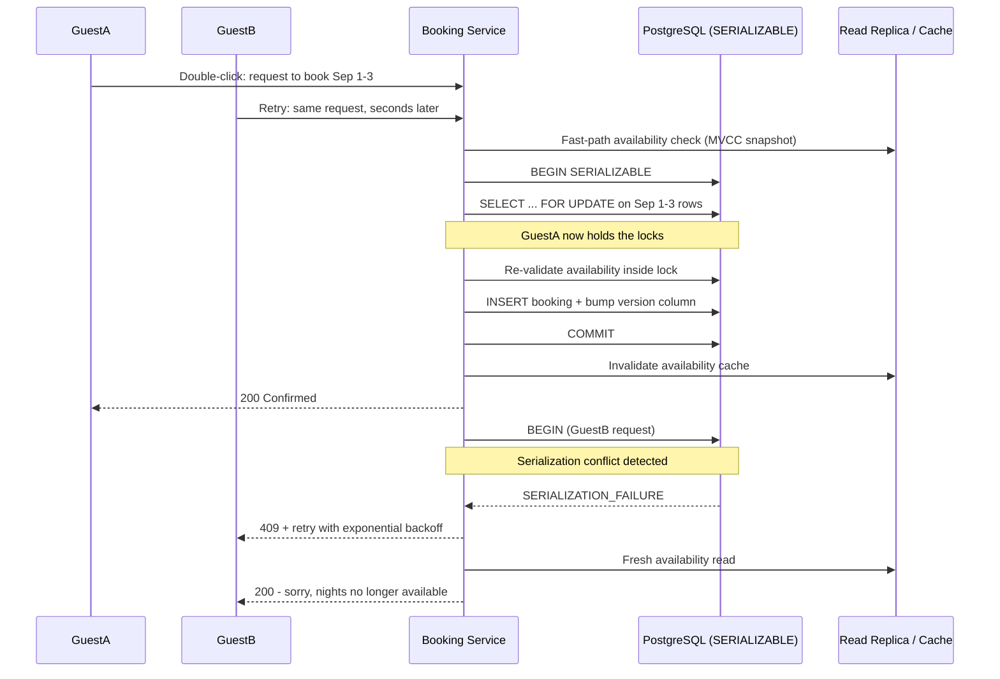

| Difficulty | Channel | Tags |
|---|---|---|
| intermediate | database | acid, isolation-levels, mvcc |

A guest double-clicks “Book”. Their client auto-retries after a 400-millisecond Wi-Fi blip. Two requests now race toward the same property, and if both land, someone gets charged twice — or two strangers walk away with reservations for the same weekend. This is not hypothetical: when Airbnb decomposed its monolithic Rails app into services, exactly this race began producing duplicate payments at massive scale, and the team’s post-mortem became a masterclass in distributed concurrency [1]. For anyone building a booking system, the lesson is brutal: availability and correctness are locked in a tug-of-war, and you get to decide who wins.

The answer, as it turns out, lives in a database setting you have probably heard of but never really trusted: SERIALIZABLE isolation.

---

> ### Real-World Case — Airbnb
>
> As Airbnb migrated from a monolithic Rails app to a service-oriented architecture, a single booking-and-payment flow now spanned multiple services, each with side effects. A guest double-clicking 'Book' (or a client auto-retrying after a network timeout) fired duplicate requests that could each execute the payment — the exact race condition that causes double bookings — and even a few seconds of read-replica lag meant a retry could re-execute a payment that already succeeded because the dedup record hadn't propagated to the replica yet.
>
> | | |
> |---|---|
> | **Challenge** | Guarantee exactly-once execution of a booking/payment transaction across distributed services without resorting to two-phase commit — while handling duplicate requests, dropped connections, timeouts, and race conditions, and without adding enough latency to hurt availability. |
> | **Solution** | Built 'Orpheus,' a general-purpose idempotency framework. Every request carries an idempotency key; before executing, the framework acquires a row-level lock (a lease with an expiration) on that key in the sharded master database, wraps all Pre-RPC and Post-RPC database work in enclosing transactions (explicitly separating network calls from DB transactions), and classifies errors as retryable vs non-retryable so retries with exponential backoff + jitter are always safe. Critically, idempotency state is always read from the master database, never from replicas, to eliminate the replica-lag duplicate window. |
> | **Outcome** | Orpheus is 'battle-tested' across multiple payments services at Airbnb's scale and prevents duplicate charges for the community. Their replica-lag analysis directly quantified the stakes: 'a few seconds of replica lag could cause significant financial impact to Airbnb's community.' |
> | **Lesson** | In distributed booking flows, idempotency keys combined with row-level locks and master reads beat distributed transactions. The counterintuitive insight is that a 'read-only' consistency decision — serving dedup checks from replicas — can silently break exactly-once guarantees, so the correctness-critical read must always hit the master. |

---

## Hook — the click that charged twice

The guest hit “Book” twice. No malice, no panic — the Wi-Fi hiccuped for a fraction of a second, the client auto-retried, and one reservation attempt silently became two. In Airbnb’s post-monolith architecture, each of those requests traveled through a chain of services with their own side effects, and each was perfectly capable of executing its own payment [1].

Two requests. One checkout. One guest staring at a duplicate charge — or worse, two strangers both holding keys to the same weekend.

That split second is the exact race condition that turns a perfectly good property into an overbooked one. And here is the uncomfortable part: the same mechanics that duplicated a payment can duplicate a reservation. The only difference is which table gets the double entry.

Sound familiar? If you have ever shipped a checkout, a ticket seller, a conference scheduler, or — yes — an Airbnb-style booking system, you have sat on this time bomb. This article walks through why it happens, how a real company got burned by it, and the isolation-level pattern that makes double bookings structurally impossible.

## Problem — the check-then-act trap

Most booking systems start with a deceptively simple pattern: read availability, and if it looks free, insert the reservation. It is the classic check-then-act flow, and it breaks the moment two requests interleave between the read and the write.

Guest A reads “available.” Guest B reads “available.” Both insert. Congratulations — the calendar now shows two guests for one property. This is the time-of-check-to-time-of-use (TOCTOU) race, and it is not a textbook curiosity; it is a production incident waiting for a holiday weekend.

Here is the thing though: the fix is not simply “throw a transaction at it.” Transaction boundaries alone do not stop two transactions from both reading the same stale snapshot. The database’s isolation level decides whether a snapshot taken mid-flight can see — and clobber — writes made by a concurrent transaction [2][3].

The problem gets worse at scale, because availability checks are cheap reads, and cheap reads get pushed onto read replicas or caches to keep write traffic off the primary [8]. But replicas lag. A few seconds of lag means a check can read stale data, see a night as free when it is already gone, and approve a booking that should never exist.

So the tension becomes explicit:

- High availability wants reads to be cheap, cached, and everywhere.
- Correctness wants reads to be authoritative — right now, from the source of truth.
- You cannot have both naively, and the naive version is what ships in most v1s.

Even multiversion concurrency control (MVCC) only gives you a consistent snapshot; a snapshot is a moment frozen in time, and it does nothing to protect you against writes that land after that moment was taken [4]. You need something that makes the check and the act one indivisible operation. That is exactly where isolation levels start to matter.

## Real-World Case — Airbnb’s duplicate-payment race

Back in Airbnb’s monolith days, a booking-and-payment flow lived inside a single Rails app — one transaction, one lock, one truth. When the team migrated to a service-oriented architecture, that same flow now spanned multiple services, each with its own side effects [1]. The decomposition quietly reintroduced an old enemy: the duplicate request.

A double-click, or a client retry after a network timeout, would fire two identical requests. Each one could independently execute a payment. That is the exact race condition that causes double bookings — just wearing a payment’s clothing. And it was hiding an even nastier twist: even a few seconds of read-replica lag meant a retry could re-execute a payment that had already succeeded, because the dedup record had not yet propagated to the replica the retry read from [1].

Airbnb’s team built a deduplication service called Orpheus to absorb duplicate requests before they reached payment systems. It is battle-tested across multiple payments services at Airbnb’s scale, and it prevents duplicate charges for the entire community. Their replica-lag analysis directly quantified the stakes: “a few seconds of replica lag could cause significant financial impact to Airbnb’s community” [1].

Read that sentence twice. The bug was never “two requests.” It was “two requests plus a replica that has not caught up yet.” The dedup record from the first payment had not reached the read replica before the retry arrived, so the second request saw a system that looked like nothing had happened [1].

Now swap “payment executed” for “night booked” and the story writes itself. The same physics applies to your availability calendar. Which leads to the question that decides everything: what does “concurrent” actually mean inside your database?

## Deep Dive — isolation levels, locks, and the plot twist

Building on Airbnb’s war story, the fix starts with a question that sounds academic and decides everything: what does your database allow two overlapping transactions to see?

**Isolation levels are a ladder, and each rung sacrifices performance for correctness** [2]:

| Isolation level | Can concurrent writes surprise you? | Anomaly it prevents | Typical cost |
|---|---|---|---|
| Read Uncommitted | Yes, even dirty reads | Nothing | Lowest |
| Read Committed | Yes — re-reads can differ | Dirty reads | Low |
| Repeatable Read | Yes — phantom rows appear | Non-repeatable reads | Medium |
| SERIALIZABLE | No — results match some serial order | All anomalies | Highest |

SERIALIZABLE is the rung that matters for bookings, because it guarantees the outcome is equivalent to running your transactions one after another [3]. Two guests cannot both end up holding the same night, no matter how their operations interleave.

**The plot twist:** most developers assume SERIALIZABLE works by locking everything in sight. In PostgreSQL it does not. Postgres uses Serializable Snapshot Isolation (SSI), which lets transactions run optimistically on MVCC snapshots and then detects read-write conflicts at commit time — aborting one of the victims [3][4]. That means your code must be ready to catch a serialization failure and retry, because the database is literally going to punch one transaction in the face to preserve correctness.

That surfaces the two concurrency-control philosophies, and choosing between them is the real design decision [5]:

| Approach | Mechanism | Best when | Danger zone |
|---|---|---|---|
| Optimistic (version columns) | Check a version, bump it on write, abort if it moved | Conflicts are rare | Thundering retries on hot rows |
| Pessimistic (SELECT … FOR UPDATE) | Lock the exact rows for the transaction’s duration | Conflicts are common | Lock waits and deadlocks |

💡 **Insight:** row-level locks (SELECT … FOR UPDATE) on a per-date availability table are the sweet spot — you lock only the nights a guest wants, never the whole property or table. For a seven-night stay, seven rows are locked while the world keeps booking other dates.

🔥 **Hot take:** a read replica should never be allowed to decide whether money moves. Replicas exist to serve reads you can afford to be wrong about. For bookings, the authoritative read must happen inside the write transaction [8]. Airbnb’s Orpheus learned this the hard way [1].

⚠️ **Watch out:** celebrity listings are lock-contention magnets. When a 5-star cabin goes viral, every request piles onto the same rows. Teams ship circuit breakers and per-property queues so one hot property cannot drag the whole bookings cluster into lock-wait hell.

You now have the theory. But theory is what fails at 2 a.m. when the pager goes off. Here is the workflow that actually survives production.

## placeholder

The sequence diagram below (Booking Race Sequence) shows the whole story in one picture: two guests racing for the same weekend, one committing, one catching a serialization failure, and one retrying with backoff until the calendar settles.

1. **Fast path check.** Read availability from a cache or read replica to fail fast on obviously unavailable dates. This is a filter, not a guarantee [8][9].
2. **Begin SERIALIZABLE.** Open the transaction at the strictest isolation level for the critical write path [3].
3. **Lock the exact rows.** Run SELECT … FOR UPDATE on the availability rows covering the requested date range. Now every concurrent writer is blocked or will be detected.
4. **Re-validate inside the lock.** Re-read availability now that you hold the locks. This closes the TOCTOU window.
5. **Write and bump the version.** Insert the booking and increment the availability version column for optimistic-concurrency bookkeeping [5].
6. **Commit.** The commit is atomic: check + act happened in one unit.
7. **Invalidate the cache.** Cache staleness is how ghosts come back to life; invalidation belongs on the commit path, not in a background job [9].
8. **Retry with exponential backoff.** On a SerializationFailure, roll back, sleep with exponential backoff plus jitter, and try again — up to a bounded number of attempts [6].

Each step inherits the tension from the deep dive: the fast path maximizes availability, and steps 2–6 sacrifice a little latency to guarantee correctness. Airbnb’s replica-lag nightmare is exactly what step 1 must never become: a source of truth [1].

## Code Example — SERIALIZABLE bookings with psycopg

Time to make it concrete. The example below uses Python and psycopg — the PostgreSQL driver — to implement the full workflow in one function: lock the date range, re-validate inside the lock, write atomically, and survive serialization failures with bounded exponential backoff [10][11]. You can adapt the pattern to any SQL database that supports row-level locking and serializable isolation.

## Lessons Learned — what tomorrow should look like

The guest who clicked twice is the whole article in miniature: one harmless action, two dangerous requests, and a system that must decide who wins. By the time you deploy these patterns, the decision is already made — structurally.

**What you should take to your codebase today:**

- **The check and the act must be one atomic unit.** Anything less is a TOCTOU race wearing a hopeful smile [2].
- **SERIALIZABLE is not a silver bullet; it is a contract with retries.** The database will abort one transaction to protect correctness, so bounded retries with exponential backoff are part of the design, not a workaround [3][6].
- **Optimistic locking (version columns) shines when conflicts are rare;** row locks (SELECT … FOR UPDATE) shine when they are frequent. Pick per workload, not per fashion [5].
- **Read replicas are for reads you can afford to be wrong about.** Never let a lagging replica decide whether a payment runs or a night is booked [8].
- **Cache invalidation belongs on the commit path.** A cache that returns stale availability is a liar with a caching layer [9].
- **Dedup at the API boundary.** Airbnb’s Orpheus proved the highest-leverage fix is refusing the duplicate before it reaches your transactions at all [1].
- **Monitor lock contention, and circuit-break your hot properties.** One viral listing should not be able to stall the entire bookings fleet.

**Battle scars worth remembering:** teams who skip step 4 (re-validation inside the lock) ship double bookings anyway. Teams who treat serialization failures as an exception rather than an expected event ship 500s under load. Teams who cache availability without invalidation ship availability that only the cache believes.

🎯 **Key point:** Airbnb’s quantified warning — that a few seconds of replica lag could cause significant financial impact — is the single most under-appreciated sentence in this whole saga [1]. Plan for stale reads as if they are guaranteed, because at scale, they are.

If this feels like a lot, you are not alone. Concurrency is the corner of engineering where confidence dies first — and where the deepest respect is earned. Start small: add a version column, wrap the booking write in a SERIALIZABLE transaction, and watch your retry log become your new best friend.

---

## Booking Race Sequence

<strong>Original Interview Question</strong>

**Q:** You're building a booking system for Airbnb where multiple users can reserve the same property simultaneously. How would you design the transaction handling to prevent double bookings while maintaining high availability?

**A:** Use SERIALIZABLE isolation with optimistic concurrency control. Implement row-level locks on property availability tables, use MVCC snapshot reads for checking availability, and apply application-level validation to ensure atomic booking operations.

## Conclusion

Remember the guest who clicked twice? With SERIALIZABLE isolation, row-level locks, version columns, and bounded exponential-backoff retries, that second click is now harmless: the first transaction commits, the second finds the nights taken, and no one gets charged twice — or double-booked. That is the transformation the journey was always about: turning a panic-inducing race into a boring, predictable outcome.

So what do you do differently tomorrow? Audit your booking or checkout path for check-then-act races. Wrap the critical write in a SERIALIZABLE transaction, lock only the rows that matter, and treat serialization failures as a designed control flow rather than an incident. Then add idempotency at the API boundary, in the spirit of Airbnb’s Orpheus, so retries are safe by construction [1].

Leave your team with this one line: a double-click should never be a double charge — and with the right isolation, it never has to be.

---

## References

1. [Airbnb incident report](https://medium.com/airbnb-engineering/avoiding-double-payments-in-a-distributed-payments-system-2981f6b070bb) — article
2. [Isolation (database systems)](https://en.wikipedia.org/wiki/Isolation_(database_systems)) — documentation
3. [Serializability](https://en.wikipedia.org/wiki/Serializability) — documentation
4. [Multiversion concurrency control](https://en.wikipedia.org/wiki/Multiversion_concurrency_control) — documentation
5. [Optimistic concurrency control](https://en.wikipedia.org/wiki/Optimistic_concurrency_control) — documentation
6. [Exponential backoff](https://en.wikipedia.org/wiki/Exponential_backoff) — documentation
7. [Highly Available Transactions: Virtues and Limitations](https://arxiv.org/abs/1301.4857) — paper
8. [Amazon RDS read replicas](https://docs.aws.amazon.com/AmazonRDS/latest/UserGuide/USER_ReadRepl.html) — documentation
9. [Amazon ElastiCache documentation](https://docs.aws.amazon.com/AmazonElastiCache/latest/mem-ug/WhatIs.html) — documentation
10. [psycopg - PostgreSQL driver for Python](https://github.com/psycopg/psycopg) — documentation
11. [Python sqlite3 module documentation](https://docs.python.org/3/library/sqlite3.html) — documentation

---

**Author:** Satishkumar Dhule — [GitHub](https://github.com/satishkumar-dhule) · [LinkedIn](https://linkedin.com/in/satishkumar-dhule) · [Website](https://satishkumar-dhule.github.io)
