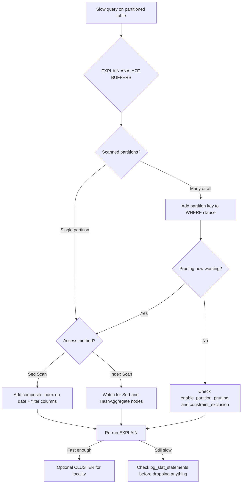

| Difficulty | Channel | Tags |
|---|---|---|
| intermediate | database | explain, query-plan, partitioning |

At GitLab.com, the `events` table grew into a quiet emergency: 500+ million rows, roughly 1 TiB of data, the sixth largest table in the production Postgres cluster, and a major contributor to CPU saturation [1]. The obvious fix — date partitioning — was the right idea, yet countless queries stayed slow because they never filtered on a date at all [1]. Sound familiar? If you have ever stared at a slow query on a 'perfectly partitioned' table, you already know the real problem is usually not the partition key. It is how the planner actually reads your query.

---

> ### Real-World Case — GitLab
>
> GitLab.com's `events` table (user activity events: pushes, issues, MRs) grew to roughly 1 TiB / 500+ million rows and was the 6th largest table in the database, contributing to primary CPU saturation on the production Postgres cluster. Despite the table being a natural candidate for date partitioning, many queries against it were slow because they didn't filter on any date at all.
>
> | | |
> |---|---|
> | **Challenge** | An audit revealed that only about 45% of the ~167 known queries touching `events` had a `created_at` filter. If they partitioned by month, the other ~55% of queries would have no partition key in their WHERE clause, so Postgres would scan every partition and the query could get slower. They also carried large, mostly-unused indexes (one alone was ~130GB) that would have to be duplicated across every new partition. |
> | **Solution** | GitLab partitioned `events` by month on `created_at` and, critically, did the query-rewrite work first: ~55% of queries were updated to include the partition key, `ORDER BY events.id` became `ORDER BY created_at, id`, and the primary key changed from `id` to composite `(id, created_at)` (required by Postgres for partition keys). They dropped ~115-130GB of unused indexes before partitioning so each partition wouldn't inherit them, and backfilled the partitioned copy via batched background migrations (initial estimate: 83 days at 50k rows/2min). This followed the same playbook they'd built partitioning `audit_events` (monthly partitions of 5-19M rows / 1.5-5.2GB per month). |
> | **Outcome** | Once queries included the partition key, the planner could prune to the single relevant month's partition, writes/vacuum got cheaper as partitions stayed small, and old data can be retired by dropping entire partitions instead of `DELETE`. Index cleanup freed ~130GB+ before partitioning even started. Plot twist: dropping the 'unused' 130GB contribution-analytics index caused the contribution analytics page to time out for large groups in production, forcing GitLab to restore it — a reminder that 'index not used' must be verified against real query patterns, and the migration of that feature to ClickHouse. |
> | **Lesson** | Partitioning by date only speeds up queries that actually filter on the date. The partition key must appear in the WHERE clause or the planner cannot prune, so every hot query needs auditing before partitioning — verify pruning with EXPLAIN, use composite indexes/orderings that match the partition key, and verify index utilization before dropping 'unused' indexes. |

---

## Hook — a 100M-row table, a perfectly good partition key, and a query that still crawls

Picture this: you are on-call, and a query against a 100M-row table that should return in milliseconds is dragging the whole database with it. The table is partitioned by date. The indexes look fine on paper. And yet, the exact date range you filtered on still scans far too much data. Before you reach for bigger hardware, there is one tool that reveals the truth — the EXPLAIN plan. The story of how GitLab tamed a 1 TiB monster table is a reminder that partition pruning is a gift you have to earn, not a promise the database makes automatically [1].

## Problem — partitioning looks easy until the planner ignores it

Here is the thing about partitioned tables: a partition is just a table. The database is not magically faster because you declared `PARTITION BY`; the magic only happens if the planner can *prune* — drop every partition it does not need before the query runs. When pruning fails, the planner does the worst possible thing: it scans all partitions and then stitches the results together. Consequently, the query reads months or years of data it never needed. Moreover, there is a second trap that GitLab's engineers hit directly — queries that never touch the partition key at all. If your WHERE clause filters only on `status`, the planner has zero information to prune with, and every one of those partitions gets a full scan. The stakes are brutal: in a 100M-row table, one wrong plan can mean seconds of latency, maxed-out CPUs, and a support ticket that finds you at 2 a.m.

## Real-World Case — GitLab

GitLab's `events` table — the table behind pushes, issues, and merge requests — became the poster child for exactly this failure mode [1]. By the time engineers took a hard look, it held roughly 1 TiB across more than 500 million rows and was the sixth largest table in the database, a genuine contributor to primary CPU saturation on the production Postgres cluster [1]. The plan was textbook: partition by date, keep partitions small, retire old data by dropping whole partitions instead of running `DELETE` [1]. And it worked — once queries included the partition key, the planner could prune to the single relevant month's partition, and writes and vacuum both got cheaper as partitions stayed small [1]. But here is the plot twist that makes this story worth remembering. During cleanup, the team spotted an index the planner seemed to ignore and dropped it — freeing more than 130 GB [1]. The very next day, the contribution analytics page started timing out for large groups in production. The index was not dead; it was load-bearing. The team had to restore it and eventually migrated that feature's analytics to ClickHouse [1]. The lesson cuts deep: 'index not used' must be verified against real query patterns, not just the plans the optimizer happens to pick.

## Deep Dive — reading the EXPLAIN plan like a mechanic reads a check-engine light

Building on the GitLab story, this is the moment to open the hood and read the EXPLAIN plan. Every plan tells a story, and you need to check three chapters of it. First, partition pruning: run `EXPLAIN (ANALYZE, BUFFERS)` and look at how many partitions the plan touches. PostgreSQL lists scanned partitions under the Append or MergeAppend node, and if you see 50 partitions where you expected one, your filter is not partition-friendly [2]. Specifically, the planner can only prune when the WHERE clause references the partition key with constants or immutable expressions — wrapping `event_date` in a function such as `date_trunc('day', event_date)` silently kills pruning [2]. Second, index versus sequential scan: a `Seq Scan` on a large partition means the planner decided your index was not worth it. That decision usually comes down to selectivity — if 20% of rows match, a sequential scan is genuinely faster [4]. But when it happens because the index cannot answer the filter, the fix is a composite index on `(event_date, filtered_columns)` that matches your WHERE clause exactly [5]. Third, the expensive stuff: sorts and hash aggregates. A sort of a million rows does not care about your index at all — that is why many developers discover the planner is happy to scan, sort, and only then filter [4]. Now the trade-offs, because every optimization is a bargain:

| Strategy | What it fixes | What it costs |
|---|---|---|
| Date partitioning | Pruning, cheap retirement, smaller vacuum units | Partition key must appear in WHERE; more DDL complexity [2] |
| Composite index (date, status) | Covers date-range + equality filters | Slower writes, extra disk per index [5] |
| CLUSTER on the index | Rewrites physical order to match index → faster range scans | Table is locked and rewritten; decays as writes land [6] |
| Dropping 'unused' indexes | Frees disk, speeds writes | Can break features if queries bypass the planner's chosen plan [1] |

🔥 Hot take: an index that never shows up in EXPLAIN is not necessarily unused — it may just be the *second* best plan the optimizer silently discarded. GitLab paid 130 GB to learn that [1].

## Workflow — a repeatable ritual for diagnosing slow partitioned queries

Armed with that mental model, diagnosis becomes a repeatable ritual instead of a guessing game. The diagram below shows the journey from slow query to verified fix, and the steps read like a checklist you can run every time:

1. **Reproduce and measure** — run the exact slow query with `EXPLAIN (ANALYZE, BUFFERS)` and record the runtime [3].
2. **Check pruning** — count scanned partitions in the plan; if pruning failed, add the partition key to the WHERE clause [2].
3. **Check the access method** — if it is a Seq Scan, evaluate selectivity and consider a composite index on (date, filtered_columns) [5].
4. **Look for sorts** — a Sort node is your cue to extend the index to support ORDER BY / GROUP BY, or accept the cost [4].
5. **Re-check, then cluster** — after adding indexes, re-run EXPLAIN; if range scans are still cold, CLUSTER to align physical order with the index [6].
6. **Verify before deleting** — before dropping any index, confirm against real query logs (`pg_stat_statements`), not just EXPLAIN [1].

*Figure: The diagnosis journey — each branch answers exactly one question about the planner's behavior.*

⚠️ Watch Out: `CLUSTER` rewrites the whole table and takes an exclusive lock — schedule it in a maintenance window, and remember that new writes undo the physical ordering over time [6].

## Code Example — the diagnostic script that catches partition-pruning failures

Translating that workflow into something you can actually run, here is a bash script built on `psql` that walks a slow partitioned query through the full diagnosis — baseline EXPLAIN, pruning-knob checks, a `CONCURRENTLY` index build, and a verification pass. It directly addresses the GitLab failure mode by forcing you to prove every step before you touch anything destructive [1].

## Lessons Learned — what GitLab's 130 GB mistake should change about your habits

This whole journey boils down to a handful of rules that would have saved GitLab — and will save you — days of firefighting.

- **Pruning is a promise you must verify.** Always confirm scanned partitions in the plan; a partition key in the WHERE clause is not enough if a function wraps it [2].
- **Indexes are checked against real queries, not plans.** GitLab's 130 GB lesson: a planner that never picks an index does not mean no query needs it — check `pg_stat_statements` and application code first [1].
- **Composite indexes beat single-column ones for range + filter.** `(date, status)` serves both the partition range and the equality filter in one pass [5].
- **CLUSTER is a maintenance-window tool.** It aligns physical order with the index for faster scans, but locks the table and decays as writes land [6].
- **Retire data by dropping partitions, not DELETE.** Old partitions can be detached and dropped in seconds instead of grinding through autovacuum [2][8].

🎯 Key Point: the EXPLAIN plan is a story the planner tells you — but it only includes the chapters it decided to write. The missing chapters (queries that would have used a dropped index) are exactly what will bite you later [1]. Tomorrow, before you drop anything, run the query logs. After this, before you optimize anything, run `EXPLAIN (ANALYZE, BUFFERS)` [3].

---

## Query Diagnosis Flow

<strong>Original Interview Question</strong>

**Q:** You have a PostgreSQL table with 100M rows partitioned by date. A query filtering on a specific date range is still slow. What would you check in the EXPLAIN plan and how would you optimize it?

**A:** Check partition pruning effectiveness, index utilization patterns, and expensive sort operations. Create composite indexes on (date, filtered_columns) and evaluate clustering strategies for optimal data access.

## Conclusion

GitLab's events table taught a costly, unforgettable lesson: partitioning and indexes are only as good as the queries the planner can prune and the indexes real code actually uses [1]. The journey — from a 1 TiB CPU-saturated table, to working date partitions, to a 130 GB index that had to be restored — ends with a simple discipline. Run `EXPLAIN (ANALYZE, BUFFERS)` before you optimize, count scanned partitions like your database depends on it, and never drop an index without checking `pg_stat_statements` first [3]. Share this rule with your team: the planner only tells you the plan it chose — your job is to check the plans it did not write.

---

## References

1. [GitLab incident report](https://gitlab.com/groups/gitlab-org/-/work_items/3946) — article
2. [PostgreSQL documentation: Table partitioning](https://www.postgresql.org/docs/current/ddl-partitioning.html) — documentation
3. [PostgreSQL documentation: EXPLAIN](https://www.postgresql.org/docs/current/sql-explain.html) — documentation
4. [PostgreSQL documentation: Using EXPLAIN](https://www.postgresql.org/docs/current/using-explain.html) — documentation
5. [PostgreSQL documentation: CREATE INDEX](https://www.postgresql.org/docs/current/sql-createindex.html) — documentation
6. [PostgreSQL documentation: CLUSTER](https://www.postgresql.org/docs/current/sql-cluster.html) — documentation
7. [pg_partman: extension for automatic partition management](https://github.com/pgpartman/pg_partman) — documentation
8. [PostgreSQL documentation: Autovacuum configuration](https://www.postgresql.org/docs/current/runtime-config-autovacuum.html) — documentation
9. [DigitalOcean: How to use PostgreSQL partitioning to improve database performance](https://www.digitalocean.com/community/tutorials/how-to-use-postgresql-partitioning-to-improve-database-performance) — blog
10. [Wikipedia: B-tree](https://en.wikipedia.org/wiki/B-tree) — article

---

**Author:** Satishkumar Dhule — [GitHub](https://github.com/satishkumar-dhule) · [LinkedIn](https://linkedin.com/in/satishkumar-dhule) · [Website](https://satishkumar-dhule.github.io)
