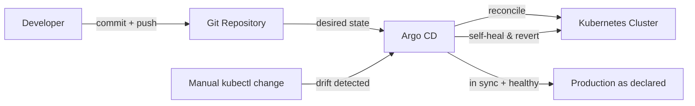

| Difficulty | Channel | Tags |
|---|---|---|
| beginner | devops | argocd, flux, declarative |

There was a time when running Kubernetes meant logging into servers over SSH and configuring them by hand. That is exactly where Okta (Auth0) found itself — until the moment its platform could no longer keep up [1]. When enterprise demand for private-cloud identity infrastructure exploded, the platform team had to grow from roughly 12 manually operated clusters to more than 1,000 Kubernetes clusters, hosting over a million resources with hundreds of daily deploys [1]. Their escape hatch was declarative GitOps, automated with Argo CD. This is the story of that journey — and the mental shift that makes it possible.

---

> ### Real-World Case — Okta (Auth0)
>
> Auth0's private cloud platform began as a manually operated service for a handful of customer clusters (~12), updated by hand via SSH and manual config. As enterprise demand for private-cloud identity infrastructure surged, the platform had to grow to nearly 1,000 Kubernetes clusters while a small team kept hundreds of daily deploys safe.
>
> | | |
> |---|---|
> | **Challenge** | How to manage a fleet of ~1,000 customer Kubernetes clusters (1M+ resources) with GitOps at scale, when Terraform-provisioned infrastructure must complete before Argo CD syncs and every customer has its own deployment windows - constraints that break naive auto-sync and a plain '3-minute reconcile' model. |
> | **Solution** | Okta built a declarative GitOps platform on Argo CD where one release manifest maps to one Argo application representing an entire customer cluster, keeping Git as the single source of truth. Because Argo CD's built-in auto-sync cannot order Terraform runs before a sync or respect customer-specific maintenance windows, they implemented their own 'auto-sync' using Argo Workflows plus a control plane - deliberately replacing the default reconciliation trigger with a dependency-aware one. |
> | **Outcome** | Scaled from ~12 to 1,000+ Kubernetes clusters with 1M+ resources and hundreds of daily deploys orchestrated declaratively, all managed by a compact platform team through extensive custom tooling on top of Argo CD. |
> | **Lesson** | Declarative GitOps genuinely scales, but Argo CD's built-in auto-sync is not a universal tool: at real-world scale you must replace it with dependency-aware, policy-aware reconciliation (Okta's workflow-based 'auto-sync') so Git stays the source of truth while respecting external dependencies like Terraform and customer deployment windows. |

---

## Hook — When 12 Clusters Suddenly Become 1,000

Picture this: you have twelve Kubernetes clusters, each one lovingly configured by hand over SSH. Now fast-forward to the morning your boss announces the company's biggest enterprise deal yet — and those twelve clusters are about to become a thousand. Sound like a nightmare? For many platform teams, this is the exact moment the pager starts screaming. Okta's private-cloud platform lived through precisely this transition, and the way it escaped the spiral of manual chaos holds a lesson for every developer who has ever run a `kubectl` command and silently prayed. The answer isn't more engineers or more heroic late-night debugging. It is a fundamental change in how you declare your intent.

## Problem — The Quiet Catastrophe of Configuration Drift

Every team that has operated Kubernetes at real scale has hit the same wall. The imperative approach — running `kubectl apply`, `kubectl scale`, `kubectl delete` — feels great on your first cluster. It is fast, direct, and satisfyingly immediate. But multiply that by a handful of environments and a rotating cast of engineers, and a sinister thing starts happening: configuration drift. You might think staging mirrors production, until the night an incident forces you to realize the two have drifted so far apart that your "tested" config was never actually tested at all [4]. Moreover, every ad-hoc command is invisible — no commit, no review, no audit trail. When something breaks, "who changed this?" becomes a rhetorical question nobody can answer. This is the exact pain that pushes teams toward a declarative model, where the desired state lives in version control and the cluster becomes an opinionated executor of that intent [4].

## Real-World Case — Okta (Auth0)

This isn't a hypothetical scenario from a slide deck. When Auth0's private cloud platform first shipped, it was a boutique operation: a handful of customer clusters — roughly twelve of them — configured by hand over SSH and manual config [1]. Then enterprise demand for private-cloud identity infrastructure surged, and the ground moved. The platform had to scale to nearly 1,000 Kubernetes clusters, hosting more than a million resources, with hundreds of daily deploys landing safely — all orchestrated by a compact platform team [1]. That scale is simply impossible with imperative ops. No team of that size could SSH into a thousand clusters, and nobody could remember what they changed in which one. Instead, Okta doubled down on a declarative GitOps model with Argo CD at its core, building extensive custom tooling on top to manage the entire fleet as code [1]. Read the numbers again: 12 to 1,000 clusters, 1M+ resources, hundreds of deploys a day — and the only thing that scaled linearly was automation, not headcount.

## Deep Dive — Declarative vs Imperative, and the Plot Twist Nobody Expects

Building on the Okta story, here is the plot twist most developers miss: the real bottleneck was never tooling — it was a mental model. The declarative approach flips the entire script. Instead of telling the cluster what to do, you write YAML manifests, Helm charts, or Kustomize overlays that describe the world as it should be [6][7]. Argo CD then becomes the tireless watchdog that continuously compares the desired state in Git with the live cluster state and reconciles the difference [2]. Specifically, you enable auto-sync with a health check interval (typically 1–5 minutes, with 3 minutes as a common default), and self-healing so that any unauthorized manual change is automatically reverted back to what Git declares [2].

💡 Insight: Auto-sync checks the repo on a polling interval, but a webhook on your Git server can trigger reconciliation in seconds. The 3-minute poll is a safety net, not a speed limit.

Here is the real tradeoff, side by side:

| Dimension | Declarative (GitOps) | Imperative (kubectl) |
|---|---|---|
| Source of truth | Git repository | Whatever happens to be in the cluster |
| How changes happen | Pull request → merge | Direct command, zero review [5] |
| Auditability | Every change is a commit [8] | Your memory and your luck |
| Drift handling | Auto-reconciled + self-healing [2] | Manual detective work at 2am |
| Rollback | `git revert` then resync | Hope, scripts, and prayer |
| Team collaboration | Built-in code review | "Ask whoever ran it" |

⚠️ Watch Out: You might assume declarative means less control. Actually, it means deliberate control. Every change now flows through code review, gets logged in history, and is reversible by design [8]. Meanwhile, every imperative `kubectl` command creates a state that was never declared, reviewed, or documented [5]. 🔥 Hot Take: If a cluster's state has never been declared in Git, can you really call it managed? That question sits at the very heart of the GitOps philosophy [9].

## Workflow — From Git Commit to Self-Healing Cluster in Six Steps

So how do you actually get from a manually operated fleet to "press merge and walk away"? The workflow is surprisingly mechanical once you accept the declarative mindset. Step one: put every piece of infrastructure into Git — plain YAML, Helm charts, or Kustomize overlays — and let version control handle the rest [6][7]. Step two: deploy Argo CD into your cluster so it can watch over you. Step three: register your Git repository as a trusted source in Argo CD [3]. Step four: create an Application Custom Resource (CRD) that points at the repo, the path, and the destination namespace. Step five: flip on auto-sync, self-healing, and pruning so the cluster follows Git like a loyal compass. Step six: merge a change and watch Argo CD do the rest — and when someone inevitably runs a rogue `kubectl` command, watch it get reverted automatically. This leads to the heart of the whole system, which is easier to see than to describe:

The diagram below shows the GitOps reconciliation loop that runs constantly once your workflow is wired up [Diagram: GitOps Reconciliation Loop].

## Code Example — Automating Argo CD from the Command Line

Everything above becomes concrete the moment you script it. Here is the production-style sequence for registering a repo and creating a self-healing, auto-syncing Application — the exact pattern that lets a small team manage a fleet that would otherwise eat their calendar.

## Lessons Learned — Battle Scars and What to Do Differently Tomorrow

After watching teams run this gauntlet — from Okta's platform group to startups with three clusters — a few hard-won lessons keep surfacing. First, start declarative on day one. Declaring an app in Git from the very beginning costs you an afternoon; retrofitting GitOps onto a drifted cluster costs you a quarter. Second, self-healing is a superpower with a caveat: if you enable `auto-prune` without discipline, resources can be deleted the moment they disappear from the repo — always review your Git history before merging a destructive change. Third, secrets in Git are a trap; teams routinely pair Argo CD with SealedSecrets or SOPS before they consider the setup production-grade.

🎯 Key Point: The single most valuable shift isn't the tool — it's the rule that the cluster is just a cache, and Git is the truth [9]. The moment your team internalizes that, code review covers infrastructure, rollbacks become `git revert`, and auditability is free because it is inherited [8].

Here is what to do tomorrow: pick one small application, write its manifests into Git, wire up Argo CD in a staging environment, and turn on auto-sync with self-healing. Watch what happens the first time somebody tries to patch it directly. 🎯 The memorable insight to share with your team: "If it isn't in Git, it doesn't exist."

---

## GitOps Reconciliation Loop

<strong>Original Interview Question</strong>

**Q:** You're setting up GitOps for a microservices deployment. How would you configure ArgoCD to automatically sync changes from your Git repository to Kubernetes, and what's the difference between declarative and imperative approaches in this context?

**A:** I'd configure ArgoCD by setting up a Git repository containing Kubernetes manifests or Helm charts, creating an Application CRD that points to the Git repository, enabling auto-sync with a health check interval of 3 minutes, and implementing self-healing to automatically revert any manual changes. The declarative approach involves defining the desired state in Git through YAML manifests, Helm charts, or Kustomize configurations, where ArgoCD continuously reconciles the actual state with the desired state. In contrast, the imperative approach uses kubectl commands to make direct changes to the cluster, bypassing the Git repository as the single source of truth.

## Conclusion

Okta started with a handful of hand-configured clusters and ended up orchestrating more than a thousand of them with a compact team — the difference wasn't a bigger budget or a bigger team, it was a better model. Declarative GitOps with Argo CD turned infrastructure into something you can review, roll back, and trust, and the same shift works for you whether you manage 2 clusters or 2,000. So here is your next step: pick one small app, put its manifests in Git, wire up Argo CD in staging, and turn on auto-sync with self-healing. Then watch what happens when someone tries to bypass it. Share the one insight that will stick with your team tomorrow: if it isn't in Git, it doesn't exist.

---

## References

1. [Okta (Auth0) incident report](https://thenewstack.io/how-okta-scaled-from-12-to-1000-kubernetes-clusters-with-argo-cd/) — article
2. [Argo CD Documentation](https://argo-cd.readthedocs.io/en/stable/) — documentation
3. [Argo CD GitHub Repository](https://github.com/argoproj/argo-cd) — documentation
4. [Kubernetes: Declarative Management of Kubernetes Objects](https://kubernetes.io/docs/tasks/manage-kubernetes-objects/declarative-config/) — documentation
5. [Kubernetes: Imperative Management of Kubernetes Objects](https://kubernetes.io/docs/tasks/manage-kubernetes-objects/imperative-command/) — documentation
6. [Helm Documentation](https://helm.sh/docs/) — documentation
7. [Kustomize](https://kustomize.io/) — documentation
8. [GitOps (Wikipedia)](https://en.wikipedia.org/wiki/GitOps) — documentation
9. [Open GitOps — GitOps Principles](https://www.gitops.tech/) — documentation

---

**Author:** Satishkumar Dhule — [GitHub](https://github.com/satishkumar-dhule) · [LinkedIn](https://linkedin.com/in/satishkumar-dhule) · [Website](https://satishkumar-dhule.github.io)
