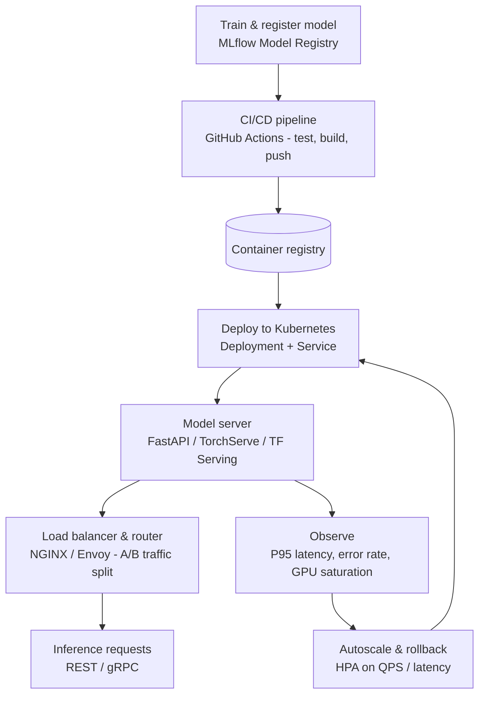

| Difficulty | Channel | Tags |
|---|---|---|
| beginner | devops | mlops, deployment |

In 2016, Uber's data scientists were shipping machine learning models with so much disjointed tooling and so little shared infrastructure that the company built an entire platform — Michelangelo — just to tame the chaos [1]. At its peak, that platform processed over 10 million predictions per second, with P95 latency under 5ms for the hottest serving paths [1]. None of that would have been possible if Uber's engineers had treated "deployment" and "serving" as the same job. This article walks through that distinction, the trade-offs hiding underneath it, and the patterns that separate systems which survive real traffic from ones that fold at the first spike.

---

> ### Real-World Case — Uber
>
> In 2016 Uber launched Michelangelo, an internal ML-as-a-service platform, because data scientists across teams were building and deploying ML systems with wildly different tooling and no shared infrastructure. The most urgent use cases were extreme-scale problems (ETA prediction, UberEATS delivery time), which drove early architecture decisions around serving performance.
>
> | | |
> |---|---|
> | **Challenge** | Uber needed to separate two very different problems: (1) deployment — packaging trained models, running CI/CD, pushing to staging/production, managing offline batch vs online serving pipelines; and (2) serving — running low-latency, high-throughput real-time inference RPCs for the highest-loaded online services at the company, while also handling model versioning and scaling. |
> | **Solution** | Michelangelo explicitly split these concerns. Deployment was handled through a web UI and API that packed models into three modes: offline (Spark batch prediction jobs), online (a prediction service cluster of hundreds of machines behind a load balancer serving Thrift RPCs), and library (model embedded into another service). Serving was its own optimized layer: a pure-Java serving runtime for low-latency online scoring, a Cassandra-backed feature store to fetch precomputed features at prediction time, and stateless, share-nothing model containers that could trivially scale horizontally by adding hosts. Later iterations integrated TensorFlow Serving and NVIDIA Triton and added shadow testing, gradual rollouts, and auto-rollback to the deployment side. |
> | **Outcome** | The highest-traffic models served over 250,000 predictions per second, with P95 latency under 5ms for models not requiring feature-store lookups and under 10ms for those that did. The platform grew to 400+ active use cases, 5,000+ models in production, and 10 million real-time predictions per second at peak. |
> | **Lesson** | Deployment and serving are distinct problems that need different infrastructure: deployment is about safely getting models into production (CI/CD, validation, rollback), while serving is about squeezing latency and throughput out of stateless prediction endpoints. Uber also learned that optimizing serving first hurt developer velocity — the deployment experience (easy packaging, standard model representations, monitoring) was equally critical to scaling ML across the company. |

---

## Hook — It was 3am and the model was melting

It is 3am and the pager is screaming. Your model — the one that aced the offline benchmark, the one the CEO mentioned in the all-hands — is now serving live traffic and returning errors faster than predictions. The autoscaler kicked in too late, the feature-store lookup is eating your latency budget, and the rollback button might as well not exist. Sound familiar?

This is the moment every ML engineer eventually meets, and it has nothing to do with model accuracy. It has everything to do with a distinction most tutorials gloss over: **model deployment** and **model serving** are not synonyms. Deployment gets your model *into* production. Serving is what your model does *in* production, request after request, at whatever scale reality throws at you.

Uber learned this lesson the expensive way — by building a platform that now peaks at 10 million predictions per second [1]. Their story starts with a hard truth: nobody's notebook performance matters once real traffic arrives.

## Problem — When "it's deployed" means five different things

Here is the core problem: ask five engineers what "deployed the model" means and you will get five different answers. One means the training pipeline pushed an artifact to an S3 bucket. Another means a container is running on a staging box. A third means users can actually hit the endpoint and get predictions back. All three are dangerously incomplete.

**Deployment** is an infrastructure discipline. It covers CI/CD pipelines, environment provisioning, rollback strategies, and monitoring — the machinery that gets an artifact from a notebook into a running system [2]. **Serving** is a runtime discipline. It covers model loading, request routing, batching, versioning, and autoscaling — everything that happens between "request arrives" and "prediction leaves" [5].

The danger of conflating the two is that teams design for one and get blindsided by the other. You might spend weeks perfecting a CI/CD pipeline, then discover your inference server takes 30 seconds to load a 2GB model on every cold start. Or you build a lightning-fast inference API and realize there is no way to roll back when a bad version ships. Many developers discover, to their horror, that their "production ML system" is really a script behind a load balancer.

## Real-World Case — Uber and the birth of Michelangelo

By 2016, Uber had a serious problem hiding in plain sight. Data scientists across teams were building and deploying ML systems with wildly different tooling and zero shared infrastructure [1]. Every team reinvented the wheel — and the wheels didn't fit each other's carts. So Uber did what any company at that scale had to do: it built a platform. That platform, **Michelangelo**, became the company's internal ML-as-a-service system, and its most urgent use cases were the ones nobody could afford to get wrong: ETA prediction and UberEATS delivery-time estimates [1].

Here is where the story gets interesting. Those extreme-scale use cases didn't just set a high bar — they *defined the architecture* from day one. Because when you are predicting arrival times for millions of trips, you cannot afford a 200ms inference. Michelangelo's highest-traffic models served more than **250,000 predictions per second**, with **P95 latency under 5ms** for models that didn't require feature-store lookups and **under 10ms** for those that did [1].

The platform grew to 400+ active use cases, 5,000+ models in production, and **10 million real-time predictions per second** at peak [1]. None of that was an accident. It was the direct result of treating serving as a first-class engineering discipline with hard latency budgets — not as an afterthought bolted onto a training notebook.

## Deep Dive — Same coin, two very different sides

Building on Uber's lesson, pull the two concepts apart properly. Think of deployment as the *delivery* of a model and serving as its *day job*. One is a series of one-time events; the other is a continuous runtime.

| | Deployment | Serving |
|---|---|---|
| Core job | Get the artifact into production | Answer inference requests |
| Tools | Kubernetes, Docker, Terraform [2] | TF Serving, TorchServe, BentoML, FastAPI [5][6][7][8] |
| Platforms | MLflow, SageMaker, Vertex AI [4][10] | Load balancers: NGINX, Envoy [11] |
| Key activities | CI/CD, provisioning, monitoring, rollback | Model loading, routing, batching, versioning |
| Typical metric | Deploy time, success rate, MTTR | P95 latency, throughput, error rate |

Notice what shifts: deployment cares about *how fast and safely* a model arrives; serving cares about *how fast and reliably* it responds. The tooling barely overlaps, and neither discipline makes the other unnecessary.

Now the trade-offs, because this is where the plot twists:

- **Latency vs. throughput.** Real-time inference wants sub-100ms responses; batch inference wants maximum throughput over minutes or hours [1]. You cannot optimize both with one configuration — the batch pipeline should queue aggressively, while the real-time pipeline should parallelize and cache aggressively.
- **Horizontal vs. vertical scaling.** You might think "just add pods." Horizontal scaling (replicas behind a load balancer) handles high QPS [3]. Vertical scaling (more GPU memory, more CPU) handles single-request complexity — think large transformer models that don't fit one replica's budget.
- **Cold starts.** The most underrated villain. When a new replica boots, it must load weights, initialize CUDA context, and warm caches before answering its first request. Many developers discover their autoscaler is useless because new pods take 30+ seconds to warm up. Model preloading and weight deduplication across replicas are serving concerns, not deployment ones.
- **Versioning and A/B testing.** Traffic splitting, gradual rollouts, and instant rollback are the mechanism that lets you ship a challenger model to 5% of traffic, watch P95 latency and business metrics, then decide [4].

The counterintuitive part: **the model is rarely the bottleneck.** Feature lookups, serialization, network hops, and queueing eat your latency budget before a single matrix multiply runs. That is why Michelangelo drew a hard line between models that hit the feature store and models that didn't — the difference was 5ms of P95 budget [1]. The paper *Hidden Technical Debt in Machine Learning Systems* makes the broader point: the model itself is a tiny fraction of the real system, and the glue around it is where systems die [9].

## Workflow — From training notebook to autoscaling endpoint

Now that the two disciplines are clear, here is the workflow that binds them into one production system. The pipeline below is the pattern used — with local variations — by virtually every serious ML platform, Michelangelo included.

The flow starts when a data scientist registers a trained artifact in a model registry such as MLflow [4]. A CI/CD pipeline picks it up, runs validation tests, builds a container image, and pushes it to a registry [2]. From there, Kubernetes provisions the infrastructure and rolls out the model server — TF Serving, TorchServe, or a custom FastAPI/BentoML service [5][6][7][8]. A load balancer routes traffic, slicing off a percentage for A/B testing [11]. The horizontal pod autoscaler watches QPS and latency and scales replicas in and out [3]. Monitoring feeds the decisions: if P95 latency or error rates spike, the system rolls back to the last known-good version.

Step by step:

1. **Train and register.** Push the artifact plus metadata (metrics, dataset hash, params) to the registry [4].
2. **CI/CD build.** Automated tests, then a container image that packages the model weights with the serving code [2].
3. **Provision and deploy.** Terraform and Kubernetes stand up namespaces, secrets, and the deployment object.
4. **Serve.** The model server loads the artifact into memory and exposes a versioned inference endpoint [6].
5. **Route and split.** NGINX or Envoy balances traffic; a slice is cut for the challenger model [11].
6. **Scale.** HPA adds replicas as QPS climbs and removes them when demand drops [3].
7. **Observe and rollback.** P95 latency, error rate, and GPU utilization feed alerts and rollback triggers.

Sound like a lot? It is. But notice that only steps 2 and 3 are "deployment." Everything after — loading, routing, scaling, rolling back — is serving. Uber's 10M predictions per second are the payoff of engineering that whole chain as one system [1].

## Code Example — A versioned, autoscaling-ready model server

To make this concrete, here is a minimal but production-shaped model server. It demonstrates the serving concerns deployment pipelines often ignore: versioned endpoints, health probes for Kubernetes, and per-request latency tracking.

```python
# server.py — model serving with versioning, health checks, and latency tracking
from __future__ import annotations

import time
from typing import Dict, List

from fastapi import FastAPI, HTTPException
from pydantic import BaseModel

app = FastAPI(title="Recsys Model Server")

# In production, this registry is populated at boot from MLflow/S3.
# Holding weights in memory is what makes sub-5ms serving possible.
REGISTRY: Dict[str, List[float]] = {
    "v1": [0.5, -0.2, 0.8],   # champion: serving full traffic
    "v2": [0.6, -0.1, 0.9],   # challenger: ready for A/B traffic split
}

class PredictRequest(BaseModel):
    features: List[float]

class PredictResponse(BaseModel):
    prediction: float
    model_version: str
    latency_ms: float

@app.get("/healthz")
def healthz() -> dict:
    """Kubernetes liveness/readiness probe — must return fast, always 200."""
    return {"status": "ok", "loaded_versions": sorted(REGISTRY)}

@app.get("/versions")
def versions() -> dict:
    """Expose versions so the router can split traffic for A/B tests."""
    return {"versions": sorted(REGISTRY)}

@app.post("/predict/{version}", response_model=PredictResponse)
def predict(version: str, body: PredictRequest) -> PredictResponse:
    model = REGISTRY.get(version)
    if model is None:
        raise HTTPException(status_code=404, detail=f"version {version} not loaded")

    if len(body.features) != len(model):
        raise HTTPException(status_code=422, detail="feature dimension mismatch")

    start = time.perf_counter()
    # In a real system, this is model.predict(...) on a serialized torch/tf
    # artifact. Keeping inference isolated from the HTTP layer lets you swap
    # in GPU batching or a compiled runtime without touching the API.
    score = sum(w * f for w, f in zip(model, body.features))
    latency_ms = (time.perf_counter() - start) * 1000

    return PredictResponse(prediction=score, model_version=version, latency_ms=latency_ms)
```

What to notice:

- **Versioned routes** (`/predict/v1` vs `/predict/v2`) let a router split traffic for A/B testing without redeploying anything [4]. The challenger can sit idle at near-zero cost until it wins the experiment.
- **`/healthz` returns immediately.** Kubernetes probes hit this endpoint every few seconds on every pod; if it does heavy work or allocates memory, every probe steals from your latency budget [2].
- **Latency is measured per request** and returned in the response. That single field turns serving into an observable system — you can chart P95 directly from response logs instead of guessing.
- **The inference call is isolated** from the HTTP layer, so the hot path can later move to GPU batching or a compiled runtime without redefining the API [7].

This is a serving layer, not a deployment story. The deployment half — container image, Kubernetes manifests, HPA config, CI/CD pipeline — wraps this code so it can be shipped, scaled, and rolled back [2][3].

## Lessons Learned — What the serving war teaches

After the full journey — from Uber's pre-2016 toolchain chaos to a 10M predictions-per-second platform — the lessons distill down to a handful that apply at any scale.

- **Separate deployment from serving in your head, your team, and your repos.** The infrastructure team owns the pipeline; the serving team owns the runtime contract. When both fall to one person (the usual startup reality), at least keep the concerns separate in the architecture [1].
- **Design against a latency budget, not against accuracy.** Uber's P95 budgets — 5ms and 10ms — were set before the models were built, and every architecture decision served them [1].
- **Version everything, including the data.** Rolling back a model is meaningless if you can't also roll back its feature computation. Versioned routes + registry metadata + CI/CD rollback is the pattern that makes "ship the challenger" a low-risk move [4].
- **Assume cold starts will betray you.** Preload models, deduplicate weights across replicas, and test autoscaling against a warm-up strategy — not a fresh-boot surprise.
- **Measure P95 and error rates before you need them.** The monitoring you set up at the start determines whether you debug the next incident in minutes or inside the incident itself [9].
- **The model is the smallest part of the system.** Michelangelo is not a training platform; it is a serving platform with a training front door. The glue — routing, scaling, observability — is where ML systems live or die [9].

What to do differently tomorrow: take the smallest model your team has in production, add a versioned endpoint, expose a fast health probe, and start returning latency per request. That is the first step toward a serving layer that behaves like Uber's — at a scale you can actually reach.

---

## Deployment vs Serving Pipeline



<details>
<summary><strong>Original Interview Question</strong></summary>

**Q:** Explain the key differences between model serving and model deployment in ML systems, including specific technologies, scaling considerations, and real-world implementation patterns?

**A:** Deployment encompasses CI/CD pipelines, infrastructure setup, and monitoring using tools like Kubernetes, MLflow, and SageMaker. Serving focuses on runtime inference APIs with frameworks like TensorFlow Serving, TorchServe, or BentoML, handling request routing, model versioning, and autoscaling. Key trade-offs include latency vs throughput, batch vs real-time inference, and cold start optimization.

</details>

## Conclusion

Uber's Michelangelo story is not a cautionary tale about a scale you will never reach — it is a blueprint for separating the two jobs every ML system must do: getting models *into* production, and keeping them *alive* in production. Deployment gets you to the starting line. Serving is the race. The next time your team says "the model is deployed," ask the follow-up that separates the professionals from the amateurs: "Yes, but how fast does it answer, how does it scale, and how do you get it back if it breaks?" The teams that answer that question well are the ones that wake up to 250,000 predictions per second instead of a pager at 3am [1].

---

## References

1. [Uber incident report](https://www.uber.com/us/en/blog/michelangelo-machine-learning-platform/) — article
2. [Kubernetes Overview — Concepts](https://kubernetes.io/docs/concepts/overview/) — documentation
3. [Horizontal Pod Autoscaling — Kubernetes Documentation](https://kubernetes.io/docs/tasks/run-application/horizontal-pod-autoscale/) — documentation
4. [MLflow — GitHub Repository](https://github.com/mlflow/mlflow) — documentation
5. [TensorFlow Serving — GitHub Repository](https://github.com/tensorflow/serving) — documentation
6. [TorchServe — GitHub Repository](https://github.com/pytorch/serve) — documentation
7. [BentoML — GitHub Repository](https://github.com/bentoml/BentoML) — documentation
8. [FastAPI — Official Documentation](https://fastapi.tiangolo.com/) — documentation
9. [Hidden Technical Debt in Machine Learning Systems — ArXiv](https://arxiv.org/abs/1912.04222) — paper
10. [Amazon SageMaker — AWS Documentation](https://docs.aws.amazon.com/sagemaker/latest/dg/whatis.html) — documentation
11. [HTTP Load Balancing with NGINX — NGINX Docs](https://docs.nginx.com/nginx/admin-guide/load-balancer/http-load-balancer/) — documentation

---

**Author:** Satishkumar Dhule — [GitHub](https://github.com/satishkumar-dhule) · [LinkedIn](https://linkedin.com/in/satishkumar-dhule) · [Website](https://satishkumar-dhule.github.io)
