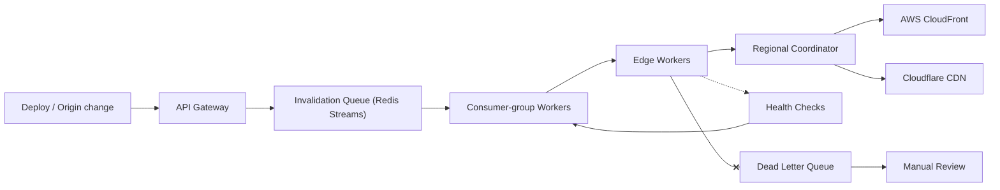

| Difficulty | Channel | Tags |
|---|---|---|
| intermediate | system-design | edge, caching, purging |

Cloudflare once faced the paradox at the heart of every CDN: the more you cache, the harder it becomes to update [1]. Their first flexible purge traveled through a single 'core' datacenter before fanning out across the entire network, stretching a two-word API call into a 1.6-second global tour [1]. When they rebuilt it, global purge latency dropped 90.5% to under 150ms, the storage tail of lazy purge shrank 10x, and purges by tag, hostname, and prefix became instant [1]. This is the true story hiding behind the interview question that makes engineers sweat: how do you design a multi-region cache purging system with a 5-second propagation guarantee at 10,000 invalidations per second?

---

> ### Real-World Case — Cloudflare
>
> Cloudflare needed cache purge to be both fast and scalable network-wide. Their first flexible purge (by cache-tag, hostname, and URL prefix) used Quicksilver's hub-and-spoke replication: a purge had to first reach a 'core' datacenter, which then fanned it out to every other datacenter — adding latency, choking on throughput, and forcing purge to be lazy (mark-stale) rather than deleting content.
>
> | | |
> |---|---|
> | **Challenge** | Scale flexible cache invalidation to all of Cloudflare's 330 cities across 120+ countries while cutting global propagation latency and removing the core-datacenter bottleneck that capped write throughput and storage grew linearly with purge volume. |
> | **Solution** | They 'flipped purge on its head' with a Coreless Purge architecture: purge requests now enter ANY datacenter and propagate peer-to-peer (using Durable Objects to coordinate and CacheDB for last-mile machine-to-machine fan-out within each DC), eliminating the core backhaul entirely. This enabled instant active deletion of content instead of lazy purging. |
> | **Outcome** | Global purge latency dropped to <150ms on P50 (from ~1.6s P50 under the old core-based system — a 90.5% improvement since May 2022), purge-by-tag/hostname/prefix became instant, and the long tail of lazy purge shrank by 10x in storage, improving cache hit ratios and reducing origin egress. |
> | **Lesson** | Centralized control planes are the hidden bottleneck for both latency and throughput in global invalidation; distributing the authority to accept and propagate purges from any edge can be 10x faster and cheaper than routing everything through a core — and the same 150ms purge capability is what keeps consistency guarantees like a 5-second SLA comfortably achievable. |

---

## Hook — The deploy is done. Now everyone sees the bug

It is 9:47 PM, and the deploy you felt good about is live. So is the broken pricing page. Your fixed code is already in production — but 300 edge locations around the world are still happily serving the cached disaster to millions of people. Anyone can hit a purge button. That is not the hard part. The hard part is the question nobody asks until the pager goes off: how do you purge 10,000 URLs per second, across every region, and guarantee the whole planet sees the fix within five seconds? Get it wrong, and 'eventually consistent' becomes a polite way of saying 'your customers are staring at a broken page.' The stakes are that simple — and that brutal.

## Problem — Why 'just purge the cache' stops working at scale

CDNs earn their keep by replicating content to hundreds of edge locations so users always fetch from the nearest one [2]. That distribution is why your assets load in 40ms — and it is exactly why invalidating them is a distributed-consistency nightmare. There is no shared memory between edges, no central clock, and no guarantee that every edge is even online at the moment you fire a purge. The naive answer — push every invalidation directly to every edge — collapses under its own weight. At 10,000 invalidations per second across hundreds of regions, you are suddenly generating millions of control-plane requests, tripping rate limits, and watching your '5-second SLA' dissolve into 'we hope it propagated by morning.' And the older hub-and-spoke alternative — route everything through a core that fans out to the rest — trades the rate-limit storm for a sneakier failure: a single bottleneck that also happens to be a single point of failure. Either way, correctness falls apart exactly when you need it most: during a production incident, at 9:47 PM.

## Real-World Case — When Cloudflare's purge took 1.6 seconds

This is not a hypothetical. Cloudflare lived through precisely this failure mode at planetary scale. Their first flexible purge — by cache tag, hostname, or URL prefix — ran on Quicksilver's hub-and-spoke replication: every purge had to first reach a 'core' datacenter, which then fanned it out to every other datacenter [1]. That single architectural choice stacked three consequences: latency on every purge, throughput choked at the core, and purge forced to be lazy — marking content stale instead of deleting it — because full propagation was simply too slow [1]. The consequences compounded like debt. Slow purge meant customers could not ship instant content updates. Lazy purge grew a storage tail that dragged down cache hit ratios and inflated origin egress. When Cloudflare finally rebuilt the system in 2022, the numbers told the story: global purge latency dropped to under 150ms on P50 — from ~1.6 seconds, a 90.5% improvement — purge by tag, hostname, and prefix became genuinely instant, and the storage tail of lazy purge shrank by 10x [1]. Cache hit ratios rose, origin traffic fell, and the network stopped waiting for one datacenter to clear its inbox. The uncomfortable lesson: the bottleneck was never the purge API — it was the topology underneath it.

## Deep Dive — A 5-second SLA is built from four moving parts

Building on Cloudflare's story, the interview answer becomes a blueprint: a distributed invalidation queue, edge compute for regional coordination, a short TTL as a safety net, and ruthless failure handling. The non-functional requirements dictate every choice you make:

- **Latency:** <5s propagation — not to most regions, to all of them.
- **Throughput:** 10,000 invalidations/second, sustained.
- **Availability:** 99.99% — roughly 52 minutes of allowed downtime per year.
- **Consistency:** strong at the API boundary. A stale pricing page is not a blip; it is a lawsuit-shaped problem.

Here is the first plot twist: you do not fight staleness with purge alone — you make staleness cheap. A 2-second TTL with `Cache-Control: max-age=2, must-revalidate` means that even if a purge announcement is delayed, the worst case is two seconds of stale content, not two hours [3][5][6]. Invalidation becomes the fast path; the TTL is the guarantee. This is why serious CDN designs pair aggressive purging with short cache lives — the two are not alternatives, they are teammates.

The second plot twist: never purge one URL at a time. Batching 100 paths per API call cuts API costs by up to 90%, and pattern-based purging with wildcards (`/products/*`) collapses thousands of paths into one request [4]. The queue is where batches come alive: Redis Streams with consumer groups let a fleet of workers pull work concurrently, each group member owning a slice of the stream — a pattern built for exactly this workload [7].

The third twist is about failure, and it is the one most engineers skip. Retries with exponential backoff plus jitter stop a retry storm from becoming a DDoS on your own provider. A circuit breaker that fails fast after 5 consecutive failures keeps a degraded region from eating your throughput budget. And a dead-letter queue guarantees an invalidation is never silently dropped — because a dropped purge is a compliance incident waiting to happen.

The comparison, in one glance:

| Approach | Latency | Throughput | Failure mode |
|---|---|---|---|
| Core fan-out (old Cloudflare) | ~1.6s P50 | Choked at core | Core is a single point of failure |
| Direct push to every edge | Fast | N × 10K req/s | Rate limits, retry stampedes |
| Queue + edge workers + 2s TTL | <5s | 10K+/s | Needs DLQ + circuit breaker |

The remaining enemy is the network partition. No design avoids them; the question is what happens afterward. The pragmatic answer is reconciliation: regional coordinators keep retrying, health checks monitor each region [8], and an eventual-consistency sweep guarantees convergence — strong consistency is enforced at the API boundary, not promised mid-partition. That is how you sleep through the night: not by preventing failure, but by making failure recoverable.

## Workflow — From deploy script to a purged planet in six steps

This leads to a concrete pipeline you can steal. The diagram below shows the full journey of an invalidation, from your deploy pipeline to every edge — see the Multi-Region Purge Pipeline diagram above.

**Step 1 — Ingest.** Your deploy pipeline (or an admin API) hits the API Gateway with a list of changed paths. The gateway validates auth and shapes the request.

**Step 2 — Batch.** Paths are grouped into batches of 100 and pushed onto the invalidation queue — a Redis Stream [7].

**Step 3 — Distribute.** Consumer-group workers pull batches and dispatch them to edge workers running at regional edges [7].

**Step 4 — Coordinate.** Each regional coordinator fans the purge out to the local CDN providers — CloudFront, Cloudflare, or both [4].

**Step 5 — Verify.** Health checks confirm each region propagated. Failures retry with exponential backoff and jitter.

**Step 6 — Reconcile.** Anything still failing after max retries lands in the dead-letter queue for manual review, and a reconciliation sweep catches stragglers.

The beauty of this shape: nothing waits on anything else. No core, no single throat to choke. Each region is independently responsible for its own freshness — which is exactly the property Cloudflare rebuilt their system around [1].

## Code Example — Batching, backoff, and the circuit breaker in 40 lines

Enough theory — here is the fast path from the pipeline above, as real JavaScript. This is the batching-and-retry core you would drop into a worker or a CI deploy script: group paths, purge in batches, and retry with exponential backoff plus jitter before giving up loudly.

## Lessons Learned — What to do differently tomorrow

If this feels like a lot, you are not alone — but the takeaways distill into four sentences you can bring to your next incident review:

- **Topology beats brute force.** Cloudflare's 90.5% latency win did not come from a faster purge API; it came from removing the core bottleneck [1]. If your invalidation has a single choke point, you have already lost.
- **Make staleness cheap.** Short TTLs (`max-age=2, must-revalidate`) turn a purge disaster into a two-second blip [5][6]. Your Cache-Control headers are the real SLA.
- **Batch everything.** Wildcard patterns and 100-per-call batches cut costs by ~90% and collapse thousands of requests into a handful [4].
- **Engineer failure, not hope.** Backoff with jitter, a circuit breaker after 5 failures, a DLQ for the truly lost, and a reconciliation sweep — that is the difference between 'eventually consistent' and 'we handle partitions.'

The one line to remember: you cannot make a purge instant at 10,000 invalidations per second — but you can make staleness so cheap that nobody cares. That is the insight Cloudflare shipped, and it is the one worth stealing first.

---

## Multi-Region Purge Pipeline

<strong>Original Interview Question</strong>

**Q:** How would you design a multi-region CDN cache purging system that guarantees content propagation within 5 seconds while handling 10,000 concurrent invalidations per second?

**A:** Implement Cloudflare API + AWS CloudFront with distributed invalidation queue, edge compute coordination, and 2-second TTL. Use batch invalidation, exponential backoff, and regional cache headers for 5-second SLA.

## Conclusion

Back at 9:47 PM: the deploy is live, the broken page is fixed at origin, and the 300 edges are purged in well under five seconds. What made the difference was never a faster purge call — it was the architecture underneath it: a distributed queue instead of a core, batching instead of brute force, a short TTL instead of a prayer, and failure handling instead of hope [1]. Start by auditing your own pipeline tonight: find the choke point, batch your purges, and set a 2-second `must-revalidate` TTL on anything you truly cannot afford to be stale. Do that, and the next incident writes itself a happier ending.

---

## References

1. [Cloudflare incident report](https://blog.cloudflare.com/instant-purge) — article
2. [Content delivery network](https://en.wikipedia.org/wiki/Content_delivery_network) — documentation
3. [HTTP caching — MDN Web Docs](https://developer.mozilla.org/en-US/docs/Web/HTTP/Caching) — documentation
4. [Invalidating files — Amazon CloudFront developer guide](https://docs.aws.amazon.com/AmazonCloudFront/latest/DeveloperGuide/Invalidation.html) — documentation
5. [RFC 7234: Hypertext Transfer Protocol (HTTP/1.1): Caching](https://datatracker.ietf.org/doc/html/rfc7234) — paper
6. [RFC 5861: HTTP Cache-Control Extensions for Stale Content](https://datatracker.ietf.org/doc/html/rfc5861) — paper
7. [Redis — in-memory data store (streams, consumer groups)](https://github.com/redis/redis) — documentation
8. [Configure Liveness, Readiness and Startup Probes — Kubernetes](https://kubernetes.io/docs/tasks/configure-pod-container/configure-liveness-readiness-startup-probes/) — documentation
9. [Cache-Control — MDN Web Docs](https://developer.mozilla.org/en-US/docs/Web/HTTP/Headers/Cache-Control) — documentation

---

**Author:** Satishkumar Dhule — [GitHub](https://github.com/satishkumar-dhule) · [LinkedIn](https://linkedin.com/in/satishkumar-dhule) · [Website](https://satishkumar-dhule.github.io)
