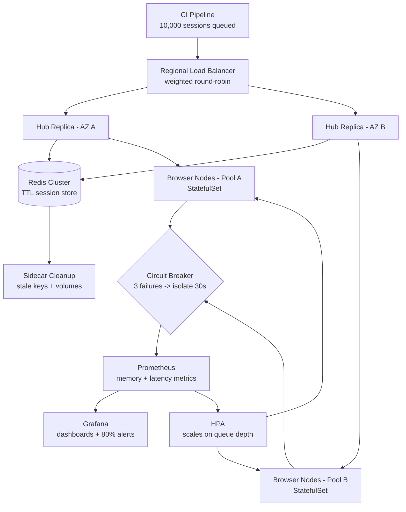

| Difficulty | Channel | Tags |
|---|---|---|
| advanced | system-design | selenium, webdriver, grid |

By 2014, Expedia Group was drowning in its own success — roughly 9,000 UI automation tests scattered across 350+ Jenkins jobs, with browsers opening directly on executors and suites taking hours [1]. Teams at Expedia responded by rebuilding the entire grid, first on auto-scaling EC2 and later on Kubernetes, climbing from 9,000 slow tests to 140,000+ a day [1]. This article walks through the architecture that got them there — and what it takes to push a grid to 10,000 concurrent sessions with 99.9% uptime and zero memory leaks.

---

> ### Real-World Case — Expedia Group
>
> Until 2014, Expedia ran ~9,000 UI automation tests across 350+ Jenkins jobs with browsers opening directly on executors — tests took hours, stale browser processes hung executors, and scaling meant adding more monolithic jobs. They first built 'Distributed Automation' (Selenium Grid + EC2 auto-scaling), reaching 100+ hubs and ~140k-150k tests/day, then hit new limits (2-4 min hub/node spin-up, IP address exhaustion, static EC2 costs) and moved the whole grid to Kubernetes with Helm and Traefik.
>
> | | |
> |---|---|
> | **Challenge** | Run ~150,000 UI tests per day across 100+ Selenium Grid hubs owned by different teams, each with its own CI/CD pipeline, while keeping the feedback cycle to minutes (not hours) and avoiding the enormous cost of third-party cross-browser vendor licenses. |
> | **Solution** | A Kubernetes (EKS) Selenium Grid called DA-Kube: Helm charts to deploy hub + browser node pods, Traefik as ingress to route each team to its own hub, per-branch dynamic grid creation for shift-left testing, Guaranteed QoS pod specs (matching CPU/memory requests and limits) to prevent eviction, one browser container per pod for reliability, and warm worker node pools with auto-scaling browser replicas (e.g. helm upgrade --set chrome.replicas=50). |
> | **Outcome** | 100+ hubs running 140k+ tests daily, with 4500+ EC2 nodes created/terminated per day in the earlier EC2 version and 300-500 browser pods supported in the Kubernetes version. Cost dropped to ~$80,000/year in-house versus ~$2.41M/year for 1,000 parallel connections from third-party vendors — roughly 30x cheaper. The earlier Distributed Automation system also achieved the stated goal of running 1,000 UI tests in about 5 minutes, matching the duration of the slowest test. |
> | **Lesson** | Containerized, auto-scaling, per-branch Selenium Grids can match third-party cross-browser vendors at a fraction of the cost while enabling true parallelism (scale-out, not scale-up). Subtle Kubernetes details matter at grid scale: IP address reservation can silently starve pod creation (300-500 pods wasted ~234 private IPs), and Guaranteed QoS plus one-browser-per-pod are what keep session reliability high under load. |

---

## Hook — The 3 AM Question Every Grid Operator Dreads

Every release pipeline has a moment where everything goes quiet. The suite has been green for nine straight hours, and then one browser process decides to hold the line hostage at 4 PM on release day. Now take that anxiety and multiply it by 10,000 concurrent test sessions running across multiple data centers. That is the bar: 10,000 parallel sessions, 99.9% uptime, and zero memory leaks — the requirement nobody thinks about until the grid slowly bleeds RAM.

The math alone is sobering. At 99.9% uptime, the grid can be unavailable for just 8.76 hours per year. Every orphaned chromedriver, every stale Docker volume, every session that never got cleaned up is a small deduction from that budget. Meanwhile, the fleet arithmetic is unforgiving: 10,000 sessions at 50 sessions per node means 200 nodes minimum, each consuming roughly 2GB of RAM — 400GB before you add a single byte of headroom.

Here is the plot twist that surprises most teams: the bottleneck is never raw CPU. It is state. Stale processes, leaked memory, and abandoned sessions are the silent killers that only surface under load [1]. Expedia Group learned this lesson the hard way, and the journey from 9,000 slow tests to 140,000 a day is the roadmap this article follows.

## Problem — Scaling a Selenium Grid Is a Memory Problem in Disguise

Every grid operator starts with the same instinct: throw more machines at the problem. Add a node, run another VM, watch the queue drain. The strategy works right up until it does not — and the reason is almost never throughput.

Consider what 'scaling' really demands here. Ten thousand sessions is not a load problem; it is a lifecycle problem. Each session spawns a browser process, a driver process, and a container that holds them together. When a test crashes — and tests crash constantly — the container can linger for hours, pinning memory and quietly eating capacity [2]. A naive grid answers this with cron jobs and manual cleanups, which is like fighting a leak with a mop: effective for a while, then someone forgets to check the bucket.

The costs compound silently. Memory creeps upward, nodes crawl under garbage collection, queue depth climbs, and suddenly the P99 session-initiation time blows past the 2-second target [2]. Sound familiar? You are not alone — this is the exact failure arc Expedia Group lived through before the journey described below [1].

What if, instead of adding capacity, you could make the grid delete itself — cleaning up every abandoned session automatically, isolating every failing node, and scaling on demand? The twist, as you will see, is that the answer has very little to do with Selenium itself.

| Naive VM grid | Kubernetes grid |
|---|---|
| Sessions cleaned by cron jobs | Sessions expire via Redis TTL [5] |
| Failing nodes poison the fleet | Circuit breakers isolate them [7] |
| Capacity provisioned manually | HPA scales on queue depth [4] |
| Memory tracked in spreadsheets | Prometheus alerts at 80% [6] |
| Cost grows linearly forever | Cost drops with utilization [1] |

## Real-World Case — Expedia Group's 30x Cost Cliffhanger

Act one: the monolithic years. Until 2014, Expedia Group ran roughly 9,000 UI automation tests across 350+ Jenkins jobs, with browsers opening directly on the executors [1]. Suites took hours, stale browser processes hung executors, and 'scaling' meant spinning up yet another monolithic job. The team's own write-up calls it exactly what it was: a system that grew by addition rather than design [1].

Act two: Distributed Automation. The first fix was a Selenium Grid on EC2 with auto-scaling — a system the team named Distributed Automation [1]. It worked, spectacularly: 100+ hubs, roughly 140,000–150,000 tests executed per day, and a headline achievement of running 1,000 UI tests in about five minutes — matching the duration of the slowest test [1]. Behind those numbers, though, sat 4,500+ EC2 nodes created and terminated every single day [1].

Act three: the wall. New limits arrived fast. Hub and node spin-up took 2–4 minutes, IP address exhaustion became a daily fire, and static EC2 costs made the finance team wince [1]. So Expedia Group moved the whole grid to Kubernetes, orchestrated with Helm and routed through Traefik, supporting 300–500 browser pods [1]. The economics tell the real story: roughly $80,000 a year in-house versus about $2.41 million a year for 1,000 parallel connections from third-party vendors — a 30x reduction [1].

The lesson hiding in those numbers: test infrastructure is infrastructure. It needs the same discipline as production — lifecycle management, isolation, and cost-aware design. What Expedia Group discovered is that the grid stops being a scaling problem the moment you stop managing machines and start managing sessions [1].

## Deep Dive — The Five Levers of an Unkillable Grid

This leads to the core question: what, exactly, makes a grid survive 10,000 concurrent sessions across multiple data centers? Strip away the marketing, and five levers keep the whole system alive.

Lever one: sessions with an expiration date. The Redis cluster is the grid's short-term memory [5]. Every session is a key with a TTL; idle sessions expire on their own, connection pooling reuses capacity, and an automatic cleanup sweep removes stale keys every five minutes [5]. This is the anti-leak weapon — the grid cannot leak what it refuses to keep. The counterintuitive insight: you do not need perfect cleanup code, you need a store that forgets by default.

Lever two: memory as a monitored, managed resource. Memory management is a combination of prevention and detection [11]. Prevention means weekly rolling restarts and garbage-collection tuning so driver processes cannot accumulate; detection means Prometheus scraping memory trends and alerting at the 80% mark, before nodes start swapping, plus Grafana dashboards for session-duration metrics [6]. You might think memory tuning is a Java concern — for browser grids, it is an operational concern [11].

Lever three: isolation by design. Circuit breakers implement Hystrix-style patterns: after three consecutive health-check failures, a node is isolated for a 30-second recovery window before the breaker half-opens and probes it again [7]. Meanwhile, the hub checks every node's /status endpoint every 10 seconds and removes it immediately after three failures [2]. The node does not get a second chance to poison the fleet — it gets a supervised recovery.

Lever four: scale that follows demand, not vibes. Horizontal pod autoscaling keys off queue depth rather than CPU, because a grid can be overloaded long before its processors are [4]. StatefulSets hold browser nodes stable across availability zones, and because the nodes live in managed Kubernetes — say, EKS — they benefit from regional load balancing that keeps P99 session initiation under 2 seconds [3][10].

Lever five: survival under edge conditions. Network partitions are handled with leader election to prevent split-brain scenarios where two hubs both believe they own a session. Pod Disruption Budgets guarantee at least 85% of capacity stays available during planned maintenance [8]. New node versions ship through canary deployments with traffic splitting, so a zero-day bug in a browser image never takes the fleet down [9].

⚠️ Watch Out: the 2GB-per-node memory limit is not a suggestion. Skip resource quotas, and one browser grid will silently consume an entire cluster's worth of RAM — then you get to explain to finance why your test suite needs a datacenter.

💡 Insight: everything above is designed around one sentence: plan for failure, then make failure cheap. Nodes are cattle, sessions are ephemeral, and memory is the enemy [6].

## Workflow — From Queue to Green Build in Seven Steps

Building on those five levers, the path from idea to running grid follows seven steps — each one depends on the last, so resist the urge to skip ahead. The Scalable Selenium Grid Architecture Flow diagram below maps the whole pipeline, from CI queue to isolated node.

1. Cluster foundation. Deploy a Kubernetes cluster across at least two availability zones, with node pools sized for your baseline (200 nodes × 2GB, plus a 30% buffer, per the arithmetic from earlier) [10].
2. Session store. Stand up the Redis cluster with TTL-based expiration, connection pooling, and a five-minute cleanup scan for stale keys [5]. This becomes the single source of truth for every live session.
3. Hub layer. Expose hub replicas behind a regional load balancer using weighted round-robin — weights derived from each hub's capacity and response time — so no single hub becomes the hot potato [2].
4. Browser pools. Run browser nodes as StatefulSets so each pod keeps a stable identity, which makes health tracking and circuit-breaker bookkeeping sane across restarts [3].
5. Autoscaling. Wire horizontal pod autoscaling to queue depth: as the CI pipeline submits sessions faster than nodes drain them, the pool grows; when the queue empties, it shrinks [4].
6. Health and isolation. Every 10 seconds the hub hits each node's /status endpoint; three consecutive failures trip the circuit breaker, removing the node from rotation for 30 seconds [7].
7. Observability and safe deploys. Prometheus feeds Grafana dashboards for memory trends and session duration; sidecar containers sweep leftover Docker volumes, init containers clean stale state on startup, and canary deployments gate every new browser image [6][9].

That workflow only stays airtight if the session lifecycle is enforced in code — which brings us to the implementation.

## Code Example — A Session Manager That Leaks Nothing

The heart of the whole design is session lifecycle management: register, heartbeat, expire, clean up. The Python module below is a production-flavored sketch of exactly that — TTL-based registration, weighted node selection that respects circuit breakers, and capacity accounting that feeds the autoscaler [5][7].

Walking through it section by section:

- The Redis client connects to a single session-store endpoint; every live session is a hash key, and TTL is the memory leak's death sentence [5].
- `is_open` implements the circuit breaker: after three consecutive health failures the node is isolated, and after the 30-second window it half-opens to allow a single probe [7].
- `pick_node` filters out tripped nodes and prefers the least-loaded candidate, giving you weighted round-robin behavior without a complex load balancer [2].
- `start_session` registers the session with a TTL and increments the node's active counter — that counter is exactly the signal the horizontal pod autoscaler watches [4].
- `heartbeat` slides the TTL forward while a test is alive, so a crashed runner simply stops the clock and the session expires naturally instead of hanging around.
- `end_session` frees capacity immediately, never waiting for a cron sweep. In a real deployment, call this in a `finally` block so cleanup happens even when the test fails.

This module is deliberately small because the design moves complexity into the infrastructure: Redis forgets for you [5], the autoscaler scales for you [4], and the circuit breaker isolates for you [7].

## Lessons Learned — What 140,000 Tests a Day Teach You

Stepping back from the code, the Expedia Group story and this architecture converge on the same handful of lessons [1]:

- The grid is a lifecycle problem, not a capacity problem. The moment you stop adding machines and start deleting sessions, the whole system breathes [5].
- Make cleanup automatic or make it moot. TTL expiration means the grid cannot leak what it refuses to keep. Expedia Group's move from manual executor hygiene to managed pods was the turning point [1].
- Isolation beats diagnosis. Circuit breakers and aggressive health checks turn a flaky node into a non-event. Three failures, out of rotation — no 2 AM archaeology required [7].
- Monitor the memory, not just the metrics. Prometheus alerting at 80% memory usage gives you time to act before garbage collection turns your nodes into molasses [6].
- The economics are real. Expedia Group's ~$80K in-house grid versus ~$2.41M from vendors — 30x — shows that the 'just buy a service' reflex is not always the cheapest path [1].

🔥 Hot Take: 'scaling' a test grid by renting more parallel connections from a vendor is the slowest way to pay the most money for the least control. Infrastructure discipline pays for itself.

Battle scar: teams routinely skip Pod Disruption Budgets because 'we rarely restart'. Then a node pool drain during an upgrade takes out 60% of the fleet at 4 PM on release day [8]. Budget your disruptions before they happen.

So what should you do tomorrow? Audit your existing grid for the three warning signs: sessions with no TTL, nodes with no health check, and a cleanup story that ends with 'someone runs a cron job'. Fix the TTL first — it is the highest-leverage change in this entire article [5].

---

## Scalable Selenium Grid Architecture Flow

<strong>Original Interview Question</strong>

**Q:** Design a scalable Selenium Grid architecture to handle 10,000 concurrent test sessions with 99.9% uptime, ensuring zero memory leaks through automatic session lifecycle management, real-time monitoring, and graceful node failure recovery across multiple data centers?

**A:** Deploy Kubernetes cluster with auto-scaling node pools, Redis session store with TTL policies, Prometheus metrics for memory monitoring, circuit breakers for node isolation, and sidecar containers for session cleanup. Implement health checks, resource quotas, and rolling updates.

## Conclusion

The journey started with Expedia Group staring at 9,000 slow, flaky tests spread across 350+ Jenkins jobs — and ended with 140,000+ tests a day at roughly a thirtieth of the vendor cost [1]. Along the way, the insight that changed everything was simple: the best grid is the one that cleans up after itself. TTL-based sessions, circuit-breaker isolation, and demand-driven autoscaling turn what feels like a scaling problem into a lifecycle problem — and lifecycle problems are solveable. Start with one change: give every session an expiration date, then watch the memory graph flatten. Share that with your team tomorrow.

---

## References

1. [Expedia Group incident report](https://medium.com/expedia-group-tech/da-kube-selenium-grid-using-kubernetes-docker-helm-and-traefik-856b802d1d08) — article
2. [Selenium Grid documentation](https://www.selenium.dev/documentation/grid/) — documentation
3. [Kubernetes StatefulSets](https://kubernetes.io/docs/concepts/workloads/controllers/statefulset/) — documentation
4. [Kubernetes Horizontal Pod Autoscaling](https://kubernetes.io/docs/tasks/run-application/horizontal-pod-autoscale/) — documentation
5. [Redis](https://en.wikipedia.org/wiki/Redis) — documentation
6. [Prometheus overview](https://prometheus.io/docs/introduction/overview/) — documentation
7. [Circuit breaker design pattern](https://en.wikipedia.org/wiki/Circuit_breaker_design_pattern) — blog
8. [Pod Disruption Budgets](https://kubernetes.io/docs/concepts/workloads/pods/disruptions/) — documentation
9. [Kubernetes Deployments](https://kubernetes.io/docs/concepts/workloads/controllers/deployment/) — documentation
10. [Amazon EKS documentation](https://docs.aws.amazon.com/eks/latest/userguide/what-is-eks.html) — documentation
11. [Garbage collection glossary](https://developer.mozilla.org/en-US/docs/Glossary/Garbage_collection) — documentation

---

**Author:** Satishkumar Dhule — [GitHub](https://github.com/satishkumar-dhule) · [LinkedIn](https://linkedin.com/in/satishkumar-dhule) · [Website](https://satishkumar-dhule.github.io)
