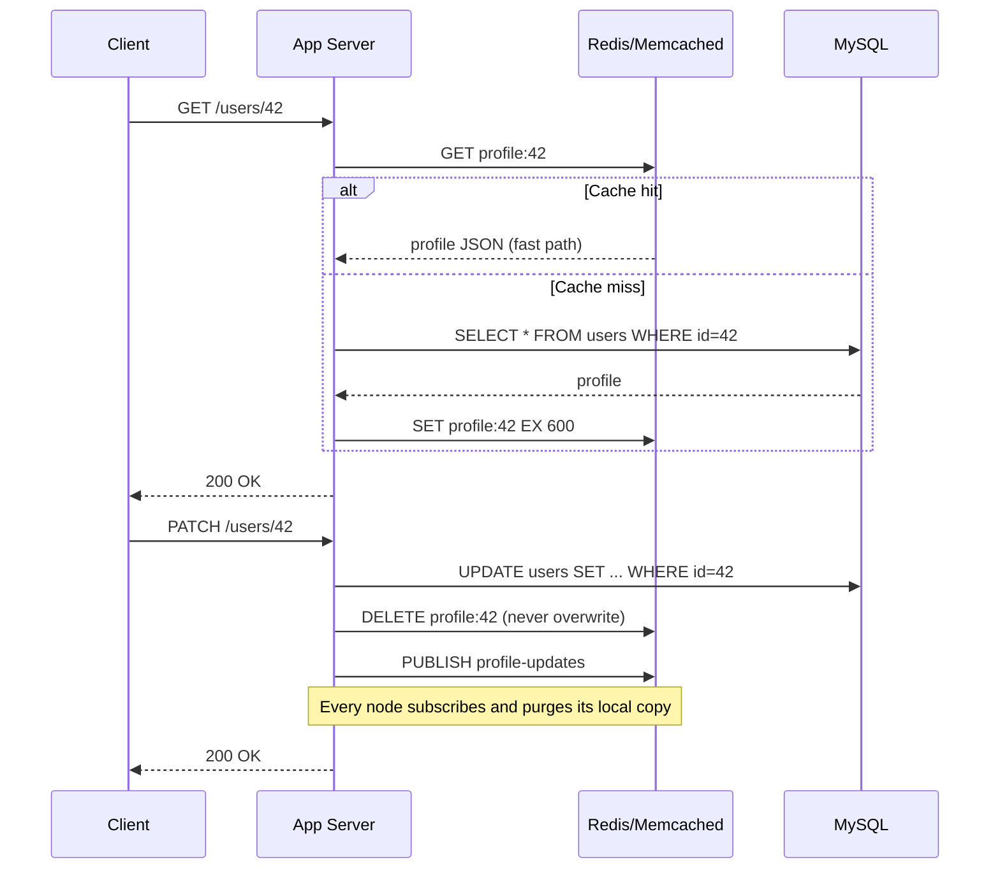

| Difficulty | Channel | Tags |
|---|---|---|
| beginner | backend | redis, memcached, cache-invalidation |

By 2013, Facebook was running one of the most aggressive caching setups in history: a lookaside Memcached tier in front of MySQL, absorbing more than a billion requests every second across thousands of servers [1]. But the moment users started editing their profiles, that giant safety net turned into a liability — one wrong invalidation could send thousands of concurrent reads stampeding straight into the database [1]. This is the story of cache invalidation: why the hardest part of caching has nothing to do with storing data, and everything to do with deleting it. By the end, you will know how to design a user profile service that survives on either Redis or Memcached — and the exact trade-offs that decide between them.

---

> ### Real-World Case — Facebook (Meta)
>
> By 2013 Facebook's read-heavy social graph (profiles, pages, timelines) was served by a lookaside memcache tier in front of MySQL, handling over a billion requests per second across thousands of memcached servers spread over geo-distributed front-end clusters. As user data changed constantly, naive cache invalidation started to cause cascading failures: a hot key expiring or being invalidated at the wrong moment sent thousands of concurrent reads straight to MySQL.
>
> | | |
> |---|---|
> | **Challenge** | How to keep the cache consistent when users update their data without serving stale values, triggering thundering herds, or hammering the database. Two naive strategies failed in the field: write-through/TTL-only invalidation produced cache stampedes (DB query rate spiked from ~1,300/s to ~17,000/s when hot keys expired), and simply re-setting values into the cache caused 'stale set' races where an out-of-order write could overwrite newer data with older data. |
> | **Solution** | They extended the memcached protocol with a lease mechanism: on a cache miss, memcached hands out a lease token bound to the key, throttled to one token per key per 10 seconds, so only one client can repopulate the cache (preventing thundering herds and stale sets). Invalidation became delete-based and data-store-driven rather than TTL-driven: 'mcsqueal' daemons tail every MySQL commit log and broadcast deletes to every front-end cluster via mcrouter, exactly the change-data-capture/pub-sub pattern that Redis provides natively but that Memcached's simplicity forced them to build themselves. |
> | **Outcome** | Leases cut the peak database query rate from ~17,000 to ~1,300 queries per second, a 92% reduction, while the memcache fleet continued serving billions of requests per second with consistent deletes propagated across regions through mcsqueal and mcrouter. |
> | **Lesson** | Cache invalidation should be driven by the source-of-truth change stream (delete-on-update via a change-capture/pub-sub bus), not by TTL expiration alone; and delete-on-update plus lease tokens beats write-through at scale. The Memcached-vs-Redis trade-off played out literally: Memcached's simplicity and speed were great, but Facebook had to build the coordination layer (mcsqueal/mcrouter) that Redis ships out of the box as pub/sub. |

---

## Hook — The profile update that took down a database

Picture this: it is 2 a.m., and your user profile service is quietly doing its job. Ten million profiles, a comfortable 20 percent database CPU, everything humming. Then one key expires at the worst possible moment — right as thousands of users finish their evening scroll — and suddenly every one of those requests misses the cache and hammers MySQL at once. The dashboard goes red. The pager goes off. And the question that started it all was deceptively simple: how do you invalidate a cached profile when a user updates it?

Sound familiar? Every backend engineer has been there. Cache invalidation is the topic that separates hobby projects from production systems, and it earns its place in the famous quip about the two hard problems in computer science: naming things and cache invalidation. This article walks through the exact scenario — a user profile service running write-through caching — and the Redis-versus-Memcached decisions that will make or break it. Buckle up, because the answer is not what most tutorials tell you.

## Problem — Why caching feels easy until the moment it is not

On paper, caching is the easiest win in system design. The cache-aside pattern is practically a rite of passage: check the cache, hit the database on a miss, and seed the cache so the next read is fast [6]. Read-heavy services love it, and a user profile service is the poster child — the same profile gets fetched thousands of times by friends, followers, and feed renderers.

The trouble starts the instant data changes. Every strategy you reach for has a hidden cost:

- TTL alone is a band-aid. A 10-minute TTL means users can see stale profiles for ten minutes — and when many keys share an expiry window, you can trigger a cache stampede [4].
- A stampede is what happens when a hot key expires and thousands of concurrent requests all miss at once, turning one database query into ten thousand — the thundering herd problem [5].
- Overwriting instead of deleting feels safer, but concurrent readers can interleave with your write and store stale data indefinitely.

Here is the uncomfortable truth: your cache is only as good as your invalidation. Nobody learns this lesson from a textbook. The industry learned it the hard way — at billion-requests-per-second scale.

## Real-World Case — Facebook (Meta): the 92% rescue

Building on that uncomfortable truth, let's step into the biggest classroom in the world: Facebook. By 2013, the company's read-heavy social graph — profiles, pages, timelines — was served by a lookaside Memcached tier in front of MySQL, handling over a billion requests per second across thousands of Memcached servers spread across geo-distributed front-end clusters [1]. For context, that is roughly ten times the traffic of a typical mid-sized cloud region, all balanced on keys that could vanish at any second.

And vanish they did. As user data changed constantly, naive invalidation started to cause cascading failures: a hot key expiring or being invalidated at the wrong moment sent thousands of concurrent reads straight to MySQL [1]. One moment a celebrity profile was trending; the next, the database was drowning in a thundering herd of its own making [5].

Facebook's engineers did not answer with bigger hardware. They answered with discipline. Leases gave each reader a ticket before re-reading from the database, strictly limiting how many concurrent misses could hit MySQL. The result: the peak database query rate dropped from roughly 17,000 to about 1,300 queries per second — a 92 percent reduction — while the Memcached fleet kept serving billions of requests per second, with consistent deletes propagated across regions through mcsqueal and mcrouter [1].

The plot twist? The fix was not smarter caching. It was smarter invalidation. That lesson transfers directly to your profile service — and it starts with understanding the two tools you will actually choose between.

## Deep Dive — Redis vs Memcached: the real trade-off matrix

So what do Redis and Memcached actually bring to the invalidation fight? At a glance they look like twins: both are in-memory key-value stores built to sit in front of a database. Look closer, and the differences dictate your architecture.

Memcached is a pure caching engine. It is multithreaded, uses a slab allocator for low memory overhead, and stores nothing after a restart — which is fine, because a cache that dies and must be rebuilt from the database is exactly what a cache is for [2]. Its simplicity makes it fast, and its horizontal scaling story is clean: add nodes, shard keys, done [8]. But it has no built-in way to tell other nodes that a key just changed. Distributed invalidation is manual — your application has to coordinate every delete across every node itself [2].

Redis is a data server with a cache button. Beyond key-value, it ships data structures, replication, and persistence (RDB snapshots and AOF logs) that Memcached simply does not offer [3]. More importantly for this story, Redis has pub/sub: when one node invalidates a key, it can publish a message and every subscriber deletes its local copy — automatic distributed invalidation without polling or manual coordination [3].

The real trade-off, side by side:

| Criterion | Memcached | Redis |
| --- | --- | --- |
| Primary job | Pure cache | Cache + data structures + messaging |
| Invalidation fan-out | Manual coordination across nodes | Built-in pub/sub channels |
| Persistence | None (by design) | RDB / AOF durability [3] |
| Memory overhead | Lower (slab allocator) | Higher per-key metadata [2] |
| Concurrency | Multithreaded | Single-threaded event loop |
| Best fit | Blazing pure caching | Complex invalidation + durability |

Here is the nuance most tutorials skip: Redis is single-threaded, so it cannot magically outrun Memcached on raw throughput — and for a pure, read-heavy cache with simple keys, Memcached's lower overhead can genuinely win [2]. But Redis earns its keep the moment your invalidation becomes a coordination problem — exactly the scenario Facebook hit at scale [1]. If you are running a handful of nodes behind one load balancer, write-through plus TTL is plenty and pub/sub is overkill. If you are running dozens of nodes across regions, that pub/sub channel is the difference between consistent deletes and a stampede [4][5].

## Workflow — The write-through + delete recipe, step by step

That leads to a concrete, repeatable workflow — the same one the interview answer describes, hardened with everything this article has established. The diagram below shows the full journey of a read and an update, so keep it open while you walk through the steps.

Refer to the Cache Invalidation Sequence diagram: reads flow cache-first with a database fallback, while updates flow database-first with a delete and a pub/sub fan-out.

1. Read with cache-aside. Check the cache first. On a hit, you are done in microseconds. On a miss, read the database and seed the cache with a TTL [6].
2. Update with write-through. Write the new profile to the database first — the database is the source of truth, never the cache.
3. Delete, do not overwrite. Remove the key instead of writing over it. Overwrites race with concurrent reads; deletes force the next reader to fetch fresh data.
4. Set a TTL safety net (5–30 minutes for profiles). A TTL guarantees eventual self-healing even if a delete is lost — but keep it short enough that stale profiles do not linger, and stagger expiries so keys do not expire in a synchronized wave [4].
5. Fan out invalidation. On multi-node deployments, publish the delete event so every node purges its local copy. This is where Redis pub/sub shines and Memcached forces manual coordination [1][3].
6. Watch the numbers. Track cache hit rate, 95th-percentile read latency, and a stampede counter. A healthy system has a high hit rate and a flat latency line — the moment either bends, your invalidation is trying to tell you something.

## Code Example — Write-through caching in Python, without the drama

With the workflow in place, the implementation is surprisingly small. Here is a production-shaped profile service in Python using redis-py: cache-aside reads, write-through updates with delete-on-update, a TTL safety net, and a pub/sub invalidation consumer for multi-node deployments.

```python
import json
import redis

# Two things every cache needs: a short TTL (self-healing) and delete-on-update.
# This is the write-through + cache-aside pattern used for user profiles.

client = redis.Redis(host="cache.internal", port=6379, decode_responses=True)
PROFILE_TTL = 600  # 10 minutes: long enough to offload MySQL, short enough to self-heal

def get_profile(profile_id: str) -> dict | None:
    """Cache-aside read: cache first, database second."""
    key = f"profile:{profile_id}"

    cached = client.get(key)  # 1. Fast path — most requests end here
    if cached is not None:
        return json.loads(cached)

    profile = load_profile_from_db(profile_id)  # 2. Slow path — one DB read
    if profile is not None:
        # 3. Seed the cache on miss so the next read is fast
        client.set(key, json.dumps(profile), ex=PROFILE_TTL)
    return profile

def update_profile(profile_id: str, changes: dict) -> dict:
    """Write-through update: persist first, then invalidate. Order matters."""
    key = f"profile:{profile_id}"

    updated = save_profile_to_db(profile_id, changes)  # 1. Source of truth
    client.delete(key)  # 2. Invalidate — delete, don't overwrite

    # 3. Publish so other nodes (and regions) can invalidate too.
    #    Memcached has no built-in pub/sub; Redis does. This is the dividing line.
    client.publish("profile-updates", json.dumps({"id": profile_id}))
    return updated

def watch_invalidations() -> None:
    """Runs on every app node: stay in sync without polling."""
    sub = client.pubsub()
    sub.subscribe("profile-updates")
    for message in sub.listen():
        if message["type"] != "message":
            continue
        event = json.loads(message["data"])
        client.delete(f"profile:{event['id']}")  # purge the stale local copy
```

Walk through it with the original answer's logic in mind. `get_profile` implements the cache-aside read path: the fast path is a single cache GET, and the slow path is one database read followed by a cache seed with a 10-minute TTL [6]. `update_profile` implements write-through: persist to the database first, then delete the key — never overwrite it, because an overwrite can interleave with an in-flight read and persist stale data. Finally, `watch_invalidations` subscribes to `profile-updates` so every application node purges its local copy the moment anyone else updates a profile — the Redis pub/sub mechanism that Memcached would force you to build by hand [3].

One honest caveat: after a delete, the next reader pays the stampede tax [4]. Facebook solved this with leases — each reader gets a token before hitting the database, and only the lease holder may repopulate the cache [1]. If your profiles are truly viral, consider a lock or lease around the seed step. If they are not, the TTL plus delete is already a 90 percent solution.

## Lessons Learned — Five rules your team should steal

Wrap it all up with the rules that survived the journey:

- Stale-but-served beats blank-but-stamped. A consistent, slightly old profile costs you a quizzical user; a stampede costs you an incident [4][5].
- Delete, do not overwrite. Invalidation is about absence, not replacement. Overwrites race; deletes do not.
- The TTL is your seatbelt, not your strategy. It heals failures; it does not prevent them. Keep profiles at 5–30 minutes and stagger expiries [4].
- Choose Memcached for pure speed, Redis for coordination. Low overhead, multithreaded, no persistence — Memcached is the scalpel for pure caching [2][8]. Pub/sub, persistence, and rich structures make Redis the right call once invalidation becomes distributed [3].
- Start boring. A single-process service gets 80 percent of the benefit from `functools.lru_cache` before any Redis or Memcached enters the picture [7]. Reach for a distributed cache when you outgrow one process — and when you do, monitor hit rate before you tune anything else.

Tomorrow, do one thing: add delete-on-update to the hottest cache in your codebase, give it a TTL, and watch the hit rate. The 92 percent reduction at Facebook started with exactly that kind of discipline [1].

---

## Cache Invalidation Sequence



<details>
<summary><strong>Original Interview Question</strong></summary>

**Q:** You're building a user profile service that caches frequently accessed profiles. How would you implement cache invalidation when a user updates their profile, and what trade-offs would you consider between Redis and Memcached?

**A:** Implement write-through caching with TTL-based expiration. On profile update, invalidate the cache by deleting the key and writing new data to both the database and cache. Redis offers pub/sub for automatic distributed invalidation, while Memcached requires manual coordination across nodes.

</details>

## Conclusion

The moral of this story is almost anticlimactic: caching is easy, invalidation is the job. Facebook did not survive a billion requests per second because it cached aggressively — it survived because it invalidated with discipline, cutting peak database queries by 92 percent with leases and consistent deletes [1]. Your profile service faces the same physics, just at a smaller scale. Start with write-through, delete on update, and a short TTL. Add pub/sub fan-out when your fleet grows. And when the pager goes off at 2 a.m., you will already know exactly which key to delete.

---

## References

1. [Facebook (Meta) incident report](https://www.usenix.org/conference/nsdi13/technical-sessions/presentation/nishtala) — paper
2. [Memcached — Wikipedia](https://en.wikipedia.org/wiki/Memcached) — documentation
3. [Redis — Wikipedia](https://en.wikipedia.org/wiki/Redis) — documentation
4. [Cache stampede — Wikipedia](https://en.wikipedia.org/wiki/Cache_stampede) — documentation
5. [Thundering herd problem — Wikipedia](https://en.wikipedia.org/wiki/Thundering_herd_problem) — documentation
6. [Web Caching Basics — DigitalOcean](https://www.digitalocean.com/community/tutorials/web-caching-basics-terminology-http-headers-and-caching-strategies) — documentation
7. [functools.lru_cache — Python Documentation](https://docs.python.org/3/library/functools.html#functools.lru_cache) — documentation
8. [Amazon ElastiCache for Memcached — AWS Documentation](https://docs.aws.amazon.com/AmazonElastiCache/latest/memcached/Welcome.html) — documentation
9. [memcached — GitHub repository](https://github.com/memcached/memcached) — documentation

---

**Author:** Satishkumar Dhule — [GitHub](https://github.com/satishkumar-dhule) · [LinkedIn](https://linkedin.com/in/satishkumar-dhule) · [Website](https://satishkumar-dhule.github.io)
