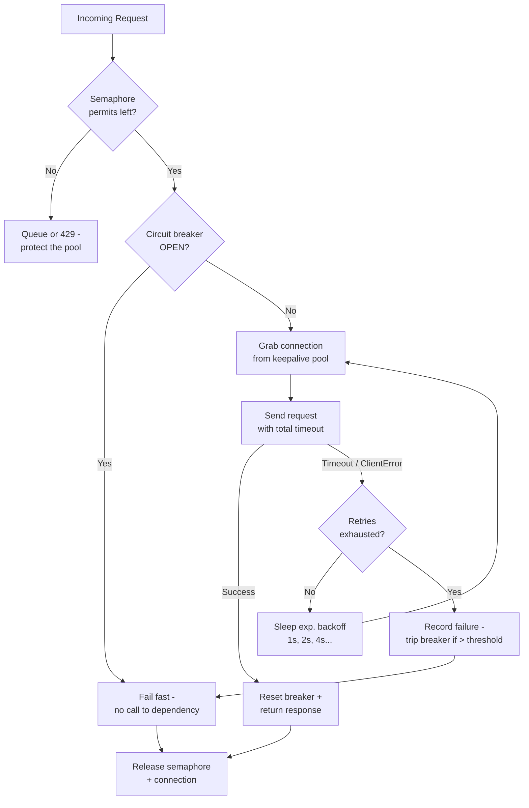

| Difficulty | Channel | Tags |
|---|---|---|
| advanced | backend | asyncio, aiohttp, concurrency |

One in six calls is a failure waiting to happen. That is the math Netflix's API team stares down daily: over a billion incoming calls fanned out at a 1:6 ratio into billions of downstream requests, with peaks above 100,000 dependency calls per second [1]. When a single slow service can saturate every request slot in seconds, "connection management" stops being plumbing and becomes a survival strategy. This is the story of how that realization reshaped one of the world's busiest APIs — and how you can apply the same architecture to your aiohttp service before the pager decides to meet you.

---

> ### Real-World Case — Netflix
>
> Netflix's API sits in front of dozens of internal services and handles over 1 billion incoming calls per day, fanning out at a 1:6 ratio to several billion downstream calls with peaks above 100,000 dependency requests per second. With that many moving parts, intermittent failures were mathematically guaranteed, and a single slow or failing dependency could saturate every request thread in the API tier within seconds, taking down the entire service.
>
> | | |
> |---|---|
> | **Challenge** | Each API request depends on dozens of subsystems, so even dependencies with 99.99% uptime combine to only 99.7% end-to-end availability (2+ hours of downtime per month). When one dependency degraded with increased latency, blocked request threads cascaded and knocked out the whole API for all users — the classic cascade-failure problem that a naive HTTP client with no concurrency limits, timeouts, or circuit breaking cannot survive. |
> | **Solution** | Netflix built Hystrix around the exact pattern stack in this topic: per-dependency connection/thread-pool limits, semaphores with non-blocking tryAcquire for in-memory and fallback calls, network timeouts plus retries with backoff, a circuit breaker that trips at a ~50% error rate over a 10-second rolling window and sheds load by failing fast, and graceful fallbacks (custom, fail-silent, or fail-fast) so members keep getting responses when a dependency is unhealthy. The API layer became a 'DependencyCommand' wrapper that applies all of these protections to every outbound call. |
> | **Outcome** | After the circuit-breaker layer shipped, a real production incident proved it: a bug caused partially-populated cache objects, which intermittently failed device requests and eventually got the API throttled by its database. The circuit for DB selects tripped, 157 of 200 server instances automatically served fallback responses from a local query cache, and the impact on member video views was minimal. By late 2012, Hystrix was executing tens of billions of thread-isolated and hundreds of billions of semaphore-isolated calls per day, and Netflix described the uptime and resilience improvement as dramatic. |
> | **Lesson** | Fault tolerance must be built into the application, not left to infrastructure. The winning combination is exactly the one in this topic — semaphore/thread-pool limits, aggressive timeouts with retries, a circuit breaker to fail fast and shed load, and fallbacks — so that when a downstream service degrades, users get a slightly degraded experience instead of a total outage. |

---

## Hook — The 2:57 AM Cascade

It is 2:57 AM and the pager just went off for the third time this week. Not because the API crashed, but because it quietly stopped responding — requests backing up like cars behind a stalled highway truck. You pull up the dashboards and watch a single number climb: P99 latency going from 80ms to 3,800ms in under a minute. The culprit? One downstream service that grew 40ms slower, absorbing every connection in your pool and dragging the whole platform down with it.

This is the failure mode every aiohttp developer eventually meets. And here is the uncomfortable part: the catastrophe was not caused by your code being wrong. It was caused by your code having no answer for a dependency that misbehaves. Netflix learned this lesson at a scale where failure was mathematically guaranteed, and the fix they built changed how the industry thinks about resilience [1].

🎯 Key Point: A connection pool is not a throughput tool. It is your first line of blast-radius control.

## Problem — Why Simple ClientSessions Fall Apart Under Load

Most services start with the humble `aiohttp.ClientSession` — one session, a handful of connections, and a prayer. That works right up until the day concurrency arrives. Then three things go wrong, often simultaneously.

First, connection starvation. Unless you configure a pooled connector, aiohttp opens a fresh TCP connection per request, and under load that becomes a socket explosion — every new request pays the full TCP + TLS handshake cost, exactly the overhead you are trying to avoid [2].

Second, timeout neglect. Without a `ClientTimeout`, requests hang on a dead peer for minutes, silently occupying the semaphore slots that healthy requests desperately need. A hang is worse than a failure, because a failure is visible and a hang is invisible.

Third, and most dangerous: the cascade. When one dependency slows, every request to it blocks, the pool saturates, and before you know it, your fast API is the slow service that other teams are retrying against. The math makes this inevitable. Netflix's API fans out at 1:6, which means a single slow dependency multiplies its damage sixfold before your error budget even notices [1].

🔥 Hot Take: "Just add more connections" is the worst advice in load testing. Unbounded connections do not fix saturation — they relocate it. Now you are the service exhausting socket file descriptors and database connections. The real problem is not throughput; it is containment.

## Real-World Case — Netflix and the Circuit Breaker That Saved the API

Netflix's API sits in front of dozens of internal services and handles over a billion incoming calls per day, fanning out at a 1:6 ratio to several billion downstream calls with peaks above 100,000 dependency requests per second [1]. With that many moving parts, intermittent failures were not a possibility — they were a guarantee. The engineering team knew that one slow or failing dependency could saturate every request thread in the API tier within seconds, taking down the entire service.

So they shipped a circuit-breaker layer called Hystrix. And then production handed them the proof they needed. A bug created partially-populated cache objects that intermittently failed device requests and eventually got the API throttled by its database. The circuit for database selects tripped. Instantly — no deploy, no manual intervention, no pager — 157 of 200 server instances began serving fallback responses from a local query cache. The impact on member video views was minimal [1].

That is the quiet superpower of a circuit breaker: it does not prevent failure, it prevents failure from becoming a platform-wide event [4]. By late 2012, Hystrix was executing tens of billions of thread-isolated and hundreds of billions of semaphore-isolated calls per day, and Netflix described the uptime and resilience improvement as dramatic [1].

💡 Insight: Notice what did NOT happen: 43 service instances were not "fixed" — they just stopped making things worse. Graceful degradation is not recovery. It is buying time.

## Deep Dive — Semaphores, Timeouts, Breakers, and Backoff

Building on the Netflix story, the pattern is not exotic infrastructure — it is four mechanisms working together, each solving a different failure mode.

**Semaphore: the bouncer.** An asyncio `Semaphore` caps how many requests are in flight at once. It is the difference between "slow and steady" and "slow and collapsing." Without it, an overloaded dependency simply queues unbounded work [3]. The semaphore is what keeps 100 concurrent slots from becoming 10,000 queued coroutines.

**Timeout: the contract with reality.** Every request needs a `ClientTimeout`. A total timeout of 30 seconds sounds generous — until you multiply it by 100 in-flight slots and realize your worst case is minutes of accumulated stuck requests. Timeouts are how you turn an undetectable hang into a measurable failure you can actually react to [2].

**Circuit breaker: the failsafe.** After N consecutive failures, the breaker trips and rejects new requests instantly, letting the dependency recover in isolation. This is the pattern that turned Netflix's 157-of-200 story into a non-story [4][5]. When it is CLOSED, traffic flows; when it is OPEN, requests fail fast with a near-zero cost instead of waiting for a timeout that may never come.

**Exponential backoff: the retry that plays nice.** When a retry is justified, backoff prevents a synchronized retry storm. AWS's own guidance warns that naive retries — all clients retrying at the same interval — create spikes that amplify outages; jitter breaks the synchronization [6].

Here is where many developers discover the plot twist: retries are load. Every retry is another request against a struggling dependency. Backoff does not remove the load; it spreads it out until the dependency can breathe.

| Approach | What it does | The catch |
| --- | --- | --- |
| More connections | Delays saturation | Moves the problem to socket and DB limits |
| Infinite retries | Hides transient errors | Multiplies load 10x during outages |
| Circuit breaker | Fails fast, protects the pool | Needs tuning on threshold and cooldown |
| Backoff + jitter | Spreads retries over time | Every retry is still load on the target |

🎯 Key Point: Graceful degradation is a negotiation between your latency budget and the dependency's recovery time. The breaker says "I will stop calling you." The timeout says "I will not wait forever." The semaphore says "I will not let you eat my whole pool."

## Workflow — Assembling the Pipeline Step by Step

Now that the pieces are clear, here is how they fit together into a single request pipeline. Every request travels the same path, and every path is designed to fail safely.

1. **Admission control** — the request first waits for a semaphore permit. If the pool is saturated, the request queues (or gets an early 429) instead of piling onto the dependency. This is where cascade failures are stopped before they start.
2. **Breaker check** — before touching the network, check the circuit state. If it is OPEN, fail fast immediately: zero network cost, zero wasted slots [4].
3. **Connection acquisition** — grab a pooled connection with keepalive enabled. Reusing connections avoids TCP and TLS handshake overhead on every request, which matters at high fan-out [7][8].
4. **Request with timeout** — send the request under a strict total timeout. Nothing hangs forever.
5. **On success** — reset the circuit breaker and return the response.
6. **On timeout or client error** — record the failure. If failures exceed the threshold, trip the breaker and stop calling the dependency.
7. **Retry with backoff** — if the retry budget remains, sleep an exponentially growing delay (1s, 2s, 4s) before the next attempt, with jitter to avoid synchronized retries [6].
8. **Shutdown hygiene** — when the application shuts down, close the session and release every connection. Connection leaks are how "one-off" incidents become recurring ones.

The diagram below captures this journey as a loop: every request either completes, fails fast, or retries on an expanding timeline.

{{DIAGRAM:Connection Pool Request Flow}}

⚠️ Watch Out: The most dangerous moment is step 6 — the transition from retrying to tripping. A threshold that is too low trips the breaker on transient blips; a threshold that is too high lets the dependency keep the pool hostage. Netflix tuned this carefully for each dependency, and so should you.

## Code Example — The Connection Pool Manager, From Theory to Python

Here is everything from the previous section in one class. The pattern: a semaphore caps concurrency, a circuit breaker contains failure, exponential backoff spaces retries, and context-manager hooks guarantee cleanup.

```python
import asyncio
import aiohttp
from asyncio import Semaphore
from typing import Optional

class CircuitBreaker:
    """Counts failures and trips when the dependency looks unhealthy."""

    def __init__(self, threshold: int = 5, cooldown: float = 60.0) -> None:
        self.threshold = threshold          # consecutive failures before tripping
        self.cooldown = cooldown            # seconds the breaker stays OPEN
        self.failures = 0
        self.last_failure = 0.0

    def should_trip(self, now: float) -> bool:
        # OPEN: threshold exceeded AND cooldown not yet elapsed
        return self.failures > self.threshold and (now - self.last_failure) < self.cooldown

    def record_failure(self, now: float) -> None:
        self.failures += 1
        self.last_failure = now

    def reset(self) -> None:
        self.failures = 0

class ConnectionPoolManager:
    def __init__(self, max_connections: int = 100, max_retries: int = 3) -> None:
        self.semaphore = Semaphore(max_connections)  # caps in-flight requests
        self.session: Optional[aiohttp.ClientSession] = None
        self.timeout = aiohttp.ClientTimeout(total=30, connect=5)  # never hang
        self.circuit = CircuitBreaker()
        self.max_retries = max_retries

    async def __aenter__(self) -> "ConnectionPoolManager":
        # Pooled connector with keepalive cuts TCP handshake overhead
        connector = aiohttp.TCPConnector(
            limit=max_connections,
            keepalive_timeout=30,
            ssl=False,                       # switch to ssl=True in production
        )
        self.session = aiohttp.ClientSession(connector=connector)
        return self

    async def __aexit__(self, *exc) -> None:
        if self.session:                     # never leak connections on shutdown
            await self.session.close()

    async def make_request(self, url: str) -> aiohttp.ClientResponse:
        loop = asyncio.get_running_loop()

        # Fail fast before touching the pool at all
        if self.circuit.should_trip(loop.time()):
            raise aiohttp.ClientError("Circuit breaker OPEN - failing fast")

        async with self.semaphore:           # bouncer at the door
            backoff = 1.0
            for attempt in range(self.max_retries):
                try:
                    async with self.session.get(url, timeout=self.timeout) as response:
                        self.circuit.reset()  # the dependency is healthy again
                        return response
                except (asyncio.TimeoutError, aiohttp.ClientError):
                    self.circuit.record_failure(loop.time())
                    if attempt == self.max_retries - 1:
                        raise               # backoff budget spent
                    await asyncio.sleep(backoff)  # 1s, 2s, 4s...
                    backoff *= 2
```

**Walking through it:**

- The `CircuitBreaker` class owns the three states that matter — counting failures, deciding when to trip, and resetting after success. The `should_trip` check runs *before* the semaphore is acquired, so an OPEN breaker costs microseconds instead of tying up pool slots.
- `ClientTimeout(total=30, connect=5)` is the contract with reality: 5 seconds to establish the connection, 30 total. If a dependency hangs, the timeout converts an invisible stall into a caught `asyncio.TimeoutError` [2][8].
- The semaphore wraps the retry loop rather than the individual request. That means retries cannot bypass the concurrency limit — the pool stays capped even while backoff replays a failing call [3].
- `record_failure` feeds the breaker on every timeout or client error. After `threshold` consecutive failures, the breaker flips to OPEN and the dependency gets its 60-second cooldown — the modern-day equivalent of Netflix's tripped DB-select circuit [1].
- The `__aexit__` hook closes the session unconditionally. This is the cleanup most tutorials omit, and it is exactly the leak that turns a graceful shutdown into a slow socket-bleed on restart.

🎯 Key Point: notice what this class does *not* do — it never retries with a fresh thread, never spawns unbounded work, and never calls a tripped dependency. Every line is about spending the failure budget deliberately.

## Lessons Learned — Battle Scars and What to Do Differently Tomorrow

Netflix's incident and every code review since point to the same truths. Here is what to carry out of this article:

- **Handle connection leaks like they are on-call incidents.** Always close sessions in `__aexit__` or a `finally`. An unclosed connection is a slow-motion outage you will discover at 3 AM [2].
- **Set timeouts everywhere, and make them explicit.** A default "no timeout" aiohttp client is a memory leak wearing a disguise. `total`, `connect`, and `sock_read` each protect a different failure window [2].
- **Validate your SSL context.** The example uses `ssl=False` for brevity, but production should use a verified `ssl.SSLContext`. Silent TLS misconfiguration is how connection pools "randomly" fail under load.
- **Do not retry blindly.** Exponential backoff exists because synchronized retries are an amplification attack on your own dependency [6]. And never auto-retry non-idempotent POSTs without thinking hard about duplicates.
- **Trip the breaker, then let it breathe.** Threshold and cooldown are per-dependency tuning, not global constants. What trips for a database might be too twitchy for a cache [4][5].
- **Monitor the pool, not just the API.** Track semaphore wait time, breaker open/closed transitions, and queue depth. If you only watch request latency, you are seeing the symptom, not the containment.

⚠️ Watch Out: The biggest mistake is shipping the semaphore but skipping the breaker, or shipping the breaker but skipping timeouts. These mechanisms are a unit — remove one and the cascade finds the gap.

💡 Insight: Netflix's 157-of-200 instance failover did not happen because their code never failed. It happened because their code had a pre-agreed answer for failure. You can copy that answer into a Python class in one afternoon.

---

## Connection Pool Request Flow



<details>
<summary><strong>Original Interview Question</strong></summary>

**Q:** How would you implement a connection pool manager for aiohttp that handles graceful degradation under high load and connection timeouts?

**A:** Implement a connection pool manager for aiohttp using a semaphore to limit concurrent connections, exponential backoff for retrying failed requests, and circuit breaker pattern to gracefully degrade under high load and connection timeouts.

</details>

## Conclusion

Netflix's incident happened in a world of thread pools and Java, but the lesson is language-agnostic: resilience is not about preventing failure, it is about containing it. Tomorrow, take one step. Add a semaphore to cap in-flight requests. Add a `ClientTimeout` so nothing hangs forever. Then build the circuit breaker — five minutes of code that can save your API from becoming the slow dependency in someone else's 2 AM story. When the next production incident rolls around, the question will not be "did your pool degrade?" It will be "did anyone notice?"

---

## References

1. [Netflix incident report](https://netflixtechblog.com/fault-tolerance-in-a-high-volume-distributed-system-91ab4faae74a) — article
2. [aiohttp Client Quickstart](https://docs.aiohttp.org/en/stable/client_quickstart.html) — documentation
3. [asyncio Synchronization Primitives (Semaphore)](https://docs.python.org/3/library/asyncio-sync.html) — documentation
4. [Circuit Breaker — Martin Fowler](https://martinfowler.com/bliki/CircuitBreaker.html) — blog
5. [Circuit Breaker Design Pattern — Wikipedia](https://en.wikipedia.org/wiki/Circuit_breaker_design_pattern) — documentation
6. [Exponential Backoff and Jitter — AWS Architecture Blog](https://aws.amazon.com/blogs/architecture/exponential-backoff-and-jitter/) — blog
7. [RFC 9110: HTTP Semantics (Persistent Connections)](https://datatracker.ietf.org/doc/html/rfc9110) — documentation
8. [Python asyncio Documentation](https://docs.python.org/3/library/asyncio.html) — documentation

---

**Author:** Satishkumar Dhule — [GitHub](https://github.com/satishkumar-dhule) · [LinkedIn](https://linkedin.com/in/satishkumar-dhule) · [Website](https://satishkumar-dhule.github.io)
