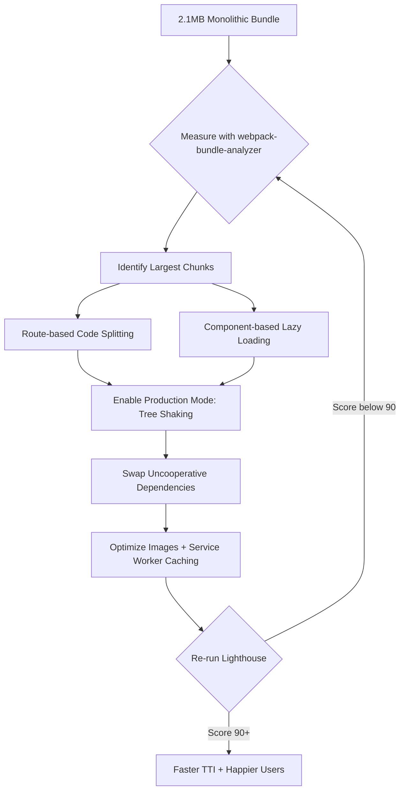

| Difficulty | Channel | Tags |
|---|---|---|
| intermediate | frontend | lighthouse, bundle, lazy-loading |

In 2017, Tinder shipped a React/Redux Progressive Web App to emerging markets where data is expensive and connections are slow — and their monolithic JavaScript bundles nearly sank it [1]. Engineers slashed the main bundle from 166KB to 101KB, cut DOMContentLoaded from 5.46s to 4.69s, and later delivered the core experience at roughly 10% of the native app's data cost (~2.8MB) [1]. Sound like a miracle? Now picture your own situation: a 2.1MB bundle, Time to Interactive of 4.2 seconds, and a Lighthouse score trapped at 65. This is the story of how you climb out.

---

> ### Real-World Case — Tinder
>
> In 2017, Tinder built a React/Redux Progressive Web App (Tinder Online) targeting emerging markets where data is costly and connections are slow. Their monolithic JavaScript bundles delayed how quickly the experience could become interactive, hurting adoption on median mobile hardware.
>
> | | |
> |---|---|
> | **Challenge** | Large, monolithic React/Redux bundles loaded code that wasn't needed to boot the core swiping experience, pushing Time to Interactive well past acceptable levels on low-end devices and slow networks. |
> | **Solution** | They implemented route-based code splitting using React Router + React Loadable (dynamic import()), used webpack-bundle-analyzer to find low-hanging fruit in the dependency graph, dropped unused polyfills with core-js + babel-preset-env, replaced localForage with IndexedDB, used the Lodash Module Replacement Plugin for tree shaking, extracted a webpack manifest for long-term caching, adopted ~155KB main/vendor chunk performance budgets, and preloaded critical route bundles with . |
> | **Outcome** | Main bundle dropped from 166KB to 101KB and DOMContentLoaded improved from 5.46s to 4.69s; preloading cut load time by 1s and first paint from ~1000ms to ~500ms; scope hoisting improved vendor bundle parse time by 8%; React 16 cut the vendor chunk by ~6.7%. The resulting PWA delivered the core Tinder experience at roughly 10% of the native app's data cost (~2.8MB), and users swiped and messaged more on web than in native apps. |
> | **Lesson** | Measuring before optimizing matters: bundle analyzers reveal hidden waste (polyfills, unused deps, bloated libraries), route-level splitting plus performance budgets keeps regressions out, and shipping only what the first interaction needs delivers dramatic, measurable wins. |

---

## Hook — The 2.1MB Anchor Dragging Your Users Away

Every millisecond your app stays frozen is a tiny vote of no confidence from the person waiting on the other end of the screen. A 2.1MB JavaScript bundle means roughly 4.2 seconds of Time to Interactive — which is an eternity in a world where users expect paint within a second and are gone within three. Many developers treat bundle size as a background annoyance, a boring number in a build log. It is not boring. It is the difference between a user who swipes and a user who uninstalls. The stakes are real, and the path to fixing it is more methodical — and more fun — than you might expect. The question is not whether you can hit a Lighthouse score of 90+. The question is whether you know what is actually hiding inside that 2.1MB.

## Problem — Why Your Lighthouse Score Is Stuck at 65

A Lighthouse score of 65 is not a failing grade so much as a diagnostic one. It is your app politely telling you that the JavaScript you ship is too much, too early, and too undifferentiated. Here is the uncomfortable truth about bundle bloat: the cost is not download time alone. The real tax is parse, compile, and execute time — the CPU work your browser does before anything becomes interactive. That is why Time to Interactive lags behind seemingly 'fast' network metrics. Moreover, a monolithic bundle forces every user to pay the full price upfront, even when they only need a fraction of the app. Consequently, teams find themselves in a losing game: the more features you add, the slower your entry point becomes. This is the core challenge — a 2.1MB bundle is not a network problem, it is an architecture problem. And architecture problems demand more than a quick fix; they demand a strategy.

## Real-World Case — Tinder Online and the Cost of a Fat Bundle

In 2017, Tinder built a React/Redux Progressive Web App aimed squarely at emerging markets where every megabyte drains a user's wallet and connections crawl [1]. The initial approach seemed reasonable: a single monolithic bundle that shipped everything at once. But on median mobile hardware, the experience took far too long to become interactive, and adoption suffered. Here is the plot twist: the fixes were not exotic. Teams reorganized the bundle so only the critical path loaded first, and the results were dramatic. The main bundle dropped from 166KB to 101KB. DOMContentLoaded improved from 5.46s to 4.69s. Preloading cut load time by roughly 1 second, first paint tumbled from ~1000ms to ~500ms, scope hoisting improved vendor bundle parse time by 8%, and moving to React 16 shaved ~6.7% off the vendor chunk [1]. The payoff was the kind of number executives dream about: web users on the PWA swiped and messaged more than users on the native app, all at a fraction of the data cost [1]. The lesson is clear — small, deliberate bundle changes compound into experiences people actually use.

## Deep Dive — Code Splitting, Tree Shaking, and the Trade-Offs Nobody Warns You About

Building on Tinder's story, the next question is tactical: which levers actually move the needle? First, measure before you meddle. Running webpack-bundle-analyzer reveals the honest truth about what is inside your bundle — the giant moment.js, the chart library loaded on every page, the lodash import that pulls in everything [8]. With that map in hand, code splitting becomes surgical. Route-based splitting loads only what a route needs; component-based splitting defers heavy widgets until they are visible [6]. React's lazy() and Suspense make this almost embarrassingly easy [2][3], and dynamic import() gives you granular control at any level [4]. But here is the plot twist: tree shaking only works when your dependencies cooperate. It requires ES module syntax so the bundler can statically analyze and drop dead code — a CommonJS library can quietly bypass the whole optimization [5][7]. The trade-offs matter too, as shown below:

## Workflow — Your Step-by-Step Journey from 65 to 90+

So how do you turn this theory into a repeatable process? Think of it as a loop, not a one-off. Start by auditing the bundle with webpack-bundle-analyzer to see which chunks are the real offenders [8]. Next, split by route — the highest leverage, lowest risk move. Then defer the heavy components that only appear after user interaction, wrapping each in Suspense with a polished fallback [2][3]. Enable production mode so minification and tree shaking kick in, then chase down the dependencies that refuse to play along — often by swapping to smaller, modern alternatives [7]. Finally, layer in image optimization and a service worker so repeat visits are near-instant [9]. The diagram below shows this cycle:

## Code Example — Lazy Loading Done Right, With a Safety Net

This is where the rubber meets the road. The pattern below mirrors what Tinder's team effectively did: split by route, defer heavy components, and protect everything with a Suspense fallback [1][2][3].

## Lessons Learned — What Tomorrow's Build Should Look Like

If there is one insight to carry away from Tinder's journey, it is this: performance is a process, not a patch [1]. Measure first, split by route, defer the heavy stuff, shake out the dead code, and cache aggressively. Here is the takeaway list: · Run bundle analysis before touching anything — guesswork wastes sprints [8] · Split by route first, then component-level, then dependency swaps · Treat every third-party library as a suspect until its size is justified · Wrap lazy components in Suspense and an error boundary, no exceptions [2][3] · Verify gains with Lighthouse after every change, not at the end. The transformation story is always the same: measurement reveals the monster, splitting tames it, and caching keeps it caged. Your tomorrow-morning move: open bundle analyzer, find your heaviest chunk, and make it lazy.

---

## Bundle Optimization Flow

<strong>Original Interview Question</strong>

**Q:** You're tasked with improving a React app's Lighthouse performance score from 65 to 90+. The bundle size is 2.1MB and Time to Interactive is 4.2s. What specific steps would you take to optimize the bundle and implement lazy loading?

**A:** Implement code splitting with React.lazy() and Suspense, analyze bundle composition with webpack-bundle-analyzer to identify largest chunks, remove unused dependencies and optimize imports, add dynamic imports for heavy components and third-party libraries, implement route-based splitting for better initial load times, and utilize tree shaking with proper ES module configuration.

## Conclusion

Tinder proved that a slow, bloated web app can be transformed into one people genuinely prefer — users swiped and messaged more on the web than in native apps, at a tenth of the data cost [1]. The playbook is neither magic nor mystery: measure with a bundle analyzer, split by route, defer heavy components with lazy() and Suspense, shake out dead code, and cache with a service worker. So what should you do differently tomorrow? Open webpack-bundle-analyzer, find your heaviest chunk, and make it lazy before you write another feature. The insight to share with your team: every kilobyte you don't ship on the first paint is a user who reaches your value proposition sooner. Small changes, measured relentlessly, compound into experiences users love.

---

## References

1. [Tinder incident report](https://calendar.perfplanet.com/2017/a-tinder-progressive-web-app-performance-case-study/) — article
2. [React lazy API reference](https://react.dev/reference/react/lazy) — documentation
3. [React Suspense API reference](https://react.dev/reference/react/Suspense) — documentation
4. [MDN dynamic import](https://developer.mozilla.org/en-US/docs/Web/JavaScript/Reference/Operators/import) — documentation
5. [MDN JavaScript modules guide](https://developer.mozilla.org/en-US/docs/Web/JavaScript/Guide/Modules) — documentation
6. [webpack code splitting guide](https://webpack.js.org/guides/code-splitting/) — documentation
7. [webpack tree shaking guide](https://webpack.js.org/guides/tree-shaking/) — documentation
8. [webpack-bundle-analyzer repository](https://github.com/webpack-contrib/webpack-bundle-analyzer) — documentation
9. [MDN Service Worker API](https://developer.mozilla.org/en-US/docs/Web/API/Service_Worker_API) — documentation

---

**Author:** Satishkumar Dhule — [GitHub](https://github.com/satishkumar-dhule) · [LinkedIn](https://linkedin.com/in/satishkumar-dhule) · [Website](https://satishkumar-dhule.github.io)
