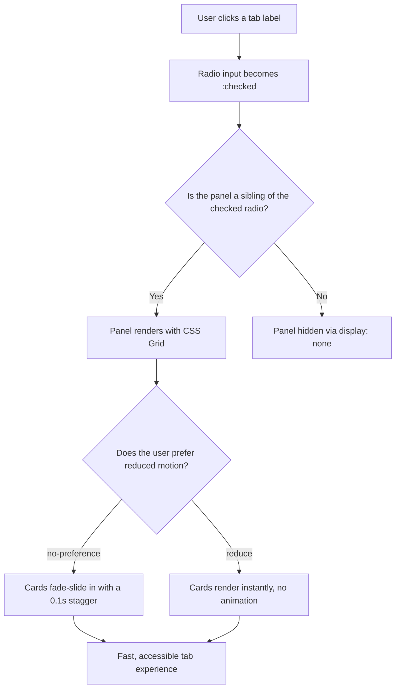

| Difficulty | Channel | Tags |
|---|---|---|
| beginner | frontend | css, flexbox, grid, animations |

Picture this: the most important page in Netflix's growth funnel — the logged-out homepage where new users sign up — takes seven seconds to become interactive on a 3G connection. Seven seconds, for a page made of little more than tabs, cards, and one button [1]. The culprit was not a heavy feature set; it was roughly 300KB of client-side JavaScript shipping alongside server-rendered markup. This article takes that 300KB lesson and turns it into a concrete design-system pattern: tabs that switch content with zero JavaScript.

---

> ### Real-World Case — Netflix
>
> Netflix's logged-out homepage — the landing page where new users sign up and existing users log in — was served as server-side rendered React but hydrated with a ~300KB client-side JavaScript payload (React core, Lodash, and context data). Simulated on a 3G connection in Chrome DevTools/Lighthouse, the simple landing page took 7 seconds to become interactive, which the team considered far too slow for a page whose whole job is converting sign-ups.
>
> | | |
> |---|---|
> | **Challenge** | The page only needed light interactivity — homepage tabs, a language switcher, and a cookie banner — yet shipping a client-side React app with utility libraries for those few interactions bloated the bundle and pushed Time-to-Interactive past acceptable thresholds, hurting the sign-up flow. |
> | **Solution** | Netflix kept React on the server for SSR to preserve their developer experience, but replaced client-side React and Lodash with vanilla JavaScript. Simple components like the homepage tabs were rewritten as plain HTML/CSS with lightweight JS for click handling and class toggling (the language switcher dropped ~300 lines vs. its React version). They also prefetched the HTML/CSS/JS (including React) for the next page in the signup SPA while users were still on the landing page, using the browser's link prefetch and XHR. |
> | **Outcome** | JavaScript bundle size dropped by over 200KB; Loading and Time-to-Interactive decreased by 50% on the logged-out desktop homepage; prefetching reduced Time-to-Interactive by another 30% on subsequent pages; and users clicked the sign-up button at a greater rate after the optimizations. |
> | **Lesson** | Simple interactive UI like tab panels doesn't need a client-side framework — when an interface can be delivered as static HTML/CSS with minimal or no JavaScript, shipping a framework and its hydration runtime is pure overhead. Netflix proved removing unneeded JavaScript measurably improved load time and even sign-up conversion. |

---

## Hook — The sign-up button that nobody could click fast enough

Picture this: a developer on the Netflix performance team opens DevTools, throttles to 3G, and watches the logged-out homepage — the one page whose entire job is turning visitors into subscribers — sit there for seven seconds before the sign-up button even responds [1]. Seven seconds. Not for a video player. Not for a recommendation engine. For a landing page with a couple of tabs and some cards. The page was server-side rendered, so the text appeared instantly. The problem was everything after: a payload of roughly 300KB (React core, Lodash, and context data) that had to download, parse, and hydrate before a single click could be handled. Sound familiar? That moment — when a page renders but refuses to respond — is exactly the failure mode a simple component like a tab panel can trigger at scale. Here is the twist: the tab panels on that page never needed any of that JavaScript to begin with.

## Problem — Every widget has a price tag

To understand why that payload existed, look at how tabs get built by default. A developer opens the design-system docs, needs a tab switcher, and reaches for the component library: a Tabs component that drags along its own state management, event wiring, and a slice of the framework's runtime. Multiply that by every accordion, tooltip, and modal on the same page, and the JavaScript budget evaporates before the page is even interactive. This is where many teams get stuck: they treat interactivity as synonymous with JavaScript. But the stakes of that assumption are measurable — time-to-interactive is a core performance metric that browsers, search engines, and impatient users all care about [8]. Moreover, on a docs page or a marketing site, every widget you hydrate is weight you carry on every single visit. However, there is a whole category of UI — tabs included — that was interactive long before React existed. Why? Because browsers already ship the state machine: form inputs. The question is whether you are willing to use it.

## Real-World Case — Netflix

Now back to Netflix, because their numbers are a road map. The logged-out homepage was built as server-side rendered React, then hydrated with a roughly 300KB client-side bundle — React core, Lodash, and context data all included [1]. On a simulated 3G connection in Chrome DevTools and Lighthouse, that landing page took seven seconds to become interactive, which the team considered far too slow for a page whose whole job is converting sign-ups. So they went on a diet. They cut the JavaScript bundle by over 200KB. Loading and Time-to-Interactive dropped by 50% on the logged-out desktop homepage, prefetching reduced Time-to-Interactive by another 30% on subsequent pages, and after the optimizations more users clicked the sign-up button. Crucially, they did not strip features — they trimmed the runtime that made simple interactions heavy. Which raises an uncomfortable question for every team building just another tab component: if the interaction can run on the platform's native state machine, why is your framework along for the ride?

## Deep Dive — The CSS-only tab pattern, dissected

Building on that question, here is the pattern that delivers tab behavior for exactly zero bytes of JavaScript: radio inputs plus labels plus CSS. Radios are a state machine — check one and the others in the same name group clear automatically. The :checked pseudo-class exposes that state to CSS [2], and sibling combinators let your styles respond to it [3]. Specifically, you hide every panel that is a sibling of an unchecked radio, and you let the one that follows the checked radio render. No JavaScript, no event listeners, no hydration. You might think the trade-off is obvious: no scripted behavior, no fancy transitions. But the pattern is richer than it looks. Keyboard support? Native inputs handle that, and they give you :focus-visible outlines for free [4]. Motion sensitivity? A single prefers-reduced-motion query gates the entrance animation [5]. Responsive cards? repeat(2, 1fr) with a media query collapse is a two-line change [7], and aspect-ratio: 16/9 locks every image container at the exact ratio you want [6]. The plot twist is that the supposedly less capable option is, for this use case, more robust. Here is the honest trade-off:

| Capability | JavaScript tab component | CSS-only radio pattern |
|---|---|---|
| State management | Component state or URL params | :checked pseudo-class [2] |
| Bundle weight | Framework + component code | Zero bytes |
| Screen reader semantics | Full ARIA tabs pattern | Simpler toggle semantics |
| Motion control | Manual JS checks | prefers-reduced-motion [5] |
| Focus handling | Manual focus management | Native + :focus-visible [4] |
| Persistable state | Yes | No |

💡 Insight: A radio group is a miniature state machine the browser runs for you — check one, and the rest reset themselves. 💡

⚠️ Watch Out: Markup order matters. The input, its label, and each panel must be siblings, and panels must come after their inputs, because the sibling combinators only reach forward [3]. ⚠️

🔥 Hot Take: No-JS does not mean no interactivity. It means the browser does the interaction instead of your bundle. 🔥

🎯 Key Point: Native inputs hand you keyboard behavior and focus semantics without a single event listener — the a11y foundation is free, not extra. 🎯

## Workflow — From static markup to polished tabs, step by step

With the theory in place, here is the build order that keeps frustration low. The flow below summarizes what happens the moment a user clicks a label.

1. Write the static markup: each tab is an input type="radio" with a shared name attribute, its , and a  panel — all siblings in the same container.
2. Wire the checked state: hide every panel that is a sibling of an unchecked radio with input:not(:checked) ~ .panel { display: none; }.
3. Build the responsive card grid: display: grid with grid-template-columns: repeat(2, 1fr), collapsing to 1fr under a 768px media query [7].
4. Lock the image area: give the card__image container aspect-ratio: 16 / 9 so every thumbnail stays uniform regardless of source dimensions [6].
5. Gate the motion: wrap the entrance animation in @media (prefers-reduced-motion: no-preference) and add staggered delays per card [5].
6. Make focus visible: define :focus-visible outlines so keyboard users always see where they are [4].
7. Test like a skeptic: disable JavaScript in DevTools, emulate reduced motion, and check the keyboard path end to end.

The mermaid diagram below traces this exact decision flow — from the click through the grid render to the animation gate. 💡 Pro tip: after building this once, keep it as a docs-page snippet; teams tend to reach for it everywhere once they see the zero-byte price tag.

## Code Example — The complete pattern, explained line by line

Here is the full pattern, ready to drop into a design-system docs page. Notice what is missing: the script tag. The markup and styles below are everything. The code ships the whole tab system as a static string — which is precisely the point — so the browser renders and responds without a hydration pass.

The structure is straightforward: each radio and its label sit before its panel, and the checked radio's panel is the only one revealed by the sibling selector. The grid does the responsive heavy lifting, aspect-ratio keeps the image area honest, and the reduced-motion guard ensures the stagger never becomes a liability for users who prefer stillness. One thing to note: the animation uses backwards fill mode, so cards hold their starting state during the delay and the stagger stays smooth even on slower devices.

## Lessons Learned — What to carry into your next component

Stepping back, the Netflix story is really about one discipline: making every byte justify itself. Here is what to take away.

- Performance is a feature: the cheapest JavaScript is the code you never ship, and a 200KB+ reduction moved real conversion metrics for Netflix [1].
- Know when the browser is already the framework: radios, checkboxes, and native inputs are state machines you get for free [2].
- Accessibility is default-on with native controls: :focus-visible [4] and prefers-reduced-motion [5] are CSS responsibilities, not afterthoughts.
- Be honest about the pattern's limits: pure-CSS tabs cannot persist state across reloads and stop short of the full ARIA tablist contract — if you need those, pick the right tool rather than forcing it.
- Test the path you care about: throttle to 3G, disable JavaScript, emulate reduced motion. Resilience is the whole point of the pattern, so prove it works when the worst happens.

⚠️ Battle scar: the classic failure is hiding the radio with display: none — that removes it from the tab order and breaks the keyboard path entirely. Use a visually-hidden class instead, keeping the input focusable. ⚠️

---

## CSS-Only Tab System Flow

<strong>Original Interview Question</strong>

**Q:** Build a CSS-only tab panel for a design-system docs page. Use radio inputs to switch tabs (no JavaScript). Desktop: a 2x2 grid of cards under each tab; mobile: single column. Each card has a fixed 16:9 image area, a title, and a short meta line. Add a subtle entrance animation with a stagger and keep focus-visible outlines; ensure prefers-reduced-motion is respected?

**A:** Use a set of radio inputs with a shared `name` attribute and corresponding `` elements for each tab section. The `:checked` state of each radio controls visibility of its associated panel via adjacent sibling selectors. Each panel renders a 2×2 card grid on desktop and collapses to a single column on mobile. Cards use `aspect-ratio: 16/9` for fixed image containers, with a title and meta line below.

## Conclusion

The moral of the Netflix story is not never use JavaScript. It is that every byte should earn its place. When a tab panel, a card grid, and an entrance animation can run entirely on the platform's built-in state machine, shipping a framework just to flip panels is overhead with a measurable cost [1]. Tomorrow, audit your docs page or your next component: count the widgets that exist only to toggle visibility, then rebuild one with a radio, a label, and a sibling selector. Measure it before and after. The pattern takes minutes to implement, is more accessible by default, and delivers the one thing users never stop wanting — a page that responds the moment they click. The insight to share with your team: the most powerful optimization is the one that ships nothing.

---

## References

1. [Netflix incident report](https://medium.com/dev-channel/a-netflix-web-performance-case-study-c0bcde26a9d9) — article
2. [MDN — :checked pseudo-class](https://developer.mozilla.org/en-US/docs/Web/CSS/:checked) — documentation
3. [MDN — General sibling combinator](https://developer.mozilla.org/en-US/docs/Web/CSS/General_sibling_combinator) — documentation
4. [MDN — :focus-visible pseudo-class](https://developer.mozilla.org/en-US/docs/Web/CSS/:focus-visible) — documentation
5. [MDN — prefers-reduced-motion media query](https://developer.mozilla.org/en-US/docs/Web/CSS/@media/prefers-reduced-motion) — documentation
6. [MDN — aspect-ratio property](https://developer.mozilla.org/en-US/docs/Web/CSS/aspect-ratio) — documentation
7. [MDN — CSS grid layout](https://developer.mozilla.org/en-US/docs/Web/CSS/CSS_grid_layout) — documentation
8. [Wikipedia — Core Web Vitals](https://en.wikipedia.org/wiki/Core_Web_Vitals) — documentation
9. [MDN — @keyframes](https://developer.mozilla.org/en-US/docs/Web/CSS/@keyframes) — documentation

---

**Author:** Satishkumar Dhule — [GitHub](https://github.com/satishkumar-dhule) · [LinkedIn](https://linkedin.com/in/satishkumar-dhule) · [Website](https://satishkumar-dhule.github.io)
